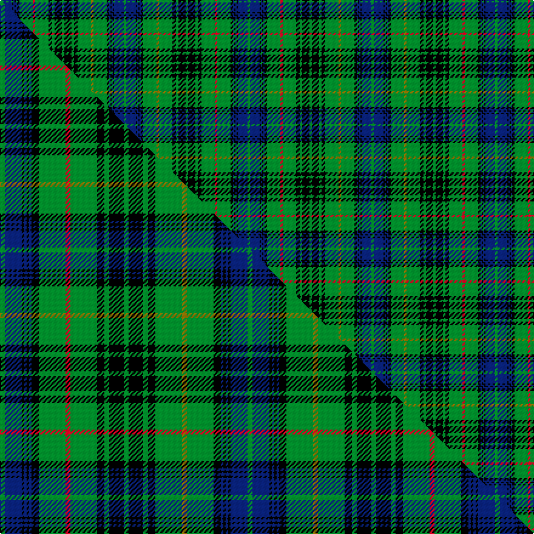

This is one **variant** — a specific cloth: this exact thread count and colourway, with its own
provenance below. It is one weaving of the [sett](/tartans/s/st/stewart-hunting/) (the scale-free proportion — the
same cloth at any scale or shade), whose colour order is pattern [GBKBKBKGGGKGKGKGKGRGKBKBKBG](/stripes/gbkbkbkgggkgkgkgkgrgkbkbkbg/).

Part of the [Stewart Hunting](/tartans/s/st/stewart-hunting/) tartan — the named design grouping this sett with its other cloths.

Sourced from weddslist.  It is a [27 stripe tartan](/stripes/stripes27/).

Original link [http://www.weddslist.com/cgi-bin/tartans/pg.pl?source=rb](http://www.weddslist.com/cgi-bin/tartans/pg.pl?source=rb)

Dataset <small>— provenance for this record, inherited from the source manifest</small>

<dl class="dataset-prov">
<dt>source</dt><dd><a href="/sources/weddslist/">Weddslist</a></dd>
<dt>data captured from</dt><dd><a href="https://github.com/thetartan/tartan-database/blob/master/data/weddslist/data.csv">https://github.com/thetartan/tartan-database/blob/master/data/weddslist/data.csv</a></dd>
<dt>data date</dt><dd>2016-11-17 <small>(dataset default)</small></dd>
<dt>licence</dt><dd><a href="https://creativecommons.org/licenses/by-nc-nd/4.0/">CC BY-NC-ND 4.0</a></dd>
</dl>

Capture chain <small>— the hands this data passed through, oldest first; each capture carries its own licence</small>

<ol class="capture-chain">
<li><a href="https://www.weddslist.com/tartans/">Weddslist</a> <small>the living privately compiled reference</small></li>
<li><a href="https://github.com/thetartan/tartan-database">thetartan/tartan-database</a> <small>2016-2017</small> · <a href="https://creativecommons.org/licenses/by-nc-nd/4.0/">CC BY-NC-ND 4.0</a> <small>Levko Kravets's frozen compilation — the capture we vendored, and where its CC licence text came from</small></li>
<li>this dictionary <small>captured 2026-06-10 · commit 5bf86c7566</small> <small>each re-capture is a git commit to data/sources</small></li>
</ol>

## Thread count
G/2 DB8 K1 DB1 K1 DB1 K2 G11 R2 G11 K3 G2 K6 G2 K6 G2 K3 G11 Y2 G11 K2 DB1 K1 DB1 K1 DB8 G/2

One full sett is **204 threads**.

## Palette
<table><thead><tr><th>Colour</th><th>Shade</th><th>OKLCh</th></tr></thead><tbody><tr><td>DB</td><td><code style="background-color:#082077;">#082077</code> <small style="color:#888">#082077</small></td><td><small style="color:#888">oklch(30.0% 0.149 265.1)</small></td></tr><tr><td>G</td><td><code style="background-color:#008B2A;">#008B2A</code> <small style="color:#888">#008B2A</small></td><td><small style="color:#888">oklch(55.4% 0.170 145.9)</small></td></tr><tr><td>K</td><td><code style="background-color:#000000;">#000000</code> <small style="color:#888">#000000</small></td><td><small style="color:#888">oklch(0.0% 0.000 0.0)</small></td></tr><tr><td>R</td><td><code style="background-color:#D60020;">#D60020</code> <small style="color:#888">#D60020</small></td><td><small style="color:#888">oklch(55.2% 0.224 25.5)</small></td></tr><tr><td>Y</td><td><code style="background-color:#8B6E00;">#8B6E00</code> <small style="color:#888">#8B6E00</small></td><td><small style="color:#888">oklch(55.1% 0.113 90.4)</small></td></tr></tbody></table>

# Sample pattern

## Compared to the master

This cloth is one sett of its design; the master sett (the exemplar the design is anchored on) is below for comparison.

Its **ΔTartan distance** from the master is **0.09** — the same measure the nearest-tartans table ranks by (0 is identical; a re-scale of the same cloth is near 0, a recolour or a different proportion further).

<figure class="master-compare" style="margin:0">

this sett
master sett ★

<figcaption style="color:#888;font-size:smaller">One weave of this sett against the <a href="/setts/g2db7k1db1k1db1k3g11r2g11k3g2k6g2k6g2k3g11y2g11k3db1k1db1k1db7g2/">master sett ★</a>, split on the diagonal: a shared proportion runs seamlessly across it with only the shades shifting; a different proportion breaks on it.</figcaption>
</figure>

## Nearest tartan variants

The nearest existing variants by ΔTartan distance, with this cloth at the top so the swatches line up against it.

ΔTartan

Threads

Variant

Sett

—

204

<a href="/variants/s27/g2db8k1db1k1db1k2g11r2g11k3g2k6g2k6g2k3g11y2g11k2db1k1db1k1db8g2/">Stewart Hunting</a>

<a href="/ttd/edit/#slug=g2db7k1db1k1db1k3g11r2g11k3g2k6g2k6g2k3g11y2g11k3db1k1db1k1db7g2~x2&amp;base=g2db8k1db1k1db1k2g11r2g11k3g2k6g2k6g2k3g11y2g11k2db1k1db1k1db8g2" title="compare in the TTD">0.09</a>

408

<a href="/variants/s27/g2db7k1db1k1db1k3g11r2g11k3g2k6g2k6g2k3g11y2g11k3db1k1db1k1db7g2~x2/">Stewart Hunting</a>

<a href="/ttd/edit/#slug=g2db7k1db1k1db1k3g11r4g11k3g2k6g4k6g2k3g11y4g11k3db1k1db1k1db7g2&amp;base=g2db8k1db1k1db1k2g11r2g11k3g2k6g2k6g2k3g11y2g11k2db1k1db1k1db8g2" title="compare in the TTD">0.15</a>

216

<a href="/variants/s27/g2db7k1db1k1db1k3g11r4g11k3g2k6g4k6g2k3g11y4g11k3db1k1db1k1db7g2/">Stewart Hunting</a>

<a href="/ttd/edit/#slug=g2db3k1db1k1db1k4g12r2g12k3g2k6g2k6g2k3g12y2g12k4db1k1db1k1db3g2&amp;base=g2db8k1db1k1db1k2g11r2g11k3g2k6g2k6g2k3g11y2g11k2db1k1db1k1db8g2" title="compare in the TTD">0.26</a>

200

<a href="/variants/s27/g2db3k1db1k1db1k4g12r2g12k3g2k6g2k6g2k3g12y2g12k4db1k1db1k1db3g2/">Stewart Hunting D</a>

<a href="/ttd/edit/#slug=g2db3k1db1k1db1k4g12r2g12k3g2k6g2k6g2k3g12y2g12k4db1k1db1k1db3g2~x2&amp;base=g2db8k1db1k1db1k2g11r2g11k3g2k6g2k6g2k3g11y2g11k2db1k1db1k1db8g2" title="compare in the TTD">0.26</a>

400

<a href="/variants/s27/g2db3k1db1k1db1k4g12r2g12k3g2k6g2k6g2k3g12y2g12k4db1k1db1k1db3g2~x2/">Stewart Hunting D</a>

<a href="/ttd/edit/#slug=g2db3k1db1k1db1k4g12r4g12k3g2k6g4k6g2k3g12y4g12k4db1k1db1k1db3g2&amp;base=g2db8k1db1k1db1k2g11r2g11k3g2k6g2k6g2k3g11y2g11k2db1k1db1k1db8g2" title="compare in the TTD">0.29</a>

212

<a href="/variants/s27/g2db3k1db1k1db1k4g12r4g12k3g2k6g4k6g2k3g12y4g12k4db1k1db1k1db3g2/">Stewart Hunting D</a>

<a href="/ttd/edit/#slug=db9dg4db9k3db3k3db3k8dg27r4dg27k8dg5k13dg4k13dg5k8dg27y4dg27k8db3k3db3k3~dg1605139&amp;base=g2db8k1db1k1db1k2g11r2g11k3g2k6g2k6g2k3g11y2g11k2db1k1db1k1db8g2" title="compare in the TTD">1.39</a>

456

<a href="/variants/s26/db9dg4db9k3db3k3db3k8dg27r4dg27k8dg5k13dg4k13dg5k8dg27y4dg27k8db3k3db3k3~dg1605139/">Stewart Hunting</a>

<a href="/ttd/edit/#slug=db8g2db8k2db2k2db2k4g11r2g11k4g2k9g2k9g2k4g11y2g11k4db2k2db2k4~x2&amp;base=g2db8k1db1k1db1k2g11r2g11k3g2k6g2k6g2k3g11y2g11k2db1k1db1k1db8g2" title="compare in the TTD">1.72</a>

472

<a href="/variants/s26/db8g2db8k2db2k2db2k4g11r2g11k4g2k9g2k9g2k4g11y2g11k4db2k2db2k4~x2/">Stuart/Stewart Hunting #3</a>

<a href="/ttd/edit/#slug=g4db9k3db3k8g27r8g27k8g5k13g8k13g5k8g27y8g27k8db3k3db9g4&amp;base=g2db8k1db1k1db1k2g11r2g11k3g2k6g2k6g2k3g11y2g11k2db1k1db1k1db8g2" title="compare in the TTD">1.93</a>

468

<a href="/variants/s23/g4db9k3db3k8g27r8g27k8g5k13g8k13g5k8g27y8g27k8db3k3db9g4/">Stewart Hunting Early</a>

<a href="/ttd/edit/#slug=db9g4db9k3db3k8g27r4g27k8g5k13g4k13g5k8g27y4g27k8db3k3&amp;base=g2db8k1db1k1db1k2g11r2g11k3g2k6g2k6g2k3g11y2g11k2db1k1db1k1db8g2" title="compare in the TTD">1.94</a>

432

<a href="/variants/s22/db9g4db9k3db3k8g27r4g27k8g5k13g4k13g5k8g27y4g27k8db3k3/">Stewart Hunting General Tartan</a>

<a href="/ttd/edit/#slug=g4db9k3db3k8g27r4g27k8g5k13g4k13g5k8g27y4g27k8db3k3db9g4~x2&amp;base=g2db8k1db1k1db1k2g11r2g11k3g2k6g2k6g2k3g11y2g11k2db1k1db1k1db8g2" title="compare in the TTD">1.97</a>

888

<a href="/variants/s23/g4db9k3db3k8g27r4g27k8g5k13g4k13g5k8g27y4g27k8db3k3db9g4~x2/">Stewart Hunting Early</a>

## Neighbour map

Every grey dot is one of 13657 variants placed by the first two principal components of the ΔTartan feature space (42% of its variance). Red is this tartan; blue dots are its nearest — click one to open its page. The map is a flat projection of a many-dimensional space — [how to read it](/posts/neighbourhood-maps/).

<svg viewBox="0 0 640 380" role="img" style="max-width:100%;height:auto;border:1px solid #e0e0e0;border-radius:4px;display:block" xmlns="http://www.w3.org/2000/svg"><image href="/nn/cloud.v1.png" width="640" height="380"/><a href="/variants/s27/g2db7k1db1k1db1k3g11r2g11k3g2k6g2k6g2k3g11y2g11k3db1k1db1k1db7g2~x2/"><circle cx="180.2" cy="115.1" r="4" fill="#3465a4"><title>Stewart Hunting</title></circle></a><a href="/variants/s27/g2db7k1db1k1db1k3g11r4g11k3g2k6g4k6g2k3g11y4g11k3db1k1db1k1db7g2/"><circle cx="167.1" cy="120.5" r="4" fill="#3465a4"><title>Stewart Hunting</title></circle></a><a href="/variants/s27/g2db3k1db1k1db1k4g12r2g12k3g2k6g2k6g2k3g12y2g12k4db1k1db1k1db3g2/"><circle cx="215.5" cy="104.7" r="4" fill="#3465a4"><title>Stewart Hunting D</title></circle></a><a href="/variants/s27/g2db3k1db1k1db1k4g12r2g12k3g2k6g2k6g2k3g12y2g12k4db1k1db1k1db3g2~x2/"><circle cx="215.5" cy="104.7" r="4" fill="#3465a4"><title>Stewart Hunting D</title></circle></a><a href="/variants/s27/g2db3k1db1k1db1k4g12r4g12k3g2k6g4k6g2k3g12y4g12k4db1k1db1k1db3g2/"><circle cx="200.7" cy="110.0" r="4" fill="#3465a4"><title>Stewart Hunting D</title></circle></a><a href="/variants/s26/db9dg4db9k3db3k3db3k8dg27r4dg27k8dg5k13dg4k13dg5k8dg27y4dg27k8db3k3db3k3~dg1605139/"><circle cx="220.6" cy="128.6" r="4" fill="#3465a4"><title>Stewart Hunting</title></circle></a><a href="/variants/s26/db8g2db8k2db2k2db2k4g11r2g11k4g2k9g2k9g2k4g11y2g11k4db2k2db2k4~x2/"><circle cx="106.0" cy="157.2" r="4" fill="#3465a4"><title>Stuart/Stewart Hunting #3</title></circle></a><a href="/variants/s23/g4db9k3db3k8g27r8g27k8g5k13g8k13g5k8g27y8g27k8db3k3db9g4/"><circle cx="191.7" cy="137.3" r="4" fill="#3465a4"><title>Stewart Hunting Early</title></circle></a><a href="/variants/s22/db9g4db9k3db3k8g27r4g27k8g5k13g4k13g5k8g27y4g27k8db3k3/"><circle cx="202.2" cy="134.1" r="4" fill="#3465a4"><title>Stewart Hunting General Tartan</title></circle></a><a href="/variants/s23/g4db9k3db3k8g27r4g27k8g5k13g4k13g5k8g27y4g27k8db3k3db9g4~x2/"><circle cx="206.3" cy="131.3" r="4" fill="#3465a4"><title>Stewart Hunting Early</title></circle></a><circle cx="182.3" cy="113.5" r="5" fill="#c00000"/><text x="320" y="376" text-anchor="middle" font-size="11" fill="#999">ground</text><text x="11" y="190" text-anchor="middle" font-size="11" fill="#999" transform="rotate(-90 11 190)">complexity</text></svg>

ID: /variants/s27/g2db8k1db1k1db1k2g11r2g11k3g2k6g2k6g2k3g11y2g11k2db1k1db1k1db8g2/
