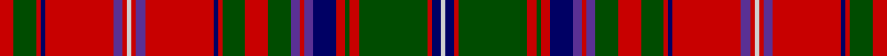

This page is one **sett** — a single exact thread-count. It belongs to the [tartan](/setts/r3dg5r1db1r15dp2r1lb1r1dp2r15db1r1dg5r5dg5dp2r1dp2db5r2dg1r2dg15r1db2lb1/)
(the same proportion at any scale), whose colour order is pattern [RGRBRBRWRBRBRGRGBRBBRGRGRBW](/stripes/rgrbrbrwrbrbrgrgbrbbrgrgrbw/).

Part of the [MacDougall D](/tartans/macdougall-d/) tartan — the named design grouping this sett with its other cloths.

Sourced from weddslist.  It is a [27 stripe tartan](/stripes/stripes27/).

Original link http://www.weddslist.com/cgi-bin/tartans/pg.pl?source=rb

## Thread count
R/6 G10 R2 DB2 R30 P4 R2 N2 R2 P4 R30 DB2 R2 G10 R10 G10 P4 R2 P4 DB10 R4 G2 R4 G30 R2 DB4 N/2

One full sett is **384 threads**.

## Palette

Palette: <strong>Tartan Register</strong> <small style="color:#888">(3 of 5 colours)</small>
<table><thead><tr><th>Colour</th><th>Threads</th><th>Shade</th><th>Base</th><th>OKLCh</th></tr></thead><tbody><tr><td>R/</td><td style="text-align:right;font-variant-numeric:tabular-nums">6</td><td><code style="background-color:#C80000;">#C80000</code> <small style="color:#888">#C80000</small></td><td>R <code style="background-color:#CC0000;">#CC0000</code></td><td><small style="color:#888">oklch(52.3% 0.215 29.2)</small></td></tr><tr><td>G</td><td style="text-align:right;font-variant-numeric:tabular-nums">10</td><td><code style="background-color:#004C00;">#004C00</code> <small style="color:#888">#004C00</small></td><td>G <code style="background-color:#006100;">#006100</code></td><td><small style="color:#888">oklch(36.1% 0.123 142.5)</small></td></tr><tr><td>R</td><td style="text-align:right;font-variant-numeric:tabular-nums">2</td><td><code style="background-color:#C80000;">#C80000</code> <small style="color:#888">#C80000</small></td><td>R <code style="background-color:#CC0000;">#CC0000</code></td><td><small style="color:#888">oklch(52.3% 0.215 29.2)</small></td></tr><tr><td>DB</td><td style="text-align:right;font-variant-numeric:tabular-nums">2</td><td><code style="background-color:#000064;">#000064</code> <small style="color:#888">#000064</small></td><td>B <code style="background-color:#2A418A;">#2A418A</code></td><td><small style="color:#888">oklch(22.7% 0.158 264.1)</small></td></tr><tr><td>R</td><td style="text-align:right;font-variant-numeric:tabular-nums">30</td><td><code style="background-color:#C80000;">#C80000</code> <small style="color:#888">#C80000</small></td><td>R <code style="background-color:#CC0000;">#CC0000</code></td><td><small style="color:#888">oklch(52.3% 0.215 29.2)</small></td></tr><tr><td>P</td><td style="text-align:right;font-variant-numeric:tabular-nums">4</td><td><code style="background-color:#5A3094;">#5A3094</code> <small style="color:#888">#5A3094</small></td><td>B <code style="background-color:#2A418A;">#2A418A</code></td><td><small style="color:#888">oklch(41.8% 0.156 298.7)</small></td></tr><tr><td>R</td><td style="text-align:right;font-variant-numeric:tabular-nums">2</td><td><code style="background-color:#C80000;">#C80000</code> <small style="color:#888">#C80000</small></td><td>R <code style="background-color:#CC0000;">#CC0000</code></td><td><small style="color:#888">oklch(52.3% 0.215 29.2)</small></td></tr><tr><td>N</td><td style="text-align:right;font-variant-numeric:tabular-nums">2</td><td><code style="background-color:#D0D0D0;">#D0D0D0</code> <small style="color:#888">#D0D0D0</small></td><td>W <code style="background-color:#F7F7F7;">#F7F7F7</code></td><td><small style="color:#888">oklch(85.8% 0.000 89.9)</small></td></tr><tr><td>R</td><td style="text-align:right;font-variant-numeric:tabular-nums">2</td><td><code style="background-color:#C80000;">#C80000</code> <small style="color:#888">#C80000</small></td><td>R <code style="background-color:#CC0000;">#CC0000</code></td><td><small style="color:#888">oklch(52.3% 0.215 29.2)</small></td></tr><tr><td>P</td><td style="text-align:right;font-variant-numeric:tabular-nums">4</td><td><code style="background-color:#5A3094;">#5A3094</code> <small style="color:#888">#5A3094</small></td><td>B <code style="background-color:#2A418A;">#2A418A</code></td><td><small style="color:#888">oklch(41.8% 0.156 298.7)</small></td></tr><tr><td>R</td><td style="text-align:right;font-variant-numeric:tabular-nums">30</td><td><code style="background-color:#C80000;">#C80000</code> <small style="color:#888">#C80000</small></td><td>R <code style="background-color:#CC0000;">#CC0000</code></td><td><small style="color:#888">oklch(52.3% 0.215 29.2)</small></td></tr><tr><td>DB</td><td style="text-align:right;font-variant-numeric:tabular-nums">2</td><td><code style="background-color:#000064;">#000064</code> <small style="color:#888">#000064</small></td><td>B <code style="background-color:#2A418A;">#2A418A</code></td><td><small style="color:#888">oklch(22.7% 0.158 264.1)</small></td></tr><tr><td>R</td><td style="text-align:right;font-variant-numeric:tabular-nums">2</td><td><code style="background-color:#C80000;">#C80000</code> <small style="color:#888">#C80000</small></td><td>R <code style="background-color:#CC0000;">#CC0000</code></td><td><small style="color:#888">oklch(52.3% 0.215 29.2)</small></td></tr><tr><td>G</td><td style="text-align:right;font-variant-numeric:tabular-nums">10</td><td><code style="background-color:#004C00;">#004C00</code> <small style="color:#888">#004C00</small></td><td>G <code style="background-color:#006100;">#006100</code></td><td><small style="color:#888">oklch(36.1% 0.123 142.5)</small></td></tr><tr><td>R</td><td style="text-align:right;font-variant-numeric:tabular-nums">10</td><td><code style="background-color:#C80000;">#C80000</code> <small style="color:#888">#C80000</small></td><td>R <code style="background-color:#CC0000;">#CC0000</code></td><td><small style="color:#888">oklch(52.3% 0.215 29.2)</small></td></tr><tr><td>G</td><td style="text-align:right;font-variant-numeric:tabular-nums">10</td><td><code style="background-color:#004C00;">#004C00</code> <small style="color:#888">#004C00</small></td><td>G <code style="background-color:#006100;">#006100</code></td><td><small style="color:#888">oklch(36.1% 0.123 142.5)</small></td></tr><tr><td>P</td><td style="text-align:right;font-variant-numeric:tabular-nums">4</td><td><code style="background-color:#5A3094;">#5A3094</code> <small style="color:#888">#5A3094</small></td><td>B <code style="background-color:#2A418A;">#2A418A</code></td><td><small style="color:#888">oklch(41.8% 0.156 298.7)</small></td></tr><tr><td>R</td><td style="text-align:right;font-variant-numeric:tabular-nums">2</td><td><code style="background-color:#C80000;">#C80000</code> <small style="color:#888">#C80000</small></td><td>R <code style="background-color:#CC0000;">#CC0000</code></td><td><small style="color:#888">oklch(52.3% 0.215 29.2)</small></td></tr><tr><td>P</td><td style="text-align:right;font-variant-numeric:tabular-nums">4</td><td><code style="background-color:#5A3094;">#5A3094</code> <small style="color:#888">#5A3094</small></td><td>B <code style="background-color:#2A418A;">#2A418A</code></td><td><small style="color:#888">oklch(41.8% 0.156 298.7)</small></td></tr><tr><td>DB</td><td style="text-align:right;font-variant-numeric:tabular-nums">10</td><td><code style="background-color:#000064;">#000064</code> <small style="color:#888">#000064</small></td><td>B <code style="background-color:#2A418A;">#2A418A</code></td><td><small style="color:#888">oklch(22.7% 0.158 264.1)</small></td></tr><tr><td>R</td><td style="text-align:right;font-variant-numeric:tabular-nums">4</td><td><code style="background-color:#C80000;">#C80000</code> <small style="color:#888">#C80000</small></td><td>R <code style="background-color:#CC0000;">#CC0000</code></td><td><small style="color:#888">oklch(52.3% 0.215 29.2)</small></td></tr><tr><td>G</td><td style="text-align:right;font-variant-numeric:tabular-nums">2</td><td><code style="background-color:#004C00;">#004C00</code> <small style="color:#888">#004C00</small></td><td>G <code style="background-color:#006100;">#006100</code></td><td><small style="color:#888">oklch(36.1% 0.123 142.5)</small></td></tr><tr><td>R</td><td style="text-align:right;font-variant-numeric:tabular-nums">4</td><td><code style="background-color:#C80000;">#C80000</code> <small style="color:#888">#C80000</small></td><td>R <code style="background-color:#CC0000;">#CC0000</code></td><td><small style="color:#888">oklch(52.3% 0.215 29.2)</small></td></tr><tr><td>G</td><td style="text-align:right;font-variant-numeric:tabular-nums">30</td><td><code style="background-color:#004C00;">#004C00</code> <small style="color:#888">#004C00</small></td><td>G <code style="background-color:#006100;">#006100</code></td><td><small style="color:#888">oklch(36.1% 0.123 142.5)</small></td></tr><tr><td>R</td><td style="text-align:right;font-variant-numeric:tabular-nums">2</td><td><code style="background-color:#C80000;">#C80000</code> <small style="color:#888">#C80000</small></td><td>R <code style="background-color:#CC0000;">#CC0000</code></td><td><small style="color:#888">oklch(52.3% 0.215 29.2)</small></td></tr><tr><td>DB</td><td style="text-align:right;font-variant-numeric:tabular-nums">4</td><td><code style="background-color:#000064;">#000064</code> <small style="color:#888">#000064</small></td><td>B <code style="background-color:#2A418A;">#2A418A</code></td><td><small style="color:#888">oklch(22.7% 0.158 264.1)</small></td></tr><tr><td>N/</td><td style="text-align:right;font-variant-numeric:tabular-nums">2</td><td><code style="background-color:#D0D0D0;">#D0D0D0</code> <small style="color:#888">#D0D0D0</small></td><td>W <code style="background-color:#F7F7F7;">#F7F7F7</code></td><td><small style="color:#888">oklch(85.8% 0.000 89.9)</small></td></tr></tbody></table>

## Nearest tartans

The nearest existing variants by ΔTartan distance, with this tartan at the top so the swatches line up against it.

ΔTartan

Tartan

Sett

—

<a href="/ttd/edit/#slug=r3dg5r1db1r15dp2r1lb1r1dp2r15db1r1dg5r5dg5dp2r1dp2db5r2dg1r2dg15r1db2lb1~x2">MacDougall D</a> <a class="nn-out" href="/variants/s27/r3dg5r1db1r15dp2r1lb1r1dp2r15db1r1dg5r5dg5dp2r1dp2db5r2dg1r2dg15r1db2lb1~x2/" title="open its dictionary page">↗</a>

1.06

<a href="/ttd/edit/#slug=g8r2g8r12g2r3g2r12w1r3ly1db12r3db12ly1r3w1r12db1r1db2r1db1r12db1r1db2r1db1r12g8r2g8~x2&amp;base=r3dg5r1db1r15dp2r1lb1r1dp2r15db1r1dg5r5dg5dp2r1dp2db5r2dg1r2dg15r1db2lb1~x2">Huntly</a> <a class="nn-out" href="/variants/s33/g8r2g8r12g2r3g2r12w1r3ly1db12r3db12ly1r3w1r12db1r1db2r1db1r12db1r1db2r1db1r12g8r2g8~x2/" title="open its dictionary page">↗</a>

1.07

<a href="/ttd/edit/#slug=r3k18r2g3r2k2r20g2ly1g2r2k18r2k2r20g3w1r3k18r2g3r2k2r20g2ly1g2r2k18r2g2r20g3w1~x2&amp;base=r3dg5r1db1r15dp2r1lb1r1dp2r15db1r1dg5r5dg5dp2r1dp2db5r2dg1r2dg15r1db2lb1~x2">Unidentified Scarlett #3</a> <a class="nn-out" href="/variants/s34/r3k18r2g3r2k2r20g2ly1g2r2k18r2k2r20g3w1r3k18r2g3r2k2r20g2ly1g2r2k18r2g2r20g3w1~x2/" title="open its dictionary page">↗</a>

1.12

<a href="/ttd/edit/#slug=w1dp2r1dg22r3dg1r3db9dp2r1dp2dg8r8dg8r1db1r22dp2r2w1~x2&amp;base=r3dg5r1db1r15dp2r1lb1r1dp2r15db1r1dg5r5dg5dp2r1dp2db5r2dg1r2dg15r1db2lb1~x2">MacDougall (Paton)</a> <a class="nn-out" href="/variants/s20/w1dp2r1dg22r3dg1r3db9dp2r1dp2dg8r8dg8r1db1r22dp2r2w1~x2/" title="open its dictionary page">↗</a>

1.12

<a href="/ttd/edit/#slug=g23r6g23r25g4r10g4r25w3r10b31r6b31r10w3r25k2r2k4r2k2r25k2r2k4r2k2r25g23r6g23~x2&amp;base=r3dg5r1db1r15dp2r1lb1r1dp2r15db1r1dg5r5dg5dp2r1dp2db5r2dg1r2dg15r1db2lb1~x2">Kinnoull</a> <a class="nn-out" href="/variants/s31/g23r6g23r25g4r10g4r25w3r10b31r6b31r10w3r25k2r2k4r2k2r25k2r2k4r2k2r25g23r6g23~x2/" title="open its dictionary page">↗</a>

1.15

<a href="/ttd/edit/#slug=dg32r7dg32r33dg4r12dg4r33w3r12ly3dp33r7dp33ly3r12w3r33dp2r2dp5r2dp2r33dp2r2dp5r2dp2r33dg32r6dg23&amp;base=r3dg5r1db1r15dp2r1lb1r1dp2r15db1r1dg5r5dg5dp2r1dp2db5r2dg1r2dg15r1db2lb1~x2">Huntly (District)</a> <a class="nn-out" href="/variants/s33/dg32r7dg32r33dg4r12dg4r33w3r12ly3dp33r7dp33ly3r12w3r33dp2r2dp5r2dp2r33dp2r2dp5r2dp2r33dg32r6dg23/" title="open its dictionary page">↗</a>

1.16

<a href="/ttd/edit/#slug=g32r7g32r33g4r12g4r33lb3r12ly3dp33r7dp33ly3r12lb3r33dp2r2dp5r2dp2r33dp2r2dp5r2dp2r33g32r7g32~x2&amp;base=r3dg5r1db1r15dp2r1lb1r1dp2r15db1r1dg5r5dg5dp2r1dp2db5r2dg1r2dg15r1db2lb1~x2">Marchioness of Huntly's</a> <a class="nn-out" href="/variants/s33/g32r7g32r33g4r12g4r33lb3r12ly3dp33r7dp33ly3r12lb3r33dp2r2dp5r2dp2r33dp2r2dp5r2dp2r33g32r7g32~x2/" title="open its dictionary page">↗</a>

1.18

<a href="/ttd/edit/#slug=g10r2db2r30dp3r2w1r2dp3r30db2r2g10r10g10dp4r2dp4db10r4g2r4g30r2dp3w1~x2&amp;base=r3dg5r1db1r15dp2r1lb1r1dp2r15db1r1dg5r5dg5dp2r1dp2db5r2dg1r2dg15r1db2lb1~x2">MacDougal</a> <a class="nn-out" href="/variants/s26/g10r2db2r30dp3r2w1r2dp3r30db2r2g10r10g10dp4r2dp4db10r4g2r4g30r2dp3w1~x2/" title="open its dictionary page">↗</a>

1.19

<a href="/variants/s20/o40k10oi2k2lr2k3r8o6k2o8lr2~x2/">Islay</a>

1.20

<a href="/ttd/edit/#slug=db48r40k4r4g48r54db46r54dg14r4k4r4k4r48k4r4k4r4dg14r52db46r54dg60r4dg4r48db4r4r8db4r4db4r48k4r4dg60r48db4r4db4r4k7&amp;base=r3dg5r1db1r15dp2r1lb1r1dp2r15db1r1dg5r5dg5dp2r1dp2db5r2dg1r2dg15r1db2lb1~x2">MacKintosh 5</a> <a class="nn-out" href="/variants/s42/db48r40k4r4g48r54db46r54dg14r4k4r4k4r48k4r4k4r4dg14r52db46r54dg60r4dg4r48db4r4r8db4r4db4r48k4r4dg60r48db4r4db4r4k7/" title="open its dictionary page">↗</a>

1.20

<a href="/ttd/edit/#slug=r5g10r2db2r30dp3r2w1r2dp3r30db2r2g10r10g10dp4r2dp4db10r4g2r4g30r2dp3w1~x2&amp;base=r3dg5r1db1r15dp2r1lb1r1dp2r15db1r1dg5r5dg5dp2r1dp2db5r2dg1r2dg15r1db2lb1~x2">MacDougall - 1970 (H of E)</a> <a class="nn-out" href="/variants/s27/r5g10r2db2r30dp3r2w1r2dp3r30db2r2g10r10g10dp4r2dp4db10r4g2r4g30r2dp3w1~x2/" title="open its dictionary page">↗</a>

## Neighbour map

Every grey dot is one of 14360 variants placed by the first two principal components of the ΔTartan feature space (44% of its variance). Red is this tartan; blue dots are its nearest — click one to open its page.

<svg viewBox="0 0 640 380" role="img" style="max-width:100%;height:auto;border:1px solid #e0e0e0;border-radius:4px;display:block" xmlns="http://www.w3.org/2000/svg"><image href="/nn/cloud.v1.png" width="640" height="380"/><a href="/variants/s33/g8r2g8r12g2r3g2r12w1r3ly1db12r3db12ly1r3w1r12db1r1db2r1db1r12db1r1db2r1db1r12g8r2g8~x2/"><circle cx="259.4" cy="103.1" r="4" fill="#3465a4"><title>Huntly</title></circle></a><a href="/variants/s34/r3k18r2g3r2k2r20g2ly1g2r2k18r2k2r20g3w1r3k18r2g3r2k2r20g2ly1g2r2k18r2g2r20g3w1~x2/"><circle cx="274.2" cy="60.3" r="4" fill="#3465a4"><title>Unidentified Scarlett #3</title></circle></a><a href="/variants/s20/w1dp2r1dg22r3dg1r3db9dp2r1dp2dg8r8dg8r1db1r22dp2r2w1~x2/"><circle cx="249.9" cy="81.4" r="4" fill="#3465a4"><title>MacDougall (Paton)</title></circle></a><a href="/variants/s31/g23r6g23r25g4r10g4r25w3r10b31r6b31r10w3r25k2r2k4r2k2r25k2r2k4r2k2r25g23r6g23~x2/"><circle cx="227.8" cy="92.2" r="4" fill="#3465a4"><title>Kinnoull</title></circle></a><a href="/variants/s33/dg32r7dg32r33dg4r12dg4r33w3r12ly3dp33r7dp33ly3r12w3r33dp2r2dp5r2dp2r33dp2r2dp5r2dp2r33dg32r6dg23/"><circle cx="273.2" cy="91.5" r="4" fill="#3465a4"><title>Huntly (District)</title></circle></a><a href="/variants/s33/g32r7g32r33g4r12g4r33lb3r12ly3dp33r7dp33ly3r12lb3r33dp2r2dp5r2dp2r33dp2r2dp5r2dp2r33g32r7g32~x2/"><circle cx="270.4" cy="92.6" r="4" fill="#3465a4"><title>Marchioness of Huntly's</title></circle></a><a href="/variants/s26/g10r2db2r30dp3r2w1r2dp3r30db2r2g10r10g10dp4r2dp4db10r4g2r4g30r2dp3w1~x2/"><circle cx="300.3" cy="63.6" r="4" fill="#3465a4"><title>MacDougal</title></circle></a><a href="/variants/s20/o40k10oi2k2lr2k3r8o6k2o8lr2~x2/"><circle cx="287.9" cy="81.9" r="4" fill="#3465a4"><title>Islay</title></circle></a><a href="/variants/s42/db48r40k4r4g48r54db46r54dg14r4k4r4k4r48k4r4k4r4dg14r52db46r54dg60r4dg4r48db4r4r8db4r4db4r48k4r4dg60r48db4r4db4r4k7/"><circle cx="279.8" cy="78.4" r="4" fill="#3465a4"><title>MacKintosh 5</title></circle></a><a href="/variants/s27/r5g10r2db2r30dp3r2w1r2dp3r30db2r2g10r10g10dp4r2dp4db10r4g2r4g30r2dp3w1~x2/"><circle cx="306.9" cy="62.4" r="4" fill="#3465a4"><title>MacDougall - 1970 (H of E)</title></circle></a><circle cx="258.3" cy="86.3" r="5" fill="#c00000"/></svg>

ID: /variants/s27/r3dg5r1db1r15dp2r1lb1r1dp2r15db1r1dg5r5dg5dp2r1dp2db5r2dg1r2dg15r1db2lb1~x2/
