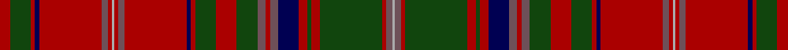

This page is one **sett** — a single exact thread-count. It belongs to the [tartan](/setts/r5dg10r2db2r30n3r2lr1r2n3r30db2r2dg10r10dg10n4r2n4db10r4dg2r4dg30r2n3lr1/)
(the same proportion at any scale), whose colour order is pattern [RGRBRBRYRBRBRGRGBRBBRGRGRBY](/stripes/rgrbrbryrbrbrgrgbrbbrgrgrby/).

Part of the [MacDougall D](/tartans/macdougall-d/) tartan — the named design grouping this sett with its other cloths.

Sourced from weddslist.  It is a [27 stripe tartan](/stripes/stripes27/).

Original link http://www.weddslist.com/cgi-bin/tartans/pg.pl?source=tinsel

2 attestations — the source records this cloth was collapsed from (oldest owns this page)

<ul>
<li>undated — MacDougall D (weddslist, <a href="http://www.weddslist.com/cgi-bin/tartans/pg.pl?source=tinsel">record</a>)</li>
<li>undated — MacDougall D (weddslist, <a href="http://www.weddslist.com/cgi-bin/tartans/pg.pl?source=x">record</a>)</li>
</ul>

## Thread count
DR/10 DG20 DR4 DB4 DR60 N6 DR4 Na2 DR4 N6 DR60 DB4 DR4 DG20 DR20 DG20 N8 DR4 N8 DB20 DR8 DG4 DR8 DG60 DR4 N6 Na/2

One full sett is **748 threads**.

## Palette

Palette: <strong>custom</strong>
<table><thead><tr><th>Colour</th><th>Threads</th><th>Shade</th><th>Base</th><th>OKLCh</th></tr></thead><tbody><tr><td>DR/</td><td style="text-align:right;font-variant-numeric:tabular-nums">10</td><td><code style="background-color:#AA0000;">#AA0000</code> <small style="color:#888">#AA0000</small></td><td>R <code style="background-color:#CC0000;">#CC0000</code></td><td><small style="color:#888">oklch(46.3% 0.190 29.2)</small></td></tr><tr><td>DG</td><td style="text-align:right;font-variant-numeric:tabular-nums">20</td><td><code style="background-color:#11450D;">#11450D</code> <small style="color:#888">#11450D</small></td><td>G <code style="background-color:#006100;">#006100</code></td><td><small style="color:#888">oklch(34.4% 0.101 142.1)</small></td></tr><tr><td>DR</td><td style="text-align:right;font-variant-numeric:tabular-nums">4</td><td><code style="background-color:#AA0000;">#AA0000</code> <small style="color:#888">#AA0000</small></td><td>R <code style="background-color:#CC0000;">#CC0000</code></td><td><small style="color:#888">oklch(46.3% 0.190 29.2)</small></td></tr><tr><td>DB</td><td style="text-align:right;font-variant-numeric:tabular-nums">4</td><td><code style="background-color:#000052;">#000052</code> <small style="color:#888">#000052</small></td><td>B <code style="background-color:#2A418A;">#2A418A</code></td><td><small style="color:#888">oklch(19.8% 0.137 264.1)</small></td></tr><tr><td>DR</td><td style="text-align:right;font-variant-numeric:tabular-nums">60</td><td><code style="background-color:#AA0000;">#AA0000</code> <small style="color:#888">#AA0000</small></td><td>R <code style="background-color:#CC0000;">#CC0000</code></td><td><small style="color:#888">oklch(46.3% 0.190 29.2)</small></td></tr><tr><td>N</td><td style="text-align:right;font-variant-numeric:tabular-nums">6</td><td><code style="background-color:#6E5058;">#6E5058</code> <small style="color:#888">#6E5058</small></td><td>B <code style="background-color:#2A418A;">#2A418A</code></td><td><small style="color:#888">oklch(46.6% 0.042 1.2)</small></td></tr><tr><td>DR</td><td style="text-align:right;font-variant-numeric:tabular-nums">4</td><td><code style="background-color:#AA0000;">#AA0000</code> <small style="color:#888">#AA0000</small></td><td>R <code style="background-color:#CC0000;">#CC0000</code></td><td><small style="color:#888">oklch(46.3% 0.190 29.2)</small></td></tr><tr><td>Na</td><td style="text-align:right;font-variant-numeric:tabular-nums">2</td><td><code style="background-color:#AAAAAA;">#AAAAAA</code> <small style="color:#888">#AAAAAA</small></td><td>Y <code style="background-color:#F2BF00;">#F2BF00</code></td><td><small style="color:#888">oklch(73.8% 0.000 89.9)</small></td></tr><tr><td>DR</td><td style="text-align:right;font-variant-numeric:tabular-nums">4</td><td><code style="background-color:#AA0000;">#AA0000</code> <small style="color:#888">#AA0000</small></td><td>R <code style="background-color:#CC0000;">#CC0000</code></td><td><small style="color:#888">oklch(46.3% 0.190 29.2)</small></td></tr><tr><td>N</td><td style="text-align:right;font-variant-numeric:tabular-nums">6</td><td><code style="background-color:#6E5058;">#6E5058</code> <small style="color:#888">#6E5058</small></td><td>B <code style="background-color:#2A418A;">#2A418A</code></td><td><small style="color:#888">oklch(46.6% 0.042 1.2)</small></td></tr><tr><td>DR</td><td style="text-align:right;font-variant-numeric:tabular-nums">60</td><td><code style="background-color:#AA0000;">#AA0000</code> <small style="color:#888">#AA0000</small></td><td>R <code style="background-color:#CC0000;">#CC0000</code></td><td><small style="color:#888">oklch(46.3% 0.190 29.2)</small></td></tr><tr><td>DB</td><td style="text-align:right;font-variant-numeric:tabular-nums">4</td><td><code style="background-color:#000052;">#000052</code> <small style="color:#888">#000052</small></td><td>B <code style="background-color:#2A418A;">#2A418A</code></td><td><small style="color:#888">oklch(19.8% 0.137 264.1)</small></td></tr><tr><td>DR</td><td style="text-align:right;font-variant-numeric:tabular-nums">4</td><td><code style="background-color:#AA0000;">#AA0000</code> <small style="color:#888">#AA0000</small></td><td>R <code style="background-color:#CC0000;">#CC0000</code></td><td><small style="color:#888">oklch(46.3% 0.190 29.2)</small></td></tr><tr><td>DG</td><td style="text-align:right;font-variant-numeric:tabular-nums">20</td><td><code style="background-color:#11450D;">#11450D</code> <small style="color:#888">#11450D</small></td><td>G <code style="background-color:#006100;">#006100</code></td><td><small style="color:#888">oklch(34.4% 0.101 142.1)</small></td></tr><tr><td>DR</td><td style="text-align:right;font-variant-numeric:tabular-nums">20</td><td><code style="background-color:#AA0000;">#AA0000</code> <small style="color:#888">#AA0000</small></td><td>R <code style="background-color:#CC0000;">#CC0000</code></td><td><small style="color:#888">oklch(46.3% 0.190 29.2)</small></td></tr><tr><td>DG</td><td style="text-align:right;font-variant-numeric:tabular-nums">20</td><td><code style="background-color:#11450D;">#11450D</code> <small style="color:#888">#11450D</small></td><td>G <code style="background-color:#006100;">#006100</code></td><td><small style="color:#888">oklch(34.4% 0.101 142.1)</small></td></tr><tr><td>N</td><td style="text-align:right;font-variant-numeric:tabular-nums">8</td><td><code style="background-color:#6E5058;">#6E5058</code> <small style="color:#888">#6E5058</small></td><td>B <code style="background-color:#2A418A;">#2A418A</code></td><td><small style="color:#888">oklch(46.6% 0.042 1.2)</small></td></tr><tr><td>DR</td><td style="text-align:right;font-variant-numeric:tabular-nums">4</td><td><code style="background-color:#AA0000;">#AA0000</code> <small style="color:#888">#AA0000</small></td><td>R <code style="background-color:#CC0000;">#CC0000</code></td><td><small style="color:#888">oklch(46.3% 0.190 29.2)</small></td></tr><tr><td>N</td><td style="text-align:right;font-variant-numeric:tabular-nums">8</td><td><code style="background-color:#6E5058;">#6E5058</code> <small style="color:#888">#6E5058</small></td><td>B <code style="background-color:#2A418A;">#2A418A</code></td><td><small style="color:#888">oklch(46.6% 0.042 1.2)</small></td></tr><tr><td>DB</td><td style="text-align:right;font-variant-numeric:tabular-nums">20</td><td><code style="background-color:#000052;">#000052</code> <small style="color:#888">#000052</small></td><td>B <code style="background-color:#2A418A;">#2A418A</code></td><td><small style="color:#888">oklch(19.8% 0.137 264.1)</small></td></tr><tr><td>DR</td><td style="text-align:right;font-variant-numeric:tabular-nums">8</td><td><code style="background-color:#AA0000;">#AA0000</code> <small style="color:#888">#AA0000</small></td><td>R <code style="background-color:#CC0000;">#CC0000</code></td><td><small style="color:#888">oklch(46.3% 0.190 29.2)</small></td></tr><tr><td>DG</td><td style="text-align:right;font-variant-numeric:tabular-nums">4</td><td><code style="background-color:#11450D;">#11450D</code> <small style="color:#888">#11450D</small></td><td>G <code style="background-color:#006100;">#006100</code></td><td><small style="color:#888">oklch(34.4% 0.101 142.1)</small></td></tr><tr><td>DR</td><td style="text-align:right;font-variant-numeric:tabular-nums">8</td><td><code style="background-color:#AA0000;">#AA0000</code> <small style="color:#888">#AA0000</small></td><td>R <code style="background-color:#CC0000;">#CC0000</code></td><td><small style="color:#888">oklch(46.3% 0.190 29.2)</small></td></tr><tr><td>DG</td><td style="text-align:right;font-variant-numeric:tabular-nums">60</td><td><code style="background-color:#11450D;">#11450D</code> <small style="color:#888">#11450D</small></td><td>G <code style="background-color:#006100;">#006100</code></td><td><small style="color:#888">oklch(34.4% 0.101 142.1)</small></td></tr><tr><td>DR</td><td style="text-align:right;font-variant-numeric:tabular-nums">4</td><td><code style="background-color:#AA0000;">#AA0000</code> <small style="color:#888">#AA0000</small></td><td>R <code style="background-color:#CC0000;">#CC0000</code></td><td><small style="color:#888">oklch(46.3% 0.190 29.2)</small></td></tr><tr><td>N</td><td style="text-align:right;font-variant-numeric:tabular-nums">6</td><td><code style="background-color:#6E5058;">#6E5058</code> <small style="color:#888">#6E5058</small></td><td>B <code style="background-color:#2A418A;">#2A418A</code></td><td><small style="color:#888">oklch(46.6% 0.042 1.2)</small></td></tr><tr><td>Na/</td><td style="text-align:right;font-variant-numeric:tabular-nums">2</td><td><code style="background-color:#AAAAAA;">#AAAAAA</code> <small style="color:#888">#AAAAAA</small></td><td>Y <code style="background-color:#F2BF00;">#F2BF00</code></td><td><small style="color:#888">oklch(73.8% 0.000 89.9)</small></td></tr></tbody></table>

## Compared to the master

This cloth is one sett of its design; the master sett (the exemplar the design is anchored on) is below for comparison.

<figure style="margin:0"><figcaption style="color:#888;font-size:smaller">this sett</figcaption></figure>
<figure style="margin:0"><figcaption style="color:#888;font-size:smaller"><a href="/setts/r3dg5r1db1r15dp2r1lb1r1dp2r15db1r1dg5r5dg5dp2r1dp2db5r2dg1r2dg15r1db2lb1/">master sett →</a></figcaption></figure>

## Nearest tartans

The nearest existing variants by ΔTartan distance, with this tartan at the top so the swatches line up against it.

ΔTartan

Tartan

Sett

—

<a href="/ttd/edit/#slug=r5dg10r2db2r30n3r2lr1r2n3r30db2r2dg10r10dg10n4r2n4db10r4dg2r4dg30r2n3lr1~x2">MacDougall D</a> <a class="nn-out" href="/variants/s27/r5dg10r2db2r30n3r2lr1r2n3r30db2r2dg10r10dg10n4r2n4db10r4dg2r4dg30r2n3lr1~x2/" title="open its dictionary page">↗</a>

1.01

<a href="/ttd/edit/#slug=r5g10r2db2r30dp3r2w1r2dp3r30db2r2g10r10g10dp4r2dp4db10r4g2r4g30r2dp3w1~x2&amp;base=r5dg10r2db2r30n3r2lr1r2n3r30db2r2dg10r10dg10n4r2n4db10r4dg2r4dg30r2n3lr1~x2">MacDougall - 1970 (H of E)</a> <a class="nn-out" href="/variants/s27/r5g10r2db2r30dp3r2w1r2dp3r30db2r2g10r10g10dp4r2dp4db10r4g2r4g30r2dp3w1~x2/" title="open its dictionary page">↗</a>

1.01

<a href="/ttd/edit/#slug=g10r2db2r30dp3r2w1r2dp3r30db2r2g10r10g10dp4r2dp4db10r4g2r4g30r2dp3w1~x2&amp;base=r5dg10r2db2r30n3r2lr1r2n3r30db2r2dg10r10dg10n4r2n4db10r4dg2r4dg30r2n3lr1~x2">MacDougal</a> <a class="nn-out" href="/variants/s26/g10r2db2r30dp3r2w1r2dp3r30db2r2g10r10g10dp4r2dp4db10r4g2r4g30r2dp3w1~x2/" title="open its dictionary page">↗</a>

1.12

<a href="/ttd/edit/#slug=r5g10r2db2r30p3r2w1r2p3r30db2r2g10r10g10p4r2p4db10r4g2r4g30r2p3w1~x2&amp;base=r5dg10r2db2r30n3r2lr1r2n3r30db2r2dg10r10dg10n4r2n4db10r4dg2r4dg30r2n3lr1~x2">MacDougall 9</a> <a class="nn-out" href="/variants/s27/r5g10r2db2r30p3r2w1r2p3r30db2r2g10r10g10p4r2p4db10r4g2r4g30r2p3w1~x2/" title="open its dictionary page">↗</a>

1.16

<a href="/ttd/edit/#slug=r5g10r2db2r30lr3r2w1r2lr3r30db2r2g10r10g10lr4r2lr4db10r4g2r4g30r2lr3w1~x2&amp;base=r5dg10r2db2r30n3r2lr1r2n3r30db2r2dg10r10dg10n4r2n4db10r4dg2r4dg30r2n3lr1~x2">MacDougall Clan Tartan</a> <a class="nn-out" href="/variants/s27/r5g10r2db2r30lr3r2w1r2lr3r30db2r2g10r10g10lr4r2lr4db10r4g2r4g30r2lr3w1~x2/" title="open its dictionary page">↗</a>

1.24

<a href="/ttd/edit/#slug=r24lr1db2r4dg32r4db2lr1r4db6r4lr1db2r32dg2dr3dg6~x2&amp;base=r5dg10r2db2r30n3r2lr1r2n3r30db2r2dg10r10dg10n4r2n4db10r4dg2r4dg30r2n3lr1~x2">Dalzell</a> <a class="nn-out" href="/variants/s17/r24lr1db2r4dg32r4db2lr1r4db6r4lr1db2r32dg2dr3dg6~x2/" title="open its dictionary page">↗</a>

1.27

<a href="/ttd/edit/#slug=r6g12r2db1r36ri4r36db1r2g12r12g12ri6r2ri6db12r4g2r4g36r2ri2~x4&amp;base=r5dg10r2db2r30n3r2lr1r2n3r30db2r2dg10r10dg10n4r2n4db10r4dg2r4dg30r2n3lr1~x2">MacDougall</a> <a class="nn-out" href="/variants/s22/r6g12r2db1r36ri4r36db1r2g12r12g12ri6r2ri6db12r4g2r4g36r2ri2~x4/" title="open its dictionary page">↗</a>

1.29

<a href="/variants/s28/r6y2db2r30gi2r2g4r2gi2r1gi20r1y2db2r4~x2/">All Irish Red Irish District Tartan</a>

1.32

<a href="/ttd/edit/#slug=b2dr12r4dg72r8dg4r8db18dr12r4dr12dg18r18dg18r8db4r72dr6r4b1~x2&amp;base=r5dg10r2db2r30n3r2lr1r2n3r30db2r2dg10r10dg10n4r2n4db10r4dg2r4dg30r2n3lr1~x2">MacDougall</a> <a class="nn-out" href="/variants/s20/b2dr12r4dg72r8dg4r8db18dr12r4dr12dg18r18dg18r8db4r72dr6r4b1~x2/" title="open its dictionary page">↗</a>

1.41

<a href="/ttd/edit/#slug=r2t1db2r24g2r2db8r2g2r4g24r2t1db2r3db2t1r2g24r4g2r2db8r2g2r24db2t1r2g2~x2&amp;base=r5dg10r2db2r30n3r2lr1r2n3r30db2r2dg10r10dg10n4r2n4db10r4dg2r4dg30r2n3lr1~x2">Stewart/Stuart of Appin #2</a> <a class="nn-out" href="/variants/s30/r2t1db2r24g2r2db8r2g2r4g24r2t1db2r3db2t1r2g24r4g2r2db8r2g2r24db2t1r2g2~x2/" title="open its dictionary page">↗</a>

1.45

<a href="/ttd/edit/#slug=t1ri12r4dg72r8dg4r8db18ri12r4ri12dg18r18dg18r8db4r72ri6r4t1~x2&amp;base=r5dg10r2db2r30n3r2lr1r2n3r30db2r2dg10r10dg10n4r2n4db10r4dg2r4dg30r2n3lr1~x2">MacDougall (Logan)</a> <a class="nn-out" href="/variants/s20/t1ri12r4dg72r8dg4r8db18ri12r4ri12dg18r18dg18r8db4r72ri6r4t1~x2/" title="open its dictionary page">↗</a>

## Neighbour map

Every grey dot is one of 14360 variants placed by the first two principal components of the ΔTartan feature space (44% of its variance). Red is this tartan; blue dots are its nearest — click one to open its page.

<svg viewBox="0 0 640 380" role="img" style="max-width:100%;height:auto;border:1px solid #e0e0e0;border-radius:4px;display:block" xmlns="http://www.w3.org/2000/svg"><image href="/nn/cloud.v1.png" width="640" height="380"/><a href="/variants/s27/r5g10r2db2r30dp3r2w1r2dp3r30db2r2g10r10g10dp4r2dp4db10r4g2r4g30r2dp3w1~x2/"><circle cx="306.9" cy="62.4" r="4" fill="#3465a4"><title>MacDougall - 1970 (H of E)</title></circle></a><a href="/variants/s26/g10r2db2r30dp3r2w1r2dp3r30db2r2g10r10g10dp4r2dp4db10r4g2r4g30r2dp3w1~x2/"><circle cx="300.3" cy="63.6" r="4" fill="#3465a4"><title>MacDougal</title></circle></a><a href="/variants/s27/r5g10r2db2r30p3r2w1r2p3r30db2r2g10r10g10p4r2p4db10r4g2r4g30r2p3w1~x2/"><circle cx="305.3" cy="62.2" r="4" fill="#3465a4"><title>MacDougall 9</title></circle></a><a href="/variants/s27/r5g10r2db2r30lr3r2w1r2lr3r30db2r2g10r10g10lr4r2lr4db10r4g2r4g30r2lr3w1~x2/"><circle cx="305.6" cy="61.4" r="4" fill="#3465a4"><title>MacDougall Clan Tartan</title></circle></a><a href="/variants/s17/r24lr1db2r4dg32r4db2lr1r4db6r4lr1db2r32dg2dr3dg6~x2/"><circle cx="370.3" cy="84.7" r="4" fill="#3465a4"><title>Dalzell</title></circle></a><a href="/variants/s22/r6g12r2db1r36ri4r36db1r2g12r12g12ri6r2ri6db12r4g2r4g36r2ri2~x4/"><circle cx="349.3" cy="91.1" r="4" fill="#3465a4"><title>MacDougall</title></circle></a><a href="/variants/s28/r6y2db2r30gi2r2g4r2gi2r1gi20r1y2db2r4~x2/"><circle cx="340.2" cy="50.2" r="4" fill="#3465a4"><title>All Irish Red Irish District Tartan</title></circle></a><a href="/variants/s20/b2dr12r4dg72r8dg4r8db18dr12r4dr12dg18r18dg18r8db4r72dr6r4b1~x2/"><circle cx="321.7" cy="76.1" r="4" fill="#3465a4"><title>MacDougall</title></circle></a><a href="/variants/s30/r2t1db2r24g2r2db8r2g2r4g24r2t1db2r3db2t1r2g24r4g2r2db8r2g2r24db2t1r2g2~x2/"><circle cx="309.9" cy="76.3" r="4" fill="#3465a4"><title>Stewart/Stuart of Appin #2</title></circle></a><a href="/variants/s20/t1ri12r4dg72r8dg4r8db18ri12r4ri12dg18r18dg18r8db4r72ri6r4t1~x2/"><circle cx="302.3" cy="56.8" r="4" fill="#3465a4"><title>MacDougall (Logan)</title></circle></a><circle cx="330.2" cy="80.0" r="5" fill="#c00000"/></svg>

ID: /variants/s27/r5dg10r2db2r30n3r2lr1r2n3r30db2r2dg10r10dg10n4r2n4db10r4dg2r4dg30r2n3lr1~x2/
