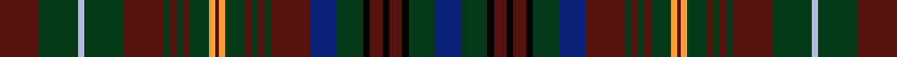

This page is one **sett** — a single exact thread-count. It belongs to the [tartan](/setts/dr12dg12lb2dg12dr12dg2dr2dg2dr2dg6lo2dr1lo2dg6dr2dg2dr2dg2dr12db8dg8k2dr4k2dr4k2dg8db8/)
(the same proportion at any scale), whose colour order is pattern [BGKBKBKGBBGBGBGYBYGBGBGBGWGB](/stripes/bgkbkbkgbbgbgbgybygbgbgbgwgb/).

Part of the [MacMaster](/tartans/macmaster-2/) tartan — the named design grouping this sett with its other cloths.

Sourced from tartans-authority.  It is a [28 stripe tartan](/stripes/stripes28/).

Original link http://www.tartansauthority.com/tartan-ferret/display/3492/

2 attestations — the source records this cloth was collapsed from (oldest owns this page)

<ul>
<li>2001 — MacMaster (Name 2001) (tartans-authority, <a href="http://www.tartansauthority.com/tartan-ferret/display/3492/">record</a>)  <em>Asymmetric. This would appear to have the strongest claim to being a tartan for all Macmasters having been designed under the auspices of the International Association of the Clan Macinnes - the "parent" clan for Macmasters. An asymmetric tartan designed by Blair Urquhart for David John MacMaster of Beamsville, Ontario, Canada. For use by all of the name regardless of spelling. Created to celebrate the 200th anniversary of the MacMaster families in Canada. The families emigrated from Moidart and settled in Craignish, Inverness Co, Cape Breton. A prime example - apparently - of separate entities designing a tartan for the same name unaware that one already exists!</em></li>
<li>undated — MacMaster (Canada) (register-of-tartans, <a href="https://www.tartanregister.gov.uk/tartanDetails.aspx?ref=5207">record</a>)  <em>An asymmetric tartan designed by Blair Urquhart for David John MacMaster of Beamsville, Ontario, Canada. For use by all of the name regardless of spelling. Created to celebrate the 200th anniversary of the MacMaster families in Canada. The families emigrated from Moidart and settled in Craignish, Inverness Co, Cape Breton. A prime example of separate entities designing a tartan for the same name unaware that one already exists.</em></li>
</ul>

## Register references

External register numbers recorded for this tartan.

- Scottish Register of Tartans: [5207](https://www.tartanregister.gov.uk/tartanDetails.aspx?ref=5207)
- Scottish Tartans Authority (ITI): 3492

## Thread count
DR/24 DG24 LB4 DG24 DR24 DG4 DR4 DG4 DR4 DG12 LO4 DR2 LO4 DG12 DR4 DG4 DR4 DG4 DR24 DB16 DG16 K4 DR8 K4 DR8 K4 DG16 DB/16

One full sett is **524 threads**.

## Palette
<table><thead><tr><th>Colour</th><th>Shade</th><th>OKLCh</th></tr></thead><tbody><tr><td>DB</td><td><code style="background-color:#082077;">#082077</code> <small style="color:#888">#082077</small></td><td><small style="color:#888">oklch(30.0% 0.149 265.1)</small></td></tr><tr><td>DR</td><td><code style="background-color:#55120C;">#55120C</code> <small style="color:#888">#55120C</small></td><td><small style="color:#888">oklch(30.0% 0.099 29.3)</small></td></tr><tr><td>LO</td><td><code style="background-color:#FF9C34;">#FF9C34</code> <small style="color:#888">#FF9C34</small></td><td><small style="color:#888">oklch(77.9% 0.161 61.8)</small></td></tr><tr><td>DG</td><td><code style="background-color:#053819;">#053819</code> <small style="color:#888">#053819</small></td><td><small style="color:#888">oklch(30.0% 0.075 151.3)</small></td></tr><tr><td>K</td><td><code style="background-color:#000000;">#000000</code> <small style="color:#888">#000000</small></td><td><small style="color:#888">oklch(0.0% 0.000 0.0)</small></td></tr><tr><td>LB</td><td><code style="background-color:#B5BBDE;">#B5BBDE</code> <small style="color:#888">#B5BBDE</small></td><td><small style="color:#888">oklch(79.9% 0.050 277.6)</small></td></tr></tbody></table>

# Sample pattern

ID: /variants/s28/dr12dg12lb2dg12dr12dg2dr2dg2dr2dg6lo2dr1lo2dg6dr2dg2dr2dg2dr12db8dg8k2dr4k2dr4k2dg8db8~x2/
