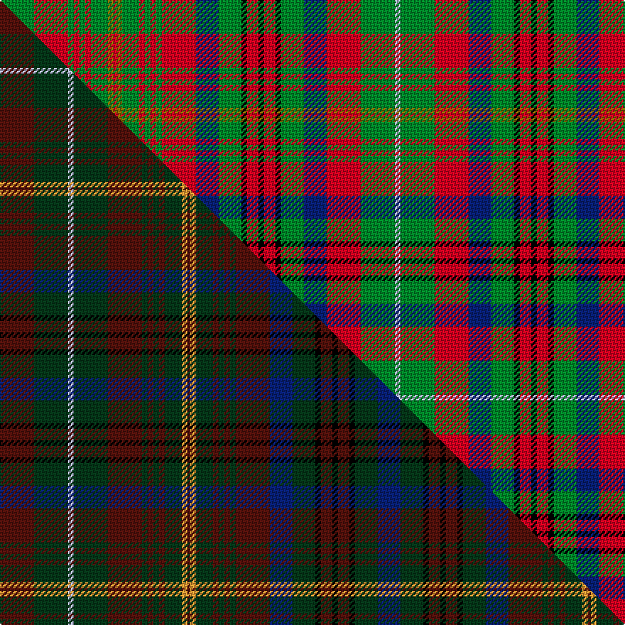

This is one **variant** — a specific cloth: this exact thread count and colourway, with its own
provenance below. It is one weaving of the [sett](/setts/g12r12g2r2g2r2g6y2r1y2g6r2g2r2g2r12db8g8k2r4k2r4k2g8db8r12g12lb2/) (the scale-free proportion — the
same cloth at any scale or shade), whose colour order is pattern [GRGRGRGGRGGRGRGRBGKRKRKGBRGW](/stripes/grgrgrggrggrgrgrbgkrkrkgbrgw/).

Part of the [MacMaster](/tartans/macmaster-2/) tartan — the named design grouping this sett with its other cloths.

Sourced from house-of-tartan.  It is a [28 stripe tartan](/stripes/stripes28/).

Original link [http://www.house-of-tartan.scotland.net/house/TartanViewjs.asp?colr=Def&tnam=3218](http://www.house-of-tartan.scotland.net/house/TartanViewjs.asp?colr=Def&tnam=3218)

## Provenance

Earliest known date: 2001 Asymetrical design follows Canadian tradition. Elements of the MacInnes and the Nova Scotia tartans were included in line with Dave McMaster's family history.

2 attestations — the source records this cloth was collapsed from (oldest owns this page)

<ul>
<li>2001 — MacMaster (New) Family Tartan (house-of-tartan, <a href="http://www.house-of-tartan.scotland.net/house/TartanViewjs.asp?colr=Def&tnam=3218">record</a>) </li>
<li>2001 — MacMaster Canadian Family Tartan (house-of-tartan, <a href="http://www.house-of-tartan.scotland.net/house/TartanViewjs.asp?colr=Def&tnam=3492">record</a>) </li>
</ul>

Dataset <small>— provenance for this record, inherited from the source manifest</small>

<dl class="dataset-prov">
<dt>source</dt><dd><a href="/sources/house-of-tartan/">House of Tartan</a></dd>
<dt>data captured from</dt><dd><a href="https://github.com/thetartan/tartan-database/blob/master/data/house-of-tartan/data.csv">https://github.com/thetartan/tartan-database/blob/master/data/house-of-tartan/data.csv</a></dd>
<dt>data date</dt><dd>2001 <small>(this record)</small></dd>
<dt>licence</dt><dd><a href="https://creativecommons.org/licenses/by-nc-nd/4.0/">CC BY-NC-ND 4.0</a></dd>
</dl>

Capture chain <small>— the hands this data passed through, oldest first; each capture carries its own licence</small>

<ol class="capture-chain">
<li><a href="http://www.house-of-tartan.scotland.net/">House of Tartan</a> <small>the weaver/retailer's database — the site is now offline; the URL is kept as the ultimate source's identity</small></li>
<li><a href="https://github.com/thetartan/tartan-database">thetartan/tartan-database</a> <small>2016-2017</small> · <a href="https://creativecommons.org/licenses/by-nc-nd/4.0/">CC BY-NC-ND 4.0</a> <small>Levko Kravets's frozen compilation — the capture we vendored, and where its CC licence text came from</small></li>
<li>this dictionary <small>captured 2026-06-10 · commit 5bf86c7566</small> <small>each re-capture is a git commit to data/sources</small></li>
</ol>

## Thread count
G/24 R24 G4 R4 G4 R4 G12 Y4 R2 Y4 G12 R4 G4 R4 G4 R24 DB16 G16 K4 R8 K4 R8 K4 G16 DB16 R24 G24 LB/4

One full sett is **536 threads**.

## Palette
<table><thead><tr><th>Colour</th><th>Shade</th><th>OKLCh</th></tr></thead><tbody><tr><td>LB</td><td><code style="background-color:#B5BBDE;">#B5BBDE</code> <small style="color:#888">#B5BBDE</small></td><td><small style="color:#888">oklch(79.9% 0.050 277.6)</small></td></tr><tr><td>DB</td><td><code style="background-color:#082077;">#082077</code> <small style="color:#888">#082077</small></td><td><small style="color:#888">oklch(30.0% 0.149 265.1)</small></td></tr><tr><td>G</td><td><code style="background-color:#008B2A;">#008B2A</code> <small style="color:#888">#008B2A</small></td><td><small style="color:#888">oklch(55.4% 0.170 145.9)</small></td></tr><tr><td>K</td><td><code style="background-color:#000000;">#000000</code> <small style="color:#888">#000000</small></td><td><small style="color:#888">oklch(0.0% 0.000 0.0)</small></td></tr><tr><td>R</td><td><code style="background-color:#D60020;">#D60020</code> <small style="color:#888">#D60020</small></td><td><small style="color:#888">oklch(55.2% 0.224 25.5)</small></td></tr><tr><td>Y</td><td><code style="background-color:#8B6E00;">#8B6E00</code> <small style="color:#888">#8B6E00</small></td><td><small style="color:#888">oklch(55.1% 0.113 90.4)</small></td></tr></tbody></table>

# Sample pattern

## Compared to the master

This cloth is one sett of its design; the master sett (the exemplar the design is anchored on) is below for comparison.

Its **ΔTartan distance** from the master is **0.69** — the same measure the nearest-tartans table ranks by (0 is identical; a re-scale of the same cloth is near 0, a recolour or a different proportion further).

<figure class="master-compare" style="margin:0">

this sett
master sett ★

<figcaption style="color:#888;font-size:smaller">One weave of this sett against the <a href="/setts/dr12dg12lb2dg12dr12dg2dr2dg2dr2dg6lo2dr1lo2dg6dr2dg2dr2dg2dr12db8dg8k2dr4k2dr4k2dg8db8/">master sett ★</a>, split on the diagonal: a shared proportion runs seamlessly across it with only the shades shifting; a different proportion breaks on it.</figcaption>
</figure>

## Nearest tartan variants

The nearest existing variants by ΔTartan distance, with this cloth at the top so the swatches line up against it.

ΔTartan

Threads

Variant

Sett

—

536

<a href="/variants/s28/g12r12g2r2g2r2g6y2r1y2g6r2g2r2g2r12db8g8k2r4k2r4k2g8db8r12g12lb2~x2/">MacMaster (New) Family Tartan</a>

<a href="/ttd/edit/#slug=g10r2g10r9k1r1k2r1k1r9k1r1k2r1k1r9w1r4db11r2db11r4w1r9g2r4g2r9g5r3g4r3g3y1g3r3g6w1~x2&amp;base=g12r12g2r2g2r2g6y2r1y2g6r2g2r2g2r12db8g8k2r4k2r4k2g8db8r12g12lb2~x2" title="compare in the TTD">2.55</a>

590

<a href="/variants/s38/g10r2g10r9k1r1k2r1k1r9k1r1k2r1k1r9w1r4db11r2db11r4w1r9g2r4g2r9g5r3g4r3g3y1g3r3g6w1~x2/">MacRae Prince's Own</a>

<a href="/ttd/edit/#slug=lb4r3ly2r9lb3g24lb3r9k3r3w2~x2&amp;base=g12r12g2r2g2r2g6y2r1y2g6r2g2r2g2r12db8g8k2r4k2r4k2g8db8r12g12lb2~x2" title="compare in the TTD">2.73</a>

248

<a href="/variants/s11/lb4r3ly2r9lb3g24lb3r9k3r3w2~x2/">Wilson's No.128</a>

<a href="/ttd/edit/#slug=g29r5g28r22k2r2k4r2k2r22k2r2k4r2k2r20w2r9db26r5db28r9w2r22g3r8g3r22g8r6g8r6g5y3g5r7g12w2~x2&amp;base=g12r12g2r2g2r2g6y2r1y2g6r2g2r2g2r12db8g8k2r4k2r4k2g8db8r12g12lb2~x2" title="compare in the TTD">2.92</a>

1342

<a href="/variants/s38/g29r5g28r22k2r2k4r2k2r22k2r2k4r2k2r20w2r9db26r5db28r9w2r22g3r8g3r22g8r6g8r6g5y3g5r7g12w2~x2/">MacRae The Princes Own Clan Tartan</a>

<a href="/ttd/edit/#slug=r25w4k4g25lo3k15t13r5t5r15g4r5k2g3~x2~r2109032-w3600000-t2503227&amp;base=g12r12g2r2g2r2g6y2r1y2g6r2g2r2g2r12db8g8k2r4k2r4k2g8db8r12g12lb2~x2" title="compare in the TTD">3.05</a>

456

<a href="/variants/s14/r25w4k4g25lo3k15t13r5t5r15g4r5k2g3~x2~r2109032-w3600000-t2503227/">Wilson's No.226</a>

<a href="/ttd/edit/#slug=r5k3g22k3y3dp7r7k2dp4w2dp4r7k2r7y3k3g22k2~x2&amp;base=g12r12g2r2g2r2g6y2r1y2g6r2g2r2g2r12db8g8k2r4k2r4k2g8db8r12g12lb2~x2" title="compare in the TTD">3.19</a>

418

<a href="/variants/s18/r5k3g22k3y3dp7r7k2dp4w2dp4r7k2r7y3k3g22k2~x2/">Derbyshire</a>

<a href="/ttd/edit/#slug=k8w1r2g16r8g8r11y2g2lo1g2w2r10y2r2k1w4~x2&amp;base=g12r12g2r2g2r2g6y2r1y2g6r2g2r2g2r12db8g8k2r4k2r4k2g8db8r12g12lb2~x2" title="compare in the TTD">3.22</a>

304

<a href="/variants/s17/k8w1r2g16r8g8r11y2g2lo1g2w2r10y2r2k1w4~x2/">Pernel (Personal)</a>

<a href="/ttd/edit/#slug=g23r6g23r25g4r10g4r25w3r10b31r6b31r10w3r25k2r2k4r2k2r25k2r2k4r2k2r25g23r6g23~x2&amp;base=g12r12g2r2g2r2g6y2r1y2g6r2g2r2g2r12db8g8k2r4k2r4k2g8db8r12g12lb2~x2" title="compare in the TTD">3.25</a>

1368

<a href="/variants/s31/g23r6g23r25g4r10g4r25w3r10b31r6b31r10w3r25k2r2k4r2k2r25k2r2k4r2k2r25g23r6g23~x2/">Kinnoull</a>

<a href="/ttd/edit/#slug=r8w2r8n15y1k15n8k1g1k1n8r8w2k2r3~x2&amp;base=g12r12g2r2g2r2g6y2r1y2g6r2g2r2g2r12db8g8k2r4k2r4k2g8db8r12g12lb2~x2" title="compare in the TTD">3.32</a>

310

<a href="/variants/s15/r8w2r8n15y1k15n8k1g1k1n8r8w2k2r3~x2/">Unidentified Scarlett #14</a>

<a href="/ttd/edit/#slug=y2r15y2dr2y2k14y2g10w1g6w1g10y2r7g10w1~x2&amp;base=g12r12g2r2g2r2g6y2r1y2g6r2g2r2g2r12db8g8k2r4k2r4k2g8db8r12g12lb2~x2" title="compare in the TTD">3.43</a>

342

<a href="/variants/s16/y2r15y2dr2y2k14y2g10w1g6w1g10y2r7g10w1~x2/">Dalrymple of Castleton #2</a>

<a href="/ttd/edit/#slug=dg24r7dg24r26k2r2k5r2k2r24k2r2k5r2k2r26w3r12db33r12w3r26dg4r12dg4r26dg12r8dg12r12dg8g7dg8r12dg9w3dg16w2~dg1806142-g1904115&amp;base=g12r12g2r2g2r2g6y2r1y2g6r2g2r2g2r12db8g8k2r4k2r4k2g8db8r12g12lb2~x2" title="compare in the TTD">3.51</a>

776

<a href="/variants/s38/dg24r7dg24r26k2r2k5r2k2r24k2r2k5r2k2r26w3r12db33r12w3r26dg4r12dg4r26dg12r8dg12r12dg8g7dg8r12dg9w3dg16w2~dg1806142-g1904115/">Kinnoull (MacRae) - Error?</a>

## Neighbour map

Every grey dot is one of 13621 variants placed by the first two principal components of the ΔTartan feature space (42% of its variance). Red is this tartan; blue dots are its nearest — click one to open its page.

<svg viewBox="0 0 640 380" role="img" style="max-width:100%;height:auto;border:1px solid #e0e0e0;border-radius:4px;display:block" xmlns="http://www.w3.org/2000/svg"><image href="/nn/cloud.v1.png" width="640" height="380"/><a href="/variants/s38/g10r2g10r9k1r1k2r1k1r9k1r1k2r1k1r9w1r4db11r2db11r4w1r9g2r4g2r9g5r3g4r3g3y1g3r3g6w1~x2/"><circle cx="152.8" cy="86.2" r="4" fill="#3465a4"><title>MacRae Prince's Own</title></circle></a><a href="/variants/s11/lb4r3ly2r9lb3g24lb3r9k3r3w2~x2/"><circle cx="150.1" cy="102.2" r="4" fill="#3465a4"><title>Wilson's No.128</title></circle></a><a href="/variants/s38/g29r5g28r22k2r2k4r2k2r22k2r2k4r2k2r20w2r9db26r5db28r9w2r22g3r8g3r22g8r6g8r6g5y3g5r7g12w2~x2/"><circle cx="172.6" cy="66.8" r="4" fill="#3465a4"><title>MacRae The Princes Own Clan Tartan</title></circle></a><a href="/variants/s14/r25w4k4g25lo3k15t13r5t5r15g4r5k2g3~x2~r2109032-w3600000-t2503227/"><circle cx="66.4" cy="99.5" r="4" fill="#3465a4"><title>Wilson's No.226</title></circle></a><a href="/variants/s18/r5k3g22k3y3dp7r7k2dp4w2dp4r7k2r7y3k3g22k2~x2/"><circle cx="117.0" cy="106.6" r="4" fill="#3465a4"><title>Derbyshire</title></circle></a><a href="/variants/s17/k8w1r2g16r8g8r11y2g2lo1g2w2r10y2r2k1w4~x2/"><circle cx="133.7" cy="99.5" r="4" fill="#3465a4"><title>Pernel (Personal)</title></circle></a><a href="/variants/s31/g23r6g23r25g4r10g4r25w3r10b31r6b31r10w3r25k2r2k4r2k2r25k2r2k4r2k2r25g23r6g23~x2/"><circle cx="206.4" cy="94.9" r="4" fill="#3465a4"><title>Kinnoull</title></circle></a><a href="/variants/s15/r8w2r8n15y1k15n8k1g1k1n8r8w2k2r3~x2/"><circle cx="116.3" cy="80.5" r="4" fill="#3465a4"><title>Unidentified Scarlett #14</title></circle></a><a href="/variants/s16/y2r15y2dr2y2k14y2g10w1g6w1g10y2r7g10w1~x2/"><circle cx="129.0" cy="112.5" r="4" fill="#3465a4"><title>Dalrymple of Castleton #2</title></circle></a><a href="/variants/s38/dg24r7dg24r26k2r2k5r2k2r24k2r2k5r2k2r26w3r12db33r12w3r26dg4r12dg4r26dg12r8dg12r12dg8g7dg8r12dg9w3dg16w2~dg1806142-g1904115/"><circle cx="200.7" cy="71.0" r="4" fill="#3465a4"><title>Kinnoull (MacRae) - Error?</title></circle></a><circle cx="144.5" cy="109.1" r="5" fill="#c00000"/><text x="320" y="376" text-anchor="middle" font-size="11" fill="#999">ground</text><text x="11" y="190" text-anchor="middle" font-size="11" fill="#999" transform="rotate(-90 11 190)">complexity</text></svg>

ID: /variants/s28/g12r12g2r2g2r2g6y2r1y2g6r2g2r2g2r12db8g8k2r4k2r4k2g8db8r12g12lb2~x2/
