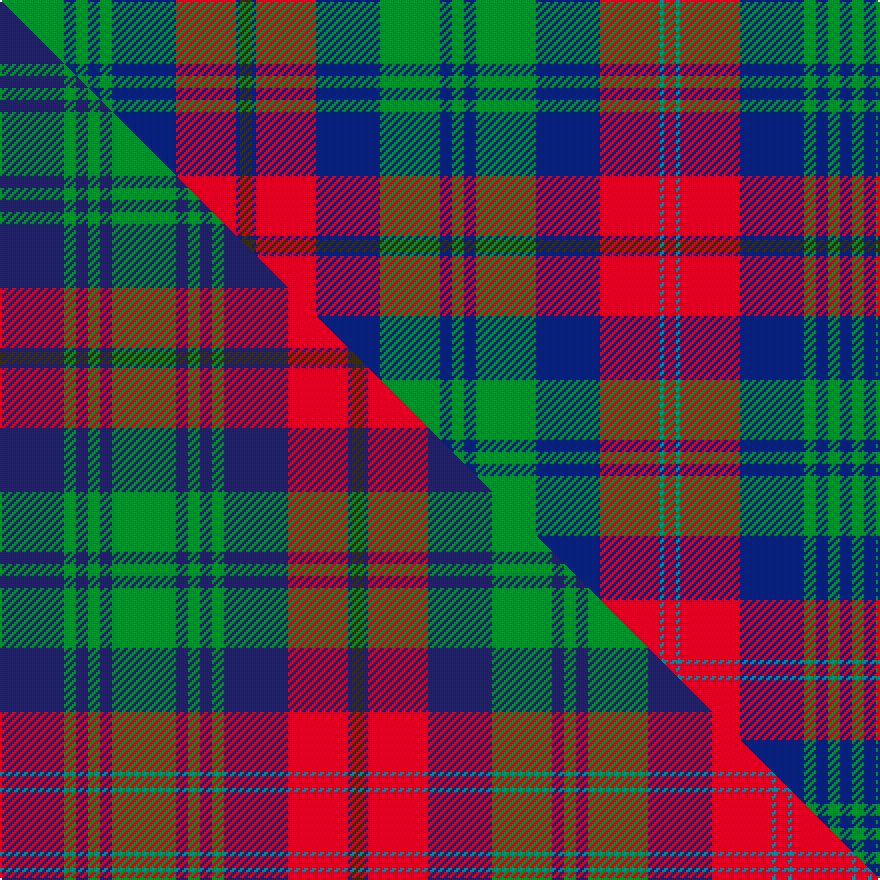

This is one **variant** — a specific cloth: this exact thread count and colourway, with its own
provenance below. It is one weaving of the [sett](/setts/g16db3g3db3g3db16r15db1dy3db1r15db16g15db3g3db3g15db16r15t1r3t1r15db16g3db3g3db3/) (the scale-free proportion — the
same cloth at any scale or shade), whose colour order is pattern [BGBGBRBRBRBGBGBGBRBGBRBGBGBG](/stripes/bgbgbrbrbrbgbgbgbrbgbrbgbgbg/).

Part of the [Cairns of Finavon](/tartans/cairns-of-finavon/) tartan — the named design grouping this sett with its other cloths.

Sourced from tartans-authority.  It is a [28 stripe tartan](/stripes/stripes28/).

Original link [https://www.tartanregister.gov.uk/tartanDetails.aspx?ref=7006](https://www.tartanregister.gov.uk/tartanDetails.aspx?ref=7006)

Dataset <small>— provenance for this record, inherited from the source manifest</small>

<dl class="dataset-prov">
<dt>source</dt><dd><a href="/sources/tartans-authority/">Scottish Tartans Authority</a></dd>
<dt>data captured from</dt><dd><a href="https://github.com/thetartan/tartan-database/blob/master/data/tartans-authority/data.csv">https://github.com/thetartan/tartan-database/blob/master/data/tartans-authority/data.csv</a></dd>
<dt>data date</dt><dd>September 2006 <small>(this record)</small></dd>
<dt>licence</dt><dd><a href="https://creativecommons.org/licenses/by-nc-nd/4.0/">CC BY-NC-ND 4.0</a></dd>
</dl>

Capture chain <small>— the hands this data passed through, oldest first; each capture carries its own licence</small>

<ol class="capture-chain">
<li><a href="https://www.tartansauthority.com/">Scottish Tartans Authority</a> <small>the heritage body's archive — its tartan-ferret record browser is retired (links repaired to the SRT, above)</small></li>
<li><a href="https://github.com/thetartan/tartan-database">thetartan/tartan-database</a> <small>2016-2017</small> · <a href="https://creativecommons.org/licenses/by-nc-nd/4.0/">CC BY-NC-ND 4.0</a> <small>Levko Kravets's frozen compilation — the capture we vendored, and where its CC licence text came from</small></li>
<li>this dictionary <small>captured 2026-06-10 · commit 5bf86c7566</small> <small>each re-capture is a git commit to data/sources</small></li>
</ol>

## Register references

External register numbers recorded for this tartan.

- Scottish Tartans Authority (ITI): 7006

## Thread count
G/32 DB6 G6 DB6 G6 DB32 R30 DB2 DY6 DB2 R30 DB32 G30 DB6 G6 DB6 G30 DB32 R30 T2 R6 T2 R30 DB32 G6 DB6 G6 DB/6

One full sett is **814 threads**.

## Palette
<table><thead><tr><th>Colour</th><th>Shade</th><th>OKLCh</th></tr></thead><tbody><tr><td>T</td><td><code style="background-color:#00879F;">#00879F</code> <small style="color:#888">#00879F</small></td><td><small style="color:#888">oklch(57.4% 0.102 216.1)</small></td></tr><tr><td>DB</td><td><code style="background-color:#082077;">#082077</code> <small style="color:#888">#082077</small></td><td><small style="color:#888">oklch(30.0% 0.149 265.1)</small></td></tr><tr><td>G</td><td><code style="background-color:#008B2A;">#008B2A</code> <small style="color:#888">#008B2A</small></td><td><small style="color:#888">oklch(55.4% 0.170 145.9)</small></td></tr><tr><td>R</td><td><code style="background-color:#D60020;">#D60020</code> <small style="color:#888">#D60020</small></td><td><small style="color:#888">oklch(55.2% 0.224 25.5)</small></td></tr><tr><td>DY</td><td><code style="background-color:#3A2B0D;">#3A2B0D</code> <small style="color:#888">#3A2B0D</small></td><td><small style="color:#888">oklch(30.0% 0.049 82.0)</small></td></tr></tbody></table>

# Sample pattern

## Compared to the master

This cloth is one sett of its design; the master sett (the exemplar the design is anchored on) is below for comparison.

Its **ΔTartan distance** from the master is **0.05** — the same measure the nearest-tartans table ranks by (0 is identical; a re-scale of the same cloth is near 0, a recolour or a different proportion further).

<figure class="master-compare" style="margin:0">

this sett
master sett ★

<figcaption style="color:#888;font-size:smaller">One weave of this sett against the <a href="/setts/db16g3db3g3db3g16db3g3db3g3db16r15db1dy3db1r15db16g15db3g3db3g15db16r15t1r3t1r15/">master sett ★</a>, split on the diagonal: a shared proportion runs seamlessly across it with only the shades shifting; a different proportion breaks on it.</figcaption>
</figure>

## Nearest tartan variants

The nearest existing variants by ΔTartan distance, with this cloth at the top so the swatches line up against it.

ΔTartan

Threads

Variant

Sett

—

814

<a href="/variants/s28/g16db3g3db3g3db16r15db1dy3db1r15db16g15db3g3db3g15db16r15t1r3t1r15db16g3db3g3db3~x2/">Cairns of Finavon (Name)</a>

<a href="/ttd/edit/#slug=dt16g3dt3g3dt3g16dt3g3dt3g3dt16r15dt1dy3dt1r15dt16g15dt3g3dt3g15dt16r15t1r3t1r15~x2~dt1204274&amp;base=g16db3g3db3g3db16r15db1dy3db1r15db16g15db3g3db3g15db16r15t1r3t1r15db16g3db3g3db3~x2" title="compare in the TTD">0.04</a>

790

<a href="/variants/s28/db16g3db3g3db3g16db3g3db3g3db16r15db1dy3db1r15db16g15db3g3db3g15db16r15t1r3t1r15~x2~db1204274/">Cairns of Finavon</a>

<a href="/ttd/edit/#slug=g16dt3g3dt3g3dt16r15dt1dy3dt1r15dt16g15dt3g3dt3g15dt16r15t1r3t1r15dt16g3dt3g3dt3~x2~dt1204274&amp;base=g16db3g3db3g3db16r15db1dy3db1r15db16g15db3g3db3g15db16r15t1r3t1r15db16g3db3g3db3~x2" title="compare in the TTD">0.04</a>

814

<a href="/variants/s28/g16db3g3db3g3db16r15db1dy3db1r15db16g15db3g3db3g15db16r15t1r3t1r15db16g3db3g3db3~x2~db1204274/">Cairns of Finavon Personal Tartan</a>

<a href="/ttd/edit/#slug=g10r3db12lb1r10g12r3db20r3db3lb1r3db20r3g12r12lb1db12r3g20r3db3~x2&amp;base=g16db3g3db3g3db16r15db1dy3db1r15db16g15db3g3db3g15db16r15t1r3t1r15db16g3db3g3db3~x2" title="compare in the TTD">2.34</a>

654

<a href="/variants/s22/g10r3db12lb1r10g12r3db20r3db3lb1r3db20r3g12r12lb1db12r3g20r3db3~x2/">Cumming</a>

<a href="/ttd/edit/#slug=r3db21r3g7r7db8r3g21r3db3r3g21r3db8r6g7r3db21r3db3lb1~x2&amp;base=g16db3g3db3g3db16r15db1dy3db1r15db16g15db3g3db3g15db16r15t1r3t1r15db16g3db3g3db3~x2" title="compare in the TTD">2.65</a>

624

<a href="/variants/s21/r3db21r3g7r7db8r3g21r3db3r3g21r3db8r6g7r3db21r3db3lb1~x2/">MacIntyre, or Perthshire</a>

<a href="/ttd/edit/#slug=db3r15g2r2g12w2db12r2db4r2db12w2r8db2r2db2r2db2r8db2r2db2r2db2r8g10db1g2r2~x2&amp;base=g16db3g3db3g3db16r15db1dy3db1r15db16g15db3g3db3g15db16r15t1r3t1r15db16g3db3g3db3~x2" title="compare in the TTD">2.80</a>

506

<a href="/variants/s29/db3r15g2r2g12w2db12r2db4r2db12w2r8db2r2db2r2db2r8db2r2db2r2db2r8g10db1g2r2~x2/">Summerville Presbyterian Church (Cor</a>

<a href="/ttd/edit/#slug=r15w2r15y1db8w2db8y1db12r1y3r1db12w2g20w2y1db20y1~x2&amp;base=g16db3g3db3g3db16r15db1dy3db1r15db16g15db3g3db3g15db16r15t1r3t1r15db16g3db3g3db3~x2" title="compare in the TTD">2.88</a>

476

<a href="/variants/s19/r15w2r15y1db8w2db8y1db12r1y3r1db12w2g20w2y1db20y1~x2/">Hébert Kitenge Family (Personal)</a>

<a href="/ttd/edit/#slug=db30w2lb3g3lb3g3lb3g16r3g3r3g3r3g3r3g25r15g4lb4r8w2r15~x2&amp;base=g16db3g3db3g3db16r15db1dy3db1r15db16g15db3g3db3g15db16r15t1r3t1r15db16g3db3g3db3~x2" title="compare in the TTD">2.98</a>

538

<a href="/variants/s22/db30w2lb3g3lb3g3lb3g16r3g3r3g3r3g3r3g25r15g4lb4r8w2r15~x2/">Wilson (Janet) #2</a>

<a href="/ttd/edit/#slug=r9db3dg12r2db40r2dg20db2r18db2w2db2r18db2dg20r2db40r2dg12db3r9y2~x2&amp;base=g16db3g3db3g3db16r15db1dy3db1r15db16g15db3g3db3g15db16r15t1r3t1r15db16g3db3g3db3~x2" title="compare in the TTD">3.02</a>

874

<a href="/variants/s22/r9db3dg12r2db40r2dg20db2r18db2w2db2r18db2dg20r2db40r2dg12db3r9y2~x2/">Kormylo (Personal)</a>

<a href="/ttd/edit/#slug=db2lb1r2g16r2db6lb1r2g6r2db16lb1r2g2~x2~db1406275-r2109032&amp;base=g16db3g3db3g3db16r15db1dy3db1r15db16g15db3g3db3g15db16r15t1r3t1r15db16g3db3g3db3~x2" title="compare in the TTD">3.07</a>

236

<a href="/variants/s14/db2lb1r2g16r2db6lb1r2g6r2db16lb1r2g2~x2~db1406275-r2109032/">Norwich No.023</a>

<a href="/ttd/edit/#slug=dp30w2lb3dg3lb3dg3lb3dg16r3dg3r3dg3r3dg3r3dg25r15dg4lb4r8w2r15~x2&amp;base=g16db3g3db3g3db16r15db1dy3db1r15db16g15db3g3db3g15db16r15t1r3t1r15db16g3db3g3db3~x2" title="compare in the TTD">3.17</a>

538

<a href="/variants/s22/dp30w2lb3dg3lb3dg3lb3dg16r3dg3r3dg3r3dg3r3dg25r15dg4lb4r8w2r15~x2/">Wilson, Janet (1780 Original)</a>

## Neighbour map

Every grey dot is one of 13621 variants placed by the first two principal components of the ΔTartan feature space (42% of its variance). Red is this tartan; blue dots are its nearest — click one to open its page.

<svg viewBox="0 0 640 380" role="img" style="max-width:100%;height:auto;border:1px solid #e0e0e0;border-radius:4px;display:block" xmlns="http://www.w3.org/2000/svg"><image href="/nn/cloud.v1.png" width="640" height="380"/><a href="/variants/s28/db16g3db3g3db3g16db3g3db3g3db16r15db1dy3db1r15db16g15db3g3db3g15db16r15t1r3t1r15~x2~db1204274/"><circle cx="196.0" cy="126.8" r="4" fill="#3465a4"><title>Cairns of Finavon</title></circle></a><a href="/variants/s28/g16db3g3db3g3db16r15db1dy3db1r15db16g15db3g3db3g15db16r15t1r3t1r15db16g3db3g3db3~x2~db1204274/"><circle cx="196.0" cy="126.8" r="4" fill="#3465a4"><title>Cairns of Finavon Personal Tartan</title></circle></a><a href="/variants/s22/g10r3db12lb1r10g12r3db20r3db3lb1r3db20r3g12r12lb1db12r3g20r3db3~x2/"><circle cx="220.1" cy="139.7" r="4" fill="#3465a4"><title>Cumming</title></circle></a><a href="/variants/s21/r3db21r3g7r7db8r3g21r3db3r3g21r3db8r6g7r3db21r3db3lb1~x2/"><circle cx="230.6" cy="134.3" r="4" fill="#3465a4"><title>MacIntyre, or Perthshire</title></circle></a><a href="/variants/s29/db3r15g2r2g12w2db12r2db4r2db12w2r8db2r2db2r2db2r8db2r2db2r2db2r8g10db1g2r2~x2/"><circle cx="213.9" cy="125.2" r="4" fill="#3465a4"><title>Summerville Presbyterian Church (Cor</title></circle></a><a href="/variants/s19/r15w2r15y1db8w2db8y1db12r1y3r1db12w2g20w2y1db20y1~x2/"><circle cx="219.7" cy="110.4" r="4" fill="#3465a4"><title>Hébert Kitenge Family (Personal)</title></circle></a><a href="/variants/s22/db30w2lb3g3lb3g3lb3g16r3g3r3g3r3g3r3g25r15g4lb4r8w2r15~x2/"><circle cx="183.9" cy="116.2" r="4" fill="#3465a4"><title>Wilson (Janet) #2</title></circle></a><a href="/variants/s22/r9db3dg12r2db40r2dg20db2r18db2w2db2r18db2dg20r2db40r2dg12db3r9y2~x2/"><circle cx="245.7" cy="106.8" r="4" fill="#3465a4"><title>Kormylo (Personal)</title></circle></a><a href="/variants/s14/db2lb1r2g16r2db6lb1r2g6r2db16lb1r2g2~x2~db1406275-r2109032/"><circle cx="233.3" cy="125.3" r="4" fill="#3465a4"><title>Norwich No.023</title></circle></a><a href="/variants/s22/dp30w2lb3dg3lb3dg3lb3dg16r3dg3r3dg3r3dg3r3dg25r15dg4lb4r8w2r15~x2/"><circle cx="192.6" cy="112.1" r="4" fill="#3465a4"><title>Wilson, Janet (1780 Original)</title></circle></a><circle cx="190.1" cy="126.2" r="5" fill="#c00000"/><text x="320" y="376" text-anchor="middle" font-size="11" fill="#999">ground</text><text x="11" y="190" text-anchor="middle" font-size="11" fill="#999" transform="rotate(-90 11 190)">complexity</text></svg>

ID: /variants/s28/g16db3g3db3g3db16r15db1dy3db1r15db16g15db3g3db3g15db16r15t1r3t1r15db16g3db3g3db3~x2/
