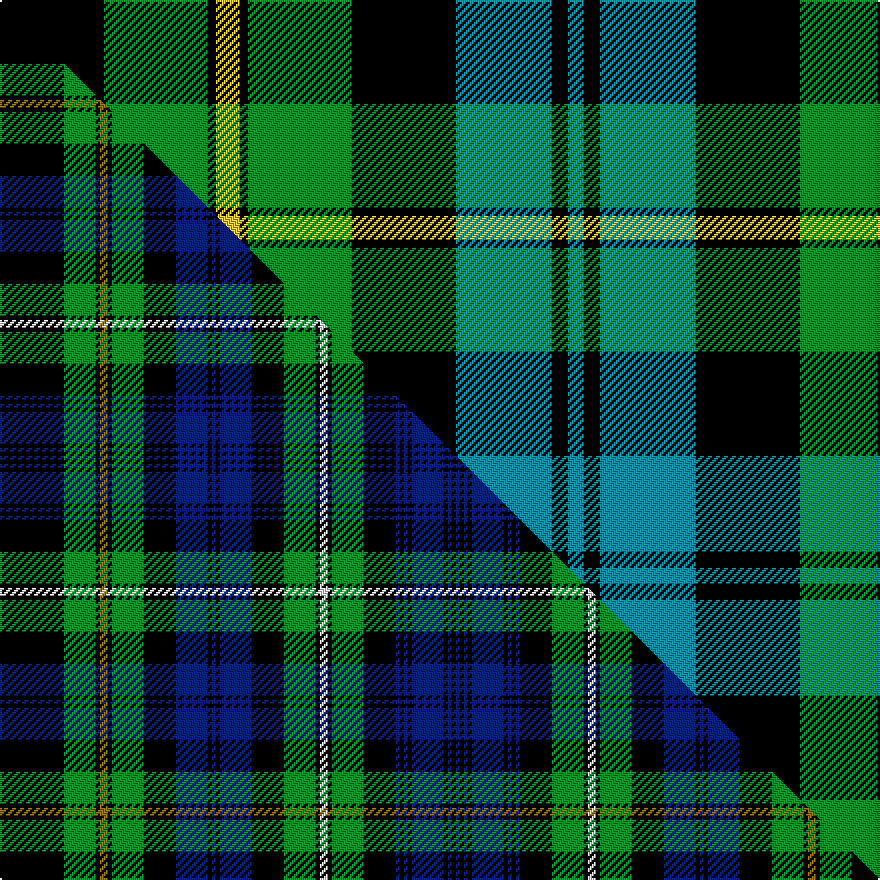

This page is one **sett** — a single exact thread-count. It belongs to the [tartan](/setts/k13g13k1ly3k1g13k13t12k2t2k2t12k13g13k1w3k1g13k13t2k2t2k2t13k2t2k2t2/)
(the same proportion at any scale), whose colour order is pattern [BKBKBKBKBKGKWKGKBKBKBKGKYKGK](/stripes/bkbkbkbkbkgkwkgkbkbkbkgkykgk/).

Part of the [Campbell of Argyll](/tartans/campbell-of-argyll/) tartan — the named design grouping this sett with its other cloths.

Sourced from tartans-authority.  It is a [28 stripe tartan](/stripes/stripes28/).

Original link [https://www.tartanregister.gov.uk/tartanDetails.aspx?ref=1961](https://www.tartanregister.gov.uk/tartanDetails.aspx?ref=1961)

Dataset <small>— provenance for this record, inherited from the source manifest</small>

<dl class="dataset-prov">
<dt>source</dt><dd><a href="/sources/tartans-authority/">Scottish Tartans Authority</a></dd>
<dt>data captured from</dt><dd><a href="https://github.com/thetartan/tartan-database/blob/master/data/tartans-authority/data.csv">https://github.com/thetartan/tartan-database/blob/master/data/tartans-authority/data.csv</a></dd>
<dt>data date</dt><dd>1810 <small>(this record)</small></dd>
<dt>licence</dt><dd><a href="https://creativecommons.org/licenses/by-nc-nd/4.0/">CC BY-NC-ND 4.0</a></dd>
</dl>

Capture chain <small>— the hands this data passed through, oldest first; each capture carries its own licence</small>

<ol class="capture-chain">
<li><a href="https://www.tartansauthority.com/">Scottish Tartans Authority</a> <small>the heritage body's archive — its tartan-ferret record browser is retired (links repaired to the SRT, above)</small></li>
<li><a href="https://github.com/thetartan/tartan-database">thetartan/tartan-database</a> <small>2016-2017</small> · <a href="https://creativecommons.org/licenses/by-nc-nd/4.0/">CC BY-NC-ND 4.0</a> <small>Levko Kravets's frozen compilation — the capture we vendored, and where its CC licence text came from</small></li>
<li>this dictionary <small>captured 2026-06-10 · commit 5bf86c7566</small> <small>each re-capture is a git commit to data/sources</small></li>
</ol>

## Register references

External register numbers recorded for this tartan.

- Scottish Tartans Authority (ITI): 1961

## Thread count
K/52 G52 K4 LY12 K4 G52 K52 T48 K8 T8 K8 T48 K52 G52 K4 W12 K4 G52 K52 T8 K8 T8 K8 T52 K8 T8 K8 T/8

One full sett is **1324 threads**.

## Palette
<table><thead><tr><th>Colour</th><th>Shade</th><th>OKLCh</th></tr></thead><tbody><tr><td>T</td><td><code style="background-color:#00879F;">#00879F</code> <small style="color:#888">#00879F</small></td><td><small style="color:#888">oklch(57.4% 0.102 216.1)</small></td></tr><tr><td>G</td><td><code style="background-color:#008B2A;">#008B2A</code> <small style="color:#888">#008B2A</small></td><td><small style="color:#888">oklch(55.4% 0.170 145.9)</small></td></tr><tr><td>K</td><td><code style="background-color:#000000;">#000000</code> <small style="color:#888">#000000</small></td><td><small style="color:#888">oklch(0.0% 0.000 0.0)</small></td></tr><tr><td>W</td><td><code style="background-color:#F7F7F7;">#F7F7F7</code> <small style="color:#888">#F7F7F7</small></td><td><small style="color:#888">oklch(97.6% 0.000 89.9)</small></td></tr><tr><td>LY</td><td><code style="background-color:#DCBC32;">#DCBC32</code> <small style="color:#888">#DCBC32</small></td><td><small style="color:#888">oklch(80.0% 0.150 95.2)</small></td></tr></tbody></table>

# Sample pattern

## Compared to the master

This cloth is one sett of its design; the master sett (the exemplar the design is anchored on) is below for comparison.

Its **ΔTartan distance** from the master is **0.57** — the same measure the nearest-tartans table ranks by (0 is identical; a re-scale of the same cloth is near 0, a recolour or a different proportion further).

<figure class="master-compare" style="margin:0">

this sett
master sett ★

<figcaption style="color:#888;font-size:smaller">One weave of this sett against the <a href="/setts/k16g8k1y2k1g8k8db8k1db1k1db8k8g8k1w2k1g8k8db1k1db1k1db8k1db1k1db1/">master sett ★</a>, split on the diagonal: a shared proportion runs seamlessly across it with only the shades shifting; a different proportion breaks on it.</figcaption>
</figure>

## Nearest tartan variants

The nearest existing variants by ΔTartan distance, with this cloth at the top so the swatches line up against it.

ΔTartan

Threads

Variant

Sett

—

1324

<a href="/variants/s28/k13g13k1ly3k1g13k13t12k2t2k2t12k13g13k1w3k1g13k13t2k2t2k2t13k2t2k2t2~x4/">Campbell of Argyll (Clan)</a>

<a href="/ttd/edit/#slug=k1t8k8g8k1w2k1g8k8t1k1t1k1t8k1t1k1t1k8g8k1y2k1g8k8t8k1t1~x2~w4000000&amp;base=k13g13k1ly3k1g13k13t12k2t2k2t12k13g13k1w3k1g13k13t2k2t2k2t13k2t2k2t2~x4" title="compare in the TTD">0.43</a>

424

<a href="/variants/s28/k1t8k8g8k1w2k1g8k8t1k1t1k1t8k1t1k1t1k8g8k1y2k1g8k8t8k1t1~x2~w4000000/">Campbell of Argyll #2</a>

<a href="/ttd/edit/#slug=k8g8k1y2k1g8k8db8k1db1k1db8k8g8k1w2k1g8k8db1k1db1k1db8k1db1k1db1~x2&amp;base=k13g13k1ly3k1g13k13t12k2t2k2t12k13g13k1w3k1g13k13t2k2t2k2t13k2t2k2t2~x4" title="compare in the TTD">0.50</a>

410

<a href="/variants/s28/k8g8k1y2k1g8k8db8k1db1k1db8k8g8k1w2k1g8k8db1k1db1k1db8k1db1k1db1~x2/">Campbell of Argyll Clan Tartan</a>

<a href="/ttd/edit/#slug=k16g8k1y2k1g8k8db8k1db1k1db8k8g8k1w2k1g8k8db1k1db1k1db8k1db1k1db1~x2&amp;base=k13g13k1ly3k1g13k13t12k2t2k2t12k13g13k1w3k1g13k13t2k2t2k2t13k2t2k2t2~x4" title="compare in the TTD">0.57</a>

426

<a href="/variants/s28/k16g8k1y2k1g8k8db8k1db1k1db8k8g8k1w2k1g8k8db1k1db1k1db8k1db1k1db1~x2/">Campbell of Argyll</a>

<a href="/ttd/edit/#slug=k19g22k1r4k1g22k19db16k2db3k2db16k19g22k1y4k1g22k19db3k2db3k2db28k2db3k2db3~x2&amp;base=k13g13k1ly3k1g13k13t12k2t2k2t12k13g13k1w3k1g13k13t2k2t2k2t13k2t2k2t2~x4" title="compare in the TTD">0.83</a>

1008

<a href="/variants/s28/k19g22k1r4k1g22k19db16k2db3k2db16k19g22k1y4k1g22k19db3k2db3k2db28k2db3k2db3~x2/">Farquharson or MacEwan Clan Tartan</a>

<a href="/ttd/edit/#slug=k1g6k6db1k1db1k1db7k1db1k1db1k6g6k1r1k1g6k6db6k1db1k1db6k6g6k1ly1~x4&amp;base=k13g13k1ly3k1g13k13t12k2t2k2t12k13g13k1w3k1g13k13t2k2t2k2t13k2t2k2t2~x4" title="compare in the TTD">0.86</a>

664

<a href="/variants/s28/k1g6k6db1k1db1k1db7k1db1k1db1k6g6k1r1k1g6k6db6k1db1k1db6k6g6k1ly1~x4/">MacEwen (Clans Originaux)</a>

<a href="/ttd/edit/#slug=db1k1db8k8g8k1y2k1g8k8db1k1db1k1db8k1db1k1db1k8g8k1w2k1g8k8db8k1db1~x2&amp;base=k13g13k1ly3k1g13k13t12k2t2k2t12k13g13k1w3k1g13k13t2k2t2k2t13k2t2k2t2~x4" title="compare in the TTD">1.42</a>

428

<a href="/variants/s29/db1k1db8k8g8k1y2k1g8k8db1k1db1k1db8k1db1k1db1k8g8k1w2k1g8k8db8k1db1~x2/">Campbell of Argyll</a>

<a href="/ttd/edit/#slug=db4k1db1k1db1k8g8k1w2k1g8k8db8k1db1k1db8k8g8k1ly2k1g8k8db1k1db1k1db4~x8&amp;base=k13g13k1ly3k1g13k13t12k2t2k2t12k13g13k1w3k1g13k13t2k2t2k2t13k2t2k2t2~x4" title="compare in the TTD">1.44</a>

1648

<a href="/variants/s29/db4k1db1k1db1k8g8k1w2k1g8k8db8k1db1k1db8k8g8k1ly2k1g8k8db1k1db1k1db4~x8/">Campbell</a>

<a href="/ttd/edit/#slug=db1k1db8k8g8k1y4k1g8k8db1k1db1k1db16k1db1k1db1k8g8k1w4k1g8k8db8k1db1&amp;base=k13g13k1ly3k1g13k13t12k2t2k2t12k13g13k1w3k1g13k13t2k2t2k2t13k2t2k2t2~x4" title="compare in the TTD">1.47</a>

238

<a href="/variants/s29/db1k1db8k8g8k1y4k1g8k8db1k1db1k1db16k1db1k1db1k8g8k1w4k1g8k8db8k1db1/">Campbell of Argyll</a>

<a href="/ttd/edit/#slug=r2k1t9k9g9k1w1k2w1k1g9t9k9t9k1g2~x4&amp;base=k13g13k1ly3k1g13k13t12k2t2k2t12k13g13k1w3k1g13k13t2k2t2k2t13k2t2k2t2~x4" title="compare in the TTD">1.63</a>

584

<a href="/variants/s16/r2k1t9k9g9k1w1k2w1k1g9t9k9t9k1g2~x4/">Stephenson Hunting #2</a>

<a href="/ttd/edit/#slug=k3db19k15r2g19k1t3k1g19k15db3k3db3k3db22k3db3k3db3k15g19k1t3k1g19r2k15db19k3db3~x2~t2503227&amp;base=k13g13k1ly3k1g13k13t12k2t2k2t12k13g13k1w3k1g13k13t2k2t2k2t13k2t2k2t2~x4" title="compare in the TTD">1.64</a>

960

<a href="/variants/s30/k3db19k15r2g19k1t3k1g19k15db3k3db3k3db22k3db3k3db3k15g19k1t3k1g19r2k15db19k3db3~x2~t2503227/">Sempill Clan/Family Tartan</a>

## Neighbour map

Every grey dot is one of 13621 variants placed by the first two principal components of the ΔTartan feature space (42% of its variance). Red is this tartan; blue dots are its nearest — click one to open its page.

<svg viewBox="0 0 640 380" role="img" style="max-width:100%;height:auto;border:1px solid #e0e0e0;border-radius:4px;display:block" xmlns="http://www.w3.org/2000/svg"><image href="/nn/cloud.v1.png" width="640" height="380"/><a href="/variants/s28/k1t8k8g8k1w2k1g8k8t1k1t1k1t8k1t1k1t1k8g8k1y2k1g8k8t8k1t1~x2~w4000000/"><circle cx="103.5" cy="126.9" r="4" fill="#3465a4"><title>Campbell of Argyll #2</title></circle></a><a href="/variants/s28/k8g8k1y2k1g8k8db8k1db1k1db8k8g8k1w2k1g8k8db1k1db1k1db8k1db1k1db1~x2/"><circle cx="112.0" cy="126.6" r="4" fill="#3465a4"><title>Campbell of Argyll Clan Tartan</title></circle></a><a href="/variants/s28/k16g8k1y2k1g8k8db8k1db1k1db8k8g8k1w2k1g8k8db1k1db1k1db8k1db1k1db1~x2/"><circle cx="156.1" cy="92.5" r="4" fill="#3465a4"><title>Campbell of Argyll</title></circle></a><a href="/variants/s28/k19g22k1r4k1g22k19db16k2db3k2db16k19g22k1y4k1g22k19db3k2db3k2db28k2db3k2db3~x2/"><circle cx="143.5" cy="74.6" r="4" fill="#3465a4"><title>Farquharson or MacEwan Clan Tartan</title></circle></a><a href="/variants/s28/k1g6k6db1k1db1k1db7k1db1k1db1k6g6k1r1k1g6k6db6k1db1k1db6k6g6k1ly1~x4/"><circle cx="112.1" cy="133.9" r="4" fill="#3465a4"><title>MacEwen (Clans Originaux)</title></circle></a><a href="/variants/s29/db1k1db8k8g8k1y2k1g8k8db1k1db1k1db8k1db1k1db1k8g8k1w2k1g8k8db8k1db1~x2/"><circle cx="111.4" cy="124.0" r="4" fill="#3465a4"><title>Campbell of Argyll</title></circle></a><a href="/variants/s29/db4k1db1k1db1k8g8k1w2k1g8k8db8k1db1k1db8k8g8k1ly2k1g8k8db1k1db1k1db4~x8/"><circle cx="108.3" cy="125.5" r="4" fill="#3465a4"><title>Campbell</title></circle></a><a href="/variants/s29/db1k1db8k8g8k1y4k1g8k8db1k1db1k1db16k1db1k1db1k8g8k1w4k1g8k8db8k1db1/"><circle cx="115.9" cy="95.1" r="4" fill="#3465a4"><title>Campbell of Argyll</title></circle></a><a href="/variants/s16/r2k1t9k9g9k1w1k2w1k1g9t9k9t9k1g2~x4/"><circle cx="89.8" cy="126.7" r="4" fill="#3465a4"><title>Stephenson Hunting #2</title></circle></a><a href="/variants/s30/k3db19k15r2g19k1t3k1g19k15db3k3db3k3db22k3db3k3db3k15g19k1t3k1g19r2k15db19k3db3~x2~t2503227/"><circle cx="128.0" cy="84.6" r="4" fill="#3465a4"><title>Sempill Clan/Family Tartan</title></circle></a><circle cx="117.2" cy="110.0" r="5" fill="#c00000"/><text x="320" y="376" text-anchor="middle" font-size="11" fill="#999">ground</text><text x="11" y="190" text-anchor="middle" font-size="11" fill="#999" transform="rotate(-90 11 190)">complexity</text></svg>

ID: /variants/s28/k13g13k1ly3k1g13k13t12k2t2k2t12k13g13k1w3k1g13k13t2k2t2k2t13k2t2k2t2~x4/
