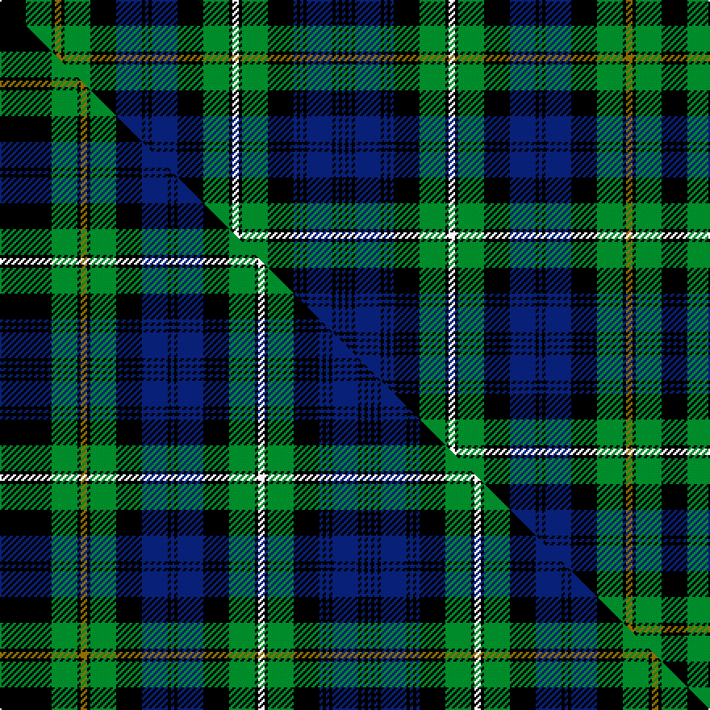

This is one **variant** — a specific cloth: this exact thread count and colourway, with its own
provenance below. It is one weaving of the [sett](/setts/k8g8k1y2k1g8k8db8k1db1k1db8k8g8k1w2k1g8k8db1k1db1k1db8k1db1k1db1/) (the scale-free proportion — the
same cloth at any scale or shade), whose colour order is pattern [BKBKBKBKBKGKWKGKBKBKBKGKGKGK](/stripes/bkbkbkbkbkgkwkgkbkbkbkgkgkgk/).

Part of the [Campbell of Argyll](/tartans/campbell-of-argyll-2/) tartan — the named design grouping this sett with its other cloths.

Sourced from house-of-tartan.  It is a [28 stripe tartan](/stripes/stripes28/).

Original link [http://www.house-of-tartan.scotland.net/house/TartanViewjs.asp?colr=Def&tnam=1961](http://www.house-of-tartan.scotland.net/house/TartanViewjs.asp?colr=Def&tnam=1961)

## Provenance

Earliest known date: 1810-15 This sett appears in the Cockburn Collection, (1815). Logan (1831). Vestiarium Scoticum (1842). Smibert (1850). Smith (1850). Grant (1886). The Setts No: 19 (1950). W & A K Johnston (1906). Like many of the earliest clan setts, the Campbell of Argyll, owes its origin to the post rebellion output of Wilson's of Bannockburn, whose monopoly on military supply dictated design.

Dataset <small>— provenance for this record, inherited from the source manifest</small>

<dl class="dataset-prov">
<dt>source</dt><dd><a href="/sources/house-of-tartan/">House of Tartan</a></dd>
<dt>data captured from</dt><dd><a href="https://github.com/thetartan/tartan-database/blob/master/data/house-of-tartan/data.csv">https://github.com/thetartan/tartan-database/blob/master/data/house-of-tartan/data.csv</a></dd>
<dt>data date</dt><dd>1810-15 <small>(this record)</small></dd>
<dt>licence</dt><dd><a href="https://creativecommons.org/licenses/by-nc-nd/4.0/">CC BY-NC-ND 4.0</a></dd>
</dl>

Capture chain <small>— the hands this data passed through, oldest first; each capture carries its own licence</small>

<ol class="capture-chain">
<li><a href="http://www.house-of-tartan.scotland.net/">House of Tartan</a> <small>the weaver/retailer's database — the site is now offline; the URL is kept as the ultimate source's identity</small></li>
<li><a href="https://github.com/thetartan/tartan-database">thetartan/tartan-database</a> <small>2016-2017</small> · <a href="https://creativecommons.org/licenses/by-nc-nd/4.0/">CC BY-NC-ND 4.0</a> <small>Levko Kravets's frozen compilation — the capture we vendored, and where its CC licence text came from</small></li>
<li>this dictionary <small>captured 2026-06-10 · commit 5bf86c7566</small> <small>each re-capture is a git commit to data/sources</small></li>
</ol>

## Thread count
K/16 G16 K2 Y4 K2 G16 K16 DB16 K2 DB2 K2 DB16 K16 G16 K2 W4 K2 G16 K16 DB2 K2 DB2 K2 DB16 K2 DB2 K2 DB/2

One full sett is **410 threads**.

## Palette
<table><thead><tr><th>Colour</th><th>Shade</th><th>OKLCh</th></tr></thead><tbody><tr><td>DB</td><td><code style="background-color:#082077;">#082077</code> <small style="color:#888">#082077</small></td><td><small style="color:#888">oklch(30.0% 0.149 265.1)</small></td></tr><tr><td>G</td><td><code style="background-color:#008B2A;">#008B2A</code> <small style="color:#888">#008B2A</small></td><td><small style="color:#888">oklch(55.4% 0.170 145.9)</small></td></tr><tr><td>K</td><td><code style="background-color:#000000;">#000000</code> <small style="color:#888">#000000</small></td><td><small style="color:#888">oklch(0.0% 0.000 0.0)</small></td></tr><tr><td>W</td><td><code style="background-color:#F7F7F7;">#F7F7F7</code> <small style="color:#888">#F7F7F7</small></td><td><small style="color:#888">oklch(97.6% 0.000 89.9)</small></td></tr><tr><td>Y</td><td><code style="background-color:#8B6E00;">#8B6E00</code> <small style="color:#888">#8B6E00</small></td><td><small style="color:#888">oklch(55.1% 0.113 90.4)</small></td></tr></tbody></table>

# Sample pattern

## Compared to the master

This cloth is one sett of its design; the master sett (the exemplar the design is anchored on) is below for comparison.

Its **ΔTartan distance** from the master is **0.19** — the same measure the nearest-tartans table ranks by (0 is identical; a re-scale of the same cloth is near 0, a recolour or a different proportion further).

<figure class="master-compare" style="margin:0">

this sett
master sett ★

<figcaption style="color:#888;font-size:smaller">One weave of this sett against the <a href="/setts/k16g8k1y2k1g8k8db8k1db1k1db8k8g8k1w2k1g8k8db1k1db1k1db8k1db1k1db1/">master sett ★</a>, split on the diagonal: a shared proportion runs seamlessly across it with only the shades shifting; a different proportion breaks on it.</figcaption>
</figure>

## Nearest tartan variants

The nearest existing variants by ΔTartan distance, with this cloth at the top so the swatches line up against it.

ΔTartan

Threads

Variant

Sett

—

410

<a href="/variants/s28/k8g8k1y2k1g8k8db8k1db1k1db8k8g8k1w2k1g8k8db1k1db1k1db8k1db1k1db1~x2/">Campbell of Argyll Clan Tartan</a>

<a href="/ttd/edit/#slug=k1t8k8g8k1w2k1g8k8t1k1t1k1t8k1t1k1t1k8g8k1y2k1g8k8t8k1t1~x2~w4000000&amp;base=k8g8k1y2k1g8k8db8k1db1k1db8k8g8k1w2k1g8k8db1k1db1k1db8k1db1k1db1~x2" title="compare in the TTD">0.14</a>

424

<a href="/variants/s28/k1t8k8g8k1w2k1g8k8t1k1t1k1t8k1t1k1t1k8g8k1y2k1g8k8t8k1t1~x2~w4000000/">Campbell of Argyll #2</a>

<a href="/ttd/edit/#slug=k16g8k1y2k1g8k8db8k1db1k1db8k8g8k1w2k1g8k8db1k1db1k1db8k1db1k1db1~x2&amp;base=k8g8k1y2k1g8k8db8k1db1k1db8k8g8k1w2k1g8k8db1k1db1k1db8k1db1k1db1~x2" title="compare in the TTD">0.19</a>

426

<a href="/variants/s28/k16g8k1y2k1g8k8db8k1db1k1db8k8g8k1w2k1g8k8db1k1db1k1db8k1db1k1db1~x2/">Campbell of Argyll</a>

<a href="/ttd/edit/#slug=k13g13k1ly3k1g13k13t12k2t2k2t12k13g13k1w3k1g13k13t2k2t2k2t13k2t2k2t2~x4&amp;base=k8g8k1y2k1g8k8db8k1db1k1db8k8g8k1w2k1g8k8db1k1db1k1db8k1db1k1db1~x2" title="compare in the TTD">0.50</a>

1324

<a href="/variants/s28/k13g13k1ly3k1g13k13t12k2t2k2t12k13g13k1w3k1g13k13t2k2t2k2t13k2t2k2t2~x4/">Campbell of Argyll (Clan)</a>

<a href="/ttd/edit/#slug=k1g6k6db1k1db1k1db7k1db1k1db1k6g6k1r1k1g6k6db6k1db1k1db6k6g6k1ly1~x4&amp;base=k8g8k1y2k1g8k8db8k1db1k1db8k8g8k1w2k1g8k8db1k1db1k1db8k1db1k1db1~x2" title="compare in the TTD">0.61</a>

664

<a href="/variants/s28/k1g6k6db1k1db1k1db7k1db1k1db1k6g6k1r1k1g6k6db6k1db1k1db6k6g6k1ly1~x4/">MacEwen (Clans Originaux)</a>

<a href="/ttd/edit/#slug=db1k1db8k8g8k1y2k1g8k8db1k1db1k1db8k1db1k1db1k8g8k1w2k1g8k8db8k1db1~x2&amp;base=k8g8k1y2k1g8k8db8k1db1k1db8k8g8k1w2k1g8k8db1k1db1k1db8k1db1k1db1~x2" title="compare in the TTD">1.00</a>

428

<a href="/variants/s29/db1k1db8k8g8k1y2k1g8k8db1k1db1k1db8k1db1k1db1k8g8k1w2k1g8k8db8k1db1~x2/">Campbell of Argyll</a>

<a href="/ttd/edit/#slug=db4k1db1k1db1k8g8k1w2k1g8k8db8k1db1k1db8k8g8k1ly2k1g8k8db1k1db1k1db4~x8&amp;base=k8g8k1y2k1g8k8db8k1db1k1db8k8g8k1w2k1g8k8db1k1db1k1db8k1db1k1db1~x2" title="compare in the TTD">1.06</a>

1648

<a href="/variants/s29/db4k1db1k1db1k8g8k1w2k1g8k8db8k1db1k1db8k8g8k1ly2k1g8k8db1k1db1k1db4~x8/">Campbell</a>

<a href="/ttd/edit/#slug=db1k1db8k8g8k1y4k1g8k8db1k1db1k1db16k1db1k1db1k8g8k1w4k1g8k8db8k1db1&amp;base=k8g8k1y2k1g8k8db8k1db1k1db8k8g8k1w2k1g8k8db1k1db1k1db8k1db1k1db1~x2" title="compare in the TTD">1.21</a>

238

<a href="/variants/s29/db1k1db8k8g8k1y4k1g8k8db1k1db1k1db16k1db1k1db1k8g8k1w4k1g8k8db8k1db1/">Campbell of Argyll</a>

<a href="/ttd/edit/#slug=t8k1t1k1t1k5g6k1g6k5db3t1dr1t1~x4~t2405244&amp;base=k8g8k1y2k1g8k8db8k1db1k1db8k8g8k1w2k1g8k8db1k1db1k1db8k1db1k1db1~x2" title="compare in the TTD">1.57</a>

292

<a href="/variants/s14/t8k1t1k1t1k5g6k1g6k5db3t1dr1t1~x4~t2405244/">Gemmell Clan/Family Tartan</a>

<a href="/ttd/edit/#slug=k16g2lb2db4g16y2k15db6lb2k3lb4~x2&amp;base=k8g8k1y2k1g8k8db8k1db1k1db8k8g8k1w2k1g8k8db1k1db1k1db8k1db1k1db1~x2" title="compare in the TTD">1.82</a>

248

<a href="/variants/s11/k16g2lb2db4g16y2k15db6lb2k3lb4~x2/">Wilson's No.030</a>

<a href="/ttd/edit/#slug=db16k16g2db2g2db2g16db2g2db2g2db16ly8k2db2k2ly8k16db16k2r5k2~x2&amp;base=k8g8k1y2k1g8k8db8k1db1k1db8k8g8k1w2k1g8k8db1k1db1k1db8k1db1k1db1~x2" title="compare in the TTD">1.95</a>

536

<a href="/variants/s22/db16k16g2db2g2db2g16db2g2db2g2db16ly8k2db2k2ly8k16db16k2r5k2~x2/">Lamquet (2015)</a>

## Neighbour map

Every grey dot is one of 13621 variants placed by the first two principal components of the ΔTartan feature space (42% of its variance). Red is this tartan; blue dots are its nearest — click one to open its page.

<svg viewBox="0 0 640 380" role="img" style="max-width:100%;height:auto;border:1px solid #e0e0e0;border-radius:4px;display:block" xmlns="http://www.w3.org/2000/svg"><image href="/nn/cloud.v1.png" width="640" height="380"/><a href="/variants/s28/k1t8k8g8k1w2k1g8k8t1k1t1k1t8k1t1k1t1k8g8k1y2k1g8k8t8k1t1~x2~w4000000/"><circle cx="103.5" cy="126.8" r="4" fill="#3465a4"><title>Campbell of Argyll #2</title></circle></a><a href="/variants/s28/k16g8k1y2k1g8k8db8k1db1k1db8k8g8k1w2k1g8k8db1k1db1k1db8k1db1k1db1~x2/"><circle cx="156.1" cy="92.3" r="4" fill="#3465a4"><title>Campbell of Argyll</title></circle></a><a href="/variants/s28/k13g13k1ly3k1g13k13t12k2t2k2t12k13g13k1w3k1g13k13t2k2t2k2t13k2t2k2t2~x4/"><circle cx="117.2" cy="109.9" r="4" fill="#3465a4"><title>Campbell of Argyll (Clan)</title></circle></a><a href="/variants/s28/k1g6k6db1k1db1k1db7k1db1k1db1k6g6k1r1k1g6k6db6k1db1k1db6k6g6k1ly1~x4/"><circle cx="112.1" cy="133.8" r="4" fill="#3465a4"><title>MacEwen (Clans Originaux)</title></circle></a><a href="/variants/s29/db1k1db8k8g8k1y2k1g8k8db1k1db1k1db8k1db1k1db1k8g8k1w2k1g8k8db8k1db1~x2/"><circle cx="111.4" cy="123.8" r="4" fill="#3465a4"><title>Campbell of Argyll</title></circle></a><a href="/variants/s29/db4k1db1k1db1k8g8k1w2k1g8k8db8k1db1k1db8k8g8k1ly2k1g8k8db1k1db1k1db4~x8/"><circle cx="108.3" cy="125.3" r="4" fill="#3465a4"><title>Campbell</title></circle></a><a href="/variants/s29/db1k1db8k8g8k1y4k1g8k8db1k1db1k1db16k1db1k1db1k8g8k1w4k1g8k8db8k1db1/"><circle cx="115.9" cy="94.9" r="4" fill="#3465a4"><title>Campbell of Argyll</title></circle></a><a href="/variants/s14/t8k1t1k1t1k5g6k1g6k5db3t1dr1t1~x4~t2405244/"><circle cx="83.2" cy="136.8" r="4" fill="#3465a4"><title>Gemmell Clan/Family Tartan</title></circle></a><a href="/variants/s11/k16g2lb2db4g16y2k15db6lb2k3lb4~x2/"><circle cx="114.6" cy="135.6" r="4" fill="#3465a4"><title>Wilson's No.030</title></circle></a><a href="/variants/s22/db16k16g2db2g2db2g16db2g2db2g2db16ly8k2db2k2ly8k16db16k2r5k2~x2/"><circle cx="108.9" cy="126.6" r="4" fill="#3465a4"><title>Lamquet (2015)</title></circle></a><circle cx="112.0" cy="126.5" r="5" fill="#c00000"/><text x="320" y="376" text-anchor="middle" font-size="11" fill="#999">ground</text><text x="11" y="190" text-anchor="middle" font-size="11" fill="#999" transform="rotate(-90 11 190)">complexity</text></svg>

ID: /variants/s28/k8g8k1y2k1g8k8db8k1db1k1db8k8g8k1w2k1g8k8db1k1db1k1db8k1db1k1db1~x2/
