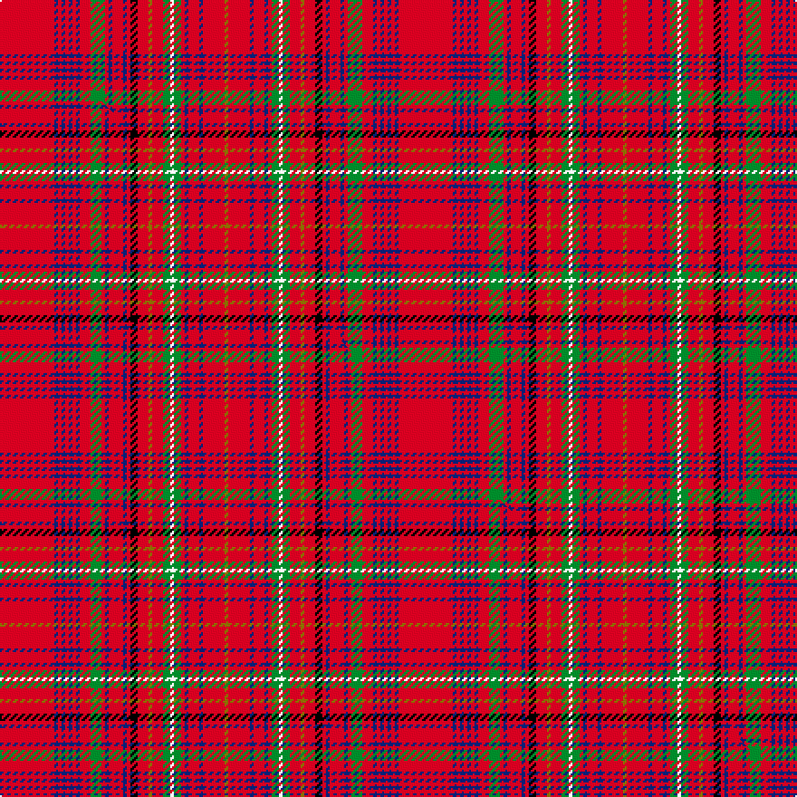

This is one **variant** — a specific cloth: this exact thread count and colourway, with its own
provenance below. It is one weaving of the [sett](/setts/r15db1r1db1r1db1r1db1r3g4r1db1r3db1r1k2r3y1r3g2w1g2r1db1r3db1r6y1/) (the scale-free proportion — the
same cloth at any scale or shade), whose colour order is pattern [GRBRBRGWGRGRKRBRBRGRBRBRBRBR](/stripes/grbrbrgwgrgrkrbrbrgrbrbrbrbr/).

Part of the [MacDonald of Staffa](/tartans/m/ma/macdonald-of-staffa-5/) tartan — the named design grouping this sett with its other cloths.

Sourced from weddslist.  It is a [28 stripe tartan](/stripes/stripes28/).

Original link [http://www.weddslist.com/cgi-bin/tartans/pg.pl?source=tinsel](http://www.weddslist.com/cgi-bin/tartans/pg.pl?source=tinsel)

2 attestations — the source records this cloth was collapsed from (oldest owns this page)

<ul>
<li>undated — MacDonald of Staffa (weddslist, <a href="http://www.weddslist.com/cgi-bin/tartans/pg.pl?source=tinsel">record</a>) </li>
<li>undated — MacDonald of Staffa (weddslist, <a href="http://www.weddslist.com/cgi-bin/tartans/pg.pl?source=x">record</a>) </li>
</ul>

Dataset <small>— provenance for this record, inherited from the source manifest</small>

<dl class="dataset-prov">
<dt>source</dt><dd><a href="/sources/weddslist/">Weddslist</a></dd>
<dt>data captured from</dt><dd><a href="https://github.com/thetartan/tartan-database/blob/master/data/weddslist/data.csv">https://github.com/thetartan/tartan-database/blob/master/data/weddslist/data.csv</a></dd>
<dt>data date</dt><dd>2016-11-17 <small>(dataset default)</small></dd>
<dt>licence</dt><dd><a href="https://creativecommons.org/licenses/by-nc-nd/4.0/">CC BY-NC-ND 4.0</a></dd>
</dl>

Capture chain <small>— the hands this data passed through, oldest first; each capture carries its own licence</small>

<ol class="capture-chain">
<li><a href="https://www.weddslist.com/tartans/">Weddslist</a> <small>the living privately compiled reference</small></li>
<li><a href="https://github.com/thetartan/tartan-database">thetartan/tartan-database</a> <small>2016-2017</small> · <a href="https://creativecommons.org/licenses/by-nc-nd/4.0/">CC BY-NC-ND 4.0</a> <small>Levko Kravets's frozen compilation — the capture we vendored, and where its CC licence text came from</small></li>
<li>this dictionary <small>captured 2026-06-10 · commit 5bf86c7566</small> <small>each re-capture is a git commit to data/sources</small></li>
</ol>

## Thread count
R/30 DB2 R2 DB2 R2 DB2 R2 DB2 R6 G8 R2 DB2 R6 DB2 R2 K4 R6 Y2 R6 G4 W2 G4 R2 DB2 R6 DB2 R12 Y/2

One full sett is **220 threads**.

## Palette
<table><thead><tr><th>Colour</th><th>Shade</th><th>OKLCh</th></tr></thead><tbody><tr><td>DB</td><td><code style="background-color:#082077;">#082077</code> <small style="color:#888">#082077</small></td><td><small style="color:#888">oklch(30.0% 0.149 265.1)</small></td></tr><tr><td>G</td><td><code style="background-color:#008B2A;">#008B2A</code> <small style="color:#888">#008B2A</small></td><td><small style="color:#888">oklch(55.4% 0.170 145.9)</small></td></tr><tr><td>R</td><td><code style="background-color:#D60020;">#D60020</code> <small style="color:#888">#D60020</small></td><td><small style="color:#888">oklch(55.2% 0.224 25.5)</small></td></tr><tr><td>K</td><td><code style="background-color:#000000;">#000000</code> <small style="color:#888">#000000</small></td><td><small style="color:#888">oklch(0.0% 0.000 0.0)</small></td></tr><tr><td>Y</td><td><code style="background-color:#8B6E00;">#8B6E00</code> <small style="color:#888">#8B6E00</small></td><td><small style="color:#888">oklch(55.1% 0.113 90.4)</small></td></tr><tr><td>W</td><td><code style="background-color:#F7F7F7;">#F7F7F7</code> <small style="color:#888">#F7F7F7</small></td><td><small style="color:#888">oklch(97.6% 0.000 89.9)</small></td></tr></tbody></table>

# Sample pattern

## Compared to the master

This cloth is one sett of its design; the master sett (the exemplar the design is anchored on) is below for comparison.

Its **ΔTartan distance** from the master is **0.05** — the same measure the nearest-tartans table ranks by (0 is identical; a re-scale of the same cloth is near 0, a recolour or a different proportion further).

<figure class="master-compare" style="margin:0">

this sett
master sett ★

<figcaption style="color:#888;font-size:smaller">One weave of this sett against the <a href="/setts/r15db1r1db1r1db1r1db1r3g3r1db1r4db1r1k2r3y1r3g2w1g2r1db1r3db1r6y1/">master sett ★</a>, split on the diagonal: a shared proportion runs seamlessly across it with only the shades shifting; a different proportion breaks on it.</figcaption>
</figure>

## Nearest tartan variants

The nearest existing variants by ΔTartan distance, with this cloth at the top so the swatches line up against it.

ΔTartan

Threads

Variant

Sett

—

220

<a href="/variants/s28/r15db1r1db1r1db1r1db1r3g4r1db1r3db1r1k2r3y1r3g2w1g2r1db1r3db1r6y1~x2/">MacDonald of Staffa</a>

<a href="/ttd/edit/#slug=r15db1r1db1r1db1r1db1r3g3r1db1r4db1r1k2r3y1r3g2w1g2r1db1r3db1r6y1~x2&amp;base=r15db1r1db1r1db1r1db1r3g4r1db1r3db1r1k2r3y1r3g2w1g2r1db1r3db1r6y1~x2" title="compare in the TTD">0.05</a>

220

<a href="/variants/s28/r15db1r1db1r1db1r1db1r3g3r1db1r4db1r1k2r3y1r3g2w1g2r1db1r3db1r6y1~x2/">MacDonald of Staffa</a>

<a href="/ttd/edit/#slug=r37g2r2g2r2g2r2g2r11k2g11r3g2r11g2r3db9r11w2r9g11w2g11r3g2r9g2r19w2&amp;base=r15db1r1db1r1db1r1db1r3g4r1db1r3db1r1k2r3y1r3g2w1g2r1db1r3db1r6y1~x2" title="compare in the TTD">2.47</a>

337

<a href="/variants/s29/r37g2r2g2r2g2r2g2r11k2g11r3g2r11g2r3db9r11w2r9g11w2g11r3g2r9g2r19w2/">MacDonald of Staffa #4</a>

<a href="/ttd/edit/#slug=r16g1r1g1r1g1r1g1r6g1db1g6k1r1g1r4g1r1db4r4w1r4g4w1g4r1g1r6g1r8w1~x2&amp;base=r15db1r1db1r1db1r1db1r3g4r1db1r3db1r1k2r3y1r3g2w1g2r1db1r3db1r6y1~x2" title="compare in the TTD">2.51</a>

310

<a href="/variants/s31/r16g1r1g1r1g1r1g1r6g1db1g6k1r1g1r4g1r1db4r4w1r4g4w1g4r1g1r6g1r8w1~x2/">MacDonald of Staffa (Smith's)</a>

<a href="/ttd/edit/#slug=r20w1r20k2r20g8y1k4db1k1db4r1db4k1db1k4g8y1r20k2r20w1r20~x2&amp;base=r15db1r1db1r1db1r1db1r3g4r1db1r3db1r1k2r3y1r3g2w1g2r1db1r3db1r6y1~x2" title="compare in the TTD">2.64</a>

580

<a href="/variants/s23/r20w1r20k2r20g8y1k4db1k1db4r1db4k1db1k4g8y1r20k2r20w1r20~x2/">Cromdale</a>

<a href="/ttd/edit/#slug=dr4r7k2r6w1db1r1db1lb1db1r1db1w1r12db1r2db1r12w2r1db1~x2~dr1305012-db1406275&amp;base=r15db1r1db1r1db1r1db1r3g4r1db1r3db1r1k2r3y1r3g2w1g2r1db1r3db1r6y1~x2" title="compare in the TTD">3.07</a>

456

<a href="/variants/s40/db1r1w2r12db1r2db1r12w1db1r1db1lb1db1r1db1w1r6k2r7dr4r7k2r6w1db1r1db1lb1db1r1db1w1r12db1r2db1r12w2r1~x2~db1406275-dr1305012/">Takla Makan (Red)</a>

<a href="/ttd/edit/#slug=r18lb1r1dg8r1lb1r6w1r1db4r1w1r2dg3g1r2g1dg3r3w1r1db2r1w1r8~x2~dg1806142-g2408144&amp;base=r15db1r1db1r1db1r1db1r3g4r1db1r3db1r1k2r3y1r3g2w1g2r1db1r3db1r6y1~x2" title="compare in the TTD">3.25</a>

240

<a href="/variants/s25/r18lb1r1dg8r1lb1r6w1r1db4r1w1r2dg3g1r2g1dg3r3w1r1db2r1w1r8~x2~dg1806142-g2408144/">MacAlister Modern (Lochcarron)</a>

<a href="/ttd/edit/#slug=r30y5r27dg5r5dg5r5dg5r5dg5r25dg5r5k2dg28k2r5dg5r28dg5r5y28r26w5r26dg24w2dg24r7dg5r28dg5r7dg5k5r7y5r7y5r24~x2&amp;base=r15db1r1db1r1db1r1db1r3g4r1db1r3db1r1k2r3y1r3g2w1g2r1db1r3db1r6y1~x2" title="compare in the TTD">3.66</a>

1720

<a href="/variants/s40/r30y5r27dg5r5dg5r5dg5r5dg5r25dg5r5k2dg28k2r5dg5r28dg5r5y28r26w5r26dg24w2dg24r7dg5r28dg5r7dg5k5r7y5r7y5r24~x2/">Donald of Staffa's Sett</a>

<a href="/ttd/edit/#slug=r24k4ly1k2w1db4dg6r3k1r2w1r2k1r3dg6db4w1k2ly1k4r24k3~x4~dg1605139&amp;base=r15db1r1db1r1db1r1db1r3g4r1db1r3db1r1k2r3y1r3g2w1g2r1db1r3db1r6y1~x2" title="compare in the TTD">3.78</a>

692

<a href="/variants/s22/r24k4ly1k2w1db4dg6r3k1r2w1r2k1r3dg6db4w1k2ly1k4r24k3~x4~dg1605139/">Stewart/Stuart of Galloway (VS)</a>

<a href="/ttd/edit/#slug=r24db4r22g4r4g4r4g4r4g4r20g4r4k2g22k2r4g4r22g4r4db22r21w4r21g19w2g19r5g4r22g4r5g4k4r5db4r5db4r19&amp;base=r15db1r1db1r1db1r1db1r3g4r1db1r3db1r1k2r3y1r3g2w1g2r1db1r3db1r6y1~x2" title="compare in the TTD">3.86</a>

683

<a href="/variants/s40/r24db4r22g4r4g4r4g4r4g4r20g4r4k2g22k2r4g4r22g4r4db22r21w4r21g19w2g19r5g4r22g4r5g4k4r5db4r5db4r19/">MacDonald of Staffa Clan Tartan</a>

<a href="/ttd/edit/#slug=r16k1r8db2k1db16k3r1k1r15db4r2k3r1k1r16~x2&amp;base=r15db1r1db1r1db1r1db1r3g4r1db1r3db1r1k2r3y1r3g2w1g2r1db1r3db1r6y1~x2" title="compare in the TTD">3.89</a>

300

<a href="/variants/s16/r16k1r8db2k1db16k3r1k1r15db4r2k3r1k1r16~x2/">(5) Ruxton hunting</a>

## Neighbour map

Every grey dot is one of 13621 variants placed by the first two principal components of the ΔTartan feature space (42% of its variance). Red is this tartan; blue dots are its nearest — click one to open its page. The map is a flat projection of a many-dimensional space — [how to read it](/posts/neighbourhood-maps/).

<svg viewBox="0 0 640 380" role="img" style="max-width:100%;height:auto;border:1px solid #e0e0e0;border-radius:4px;display:block" xmlns="http://www.w3.org/2000/svg"><image href="/nn/cloud.v1.png" width="640" height="380"/><a href="/variants/s28/r15db1r1db1r1db1r1db1r3g3r1db1r4db1r1k2r3y1r3g2w1g2r1db1r3db1r6y1~x2/"><circle cx="326.1" cy="55.3" r="4" fill="#3465a4"><title>MacDonald of Staffa</title></circle></a><a href="/variants/s29/r37g2r2g2r2g2r2g2r11k2g11r3g2r11g2r3db9r11w2r9g11w2g11r3g2r9g2r19w2/"><circle cx="335.9" cy="70.1" r="4" fill="#3465a4"><title>MacDonald of Staffa #4</title></circle></a><a href="/variants/s31/r16g1r1g1r1g1r1g1r6g1db1g6k1r1g1r4g1r1db4r4w1r4g4w1g4r1g1r6g1r8w1~x2/"><circle cx="311.8" cy="72.8" r="4" fill="#3465a4"><title>MacDonald of Staffa (Smith's)</title></circle></a><a href="/variants/s23/r20w1r20k2r20g8y1k4db1k1db4r1db4k1db1k4g8y1r20k2r20w1r20~x2/"><circle cx="361.3" cy="53.8" r="4" fill="#3465a4"><title>Cromdale</title></circle></a><a href="/variants/s40/db1r1w2r12db1r2db1r12w1db1r1db1lb1db1r1db1w1r6k2r7dr4r7k2r6w1db1r1db1lb1db1r1db1w1r12db1r2db1r12w2r1~x2~db1406275-dr1305012/"><circle cx="343.6" cy="45.2" r="4" fill="#3465a4"><title>Takla Makan (Red)</title></circle></a><a href="/variants/s25/r18lb1r1dg8r1lb1r6w1r1db4r1w1r2dg3g1r2g1dg3r3w1r1db2r1w1r8~x2~dg1806142-g2408144/"><circle cx="312.2" cy="68.1" r="4" fill="#3465a4"><title>MacAlister Modern (Lochcarron)</title></circle></a><a href="/variants/s40/r30y5r27dg5r5dg5r5dg5r5dg5r25dg5r5k2dg28k2r5dg5r28dg5r5y28r26w5r26dg24w2dg24r7dg5r28dg5r7dg5k5r7y5r7y5r24~x2/"><circle cx="279.1" cy="86.3" r="4" fill="#3465a4"><title>Donald of Staffa's Sett</title></circle></a><a href="/variants/s22/r24k4ly1k2w1db4dg6r3k1r2w1r2k1r3dg6db4w1k2ly1k4r24k3~x4~dg1605139/"><circle cx="251.8" cy="29.9" r="4" fill="#3465a4"><title>Stewart/Stuart of Galloway (VS)</title></circle></a><a href="/variants/s40/r24db4r22g4r4g4r4g4r4g4r20g4r4k2g22k2r4g4r22g4r4db22r21w4r21g19w2g19r5g4r22g4r5g4k4r5db4r5db4r19/"><circle cx="254.3" cy="92.3" r="4" fill="#3465a4"><title>MacDonald of Staffa Clan Tartan</title></circle></a><a href="/variants/s16/r16k1r8db2k1db16k3r1k1r15db4r2k3r1k1r16~x2/"><circle cx="316.8" cy="90.5" r="4" fill="#3465a4"><title>(5) Ruxton hunting</title></circle></a><circle cx="313.7" cy="55.9" r="5" fill="#c00000"/><text x="320" y="376" text-anchor="middle" font-size="11" fill="#999">ground</text><text x="11" y="190" text-anchor="middle" font-size="11" fill="#999" transform="rotate(-90 11 190)">complexity</text></svg>

ID: /variants/s28/r15db1r1db1r1db1r1db1r3g4r1db1r3db1r1k2r3y1r3g2w1g2r1db1r3db1r6y1~x2/
