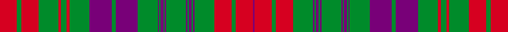

This page is one **sett** — a single exact thread-count. It belongs to the [tartan](/setts/r25g6r25g29r4g8r4g29dp32g6dp32g29dp2g2dp4g2dp2g29dp2g2dp4g2dp2g29r25g6r25dp2/)
(the same proportion at any scale), whose colour order is pattern [GRGRGRGBGBGBGBGBGBGBGBGRGRBRGRGBGBGBGBGBGBGBGBGRGRGRGR](/stripes/grgrgrgbgbgbgbgbgbgbgbgrgrbrgrgbgbgbgbgbgbgbgbgrgrgrgr/).

Sourced from house-of-tartan.  It is a [54 stripe tartan](/stripes/stripes54/).

Original link http://www.house-of-tartan.scotland.net/house/TartanViewjs.asp?colr=Def&tnam=3560

## Provenance

Earliest known date: 1819 1819 (Key Pattern Book). Peter MacDonald says that there are over a dozen patterns of this type which obviously have a common ancestor which was probably the Lumsden of the mid 1700s. (#869). Relevant tartans are Ross, Rae, MacRae and Marchioness of Huntly's, Princes Own.

## Thread count
R/25 G6 R25 G29 R4 G8 R4 G29 DP32 G6 DP32 G29 DP2 G2 DP4 G2 DP2 G29 DP2 G2 DP4 G2 DP2 G29 R25 G6 R25 DP2 R25 G6 R25 G29 DP2 G2 DP4 G2 DP2 G29 DP2 G2 DP4 G2 DP2 G29 DP32 G6 DP32 G29 R4 G8 R4 G29 R25 G/6

One full sett is **1391 threads**.

## Palette
<table><thead><tr><th>Colour</th><th>Shade</th><th>OKLCh</th></tr></thead><tbody><tr><td>DG</td><td><code style="background-color:#053819;">#053819</code> <small style="color:#888">#053819</small></td><td><small style="color:#888">oklch(30.0% 0.075 151.3)</small></td></tr><tr><td>DP</td><td><code style="background-color:#440044;">#440044</code> <small style="color:#888">#440044</small></td><td><small style="color:#888">oklch(27.1% 0.125 328.4)</small></td></tr><tr><td>G</td><td><code style="background-color:#008B2A;">#008B2A</code> <small style="color:#888">#008B2A</small></td><td><small style="color:#888">oklch(55.4% 0.170 145.9)</small></td></tr><tr><td>DP</td><td><code style="background-color:#780078;">#780078</code> <small style="color:#888">#780078</small></td><td><small style="color:#888">oklch(40.2% 0.185 328.4)</small></td></tr><tr><td>R</td><td><code style="background-color:#D60020;">#D60020</code> <small style="color:#888">#D60020</small></td><td><small style="color:#888">oklch(55.2% 0.224 25.5)</small></td></tr></tbody></table>

# Sample pattern

## Nearest tartan variants

The nearest existing variants by ΔTartan distance, with this cloth at the top so the swatches line up against it.

ΔTartan

Threads

Variant

Sett

—

1391

<a href="/variants/s28/r25g6r25g29r4g8r4g29dp32g6dp32g29dp2g2dp4g2dp2g29dp2g2dp4g2dp2g29r25g6r25dp2~dp1607327/">Ross (Wilsons) Clan/Family Tartan</a>

<a href="/ttd/edit/#slug=r25g6r25g29r4g8r4g29dp32g6dp32g29dp2g2dp4g2dp2g29dp2g2dp4g2dp2g29r25g6r25dp2&amp;base=r25g6r25g29r4g8r4g29dp32g6dp32g29dp2g2dp4g2dp2g29dp2g2dp4g2dp2g29r25g6r25dp2~dp1607327" title="compare in the TTD">0.06</a>

711

<a href="/variants/s28/r25g6r25g29r4g8r4g29dp32g6dp32g29dp2g2dp4g2dp2g29dp2g2dp4g2dp2g29r25g6r25dp2/">Ross (Wilsons)</a>

<a href="/ttd/edit/#slug=r1g17r2db2r17g2r2g2r17db2r2g17r2db17r2g2r17g2r2g2r17g2r2g17r2g17r2db2r17g2r1~x4&amp;base=r25g6r25g29r4g8r4g29dp32g6dp32g29dp2g2dp4g2dp2g29dp2g2dp4g2dp2g29r25g6r25dp2~dp1607327" title="compare in the TTD">2.99</a>

1672

<a href="/variants/s31/r1g17r2db2r17g2r2g2r17db2r2g17r2db17r2g2r17g2r2g2r17g2r2g17r2g17r2db2r17g2r1~x4/">Robertson</a>

<a href="/ttd/edit/#slug=db45w4db6g6db6g6db6g37r6g6r6g6r6g6r6g39r27g6db6r12w4r30&amp;base=r25g6r25g29r4g8r4g29dp32g6dp32g29dp2g2dp4g2dp2g29dp2g2dp4g2dp2g29r25g6r25dp2~dp1607327" title="compare in the TTD">3.05</a>

489

<a href="/variants/s22/db45w4db6g6db6g6db6g37r6g6r6g6r6g6r6g39r27g6db6r12w4r30/">Wilson (Janet)</a>

<a href="/ttd/edit/#slug=g18r2g18r18g2r4g2r18db18r2db18r18db1r1db2r1db1r18db1r1g2r1db1r18g18r2g18~x2&amp;base=r25g6r25g29r4g8r4g29dp32g6dp32g29dp2g2dp4g2dp2g29dp2g2dp4g2dp2g29r25g6r25dp2~dp1607327" title="compare in the TTD">3.37</a>

824

<a href="/variants/s27/g18r2g18r18g2r4g2r18db18r2db18r18db1r1db2r1db1r18db1r1g2r1db1r18g18r2g18~x2/">Ross (Clan)</a>

<a href="/ttd/edit/#slug=r32db3r3db8r3db3r23g20r6g20r6g20r22g5r10g5r22db24r5db24r23db3r3db8r3db3r32db3r3db8r3db3r23g20r6g20&amp;base=r25g6r25g29r4g8r4g29dp32g6dp32g29dp2g2dp4g2dp2g29dp2g2dp4g2dp2g29r25g6r25dp2~dp1607327" title="compare in the TTD">3.38</a>

804

<a href="/variants/s36/r32db3r3db8r3db3r23g20r6g20r6g20r22g5r10g5r22db24r5db24r23db3r3db8r3db3r32db3r3db8r3db3r23g20r6g20/">Ross 1</a>

<a href="/ttd/edit/#slug=g18r2g18r18g2r4g2r18db18r2db18r18db1r1db2r1db1r18db1r1db2r1db1r18g18r2g18~x2&amp;base=r25g6r25g29r4g8r4g29dp32g6dp32g29dp2g2dp4g2dp2g29dp2g2dp4g2dp2g29r25g6r25dp2~dp1607327" title="compare in the TTD">3.41</a>

824

<a href="/variants/s27/g18r2g18r18g2r4g2r18db18r2db18r18db1r1db2r1db1r18db1r1db2r1db1r18g18r2g18~x2/">Ross #4</a>

<a href="/ttd/edit/#slug=g18r2g18r18g2r4g2r18db18r2db18r18db1r1db2r1db1r18db1r1db2r1db1r18g18r2g18&amp;base=r25g6r25g29r4g8r4g29dp32g6dp32g29dp2g2dp4g2dp2g29dp2g2dp4g2dp2g29r25g6r25dp2~dp1607327" title="compare in the TTD">3.41</a>

412

<a href="/variants/s27/g18r2g18r18g2r4g2r18db18r2db18r18db1r1db2r1db1r18db1r1db2r1db1r18g18r2g18/">Ross</a>

## Neighbour map

Every grey dot is one of 13620 variants placed by the first two principal components of the ΔTartan feature space (42% of its variance). Red is this tartan; blue dots are its nearest — click one to open its page.

<svg viewBox="0 0 640 380" role="img" style="max-width:100%;height:auto;border:1px solid #e0e0e0;border-radius:4px;display:block" xmlns="http://www.w3.org/2000/svg"><image href="/nn/cloud.v1.png" width="640" height="380"/><a href="/variants/s28/r25g6r25g29r4g8r4g29dp32g6dp32g29dp2g2dp4g2dp2g29dp2g2dp4g2dp2g29r25g6r25dp2/"><circle cx="271.3" cy="119.6" r="4" fill="#3465a4"><title>Ross (Wilsons)</title></circle></a><a href="/variants/s31/r1g17r2db2r17g2r2g2r17db2r2g17r2db17r2g2r17g2r2g2r17g2r2g17r2g17r2db2r17g2r1~x4/"><circle cx="306.4" cy="125.7" r="4" fill="#3465a4"><title>Robertson</title></circle></a><a href="/variants/s22/db45w4db6g6db6g6db6g37r6g6r6g6r6g6r6g39r27g6db6r12w4r30/"><circle cx="216.7" cy="120.2" r="4" fill="#3465a4"><title>Wilson (Janet)</title></circle></a><a href="/variants/s27/g18r2g18r18g2r4g2r18db18r2db18r18db1r1db2r1db1r18db1r1g2r1db1r18g18r2g18~x2/"><circle cx="277.3" cy="134.4" r="4" fill="#3465a4"><title>Ross (Clan)</title></circle></a><a href="/variants/s36/r32db3r3db8r3db3r23g20r6g20r6g20r22g5r10g5r22db24r5db24r23db3r3db8r3db3r32db3r3db8r3db3r23g20r6g20/"><circle cx="273.2" cy="152.3" r="4" fill="#3465a4"><title>Ross 1</title></circle></a><a href="/variants/s27/g18r2g18r18g2r4g2r18db18r2db18r18db1r1db2r1db1r18db1r1db2r1db1r18g18r2g18~x2/"><circle cx="275.8" cy="134.1" r="4" fill="#3465a4"><title>Ross #4</title></circle></a><a href="/variants/s27/g18r2g18r18g2r4g2r18db18r2db18r18db1r1db2r1db1r18db1r1db2r1db1r18g18r2g18/"><circle cx="275.8" cy="134.1" r="4" fill="#3465a4"><title>Ross</title></circle></a><circle cx="278.6" cy="120.9" r="5" fill="#c00000"/><text x="320" y="376" text-anchor="middle" font-size="11" fill="#999">ground</text><text x="11" y="190" text-anchor="middle" font-size="11" fill="#999" transform="rotate(-90 11 190)">complexity</text></svg>

ID: /variants/s28/r25g6r25g29r4g8r4g29dp32g6dp32g29dp2g2dp4g2dp2g29dp2g2dp4g2dp2g29r25g6r25dp2~dp1607327/
