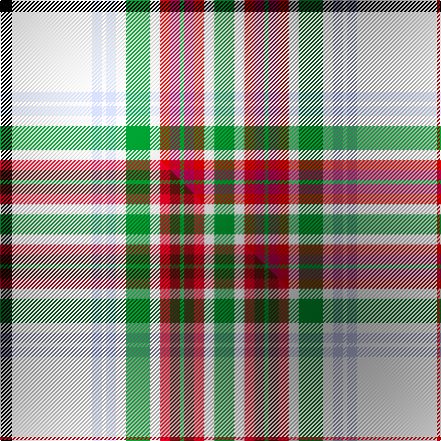

This page is one **sett** — a single exact thread-count. It belongs to the [tartan](/setts/k6w40lb5w2lb5w5g12w5ri5r5g2r5ri5w5g10w5ri5r5g2r5ri5w5g12w5lb5w2lb5w40ri6/)
(the same proportion at any scale), whose colour order is pattern [KWWWWWGWRRGRRWGWRRGRRWGWWWWWR](/stripes/kwwwwwgwrrgrrwgwrrgrrwgwwwwwr/).

Part of the [MacBean, Meta](/tartans/macbean-meta/) tartan — the named design grouping this sett with its other cloths.

Sourced from house-of-tartan.  It is a [29 stripe tartan](/stripes/stripes29/).

Original link http://www.house-of-tartan.scotland.net/house/TartanViewjs.asp?colr=Def&tnam=1220

## Provenance

Earliest known date: 1972 MacBains, MacBeans, and MacVeans are all forms of the same name possibly from the same origin as the early Scottish King, Donald Ban. The principle family is MacBean of Kinchyle from the northern end of Loch Ness. The MacBains are closely associated with Mackintosh and this is apparent in the design of the tartan. This version, recorded by Lord Lyon under the name MacBain, shows a minor variation on the earlier MacBean sett attributed to McIan (1847).

## Thread count
K/12 W80 LB10 W4 LB10 W10 G24 W10 Ri10 R10 G4 R10 Ri10 W10 G20 W10 Ri10 R10 G4 R10 Ri10 W10 G24 W10 LB10 W4 LB10 W80 Ri/12

One full sett is **872 threads**.

## Palette
<table><thead><tr><th>Colour</th><th>Shade</th><th>OKLCh</th></tr></thead><tbody><tr><td>LB</td><td><code style="background-color:#B5BBDE;">#B5BBDE</code> <small style="color:#888">#B5BBDE</small></td><td><small style="color:#888">oklch(79.9% 0.050 277.6)</small></td></tr><tr><td>G</td><td><code style="background-color:#008B2A;">#008B2A</code> <small style="color:#888">#008B2A</small></td><td><small style="color:#888">oklch(55.4% 0.170 145.9)</small></td></tr><tr><td>K</td><td><code style="background-color:#000000;">#000000</code> <small style="color:#888">#000000</small></td><td><small style="color:#888">oklch(0.0% 0.000 0.0)</small></td></tr><tr><td>W</td><td><code style="background-color:#F7F7F7;">#F7F7F7</code> <small style="color:#888">#F7F7F7</small></td><td><small style="color:#888">oklch(97.6% 0.000 89.9)</small></td></tr><tr><td>R</td><td><code style="background-color:#A00048;">#A00048</code> <small style="color:#888">#A00048</small></td><td><small style="color:#888">oklch(45.4% 0.182 5.3)</small></td></tr><tr><td>R</td><td><code style="background-color:#C80000;">#C80000</code> <small style="color:#888">#C80000</small></td><td><small style="color:#888">oklch(52.3% 0.215 29.2)</small></td></tr></tbody></table>

# Sample pattern

## Compared to the master

This cloth is one sett of its design; the master sett (the exemplar the design is anchored on) is below for comparison.

Its **ΔTartan distance** from the master is **0.05** — the same measure the nearest-tartans table ranks by (0 is identical; a re-scale of the same cloth is near 0, a recolour or a different proportion further).

<figure class="master-compare" style="margin:0">

this sett
master sett ★

<figcaption style="color:#888;font-size:smaller">One weave of this sett against the <a href="/setts/k6w40lb5w2lb5w5g12w5r5dr5g2dr5r5w5g10w5r5dr5g2dr5r5w5g12w5lb5w2lb5w40r6/">master sett ★</a>, split on the diagonal: a shared proportion runs seamlessly across it with only the shades shifting; a different proportion breaks on it.</figcaption>
</figure>

## Nearest tartan variants

The nearest existing variants by ΔTartan distance, with this cloth at the top so the swatches line up against it.

ΔTartan

Threads

Variant

Sett

—

872

<a href="/variants/s29/k6w40lb5w2lb5w5g12w5ri5r5g2r5ri5w5g10w5ri5r5g2r5ri5w5g12w5lb5w2lb5w40ri6~x2~ri2109032-r1807008/">MacBean Meta.. Family Tartan</a>

<a href="/ttd/edit/#slug=k6w40lb5w2lb5w5g12w5r5dr5g2dr5r5w5g10w5r5dr5g2dr5r5w5g12w5lb5w2lb5w40r6~x2&amp;base=k6w40lb5w2lb5w5g12w5ri5r5g2r5ri5w5g10w5ri5r5g2r5ri5w5g12w5lb5w2lb5w40ri6~x2~ri2109032-r1807008" title="compare in the TTD">0.05</a>

872

<a href="/variants/s29/k6w40lb5w2lb5w5g12w5r5dr5g2dr5r5w5g10w5r5dr5g2dr5r5w5g12w5lb5w2lb5w40r6~x2/">MacBean, Meta (Personal)</a>

<a href="/ttd/edit/#slug=r4k3r15g42w5db3lo3db13k13w66r4w2r2w10r2w2r4w66k13db13lo3db3w5g42r15k3r4w2&amp;base=k6w40lb5w2lb5w5g12w5ri5r5g2r5ri5w5g10w5ri5r5g2r5ri5w5g12w5lb5w2lb5w40ri6~x2~ri2109032-r1807008" title="compare in the TTD">3.07</a>

718

<a href="/variants/s28/r4k3r15g42w5db3lo3db13k13w66r4w2r2w10r2w2r4w66k13db13lo3db3w5g42r15k3r4w2/">Stewart/Stuart Dress (Four red lines)</a>

<a href="/ttd/edit/#slug=k4w2r1w7lb3w23lb3w7r1w2k4g4r1g1r1g1r1g1r1g4k4r1k4r1db1r1db1r1db1r1db4~x2&amp;base=k6w40lb5w2lb5w5g12w5ri5r5g2r5ri5w5g10w5ri5r5g2r5ri5w5g12w5lb5w2lb5w40ri6~x2~ri2109032-r1807008" title="compare in the TTD">3.08</a>

352

<a href="/variants/s31/k4w2r1w7lb3w23lb3w7r1w2k4g4r1g1r1g1r1g1r1g4k4r1k4r1db1r1db1r1db1r1db4~x2/">MacDonald Dress #3</a>

<a href="/ttd/edit/#slug=w3k1w20dp1db6g6o3g1o1g2~x4&amp;base=k6w40lb5w2lb5w5g12w5ri5r5g2r5ri5w5g10w5ri5r5g2r5ri5w5g12w5lb5w2lb5w40ri6~x2~ri2109032-r1807008" title="compare in the TTD">3.22</a>

332

<a href="/variants/s10/w3k1w20dp1db6g6o3g1o1g2~x4/">Scotland the Brave Dress (Dance)</a>

<a href="/ttd/edit/#slug=lb18y2lb2y1r3g3r2g2r1k2lb3w7lb2w2lb1w4~x4&amp;base=k6w40lb5w2lb5w5g12w5ri5r5g2r5ri5w5g10w5ri5r5g2r5ri5w5g12w5lb5w2lb5w40ri6~x2~ri2109032-r1807008" title="compare in the TTD">3.24</a>

352

<a href="/variants/s16/lb18y2lb2y1r3g3r2g2r1k2lb3w7lb2w2lb1w4~x4/">Inverness County (Canada) (District)</a>

<a href="/ttd/edit/#slug=k4w2r1w7b3w23b3w7r1w2k4g4r1g1r1g1r1g1r1g4k4r1k4r1db1r1db1r1db1r1db4~x2&amp;base=k6w40lb5w2lb5w5g12w5ri5r5g2r5ri5w5g10w5ri5r5g2r5ri5w5g12w5lb5w2lb5w40ri6~x2~ri2109032-r1807008" title="compare in the TTD">3.33</a>

352

<a href="/variants/s31/k4w2r1w7b3w23b3w7r1w2k4g4r1g1r1g1r1g1r1g4k4r1k4r1db1r1db1r1db1r1db4~x2/">MacDonald, dress</a>

<a href="/ttd/edit/#slug=w16ly1k2ly1w16g2k1g2r22w4db3w4db3w4db3~x2&amp;base=k6w40lb5w2lb5w5g12w5ri5r5g2r5ri5w5g10w5ri5r5g2r5ri5w5g12w5lb5w2lb5w40ri6~x2~ri2109032-r1807008" title="compare in the TTD">3.41</a>

298

<a href="/variants/s15/w16ly1k2ly1w16g2k1g2r22w4db3w4db3w4db3~x2/">Salaberry-de-Valleyfield Cer. (Dis )</a>

<a href="/ttd/edit/#slug=k4lb2w15r6y12r6w25lb2k4lb2w15lb4k2lb4k2lb4k1~x2&amp;base=k6w40lb5w2lb5w5g12w5ri5r5g2r5ri5w5g10w5ri5r5g2r5ri5w5g12w5lb5w2lb5w40ri6~x2~ri2109032-r1807008" title="compare in the TTD">3.45</a>

430

<a href="/variants/s17/k4lb2w15r6y12r6w25lb2k4lb2w15lb4k2lb4k2lb4k1~x2/">Beck Dress (Personal)</a>

<a href="/ttd/edit/#slug=k1lb2k2ly2lb12w13dr1w1dr2w1dr1w13lb12ly2k2lb2k1y1~x4&amp;base=k6w40lb5w2lb5w5g12w5ri5r5g2r5ri5w5g10w5ri5r5g2r5ri5w5g12w5lb5w2lb5w40ri6~x2~ri2109032-r1807008" title="compare in the TTD">3.47</a>

560

<a href="/variants/s18/k1lb2k2ly2lb12w13dr1w1dr2w1dr1w13lb12ly2k2lb2k1y1~x4/">Jong Nederland Born Union, Dress</a>

<a href="/ttd/edit/#slug=w16dy1k2dy1w16g2k1g2r22w4db3w4db3w4db3~x2&amp;base=k6w40lb5w2lb5w5g12w5ri5r5g2r5ri5w5g10w5ri5r5g2r5ri5w5g12w5lb5w2lb5w40ri6~x2~ri2109032-r1807008" title="compare in the TTD">3.48</a>

298

<a href="/variants/s15/w16dy1k2dy1w16g2k1g2r22w4db3w4db3w4db3~x2/">Salaberry-de-Valleyfield Ceremonial</a>

## Neighbour map

Every grey dot is one of 13620 variants placed by the first two principal components of the ΔTartan feature space (42% of its variance). Red is this tartan; blue dots are its nearest — click one to open its page.

<svg viewBox="0 0 640 380" role="img" style="max-width:100%;height:auto;border:1px solid #e0e0e0;border-radius:4px;display:block" xmlns="http://www.w3.org/2000/svg"><image href="/nn/cloud.v1.png" width="640" height="380"/><a href="/variants/s29/k6w40lb5w2lb5w5g12w5r5dr5g2dr5r5w5g10w5r5dr5g2dr5r5w5g12w5lb5w2lb5w40r6~x2/"><circle cx="174.2" cy="52.9" r="4" fill="#3465a4"><title>MacBean, Meta (Personal)</title></circle></a><a href="/variants/s28/r4k3r15g42w5db3lo3db13k13w66r4w2r2w10r2w2r4w66k13db13lo3db3w5g42r15k3r4w2/"><circle cx="149.9" cy="21.2" r="4" fill="#3465a4"><title>Stewart/Stuart Dress (Four red lines)</title></circle></a><a href="/variants/s31/k4w2r1w7lb3w23lb3w7r1w2k4g4r1g1r1g1r1g1r1g4k4r1k4r1db1r1db1r1db1r1db4~x2/"><circle cx="127.8" cy="27.1" r="4" fill="#3465a4"><title>MacDonald Dress #3</title></circle></a><a href="/variants/s10/w3k1w20dp1db6g6o3g1o1g2~x4/"><circle cx="200.1" cy="73.8" r="4" fill="#3465a4"><title>Scotland the Brave Dress (Dance)</title></circle></a><a href="/variants/s16/lb18y2lb2y1r3g3r2g2r1k2lb3w7lb2w2lb1w4~x4/"><circle cx="195.0" cy="89.0" r="4" fill="#3465a4"><title>Inverness County (Canada) (District)</title></circle></a><a href="/variants/s31/k4w2r1w7b3w23b3w7r1w2k4g4r1g1r1g1r1g1r1g4k4r1k4r1db1r1db1r1db1r1db4~x2/"><circle cx="127.6" cy="27.0" r="4" fill="#3465a4"><title>MacDonald, dress</title></circle></a><a href="/variants/s15/w16ly1k2ly1w16g2k1g2r22w4db3w4db3w4db3~x2/"><circle cx="207.0" cy="71.5" r="4" fill="#3465a4"><title>Salaberry-de-Valleyfield Cer. (Dis )</title></circle></a><a href="/variants/s17/k4lb2w15r6y12r6w25lb2k4lb2w15lb4k2lb4k2lb4k1~x2/"><circle cx="183.7" cy="85.5" r="4" fill="#3465a4"><title>Beck Dress (Personal)</title></circle></a><a href="/variants/s18/k1lb2k2ly2lb12w13dr1w1dr2w1dr1w13lb12ly2k2lb2k1y1~x4/"><circle cx="144.2" cy="93.1" r="4" fill="#3465a4"><title>Jong Nederland Born Union, Dress</title></circle></a><a href="/variants/s15/w16dy1k2dy1w16g2k1g2r22w4db3w4db3w4db3~x2/"><circle cx="205.7" cy="70.9" r="4" fill="#3465a4"><title>Salaberry-de-Valleyfield Ceremonial</title></circle></a><circle cx="179.5" cy="53.9" r="5" fill="#c00000"/><text x="320" y="376" text-anchor="middle" font-size="11" fill="#999">ground</text><text x="11" y="190" text-anchor="middle" font-size="11" fill="#999" transform="rotate(-90 11 190)">complexity</text></svg>

ID: /variants/s29/k6w40lb5w2lb5w5g12w5ri5r5g2r5ri5w5g10w5ri5r5g2r5ri5w5g12w5lb5w2lb5w40ri6~x2~ri2109032-r1807008/
