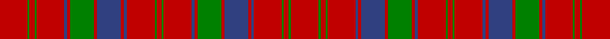

This is one **variant** — a specific cloth: this exact thread count and colourway, with its own
provenance below. It is one weaving of the [sett](/tartans/r/ro/robertson-5/) (the scale-free proportion — the
same cloth at any scale or shade), whose colour order is pattern [RGRGRBRBRGRBRGRGRBRBRGRBRGRGR](/stripes/rgrgrbrbrgrbrgrgrbrbrgrbrgrgr/).

Part of the [Robertson 5](/tartans/r/ro/robertson-5/) tartan — the named design grouping this sett with its other cloths.

Sourced from register-of-tartans.  It is a [29 stripe tartan](/stripes/stripes29/).

Original link [https://www.tartanregister.gov.uk/tartanDetails.aspx?ref=3525](https://www.tartanregister.gov.uk/tartanDetails.aspx?ref=3525)

2 attestations — the source records this cloth was collapsed from (oldest owns this page)

<ul>
<li>undated — Robertson #4 (register-of-tartans, <a href="https://www.tartanregister.gov.uk/tartanDetails.aspx?ref=3525">record</a>)  <em>This sample comes from the MacGregor-Hastie collection which forms the basis of the cloth archive of the Scottish Tartans Society. Some of the samples, including this one, were unmarked. One can assume that the sample dates between 1930 and 1950.</em></li>
<li>undated — Robertson 5 (weddslist, <a href="http://www.weddslist.com/cgi-bin/tartans/pg.pl?source=sts">record</a>) </li>
</ul>

Dataset <small>— provenance for this record, inherited from the source manifest</small>

<dl class="dataset-prov">
<dt>source</dt><dd><a href="/sources/register-of-tartans/">Scottish Register of Tartans</a></dd>
<dt>data captured from</dt><dd><a href="https://github.com/thetartan/tartan-database/blob/master/data/register-of-tartans/data.csv">https://github.com/thetartan/tartan-database/blob/master/data/register-of-tartans/data.csv</a></dd>
<dt>data date</dt><dd>2017-01-06 <small>(dataset default)</small></dd>
<dt>licence</dt><dd><a href="https://www.tartanregister.gov.uk/copyright">Crown copyright</a></dd>
</dl>

Capture chain <small>— the hands this data passed through, oldest first; each capture carries its own licence</small>

<ol class="capture-chain">
<li><a href="https://www.tartanregister.gov.uk/">Scottish Register of Tartans</a> · <a href="https://www.tartanregister.gov.uk/copyright">Crown copyright</a> <small>the living register — still published by National Records of Scotland</small></li>
<li><a href="https://github.com/thetartan/tartan-database">thetartan/tartan-database</a> <small>2016-2017</small> · <a href="https://creativecommons.org/licenses/by-nc-nd/4.0/">CC BY-NC-ND 4.0</a> <small>Levko Kravets's frozen compilation — the capture we vendored, and where its CC licence text came from</small></li>
<li>this dictionary <small>captured 2026-06-10 · commit 5bf86c7566</small> <small>each re-capture is a git commit to data/sources</small></li>
</ol>

## Register references

External register numbers recorded for this tartan.

- Scottish Register of Tartans: [3525](https://www.tartanregister.gov.uk/tartanDetails.aspx?ref=3525)
- Scottish Tartans World Register: 1502

## Thread count
R/56 G4 R10 G4 R56 DB6 R6 G48 R6 DB48 R6 DB6 R56 G4 R10 G4 R56 DB6 R6 G48 R6 DB48 R6 DB6 R56 G4 R10 G4 R/56

One full sett is **1172 threads**.

## Palette
<table><thead><tr><th>Colour</th><th>Shade</th><th>OKLCh</th></tr></thead><tbody><tr><td>DB</td><td><code style="background-color:#082077;">#082077</code> <small style="color:#888">#082077</small></td><td><small style="color:#888">oklch(30.0% 0.149 265.1)</small></td></tr><tr><td>G</td><td><code style="background-color:#008B2A;">#008B2A</code> <small style="color:#888">#008B2A</small></td><td><small style="color:#888">oklch(55.4% 0.170 145.9)</small></td></tr><tr><td>R</td><td><code style="background-color:#D60020;">#D60020</code> <small style="color:#888">#D60020</small></td><td><small style="color:#888">oklch(55.2% 0.224 25.5)</small></td></tr></tbody></table>

# Sample pattern

[Sample sheet (PDF)](swatch.pdf) — the woven sample, thread count and palette on one printable A4, rendered on demand (the same sheet the TTD print page downloads).

## Nearest tartan variants

The nearest existing variants by ΔTartan distance, with this cloth at the top so the swatches line up against it.

ΔTartan

Threads

Variant

Sett

—

1172

<a href="/variants/s29/r28g2r5g2r28db3r3db24r3g24r3db3r28g2r5g2r28db3r3db24r3g24r3db3r28g2r5g2r28~x2/">Robertson #4</a>

<a href="/ttd/edit/#slug=r28g2r5g2r28g2r5g2r28db3r3g24r3db24r3db3r28g2r5g2r28db3r3g24r3db24r3db3~x2&amp;base=r28g2r5g2r28db3r3db24r3g24r3db3r28g2r5g2r28db3r3db24r3g24r3db3r28g2r5g2r28~x2" title="compare in the TTD">1.08</a>

1110

<a href="/variants/s28/r28g2r5g2r28g2r5g2r28db3r3g24r3db24r3db3r28g2r5g2r28db3r3g24r3db24r3db3~x2/">Robertson 4</a>

<a href="/ttd/edit/#slug=r16g1r1g1r1g1r1g1r6g1db1g6db1r1g1r4g1r1db4r4w1r4g4w1g4r1g1r6g1r8w1~x2&amp;base=r28g2r5g2r28db3r3db24r3g24r3db3r28g2r5g2r28db3r3db24r3g24r3db3r28g2r5g2r28~x2" title="compare in the TTD">2.44</a>

310

<a href="/variants/s31/r16g1r1g1r1g1r1g1r6g1db1g6db1r1g1r4g1r1db4r4w1r4g4w1g4r1g1r6g1r8w1~x2/">MacDonald of Staffa #3</a>

<a href="/ttd/edit/#slug=r17g12r6db33r4g4r33g4r4g4r33g4r4db33r39g15r7db39r4g4r39g4r4g4r39g4r4db39r7g15r39db14&amp;base=r28g2r5g2r28db3r3db24r3g24r3db3r28g2r5g2r28db3r3db24r3g24r3db3r28g2r5g2r28~x2" title="compare in the TTD">2.64</a>

999

<a href="/variants/s32/r17g12r6db33r4g4r33g4r4g4r33g4r4db33r39g15r7db39r4g4r39g4r4g4r39g4r4db39r7g15r39db14/">Na Fir Dileas (Corporate)</a>

<a href="/ttd/edit/#slug=db3r1db1r3db9r3db1r1db3r1db1r18db14r3db1r1db1r3g4r14g10r10db5r4db1~x2&amp;base=r28g2r5g2r28db3r3db24r3g24r3db3r28g2r5g2r28db3r3db24r3g24r3db3r28g2r5g2r28~x2" title="compare in the TTD">2.83</a>

456

<a href="/variants/s25/db3r1db1r3db9r3db1r1db3r1db1r18db14r3db1r1db1r3g4r14g10r10db5r4db1~x2/">Campbell of Loudoun, Plaid</a>

<a href="/ttd/edit/#slug=r1dg17r2db2r17dg2r2dg2r17db2r2dg17r2db17r2dg2r17dg2r2dg2r17dg2r2dg17r2dg17r2db2r17dg2r1~x4&amp;base=r28g2r5g2r28db3r3db24r3g24r3db3r28g2r5g2r28db3r3db24r3g24r3db3r28g2r5g2r28~x2" title="compare in the TTD">2.92</a>

1672

<a href="/variants/s31/r1dg17r2db2r17dg2r2dg2r17db2r2dg17r2db17r2dg2r17dg2r2dg2r17dg2r2dg17r2dg17r2db2r17dg2r1~x4/">MacInroy of The Burn</a>

<a href="/ttd/edit/#slug=r32db3r3db8r3db3r23g20r6g20r6g20r22g5r10g5r22db24r5db24r23db3r3db8r3db3r32db3r3db8r3db3r23g20r6g20&amp;base=r28g2r5g2r28db3r3db24r3g24r3db3r28g2r5g2r28db3r3db24r3g24r3db3r28g2r5g2r28~x2" title="compare in the TTD">3.14</a>

804

<a href="/variants/s36/r32db3r3db8r3db3r23g20r6g20r6g20r22g5r10g5r22db24r5db24r23db3r3db8r3db3r32db3r3db8r3db3r23g20r6g20/">Ross 1</a>

<a href="/ttd/edit/#slug=r18db1r1db2r1db1r18db18r2db18r18g2r4g2r18g18r2g9~x2&amp;base=r28g2r5g2r28db3r3db24r3g24r3db3r28g2r5g2r28db3r3db24r3g24r3db3r28g2r5g2r28~x2" title="compare in the TTD">3.34</a>

558

<a href="/variants/s18/r18db1r1db2r1db1r18db18r2db18r18g2r4g2r18g18r2g9~x2/">MacTier of Durris</a>

<a href="/ttd/edit/#slug=r18db1r1db2r1db1r18db18r2db18r18g2r4g2r18g18r2g9~x4&amp;base=r28g2r5g2r28db3r3db24r3g24r3db3r28g2r5g2r28db3r3db24r3g24r3db3r28g2r5g2r28~x2" title="compare in the TTD">3.34</a>

1116

<a href="/variants/s18/r18db1r1db2r1db1r18db18r2db18r18g2r4g2r18g18r2g9~x4/">Ross</a>

<a href="/ttd/edit/#slug=db15r39g15r7db39r4g4r39g4r4g4r39g4r4db39r7g15r39db14&amp;base=r28g2r5g2r28db3r3db24r3g24r3db3r28g2r5g2r28db3r3db24r3g24r3db3r28g2r5g2r28~x2" title="compare in the TTD">3.38</a>

641

<a href="/variants/s19/db15r39g15r7db39r4g4r39g4r4g4r39g4r4db39r7g15r39db14/">Na Fir Dileas</a>

<a href="/ttd/edit/#slug=r18db2r1db2r1db1r18db18r2db18r18g2r4g2r18g18r2g9~x2&amp;base=r28g2r5g2r28db3r3db24r3g24r3db3r28g2r5g2r28db3r3db24r3g24r3db3r28g2r5g2r28~x2" title="compare in the TTD">3.42</a>

562

<a href="/variants/s18/r18db2r1db2r1db1r18db18r2db18r18g2r4g2r18g18r2g9~x2/">MacTier of Durris</a>

## Neighbour map

Every grey dot is one of 13662 variants placed by the first two principal components of the ΔTartan feature space (42% of its variance). Red is this tartan; blue dots are its nearest — click one to open its page. The map is a flat projection of a many-dimensional space — [how to read it](/posts/neighbourhood-maps/).

<svg viewBox="0 0 640 380" role="img" style="max-width:100%;height:auto;border:1px solid #e0e0e0;border-radius:4px;display:block" xmlns="http://www.w3.org/2000/svg"><image href="/nn/cloud.v1.png" width="640" height="380"/><a href="/variants/s28/r28g2r5g2r28g2r5g2r28db3r3g24r3db24r3db3r28g2r5g2r28db3r3g24r3db24r3db3~x2/"><circle cx="337.8" cy="129.8" r="4" fill="#3465a4"><title>Robertson 4</title></circle></a><a href="/variants/s31/r16g1r1g1r1g1r1g1r6g1db1g6db1r1g1r4g1r1db4r4w1r4g4w1g4r1g1r6g1r8w1~x2/"><circle cx="356.5" cy="102.5" r="4" fill="#3465a4"><title>MacDonald of Staffa #3</title></circle></a><a href="/variants/s32/r17g12r6db33r4g4r33g4r4g4r33g4r4db33r39g15r7db39r4g4r39g4r4g4r39g4r4db39r7g15r39db14/"><circle cx="291.6" cy="148.5" r="4" fill="#3465a4"><title>Na Fir Dileas (Corporate)</title></circle></a><a href="/variants/s25/db3r1db1r3db9r3db1r1db3r1db1r18db14r3db1r1db1r3g4r14g10r10db5r4db1~x2/"><circle cx="320.2" cy="124.9" r="4" fill="#3465a4"><title>Campbell of Loudoun, Plaid</title></circle></a><a href="/variants/s31/r1dg17r2db2r17dg2r2dg2r17db2r2dg17r2db17r2dg2r17dg2r2dg2r17dg2r2dg17r2dg17r2db2r17dg2r1~x4/"><circle cx="311.0" cy="122.5" r="4" fill="#3465a4"><title>MacInroy of The Burn</title></circle></a><a href="/variants/s36/r32db3r3db8r3db3r23g20r6g20r6g20r22g5r10g5r22db24r5db24r23db3r3db8r3db3r32db3r3db8r3db3r23g20r6g20/"><circle cx="273.4" cy="152.0" r="4" fill="#3465a4"><title>Ross 1</title></circle></a><a href="/variants/s18/r18db1r1db2r1db1r18db18r2db18r18g2r4g2r18g18r2g9~x2/"><circle cx="314.0" cy="148.2" r="4" fill="#3465a4"><title>MacTier of Durris</title></circle></a><a href="/variants/s18/r18db1r1db2r1db1r18db18r2db18r18g2r4g2r18g18r2g9~x4/"><circle cx="314.0" cy="148.2" r="4" fill="#3465a4"><title>Ross</title></circle></a><a href="/variants/s19/db15r39g15r7db39r4g4r39g4r4g4r39g4r4db39r7g15r39db14/"><circle cx="298.6" cy="172.0" r="4" fill="#3465a4"><title>Na Fir Dileas</title></circle></a><a href="/variants/s18/r18db2r1db2r1db1r18db18r2db18r18g2r4g2r18g18r2g9~x2/"><circle cx="311.3" cy="149.2" r="4" fill="#3465a4"><title>MacTier of Durris</title></circle></a><circle cx="357.1" cy="128.0" r="5" fill="#c00000"/><text x="320" y="376" text-anchor="middle" font-size="11" fill="#999">ground</text><text x="11" y="190" text-anchor="middle" font-size="11" fill="#999" transform="rotate(-90 11 190)">complexity</text></svg>

ID: /variants/s29/r28g2r5g2r28db3r3db24r3g24r3db3r28g2r5g2r28db3r3db24r3g24r3db3r28g2r5g2r28~x2/
