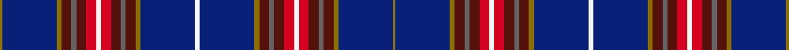
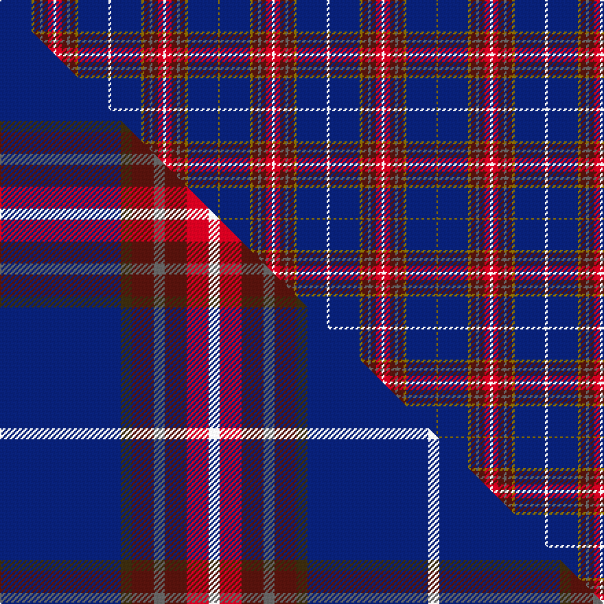

This is one **variant** — a specific cloth: this exact thread count and colourway, with its own
provenance below. It is one weaving of the [sett](/setts/y1db22y2dr4n2dr4r4w2r4dr4n2dr4y2db22w2db22y2dr4n2dr4r4w2r4dr4n2dr4y2db22y1/) (the scale-free proportion — the
same cloth at any scale or shade), whose colour order is pattern [GBGBBBRWRBBBGBWBGBBBRWRBBBGBG](/stripes/gbgbbbrwrbbbgbwbgbbbrwrbbbgbg/).

Part of the [Wisconsin in Scotland](/tartans/w/wi/wisconsin-in-scotland-2/) tartan — the named design grouping this sett with its other cloths.

Sourced from weddslist.  It is a [29 stripe tartan](/stripes/stripes29/).

Original link [http://www.weddslist.com/cgi-bin/tartans/pg.pl?source=sts](http://www.weddslist.com/cgi-bin/tartans/pg.pl?source=sts)

Dataset <small>— provenance for this record, inherited from the source manifest</small>

<dl class="dataset-prov">
<dt>source</dt><dd><a href="/sources/weddslist/">Weddslist</a></dd>
<dt>data captured from</dt><dd><a href="https://github.com/thetartan/tartan-database/blob/master/data/weddslist/data.csv">https://github.com/thetartan/tartan-database/blob/master/data/weddslist/data.csv</a></dd>
<dt>data date</dt><dd>2016-11-17 <small>(dataset default)</small></dd>
<dt>licence</dt><dd><a href="https://creativecommons.org/licenses/by-nc-nd/4.0/">CC BY-NC-ND 4.0</a></dd>
</dl>

Capture chain <small>— the hands this data passed through, oldest first; each capture carries its own licence</small>

<ol class="capture-chain">
<li><a href="https://www.weddslist.com/tartans/">Weddslist</a> <small>the living privately compiled reference</small></li>
<li><a href="https://github.com/thetartan/tartan-database">thetartan/tartan-database</a> <small>2016-2017</small> · <a href="https://creativecommons.org/licenses/by-nc-nd/4.0/">CC BY-NC-ND 4.0</a> <small>Levko Kravets's frozen compilation — the capture we vendored, and where its CC licence text came from</small></li>
<li>this dictionary <small>captured 2026-06-10 · commit 5bf86c7566</small> <small>each re-capture is a git commit to data/sources</small></li>
</ol>

## Thread count
Y/1 DB22 Y2 DR4 N2 DR4 R4 W2 R4 DR4 N2 DR4 Y2 DB22 W2 DB22 Y2 DR4 N2 DR4 R4 W2 R4 DR4 N2 DR4 Y2 DB22 Y/1

One full sett is **318 threads**.

## Palette
<table><thead><tr><th>Colour</th><th>Shade</th><th>OKLCh</th></tr></thead><tbody><tr><td>DB</td><td><code style="background-color:#082077;">#082077</code> <small style="color:#888">#082077</small></td><td><small style="color:#888">oklch(30.0% 0.149 265.1)</small></td></tr><tr><td>DR</td><td><code style="background-color:#55120C;">#55120C</code> <small style="color:#888">#55120C</small></td><td><small style="color:#888">oklch(30.0% 0.099 29.3)</small></td></tr><tr><td>W</td><td><code style="background-color:#F7F7F7;">#F7F7F7</code> <small style="color:#888">#F7F7F7</small></td><td><small style="color:#888">oklch(97.6% 0.000 89.9)</small></td></tr><tr><td>N</td><td><code style="background-color:#636363;">#636363</code> <small style="color:#888">#636363</small></td><td><small style="color:#888">oklch(50.0% 0.000 89.9)</small></td></tr><tr><td>R</td><td><code style="background-color:#D60020;">#D60020</code> <small style="color:#888">#D60020</small></td><td><small style="color:#888">oklch(55.2% 0.224 25.5)</small></td></tr><tr><td>Y</td><td><code style="background-color:#8B6E00;">#8B6E00</code> <small style="color:#888">#8B6E00</small></td><td><small style="color:#888">oklch(55.1% 0.113 90.4)</small></td></tr></tbody></table>

# Sample pattern

## Compared to the master

This cloth is one sett of its design; the master sett (the exemplar the design is anchored on) is below for comparison.

Its **ΔTartan distance** from the master is **0.80** — the same measure the nearest-tartans table ranks by (0 is identical; a re-scale of the same cloth is near 0, a recolour or a different proportion further).

<figure class="master-compare" style="margin:0">

this sett
master sett ★

<figcaption style="color:#888;font-size:smaller">One weave of this sett against the <a href="/setts/db11dy1dr2n1dr2r2w1r2dr2n1dr2dy1db11w1db11dy1dr2n1dr2r2w1r2dr2n1dr2dy1db11dy1/">master sett ★</a>, split on the diagonal: a shared proportion runs seamlessly across it with only the shades shifting; a different proportion breaks on it.</figcaption>
</figure>

## Nearest tartan variants

The nearest existing variants by ΔTartan distance, with this cloth at the top so the swatches line up against it.

ΔTartan

Threads

Variant

Sett

—

318

<a href="/variants/s29/y1db22y2dr4n2dr4r4w2r4dr4n2dr4y2db22w2db22y2dr4n2dr4r4w2r4dr4n2dr4y2db22y1/">Wisconsin in Scotland</a>

<a href="/ttd/edit/#slug=db11dy1dr2n1dr2r2w1r2dr2n1dr2dy1db11w1db11dy1dr2n1dr2r2w1r2dr2n1dr2dy1db11dy1~x8&amp;base=y1db22y2dr4n2dr4r4w2r4dr4n2dr4y2db22w2db22y2dr4n2dr4r4w2r4dr4n2dr4y2db22y1" title="compare in the TTD">0.80</a>

1184

<a href="/variants/s28/db11dy1dr2n1dr2r2w1r2dr2n1dr2dy1db11w1db11dy1dr2n1dr2r2w1r2dr2n1dr2dy1db11dy1~x8/">Wisconsin in Scotland</a>

<a href="/ttd/edit/#slug=dp40g2dp2g2dp2g2dp3g16db15m3db15g16dp3g2dp2g2dp2g2dp40w4~x2~dp1105325-g2203152&amp;base=y1db22y2dr4n2dr4r4w2r4dr4n2dr4y2db22w2db22y2dr4n2dr4r4w2r4dr4n2dr4y2db22y1" title="compare in the TTD">2.73</a>

612

<a href="/variants/s20/dp40g2dp2g2dp2g2dp3g16db15m3db15g16dp3g2dp2g2dp2g2dp40w4~x2~dp1105325-g2203152/">Solway Spirit</a>

<a href="/ttd/edit/#slug=n38db3n5db3n5db3r13db3lb5db3r13db3lp5db3n12db3w5db3n12db3lb5db3r13db3n5db3n5db3n36&amp;base=y1db22y2dr4n2dr4r4w2r4dr4n2dr4y2db22w2db22y2dr4n2dr4r4w2r4dr4n2dr4y2db22y1" title="compare in the TTD">3.41</a>

364

<a href="/variants/s29/n38db3n5db3n5db3r13db3lb5db3r13db3lp5db3n12db3w5db3n12db3lb5db3r13db3n5db3n5db3n36/">Kumikyoku - Wind of Thistle</a>

<a href="/ttd/edit/#slug=r9db3dg12r2db40r2dg20db2r18db2w2db2r18db2dg20r2db40r2dg12db3r9y2~x2&amp;base=y1db22y2dr4n2dr4r4w2r4dr4n2dr4y2db22w2db22y2dr4n2dr4r4w2r4dr4n2dr4y2db22y1" title="compare in the TTD">3.46</a>

874

<a href="/variants/s22/r9db3dg12r2db40r2dg20db2r18db2w2db2r18db2dg20r2db40r2dg12db3r9y2~x2/">Kormylo (Personal)</a>

<a href="/ttd/edit/#slug=n38db3n5db3n5db3dr13db3lb5db3dr13db3o5db3n12db3w5db3n12db3lg5db3dr13db3lb5db3dr13db3n5db3n5db3n36~db0906265-lg2704216&amp;base=y1db22y2dr4n2dr4r4w2r4dr4n2dr4y2db22w2db22y2dr4n2dr4r4w2r4dr4n2dr4y2db22y1" title="compare in the TTD">3.55</a>

412

<a href="/variants/s33/n38db3n5db3n5db3dr13db3lb5db3dr13db3o5db3n12db3w5db3n12db3lg5db3dr13db3lb5db3dr13db3n5db3n5db3n36~db0906265-lg2704216/">Kumikyoku - Wind of Thistle</a>

<a href="/ttd/edit/#slug=db67dy5g10r5y2r5g10dy5db4dy5g10r5n2r5dy5g10db24&amp;base=y1db22y2dr4n2dr4r4w2r4dr4n2dr4y2db22w2db22y2dr4n2dr4r4w2r4dr4n2dr4y2db22y1" title="compare in the TTD">3.60</a>

267

<a href="/variants/s17/db67dy5g10r5y2r5g10dy5db4dy5g10r5n2r5dy5g10db24/">Indianapolis MPD Emerald Society</a>

<a href="/ttd/edit/#slug=n2dt1b2dt2r1b12dt2r1dr10dt28b1dt3b2dt3w1~x2~dt1102249-b2308259&amp;base=y1db22y2dr4n2dr4r4w2r4dr4n2dr4y2db22w2db22y2dr4n2dr4r4w2r4dr4n2dr4y2db22y1" title="compare in the TTD">3.64</a>

278

<a href="/variants/s15/n2dt1t2dt2r1t12dt2r1dr10dt28t1dt3t2dt3w1~x2~dt1102249-t2308259/">Northfield Academy</a>

<a href="/ttd/edit/#slug=dy1db11dy1dr2n1dr2r2w1r2dr2n1dr2dy1db11w1~x8&amp;base=y1db22y2dr4n2dr4r4w2r4dr4n2dr4y2db22w2db22y2dr4n2dr4r4w2r4dr4n2dr4y2db22y1" title="compare in the TTD">3.65</a>

640

<a href="/variants/s15/dy1db11dy1dr2n1dr2r2w1r2dr2n1dr2dy1db11w1~x8/">Wisconsin in Scotland (Corporate)</a>

<a href="/ttd/edit/#slug=dt36r3dt1r2dt3r6db1r2db35w1db1ly2~x2&amp;base=y1db22y2dr4n2dr4r4w2r4dr4n2dr4y2db22w2db22y2dr4n2dr4r4w2r4dr4n2dr4y2db22y1" title="compare in the TTD">3.68</a>

296

<a href="/variants/s12/dt36r3dt1r2dt3r6db1r2db35w1db1ly2~x2/">Kirkcaldy Tartan Army</a>

<a href="/ttd/edit/#slug=db20r1dr3n1dr30g5db8r1db8r1db8g5dr30n1dr3r1db20w2~x2&amp;base=y1db22y2dr4n2dr4r4w2r4dr4n2dr4y2db22w2db22y2dr4n2dr4r4w2r4dr4n2dr4y2db22y1" title="compare in the TTD">3.82</a>

548

<a href="/variants/s18/db20r1dr3n1dr30g5db8r1db8r1db8g5dr30n1dr3r1db20w2~x2/">Guild, The</a>

## Neighbour map

Every grey dot is one of 13621 variants placed by the first two principal components of the ΔTartan feature space (42% of its variance). Red is this tartan; blue dots are its nearest — click one to open its page.

<svg viewBox="0 0 640 380" role="img" style="max-width:100%;height:auto;border:1px solid #e0e0e0;border-radius:4px;display:block" xmlns="http://www.w3.org/2000/svg"><image href="/nn/cloud.v1.png" width="640" height="380"/><a href="/variants/s28/db11dy1dr2n1dr2r2w1r2dr2n1dr2dy1db11w1db11dy1dr2n1dr2r2w1r2dr2n1dr2dy1db11dy1~x8/"><circle cx="269.0" cy="106.0" r="4" fill="#3465a4"><title>Wisconsin in Scotland</title></circle></a><a href="/variants/s20/dp40g2dp2g2dp2g2dp3g16db15m3db15g16dp3g2dp2g2dp2g2dp40w4~x2~dp1105325-g2203152/"><circle cx="328.9" cy="102.7" r="4" fill="#3465a4"><title>Solway Spirit</title></circle></a><a href="/variants/s29/n38db3n5db3n5db3r13db3lb5db3r13db3lp5db3n12db3w5db3n12db3lb5db3r13db3n5db3n5db3n36/"><circle cx="278.8" cy="104.7" r="4" fill="#3465a4"><title>Kumikyoku - Wind of Thistle</title></circle></a><a href="/variants/s22/r9db3dg12r2db40r2dg20db2r18db2w2db2r18db2dg20r2db40r2dg12db3r9y2~x2/"><circle cx="245.7" cy="106.8" r="4" fill="#3465a4"><title>Kormylo (Personal)</title></circle></a><a href="/variants/s33/n38db3n5db3n5db3dr13db3lb5db3dr13db3o5db3n12db3w5db3n12db3lg5db3dr13db3lb5db3dr13db3n5db3n5db3n36~db0906265-lg2704216/"><circle cx="222.4" cy="88.8" r="4" fill="#3465a4"><title>Kumikyoku - Wind of Thistle</title></circle></a><a href="/variants/s17/db67dy5g10r5y2r5g10dy5db4dy5g10r5n2r5dy5g10db24/"><circle cx="303.5" cy="69.8" r="4" fill="#3465a4"><title>Indianapolis MPD Emerald Society</title></circle></a><a href="/variants/s15/n2dt1t2dt2r1t12dt2r1dr10dt28t1dt3t2dt3w1~x2~dt1102249-t2308259/"><circle cx="337.8" cy="84.9" r="4" fill="#3465a4"><title>Northfield Academy</title></circle></a><a href="/variants/s15/dy1db11dy1dr2n1dr2r2w1r2dr2n1dr2dy1db11w1~x8/"><circle cx="267.8" cy="126.5" r="4" fill="#3465a4"><title>Wisconsin in Scotland (Corporate)</title></circle></a><a href="/variants/s12/dt36r3dt1r2dt3r6db1r2db35w1db1ly2~x2/"><circle cx="340.9" cy="63.6" r="4" fill="#3465a4"><title>Kirkcaldy Tartan Army</title></circle></a><a href="/variants/s18/db20r1dr3n1dr30g5db8r1db8r1db8g5dr30n1dr3r1db20w2~x2/"><circle cx="315.2" cy="97.3" r="4" fill="#3465a4"><title>Guild, The</title></circle></a><circle cx="282.1" cy="74.0" r="5" fill="#c00000"/><text x="320" y="376" text-anchor="middle" font-size="11" fill="#999">ground</text><text x="11" y="190" text-anchor="middle" font-size="11" fill="#999" transform="rotate(-90 11 190)">complexity</text></svg>

ID: /variants/s29/y1db22y2dr4n2dr4r4w2r4dr4n2dr4y2db22w2db22y2dr4n2dr4r4w2r4dr4n2dr4y2db22y1/
