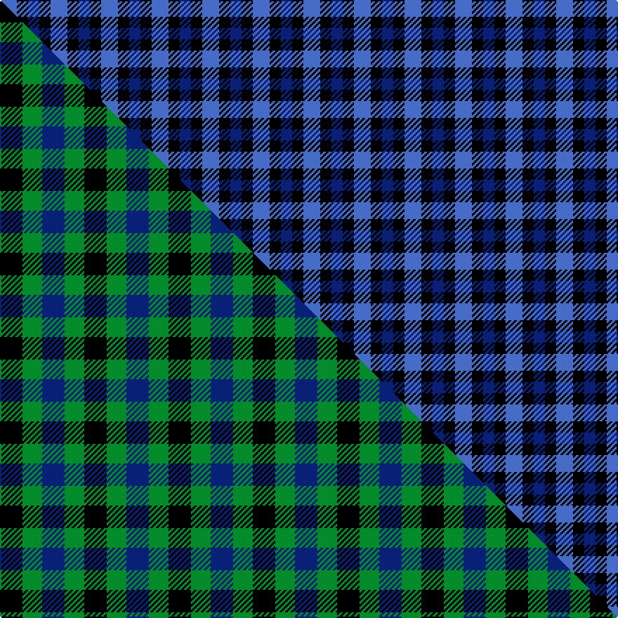

This is one **variant** — a specific cloth: this exact thread count and colourway, with its own
provenance below. It is one weaving of the [sett](/tartans/g/gl/glen-lyon-4/) (the scale-free proportion — the
same cloth at any scale or shade), whose colour order is pattern [BKB](/stripes/bkb/).

Part of the [Glen Lyon](/tartans/g/gl/glen-lyon-4/) tartan — the named design grouping this sett with its other cloths.

Sourced from weddslist.  It is a [3 stripe tartan](/stripes/stripes3/).

Original link [http://www.weddslist.com/cgi-bin/tartans/pg.pl?source=sts](http://www.weddslist.com/cgi-bin/tartans/pg.pl?source=sts)

Dataset <small>— provenance for this record, inherited from the source manifest</small>

<dl class="dataset-prov">
<dt>source</dt><dd><a href="/sources/weddslist/">Weddslist</a></dd>
<dt>data captured from</dt><dd><a href="https://github.com/thetartan/tartan-database/blob/master/data/weddslist/data.csv">https://github.com/thetartan/tartan-database/blob/master/data/weddslist/data.csv</a></dd>
<dt>data date</dt><dd>2016-11-17 <small>(dataset default)</small></dd>
<dt>licence</dt><dd><a href="https://creativecommons.org/licenses/by-nc-nd/4.0/">CC BY-NC-ND 4.0</a></dd>
</dl>

Capture chain <small>— the hands this data passed through, oldest first; each capture carries its own licence</small>

<ol class="capture-chain">
<li><a href="https://www.weddslist.com/tartans/">Weddslist</a> <small>the living privately compiled reference</small></li>
<li><a href="https://github.com/thetartan/tartan-database">thetartan/tartan-database</a> <small>2016-2017</small> · <a href="https://creativecommons.org/licenses/by-nc-nd/4.0/">CC BY-NC-ND 4.0</a> <small>Levko Kravets's frozen compilation — the capture we vendored, and where its CC licence text came from</small></li>
<li>this dictionary <small>captured 2026-06-10 · commit 5bf86c7566</small> <small>each re-capture is a git commit to data/sources</small></li>
</ol>

## Thread count
B/12 K8 DB/8

One full sett is **36 threads**.

## Palette
<table><thead><tr><th>Colour</th><th>Shade</th><th>OKLCh</th></tr></thead><tbody><tr><td>DB</td><td><code style="background-color:#082077;">#082077</code> <small style="color:#888">#082077</small></td><td><small style="color:#888">oklch(30.0% 0.149 265.1)</small></td></tr><tr><td>B</td><td><code style="background-color:#466CC8;">#466CC8</code> <small style="color:#888">#466CC8</small></td><td><small style="color:#888">oklch(55.1% 0.149 265.0)</small></td></tr><tr><td>K</td><td><code style="background-color:#000000;">#000000</code> <small style="color:#888">#000000</small></td><td><small style="color:#888">oklch(0.0% 0.000 0.0)</small></td></tr></tbody></table>

# Sample pattern

[Sample sheet (PDF)](swatch.pdf) — the woven sample, thread count and palette on one printable A4, rendered on demand (the same sheet the TTD print page downloads).

## Compared to the master

This cloth is one sett of its design; the master sett (the exemplar the design is anchored on) is below for comparison.

Its **ΔTartan distance** from the master is **1.37** — the same measure the nearest-tartans table ranks by (0 is identical; a re-scale of the same cloth is near 0, a recolour or a different proportion further).

<figure class="master-compare" style="margin:0">

this sett
master sett ★

<figcaption style="color:#888;font-size:smaller">One weave of this sett against the <a href="/setts/k8g7db8/">master sett ★</a>, split on the diagonal: a shared proportion runs seamlessly across it with only the shades shifting; a different proportion breaks on it.</figcaption>
</figure>

## Nearest tartan variants

The nearest existing variants by ΔTartan distance, with this cloth at the top so the swatches line up against it.

ΔTartan

Threads

Variant

Sett

—

36

<a href="/variants/s3/b3k2db2~x4/">Glen Lyon</a>

<a href="/ttd/edit/#slug=k1db1~x100&amp;base=b3k2db2~x4" title="compare in the TTD">1.20</a>

200

<a href="/variants/s2/k1db1~x100/">Buffalo Plaid</a>

<a href="/ttd/edit/#slug=k1lb1~x6&amp;base=b3k2db2~x4" title="compare in the TTD">1.20</a>

12

<a href="/variants/s2/k1lb1~x6/">Shepherd or Falkirk</a>

<a href="/ttd/edit/#slug=k9lb8~x2&amp;base=b3k2db2~x4" title="compare in the TTD">1.31</a>

34

<a href="/variants/s2/k9lb8~x2/">Wilson's No.172</a>

<a href="/ttd/edit/#slug=k8g7db8~x2&amp;base=b3k2db2~x4" title="compare in the TTD">1.37</a>

60

<a href="/variants/s3/k8g7db8~x2/">Glenlyon</a>

<a href="/ttd/edit/#slug=g3k2db2~x4&amp;base=b3k2db2~x4" title="compare in the TTD">1.40</a>

36

<a href="/variants/s3/g3k2db2~x4/">Glenlyon #2</a>

<a href="/ttd/edit/#slug=g7k4lb4~x2&amp;base=b3k2db2~x4" title="compare in the TTD">1.40</a>

38

<a href="/variants/s3/g7k4lb4~x2/">Wilson's No.052</a>

<a href="/ttd/edit/#slug=db2dr1k1lb1~x10&amp;base=b3k2db2~x4" title="compare in the TTD">1.69</a>

70

<a href="/variants/s4/db2dr1k1lb1~x10/">Kucher, Gregory (Personal)</a>

<a href="/ttd/edit/#slug=ly5db5k3~x4&amp;base=b3k2db2~x4" title="compare in the TTD">1.71</a>

72

<a href="/variants/s3/ly5db5k3~x4/">Kazakhstan Relic (Artefact)</a>

<a href="/ttd/edit/#slug=k5g4lb3~x2&amp;base=b3k2db2~x4" title="compare in the TTD">1.71</a>

32

<a href="/variants/s3/k5g4lb3~x2/">Glen Lyon (District)</a>

<a href="/ttd/edit/#slug=r4k7lb4~x2~r5221030&amp;base=b3k2db2~x4" title="compare in the TTD">1.73</a>

44

<a href="/variants/s3/r4k7lb4~x2~r5221030/">Wilson's No.198</a>

## Neighbour map

Every grey dot is one of 13662 variants placed by the first two principal components of the ΔTartan feature space (42% of its variance). Red is this tartan; blue dots are its nearest — click one to open its page. The map is a flat projection of a many-dimensional space — [how to read it](/posts/neighbourhood-maps/).

<svg viewBox="0 0 640 380" role="img" style="max-width:100%;height:auto;border:1px solid #e0e0e0;border-radius:4px;display:block" xmlns="http://www.w3.org/2000/svg"><image href="/nn/cloud.v1.png" width="640" height="380"/><a href="/variants/s2/k1db1~x100/"><circle cx="218.5" cy="366.0" r="4" fill="#3465a4"><title>Buffalo Plaid</title></circle></a><a href="/variants/s2/k1lb1~x6/"><circle cx="123.3" cy="366.0" r="4" fill="#3465a4"><title>Shepherd or Falkirk</title></circle></a><a href="/variants/s2/k9lb8~x2/"><circle cx="164.9" cy="366.0" r="4" fill="#3465a4"><title>Wilson's No.172</title></circle></a><a href="/variants/s3/k8g7db8~x2/"><circle cx="46.2" cy="366.0" r="4" fill="#3465a4"><title>Glenlyon</title></circle></a><a href="/variants/s3/g3k2db2~x4/"><circle cx="102.9" cy="366.0" r="4" fill="#3465a4"><title>Glenlyon #2</title></circle></a><a href="/variants/s3/g7k4lb4~x2/"><circle cx="119.4" cy="366.0" r="4" fill="#3465a4"><title>Wilson's No.052</title></circle></a><a href="/variants/s4/db2dr1k1lb1~x10/"><circle cx="86.3" cy="326.6" r="4" fill="#3465a4"><title>Kucher, Gregory (Personal)</title></circle></a><a href="/variants/s3/ly5db5k3~x4/"><circle cx="83.3" cy="366.0" r="4" fill="#3465a4"><title>Kazakhstan Relic (Artefact)</title></circle></a><a href="/variants/s3/k5g4lb3~x2/"><circle cx="83.1" cy="366.0" r="4" fill="#3465a4"><title>Glen Lyon (District)</title></circle></a><a href="/variants/s3/r4k7lb4~x2~r5221030/"><circle cx="119.7" cy="349.6" r="4" fill="#3465a4"><title>Wilson's No.198</title></circle></a><circle cx="123.2" cy="366.0" r="5" fill="#c00000"/><text x="320" y="376" text-anchor="middle" font-size="11" fill="#999">ground</text><text x="11" y="190" text-anchor="middle" font-size="11" fill="#999" transform="rotate(-90 11 190)">complexity</text></svg>

ID: /variants/s3/b3k2db2~x4/
