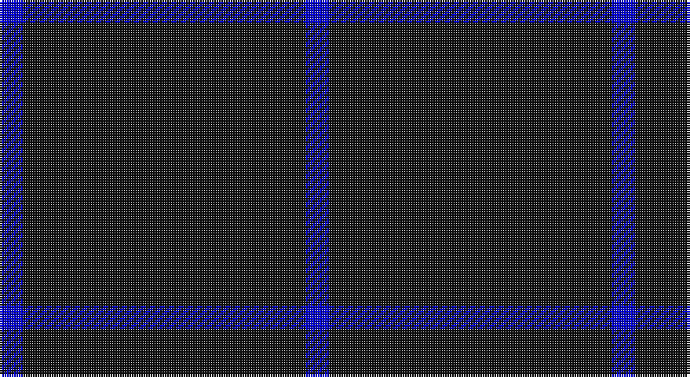

This page is one **sett** — a single exact thread-count. It belongs to the [tartan](/setts/db1k12db1/)
(the same proportion at any scale), whose colour order is pattern [BKB](/stripes/bkb/).

Part of the [Staines](/tartans/staines/) tartan — the named design grouping this sett with its other cloths.

Sourced from register-of-tartans.  It is a [3 stripe tartan](/stripes/stripes3/).

Original link https://www.tartanregister.gov.uk/tartanDetails.aspx?ref=10857

## Register references

External register numbers recorded for this tartan.

- Scottish Register of Tartans: [10857](https://www.tartanregister.gov.uk/tartanDetails.aspx?ref=10857)

## Thread count
B/10 K120 B/10

One full sett is **260 threads**.

## Palette

Palette: <strong>Tartan Register</strong>
<table><thead><tr><th>Colour</th><th>Threads</th><th>Shade</th><th>Base</th><th>OKLCh</th></tr></thead><tbody><tr><td>B/</td><td style="text-align:right;font-variant-numeric:tabular-nums">10</td><td><code style="background-color:#0000CD;">#0000CD</code> <small style="color:#888">#0000CD</small></td><td>B <code style="background-color:#2A418A;">#2A418A</code></td><td><small style="color:#888">oklch(38.3% 0.266 264.1)</small></td></tr><tr><td>K</td><td style="text-align:right;font-variant-numeric:tabular-nums">120</td><td><code style="background-color:#101010;">#101010</code> <small style="color:#888">#101010</small></td><td>K <code style="background-color:#000000;">#000000</code></td><td><small style="color:#888">oklch(17.3% 0.000 89.9)</small></td></tr><tr><td>B/</td><td style="text-align:right;font-variant-numeric:tabular-nums">10</td><td><code style="background-color:#0000CD;">#0000CD</code> <small style="color:#888">#0000CD</small></td><td>B <code style="background-color:#2A418A;">#2A418A</code></td><td><small style="color:#888">oklch(38.3% 0.266 264.1)</small></td></tr></tbody></table>

# Sample pattern

## Nearest tartans

The nearest existing variants by ΔTartan distance, with this tartan at the top so the swatches line up against it.

ΔTartan

Tartan

Sett

—

<a href="/ttd/edit/#slug=db1k12db1~x10">Staines (2013)</a> <a class="nn-out" href="/variants/s3/db1k12db1~x10/" title="open its dictionary page">↗</a>

1.70

<a href="/ttd/edit/#slug=k20db1k4db3~x4&amp;base=db1k12db1~x10">Loevenstein Castle 2 (Artefact)</a> <a class="nn-out" href="/variants/s4/k20db1k4db3~x4/" title="open its dictionary page">↗</a>

1.76

<a href="/ttd/edit/#slug=k72w3k11db9&amp;base=db1k12db1~x10">Dunnotar (School)</a> <a class="nn-out" href="/variants/s4/k72w3k11db9/" title="open its dictionary page">↗</a>

2.06

<a href="/ttd/edit/#slug=k60t3k9g7&amp;base=db1k12db1~x10">Wallington (Corporate?)</a> <a class="nn-out" href="/variants/s4/k60t3k9g7/" title="open its dictionary page">↗</a>

2.17

<a href="/ttd/edit/#slug=k15n7k6n11k50n4~x2&amp;base=db1k12db1~x10">Freedom of Scotland</a> <a class="nn-out" href="/variants/s6/k15n7k6n11k50n4~x2/" title="open its dictionary page">↗</a>

2.22

<a href="/ttd/edit/#slug=k4k12k3o7k26o3~x2&amp;base=db1k12db1~x10">Crombie House Check</a> <a class="nn-out" href="/variants/s6/k4k12k3o7k26o3~x2/" title="open its dictionary page">↗</a>

2.26

<a href="/ttd/edit/#slug=db16dr4db3r1~x2&amp;base=db1k12db1~x10">Elliott</a> <a class="nn-out" href="/variants/s4/db16dr4db3r1~x2/" title="open its dictionary page">↗</a>

2.33

<a href="/ttd/edit/#slug=k15lb1~x12&amp;base=db1k12db1~x10">Joy's Fancy, Allen (Personal)</a> <a class="nn-out" href="/variants/s2/k15lb1~x12/" title="open its dictionary page">↗</a>

2.34

<a href="/ttd/edit/#slug=db1r1k12g1~x4&amp;base=db1k12db1~x10">MacNathair Sgianach</a> <a class="nn-out" href="/variants/s4/db1r1k12g1~x4/" title="open its dictionary page">↗</a>

2.41

<a href="/ttd/edit/#slug=r1db9lo2db9lo1~x4&amp;base=db1k12db1~x10">Brooks Brothers Tattersall Blue</a> <a class="nn-out" href="/variants/s5/r1db9lo2db9lo1~x4/" title="open its dictionary page">↗</a>

2.41

<a href="/ttd/edit/#slug=db140r11db14ly11&amp;base=db1k12db1~x10">Gem</a> <a class="nn-out" href="/variants/s4/db140r11db14ly11/" title="open its dictionary page">↗</a>

## Neighbour map

Every grey dot is one of 14360 variants placed by the first two principal components of the ΔTartan feature space (44% of its variance). Red is this tartan; blue dots are its nearest — click one to open its page.

<svg viewBox="0 0 640 380" role="img" style="max-width:100%;height:auto;border:1px solid #e0e0e0;border-radius:4px;display:block" xmlns="http://www.w3.org/2000/svg"><image href="/nn/cloud.v1.png" width="640" height="380"/><a href="/variants/s4/k20db1k4db3~x4/"><circle cx="626.0" cy="279.6" r="4" fill="#3465a4"><title>Loevenstein Castle 2 (Artefact)</title></circle></a><a href="/variants/s4/k72w3k11db9/"><circle cx="626.0" cy="233.5" r="4" fill="#3465a4"><title>Dunnotar (School)</title></circle></a><a href="/variants/s4/k60t3k9g7/"><circle cx="626.0" cy="231.8" r="4" fill="#3465a4"><title>Wallington (Corporate?)</title></circle></a><a href="/variants/s6/k15n7k6n11k50n4~x2/"><circle cx="564.5" cy="266.5" r="4" fill="#3465a4"><title>Freedom of Scotland</title></circle></a><a href="/variants/s6/k4k12k3o7k26o3~x2/"><circle cx="552.3" cy="281.2" r="4" fill="#3465a4"><title>Crombie House Check</title></circle></a><a href="/variants/s4/db16dr4db3r1~x2/"><circle cx="602.7" cy="280.5" r="4" fill="#3465a4"><title>Elliott</title></circle></a><a href="/variants/s2/k15lb1~x12/"><circle cx="626.0" cy="309.6" r="4" fill="#3465a4"><title>Joy's Fancy, Allen (Personal)</title></circle></a><a href="/variants/s4/db1r1k12g1~x4/"><circle cx="566.7" cy="238.1" r="4" fill="#3465a4"><title>MacNathair Sgianach</title></circle></a><a href="/variants/s5/r1db9lo2db9lo1~x4/"><circle cx="543.1" cy="269.9" r="4" fill="#3465a4"><title>Brooks Brothers Tattersall Blue</title></circle></a><a href="/variants/s4/db140r11db14ly11/"><circle cx="614.9" cy="231.6" r="4" fill="#3465a4"><title>Gem</title></circle></a><circle cx="626.0" cy="300.4" r="5" fill="#c00000"/></svg>

ID: /variants/s3/db1k12db1~x10/
