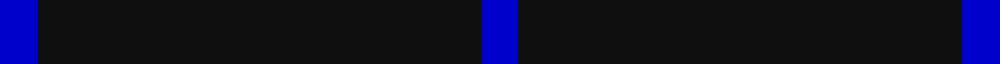

This is one **variant** — a specific cloth: this exact thread count and colourway, with its own
provenance below. It is one weaving of the [sett](/setts/db1k12db1/) (the scale-free proportion — the
same cloth at any scale or shade), whose colour order is pattern [BKB](/stripes/bkb/).

Part of the [Staines](/tartans/s/st/staines/) tartan — the named design grouping this sett with its other cloths.

Sourced from register-of-tartans.  It is a [3 stripe tartan](/stripes/stripes3/).

Original link [https://www.tartanregister.gov.uk/tartanDetails.aspx?ref=10857](https://www.tartanregister.gov.uk/tartanDetails.aspx?ref=10857)

Dataset <small>— provenance for this record, inherited from the source manifest</small>

<dl class="dataset-prov">
<dt>source</dt><dd><a href="/sources/register-of-tartans/">Scottish Register of Tartans</a></dd>
<dt>data captured from</dt><dd><a href="https://github.com/thetartan/tartan-database/blob/master/data/register-of-tartans/data.csv">https://github.com/thetartan/tartan-database/blob/master/data/register-of-tartans/data.csv</a></dd>
<dt>data date</dt><dd>25/06/2013 <small>(this record)</small></dd>
<dt>licence</dt><dd><a href="https://www.tartanregister.gov.uk/copyright">Crown copyright</a></dd>
</dl>

Capture chain <small>— the hands this data passed through, oldest first; each capture carries its own licence</small>

<ol class="capture-chain">
<li><a href="https://www.tartanregister.gov.uk/">Scottish Register of Tartans</a> · <a href="https://www.tartanregister.gov.uk/copyright">Crown copyright</a> <small>the living register — still published by National Records of Scotland</small></li>
<li><a href="https://github.com/thetartan/tartan-database">thetartan/tartan-database</a> <small>2016-2017</small> · <a href="https://creativecommons.org/licenses/by-nc-nd/4.0/">CC BY-NC-ND 4.0</a> <small>Levko Kravets's frozen compilation — the capture we vendored, and where its CC licence text came from</small></li>
<li>this dictionary <small>captured 2026-06-10 · commit 5bf86c7566</small> <small>each re-capture is a git commit to data/sources</small></li>
</ol>

## Register references

External register numbers recorded for this tartan.

- Scottish Register of Tartans: [10857](https://www.tartanregister.gov.uk/tartanDetails.aspx?ref=10857)

## Thread count
DB/10 K120 DB/10

One full sett is **260 threads**.

## Palette
<table><thead><tr><th>Colour</th><th>Shade</th><th>OKLCh</th></tr></thead><tbody><tr><td>DB</td><td><code style="background-color:#082077;">#082077</code> <small style="color:#888">#082077</small></td><td><small style="color:#888">oklch(30.0% 0.149 265.1)</small></td></tr><tr><td>K</td><td><code style="background-color:#000000;">#000000</code> <small style="color:#888">#000000</small></td><td><small style="color:#888">oklch(0.0% 0.000 0.0)</small></td></tr></tbody></table>

# Sample pattern

## Nearest tartan variants

The nearest existing variants by ΔTartan distance, with this cloth at the top so the swatches line up against it.

ΔTartan

Threads

Variant

Sett

—

260

<a href="/variants/s3/db1k12db1~x10/">Staines (2013)</a>

<a href="/ttd/edit/#slug=k15lb1~x12&amp;base=db1k12db1~x10" title="compare in the TTD">0.58</a>

192

<a href="/variants/s2/k15lb1~x12/">Joy's Fancy, Allen (Personal)</a>

<a href="/ttd/edit/#slug=db1r1k12g1~x4&amp;base=db1k12db1~x10" title="compare in the TTD">0.60</a>

112

<a href="/variants/s4/db1r1k12g1~x4/">MacNathair Sgianach</a>

<a href="/ttd/edit/#slug=k20w2db1~x6&amp;base=db1k12db1~x10" title="compare in the TTD">0.72</a>

150

<a href="/variants/s3/k20w2db1~x6/">Fily (Verneuil L'tang) (Personal)</a>

<a href="/ttd/edit/#slug=k20w2lb1~x6&amp;base=db1k12db1~x10" title="compare in the TTD">0.74</a>

150

<a href="/variants/s3/k20w2lb1~x6/">Fily (Verneuil L'tang) (Personal)</a>

<a href="/ttd/edit/#slug=db50k12db21w5~x2&amp;base=db1k12db1~x10" title="compare in the TTD">0.89</a>

242

<a href="/variants/s4/db50k12db21w5~x2/">Coinean Dubh</a>

<a href="/ttd/edit/#slug=db12k1~x10&amp;base=db1k12db1~x10" title="compare in the TTD">0.90</a>

130

<a href="/variants/s2/db12k1~x10/">Staines</a>

<a href="/ttd/edit/#slug=r1n19w1~x2&amp;base=db1k12db1~x10" title="compare in the TTD">1.01</a>

80

<a href="/variants/s3/r1n19w1~x2/">Dunbar of Pitgaveny Family Tartan</a>

<a href="/ttd/edit/#slug=dg1k20dg1~x6~dg1804158&amp;base=db1k12db1~x10" title="compare in the TTD">1.03</a>

252

<a href="/variants/s3/dg1k20dg1~x6~dg1804158/">Stirling of Keir</a>

<a href="/ttd/edit/#slug=k20dt1~x6&amp;base=db1k12db1~x10" title="compare in the TTD">1.03</a>

126

<a href="/variants/s2/k20dt1~x6/">Black Shadow (Fashion)</a>

<a href="/ttd/edit/#slug=r3db12k50y3~x2&amp;base=db1k12db1~x10" title="compare in the TTD">1.10</a>

260

<a href="/variants/s4/r3db12k50y3~x2/">Rogues (United States), The</a>

## Neighbour map

Every grey dot is one of 13621 variants placed by the first two principal components of the ΔTartan feature space (42% of its variance). Red is this tartan; blue dots are its nearest — click one to open its page.

<svg viewBox="0 0 640 380" role="img" style="max-width:100%;height:auto;border:1px solid #e0e0e0;border-radius:4px;display:block" xmlns="http://www.w3.org/2000/svg"><image href="/nn/cloud.v1.png" width="640" height="380"/><a href="/variants/s2/k15lb1~x12/"><circle cx="626.0" cy="243.2" r="4" fill="#3465a4"><title>Joy's Fancy, Allen (Personal)</title></circle></a><a href="/variants/s4/db1r1k12g1~x4/"><circle cx="471.7" cy="163.9" r="4" fill="#3465a4"><title>MacNathair Sgianach</title></circle></a><a href="/variants/s3/k20w2db1~x6/"><circle cx="544.7" cy="173.9" r="4" fill="#3465a4"><title>Fily (Verneuil L'tang) (Personal)</title></circle></a><a href="/variants/s3/k20w2lb1~x6/"><circle cx="544.7" cy="176.6" r="4" fill="#3465a4"><title>Fily (Verneuil L'tang) (Personal)</title></circle></a><a href="/variants/s4/db50k12db21w5~x2/"><circle cx="475.4" cy="230.5" r="4" fill="#3465a4"><title>Coinean Dubh</title></circle></a><a href="/variants/s2/db12k1~x10/"><circle cx="626.0" cy="291.9" r="4" fill="#3465a4"><title>Staines</title></circle></a><a href="/variants/s3/r1n19w1~x2/"><circle cx="626.0" cy="223.8" r="4" fill="#3465a4"><title>Dunbar of Pitgaveny Family Tartan</title></circle></a><a href="/variants/s3/dg1k20dg1~x6~dg1804158/"><circle cx="626.0" cy="203.0" r="4" fill="#3465a4"><title>Stirling of Keir</title></circle></a><a href="/variants/s2/k20dt1~x6/"><circle cx="626.0" cy="279.6" r="4" fill="#3465a4"><title>Black Shadow (Fashion)</title></circle></a><a href="/variants/s4/r3db12k50y3~x2/"><circle cx="444.1" cy="166.4" r="4" fill="#3465a4"><title>Rogues (United States), The</title></circle></a><circle cx="626.0" cy="243.1" r="5" fill="#c00000"/><text x="320" y="376" text-anchor="middle" font-size="11" fill="#999">ground</text><text x="11" y="190" text-anchor="middle" font-size="11" fill="#999" transform="rotate(-90 11 190)">complexity</text></svg>

ID: /variants/s3/db1k12db1~x10/
