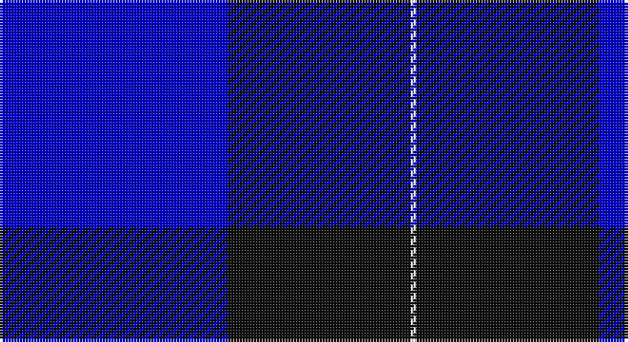

This page is one **sett** — a single exact thread-count. It belongs to the [tartan](/setts/db40k32w1/)
(the same proportion at any scale), whose colour order is pattern [BKW](/stripes/bkw/).

Sourced from register-of-tartans.  It is a [3 stripe tartan](/stripes/stripes3/).

Original link https://www.tartanregister.gov.uk/tartanDetails.aspx?ref=10930

2 attestations — the source records this cloth was collapsed from (oldest owns this page)

<ul>
<li>08/10/2013 — Shirra (2013) (register-of-tartans, <a href="https://www.tartanregister.gov.uk/tartanDetails.aspx?ref=10930">record</a>)</li>
<li>2013 — Shirra (2013) (tartans-authority, <a href="http://www.tartansauthority.com/tartan-ferret/display/10930/">record</a>)</li>
</ul>

## Register references

External register numbers recorded for this tartan.

- Scottish Register of Tartans: [10930](https://www.tartanregister.gov.uk/tartanDetails?ref=10930)
- Scottish Tartans Authority (ITI): 10930

## Thread count
B/80 K64 W/2

One full sett is **210 threads**.

## Palette

Palette: <strong>Tartan Register</strong>
<table><thead><tr><th>Colour</th><th>Threads</th><th>Shade</th><th>Base</th><th>OKLCh</th></tr></thead><tbody><tr><td>B/</td><td style="text-align:right;font-variant-numeric:tabular-nums">80</td><td><code style="background-color:#0000CD;">#0000CD</code> <small style="color:#888">#0000CD</small></td><td>B <code style="background-color:#2A418A;">#2A418A</code></td><td><small style="color:#888">oklch(38.3% 0.266 264.1)</small></td></tr><tr><td>K</td><td style="text-align:right;font-variant-numeric:tabular-nums">64</td><td><code style="background-color:#101010;">#101010</code> <small style="color:#888">#101010</small></td><td>K <code style="background-color:#000000;">#000000</code></td><td><small style="color:#888">oklch(17.3% 0.000 89.9)</small></td></tr><tr><td>W/</td><td style="text-align:right;font-variant-numeric:tabular-nums">2</td><td><code style="background-color:#FFFFFF;">#FFFFFF</code> <small style="color:#888">#FFFFFF</small></td><td>W <code style="background-color:#F7F7F7;">#F7F7F7</code></td><td><small style="color:#888">oklch(100.0% 0.000 89.9)</small></td></tr></tbody></table>

# Sample pattern

## Nearest tartans

The nearest existing variants by ΔTartan distance, with this tartan at the top so the swatches line up against it.

ΔTartan

Tartan

Sett

—

<a href="/ttd/edit/#slug=db40k32w1~x2">Shirra (2013)</a> <a class="nn-out" href="/variants/s3/db40k32w1~x2/" title="open its dictionary page">↗</a>

2.09

<a href="/ttd/edit/#slug=t9db14r1~x4&amp;base=db40k32w1~x2">Stakis Hotels (Corporate)</a> <a class="nn-out" href="/variants/s3/t9db14r1~x4/" title="open its dictionary page">↗</a>

2.25

<a href="/ttd/edit/#slug=k33db8k4db35p3~x2&amp;base=db40k32w1~x2">Fenston/Morris (Personal)</a> <a class="nn-out" href="/variants/s5/k33db8k4db35p3~x2/" title="open its dictionary page">↗</a>

2.34

<a href="/ttd/edit/#slug=db52k28w5k3w2k10&amp;base=db40k32w1~x2">St Andrews, Earl of</a> <a class="nn-out" href="/variants/s6/db52k28w5k3w2k10/" title="open its dictionary page">↗</a>

2.41

<a href="/ttd/edit/#slug=k62b33ly1~x2&amp;base=db40k32w1~x2">Westwater (Personal)</a> <a class="nn-out" href="/variants/s3/k62b33ly1~x2/" title="open its dictionary page">↗</a>

2.49

<a href="/ttd/edit/#slug=g20r7db40w2~x2&amp;base=db40k32w1~x2">McNiff, Kevin (Personal)</a> <a class="nn-out" href="/variants/s4/g20r7db40w2~x2/" title="open its dictionary page">↗</a>

2.49

<a href="/ttd/edit/#slug=w4t28db49ly3~x2&amp;base=db40k32w1~x2">McKerrell of Hillhouse</a> <a class="nn-out" href="/variants/s4/w4t28db49ly3~x2/" title="open its dictionary page">↗</a>

2.50

<a href="/ttd/edit/#slug=b52db28w5db3w2db10~x2&amp;base=db40k32w1~x2">St. Andrews, Earl of (District)</a> <a class="nn-out" href="/variants/s6/b52db28w5db3w2db10~x2/" title="open its dictionary page">↗</a>

2.50

<a href="/ttd/edit/#slug=dbi104db16w8db66r3db16&amp;base=db40k32w1~x2">Edzell, U.S. Navy</a> <a class="nn-out" href="/variants/s6/dbi104db16w8db66r3db16/" title="open its dictionary page">↗</a>

2.54

<a href="/ttd/edit/#slug=k2db9k2db9k13w1k2~x4&amp;base=db40k32w1~x2">Swan 2015, Brian E (Personal)</a> <a class="nn-out" href="/variants/s7/k2db9k2db9k13w1k2~x4/" title="open its dictionary page">↗</a>

2.54

<a href="/ttd/edit/#slug=w4t34db60ly3~x2&amp;base=db40k32w1~x2">MacKerral Family Tartan</a> <a class="nn-out" href="/variants/s4/w4t34db60ly3~x2/" title="open its dictionary page">↗</a>

## Neighbour map

Every grey dot is one of 14360 variants placed by the first two principal components of the ΔTartan feature space (44% of its variance). Red is this tartan; blue dots are its nearest — click one to open its page.

<svg viewBox="0 0 640 380" role="img" style="max-width:100%;height:auto;border:1px solid #e0e0e0;border-radius:4px;display:block" xmlns="http://www.w3.org/2000/svg"><image href="/nn/cloud.v1.png" width="640" height="380"/><a href="/variants/s3/t9db14r1~x4/"><circle cx="346.5" cy="264.5" r="4" fill="#3465a4"><title>Stakis Hotels (Corporate)</title></circle></a><a href="/variants/s5/k33db8k4db35p3~x2/"><circle cx="346.7" cy="251.0" r="4" fill="#3465a4"><title>Fenston/Morris (Personal)</title></circle></a><a href="/variants/s6/db52k28w5k3w2k10/"><circle cx="368.9" cy="189.4" r="4" fill="#3465a4"><title>St Andrews, Earl of</title></circle></a><a href="/variants/s3/k62b33ly1~x2/"><circle cx="458.9" cy="221.5" r="4" fill="#3465a4"><title>Westwater (Personal)</title></circle></a><a href="/variants/s4/g20r7db40w2~x2/"><circle cx="345.8" cy="212.4" r="4" fill="#3465a4"><title>McNiff, Kevin (Personal)</title></circle></a><a href="/variants/s4/w4t28db49ly3~x2/"><circle cx="345.4" cy="211.7" r="4" fill="#3465a4"><title>McKerrell of Hillhouse</title></circle></a><a href="/variants/s6/b52db28w5db3w2db10~x2/"><circle cx="361.3" cy="184.3" r="4" fill="#3465a4"><title>St. Andrews, Earl of (District)</title></circle></a><a href="/variants/s6/dbi104db16w8db66r3db16/"><circle cx="387.1" cy="186.9" r="4" fill="#3465a4"><title>Edzell, U.S. Navy</title></circle></a><a href="/variants/s7/k2db9k2db9k13w1k2~x4/"><circle cx="322.4" cy="230.3" r="4" fill="#3465a4"><title>Swan 2015, Brian E (Personal)</title></circle></a><a href="/variants/s4/w4t34db60ly3~x2/"><circle cx="380.2" cy="207.9" r="4" fill="#3465a4"><title>MacKerral Family Tartan</title></circle></a><circle cx="399.5" cy="243.5" r="5" fill="#c00000"/></svg>

ID: /variants/s3/db40k32w1~x2/
