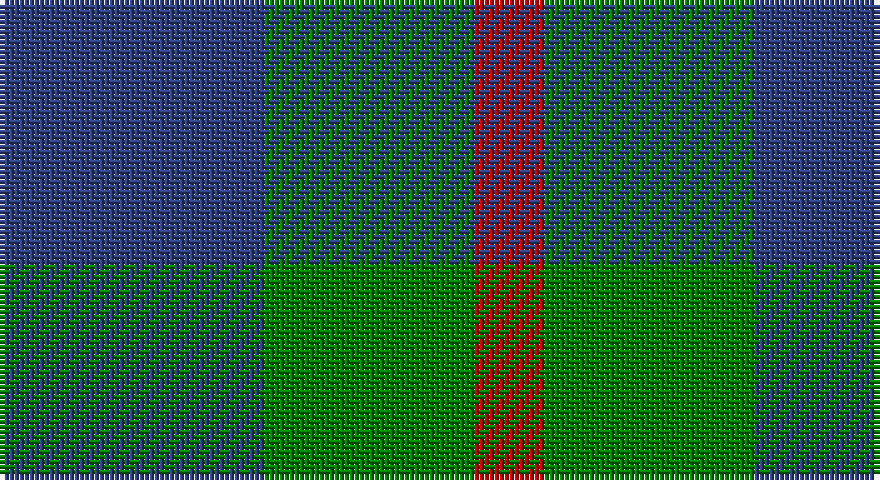

This page is one **sett** — a single exact thread-count. It belongs to the [tartan](/setts/db53g42r14/)
(the same proportion at any scale), whose colour order is pattern [BGR](/stripes/bgr/).

Sourced from weddslist.  It is a [3 stripe tartan](/stripes/stripes3/).

Original link http://www.weddslist.com/cgi-bin/tartans/pg.pl?source=sts

## Provenance

Earliest known date: 1978 Nothing

2 attestations — the source records this cloth was collapsed from (oldest owns this page)

<ul>
<li>undated — Agnew (weddslist, <a href="http://www.weddslist.com/cgi-bin/tartans/pg.pl?source=sts">record</a>)</li>
<li>undated — Agnew Family Tartan (house-of-tartan, <a href="http://www.house-of-tartan.scotland.net/house/TartanViewjs.asp?colr=Def&tnam=182">record</a>)</li>
</ul>

## Thread count
B/53 G42 R/14

One full sett is **151 threads**.

## Palette

Palette: <strong>custom</strong>
<table><thead><tr><th>Colour</th><th>Threads</th><th>Shade</th><th>Base</th><th>OKLCh</th></tr></thead><tbody><tr><td>B/</td><td style="text-align:right;font-variant-numeric:tabular-nums">53</td><td><code style="background-color:#304080;">#304080</code> <small style="color:#888">#304080</small></td><td>B <code style="background-color:#2A418A;">#2A418A</code></td><td><small style="color:#888">oklch(39.4% 0.109 270.2)</small></td></tr><tr><td>G</td><td style="text-align:right;font-variant-numeric:tabular-nums">42</td><td><code style="background-color:#008000;">#008000</code> <small style="color:#888">#008000</small></td><td>G <code style="background-color:#006100;">#006100</code></td><td><small style="color:#888">oklch(52.0% 0.177 142.5)</small></td></tr><tr><td>R/</td><td style="text-align:right;font-variant-numeric:tabular-nums">14</td><td><code style="background-color:#C00000;">#C00000</code> <small style="color:#888">#C00000</small></td><td>R <code style="background-color:#CC0000;">#CC0000</code></td><td><small style="color:#888">oklch(50.7% 0.208 29.2)</small></td></tr></tbody></table>

# Sample pattern

## Nearest tartans

The nearest existing variants by ΔTartan distance, with this tartan at the top so the swatches line up against it.

ΔTartan

Tartan

Sett

—

<a href="/ttd/edit/#slug=db53g42r14">Agnew</a> <a class="nn-out" href="/variants/s3/db53g42r14/" title="open its dictionary page">↗</a>

0.73

<a href="/ttd/edit/#slug=db53g42r14~x2&amp;base=db53g42r14">Agnew</a> <a class="nn-out" href="/variants/s3/db53g42r14~x2/" title="open its dictionary page">↗</a>

0.93

<a href="/ttd/edit/#slug=db6g5r1~x4&amp;base=db53g42r14">Ferguson</a> <a class="nn-out" href="/variants/s3/db6g5r1~x4/" title="open its dictionary page">↗</a>

1.08

<a href="/ttd/edit/#slug=db5g6r1~x4&amp;base=db53g42r14">Wilson's No 84, Ferguson</a> <a class="nn-out" href="/variants/s3/db5g6r1~x4/" title="open its dictionary page">↗</a>

1.12

<a href="/ttd/edit/#slug=g6dp5t1~x4&amp;base=db53g42r14">Wilson's No.055</a> <a class="nn-out" href="/variants/s3/g6dp5t1~x4/" title="open its dictionary page">↗</a>

1.15

<a href="/ttd/edit/#slug=db13r2g13~x2&amp;base=db53g42r14">Wilson's No 62, (Ferguson)</a> <a class="nn-out" href="/variants/s3/db13r2g13~x2/" title="open its dictionary page">↗</a>

1.17

<a href="/ttd/edit/#slug=k5g14db12g4~x4&amp;base=db53g42r14">MacCurdie (Clan?)</a> <a class="nn-out" href="/variants/s4/k5g14db12g4~x4/" title="open its dictionary page">↗</a>

1.24

<a href="/variants/s4/g7t2r4~x2/">Wilson's No.208</a>

1.29

<a href="/ttd/edit/#slug=g6p5t1~x4&amp;base=db53g42r14">Wilson's, No 55</a> <a class="nn-out" href="/variants/s3/g6p5t1~x4/" title="open its dictionary page">↗</a>

1.44

<a href="/ttd/edit/#slug=g4dp5g4t2~x2&amp;base=db53g42r14">Wilson's No.209</a> <a class="nn-out" href="/variants/s4/g4dp5g4t2~x2/" title="open its dictionary page">↗</a>

1.57

<a href="/ttd/edit/#slug=k5g4t2~x2&amp;base=db53g42r14">Mull</a> <a class="nn-out" href="/variants/s3/k5g4t2~x2/" title="open its dictionary page">↗</a>

## Neighbour map

Every grey dot is one of 14360 variants placed by the first two principal components of the ΔTartan feature space (44% of its variance). Red is this tartan; blue dots are its nearest — click one to open its page.

<svg viewBox="0 0 640 380" role="img" style="max-width:100%;height:auto;border:1px solid #e0e0e0;border-radius:4px;display:block" xmlns="http://www.w3.org/2000/svg"><image href="/nn/cloud.v1.png" width="640" height="380"/><a href="/variants/s3/db53g42r14~x2/"><circle cx="252.0" cy="349.7" r="4" fill="#3465a4"><title>Agnew</title></circle></a><a href="/variants/s3/db6g5r1~x4/"><circle cx="293.2" cy="325.0" r="4" fill="#3465a4"><title>Ferguson</title></circle></a><a href="/variants/s3/db5g6r1~x4/"><circle cx="291.3" cy="324.9" r="4" fill="#3465a4"><title>Wilson's No 84, Ferguson</title></circle></a><a href="/variants/s3/g6dp5t1~x4/"><circle cx="289.6" cy="320.4" r="4" fill="#3465a4"><title>Wilson's No.055</title></circle></a><a href="/variants/s3/db13r2g13~x2/"><circle cx="288.4" cy="321.5" r="4" fill="#3465a4"><title>Wilson's No 62, (Ferguson)</title></circle></a><a href="/variants/s4/k5g14db12g4~x4/"><circle cx="265.3" cy="347.3" r="4" fill="#3465a4"><title>MacCurdie (Clan?)</title></circle></a><a href="/variants/s4/g7t2r4~x2/"><circle cx="225.5" cy="317.7" r="4" fill="#3465a4"><title>Wilson's No.208</title></circle></a><a href="/variants/s3/g6p5t1~x4/"><circle cx="273.3" cy="305.8" r="4" fill="#3465a4"><title>Wilson's, No 55</title></circle></a><a href="/variants/s4/g4dp5g4t2~x2/"><circle cx="217.3" cy="366.0" r="4" fill="#3465a4"><title>Wilson's No.209</title></circle></a><a href="/variants/s3/k5g4t2~x2/"><circle cx="178.2" cy="366.0" r="4" fill="#3465a4"><title>Mull</title></circle></a><circle cx="247.8" cy="347.7" r="5" fill="#c00000"/></svg>

ID: /variants/s3/db53g42r14/
