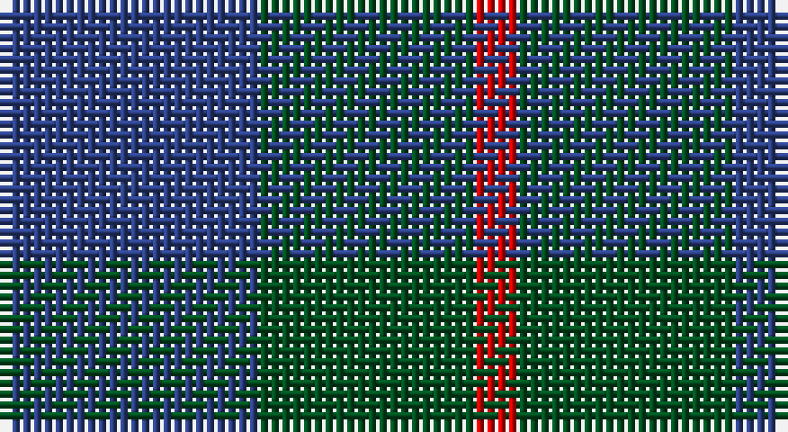

This page is one **sett** — a single exact thread-count. It belongs to the [tartan](/setts/db6dg5r1/)
(the same proportion at any scale), whose colour order is pattern [BGR](/stripes/bgr/).

Sourced from register-of-tartans.  It is a [3 stripe tartan](/stripes/stripes3/).

Original link https://www.tartanregister.gov.uk/tartanDetails.aspx?ref=1159

## Register references

External register numbers recorded for this tartan.

- Scottish Register of Tartans: [1159](https://www.tartanregister.gov.uk/tartanDetails.aspx?ref=1159)
- Scottish Tartans World Register: 1952

## Thread count
B/24 G20 R/4

One full sett is **68 threads**.

## Palette

Palette: <strong>Tartan Register</strong>
<table><thead><tr><th>Colour</th><th>Threads</th><th>Shade</th><th>Base</th><th>OKLCh</th></tr></thead><tbody><tr><td>B/</td><td style="text-align:right;font-variant-numeric:tabular-nums">24</td><td><code style="background-color:#2C4084;">#2C4084</code> <small style="color:#888">#2C4084</small></td><td>B <code style="background-color:#2A418A;">#2A418A</code></td><td><small style="color:#888">oklch(39.4% 0.117 268.3)</small></td></tr><tr><td>G</td><td style="text-align:right;font-variant-numeric:tabular-nums">20</td><td><code style="background-color:#005020;">#005020</code> <small style="color:#888">#005020</small></td><td>G <code style="background-color:#006100;">#006100</code></td><td><small style="color:#888">oklch(37.7% 0.105 149.6)</small></td></tr><tr><td>R/</td><td style="text-align:right;font-variant-numeric:tabular-nums">4</td><td><code style="background-color:#DC0000;">#DC0000</code> <small style="color:#888">#DC0000</small></td><td>R <code style="background-color:#CC0000;">#CC0000</code></td><td><small style="color:#888">oklch(56.2% 0.230 29.2)</small></td></tr></tbody></table>

# Sample pattern

## Nearest tartans

The nearest existing variants by ΔTartan distance, with this tartan at the top so the swatches line up against it.

ΔTartan

Tartan

Sett

—

<a href="/ttd/edit/#slug=db6dg5r1~x4">Ferguson</a> <a class="nn-out" href="/variants/s3/db6dg5r1~x4/" title="open its dictionary page">↗</a>

0.77

<a href="/ttd/edit/#slug=dg17r2db15~x2&amp;base=db6dg5r1~x4">Ferguson (Old)</a> <a class="nn-out" href="/variants/s3/dg17r2db15~x2/" title="open its dictionary page">↗</a>

1.29

<a href="/ttd/edit/#slug=g17r2db15~x2&amp;base=db6dg5r1~x4">Ferguson - 1930 (Old)</a> <a class="nn-out" href="/variants/s3/g17r2db15~x2/" title="open its dictionary page">↗</a>

1.31

<a href="/ttd/edit/#slug=db2dg7db7w1~x2&amp;base=db6dg5r1~x4">Unidentified No 78</a> <a class="nn-out" href="/variants/s4/db2dg7db7w1~x2/" title="open its dictionary page">↗</a>

1.44

<a href="/ttd/edit/#slug=k15dt40k9o10~x2&amp;base=db6dg5r1~x4">Omega Delta Sigma, National Veterans Fraternity</a> <a class="nn-out" href="/variants/s4/k15dt40k9o10~x2/" title="open its dictionary page">↗</a>

1.50

<a href="/ttd/edit/#slug=db6g5r1~x4&amp;base=db6dg5r1~x4">Ferguson</a> <a class="nn-out" href="/variants/s3/db6g5r1~x4/" title="open its dictionary page">↗</a>

1.53

<a href="/ttd/edit/#slug=dg14r3db9t2~x2&amp;base=db6dg5r1~x4">Unidentified #4</a> <a class="nn-out" href="/variants/s4/dg14r3db9t2~x2/" title="open its dictionary page">↗</a>

1.56

<a href="/ttd/edit/#slug=db11dg2db15dg18w2~x2&amp;base=db6dg5r1~x4">Hamilton Hunting</a> <a class="nn-out" href="/variants/s5/db11dg2db15dg18w2~x2/" title="open its dictionary page">↗</a>

1.62

<a href="/ttd/edit/#slug=db53g42r14~x2&amp;base=db6dg5r1~x4">Agnew</a> <a class="nn-out" href="/variants/s3/db53g42r14~x2/" title="open its dictionary page">↗</a>

1.65

<a href="/ttd/edit/#slug=db13r2g13~x2&amp;base=db6dg5r1~x4">Wilson's No 62, (Ferguson)</a> <a class="nn-out" href="/variants/s3/db13r2g13~x2/" title="open its dictionary page">↗</a>

1.66

<a href="/ttd/edit/#slug=k5g14db12g4~x4&amp;base=db6dg5r1~x4">MacCurdie (Clan?)</a> <a class="nn-out" href="/variants/s4/k5g14db12g4~x4/" title="open its dictionary page">↗</a>

## Neighbour map

Every grey dot is one of 14360 variants placed by the first two principal components of the ΔTartan feature space (44% of its variance). Red is this tartan; blue dots are its nearest — click one to open its page.

<svg viewBox="0 0 640 380" role="img" style="max-width:100%;height:auto;border:1px solid #e0e0e0;border-radius:4px;display:block" xmlns="http://www.w3.org/2000/svg"><image href="/nn/cloud.v1.png" width="640" height="380"/><a href="/variants/s3/dg17r2db15~x2/"><circle cx="365.7" cy="335.8" r="4" fill="#3465a4"><title>Ferguson (Old)</title></circle></a><a href="/variants/s3/g17r2db15~x2/"><circle cx="326.6" cy="314.4" r="4" fill="#3465a4"><title>Ferguson - 1930 (Old)</title></circle></a><a href="/variants/s4/db2dg7db7w1~x2/"><circle cx="332.9" cy="305.1" r="4" fill="#3465a4"><title>Unidentified No 78</title></circle></a><a href="/variants/s4/k15dt40k9o10~x2/"><circle cx="319.2" cy="322.0" r="4" fill="#3465a4"><title>Omega Delta Sigma, National Veterans Fraternity</title></circle></a><a href="/variants/s3/db6g5r1~x4/"><circle cx="293.2" cy="325.0" r="4" fill="#3465a4"><title>Ferguson</title></circle></a><a href="/variants/s4/dg14r3db9t2~x2/"><circle cx="292.0" cy="285.5" r="4" fill="#3465a4"><title>Unidentified #4</title></circle></a><a href="/variants/s5/db11dg2db15dg18w2~x2/"><circle cx="365.8" cy="292.4" r="4" fill="#3465a4"><title>Hamilton Hunting</title></circle></a><a href="/variants/s3/db53g42r14~x2/"><circle cx="252.0" cy="349.7" r="4" fill="#3465a4"><title>Agnew</title></circle></a><a href="/variants/s3/db13r2g13~x2/"><circle cx="288.4" cy="321.5" r="4" fill="#3465a4"><title>Wilson's No 62, (Ferguson)</title></circle></a><a href="/variants/s4/k5g14db12g4~x4/"><circle cx="265.3" cy="347.3" r="4" fill="#3465a4"><title>MacCurdie (Clan?)</title></circle></a><circle cx="331.1" cy="345.4" r="5" fill="#c00000"/></svg>

ID: /variants/s3/db6dg5r1~x4/
