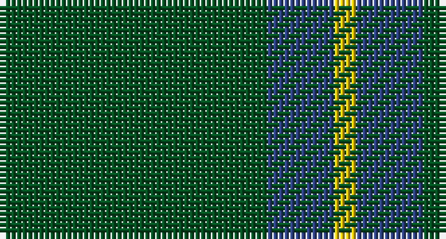

This page is one **sett** — a single exact thread-count. It belongs to the [tartan](/setts/dg12db3ly1/)
(the same proportion at any scale), whose colour order is pattern [GBY](/stripes/gby/).

Part of the [Unidentified pattern](/tartans/unidentified-pattern/) tartan — the named design grouping this sett with its other cloths.

Sourced from register-of-tartans.  It is a [3 stripe tartan](/stripes/stripes3/).

Original link https://www.tartanregister.gov.uk/tartanDetails.aspx?ref=4338

## Also known as

This cloth is also recorded under:

- Unidentified pattern #2
- Unidentified pattern #3
- Unidentified, pattern

## Register references

External register numbers recorded for this tartan.

- Scottish Register of Tartans: [4338](https://www.tartanregister.gov.uk/tartanDetails.aspx?ref=4338)
- Scottish Tartans World Register: 750

## Thread count
G/48 B12 Y/4

One full sett is **76 threads**.

## Palette

Palette: <strong>Tartan Register</strong>
<table><thead><tr><th>Colour</th><th>Threads</th><th>Shade</th><th>Base</th><th>OKLCh</th></tr></thead><tbody><tr><td>G/</td><td style="text-align:right;font-variant-numeric:tabular-nums">48</td><td><code style="background-color:#005020;">#005020</code> <small style="color:#888">#005020</small></td><td>G <code style="background-color:#006100;">#006100</code></td><td><small style="color:#888">oklch(37.7% 0.105 149.6)</small></td></tr><tr><td>B</td><td style="text-align:right;font-variant-numeric:tabular-nums">12</td><td><code style="background-color:#2C4084;">#2C4084</code> <small style="color:#888">#2C4084</small></td><td>B <code style="background-color:#2A418A;">#2A418A</code></td><td><small style="color:#888">oklch(39.4% 0.117 268.3)</small></td></tr><tr><td>Y/</td><td style="text-align:right;font-variant-numeric:tabular-nums">4</td><td><code style="background-color:#E8C000;">#E8C000</code> <small style="color:#888">#E8C000</small></td><td>Y <code style="background-color:#F2BF00;">#F2BF00</code></td><td><small style="color:#888">oklch(81.9% 0.168 93.7)</small></td></tr></tbody></table>

# Sample pattern

## Nearest tartans

The nearest existing variants by ΔTartan distance, with this tartan at the top so the swatches line up against it.

ΔTartan

Tartan

Sett

—

<a href="/ttd/edit/#slug=dg12db3ly1~x4">Unidentified pattern #2</a> <a class="nn-out" href="/variants/s3/dg12db3ly1~x4/" title="open its dictionary page">↗</a>

1.33

<a href="/ttd/edit/#slug=dp7g23r3g7~x2&amp;base=dg12db3ly1~x4">Highland Spring (1997) (Corporate)</a> <a class="nn-out" href="/variants/s4/dp7g23r3g7~x2/" title="open its dictionary page">↗</a>

1.40

<a href="/ttd/edit/#slug=g9n1g2k4g2~x4&amp;base=dg12db3ly1~x4">Peterhead (Personal)</a> <a class="nn-out" href="/variants/s5/g9n1g2k4g2~x4/" title="open its dictionary page">↗</a>

1.49

<a href="/variants/s4/g12db3g1~x2/">Montgomerie</a>

1.58

<a href="/ttd/edit/#slug=g12db3ly1~x4&amp;base=dg12db3ly1~x4">Unidentified, pattern</a> <a class="nn-out" href="/variants/s3/g12db3ly1~x4/" title="open its dictionary page">↗</a>

1.58

<a href="/ttd/edit/#slug=g8r1db1n1~x10&amp;base=dg12db3ly1~x4">Jodi Williams (Personal)</a> <a class="nn-out" href="/variants/s4/g8r1db1n1~x10/" title="open its dictionary page">↗</a>

1.64

<a href="/ttd/edit/#slug=dg9y4lo1~x8&amp;base=dg12db3ly1~x4">Ledford</a> <a class="nn-out" href="/variants/s3/dg9y4lo1~x8/" title="open its dictionary page">↗</a>

1.71

<a href="/ttd/edit/#slug=g44db9r2db9g2~x2&amp;base=dg12db3ly1~x4">Tyrconnell (Personal)</a> <a class="nn-out" href="/variants/s5/g44db9r2db9g2~x2/" title="open its dictionary page">↗</a>

1.77

<a href="/ttd/edit/#slug=g9o20g46lg5~x2&amp;base=dg12db3ly1~x4">O'Neill, Red (Corporate?)</a> <a class="nn-out" href="/variants/s4/g9o20g46lg5~x2/" title="open its dictionary page">↗</a>

1.83

<a href="/ttd/edit/#slug=g7r3g23m7~x2&amp;base=dg12db3ly1~x4">Highland Spring (Green)</a> <a class="nn-out" href="/variants/s4/g7r3g23m7~x2/" title="open its dictionary page">↗</a>

1.91

<a href="/ttd/edit/#slug=m2g1m1g10w1~x4&amp;base=dg12db3ly1~x4">Welsh National District Tartan</a> <a class="nn-out" href="/variants/s5/m2g1m1g10w1~x4/" title="open its dictionary page">↗</a>

## Neighbour map

Every grey dot is one of 14360 variants placed by the first two principal components of the ΔTartan feature space (44% of its variance). Red is this tartan; blue dots are its nearest — click one to open its page.

<svg viewBox="0 0 640 380" role="img" style="max-width:100%;height:auto;border:1px solid #e0e0e0;border-radius:4px;display:block" xmlns="http://www.w3.org/2000/svg"><image href="/nn/cloud.v1.png" width="640" height="380"/><a href="/variants/s4/dp7g23r3g7~x2/"><circle cx="471.0" cy="290.0" r="4" fill="#3465a4"><title>Highland Spring (1997) (Corporate)</title></circle></a><a href="/variants/s5/g9n1g2k4g2~x4/"><circle cx="461.0" cy="275.1" r="4" fill="#3465a4"><title>Peterhead (Personal)</title></circle></a><a href="/variants/s4/g12db3g1~x2/"><circle cx="485.4" cy="285.8" r="4" fill="#3465a4"><title>Montgomerie</title></circle></a><a href="/variants/s3/g12db3ly1~x4/"><circle cx="495.0" cy="275.6" r="4" fill="#3465a4"><title>Unidentified, pattern</title></circle></a><a href="/variants/s4/g8r1db1n1~x10/"><circle cx="476.6" cy="262.2" r="4" fill="#3465a4"><title>Jodi Williams (Personal)</title></circle></a><a href="/variants/s3/dg9y4lo1~x8/"><circle cx="421.0" cy="307.3" r="4" fill="#3465a4"><title>Ledford</title></circle></a><a href="/variants/s5/g44db9r2db9g2~x2/"><circle cx="512.3" cy="221.4" r="4" fill="#3465a4"><title>Tyrconnell (Personal)</title></circle></a><a href="/variants/s4/g9o20g46lg5~x2/"><circle cx="463.0" cy="289.0" r="4" fill="#3465a4"><title>O'Neill, Red (Corporate?)</title></circle></a><a href="/variants/s4/g7r3g23m7~x2/"><circle cx="473.4" cy="289.1" r="4" fill="#3465a4"><title>Highland Spring (Green)</title></circle></a><a href="/variants/s5/m2g1m1g10w1~x4/"><circle cx="478.5" cy="228.8" r="4" fill="#3465a4"><title>Welsh National District Tartan</title></circle></a><circle cx="515.7" cy="287.1" r="5" fill="#c00000"/></svg>

ID: /variants/s3/dg12db3ly1~x4/
