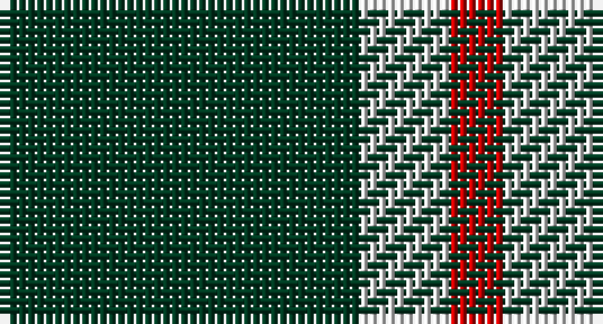

This page is one **sett** — a single exact thread-count. It belongs to the [tartan](/setts/dg20w5r3/)
(the same proportion at any scale), whose colour order is pattern [GWR](/stripes/gwr/).

Sourced from tartans-authority.  It is a [3 stripe tartan](/stripes/stripes3/).

Original link http://www.tartansauthority.com/tartan-ferret/display/3092/

## Register references

External register numbers recorded for this tartan.

- Scottish Tartans Authority (ITI): 3092

## Thread count
DG/40 LN10 R/6

One full sett is **66 threads**.

## Palette

Palette: <strong>Tartan Register</strong>
<table><thead><tr><th>Colour</th><th>Threads</th><th>Shade</th><th>Base</th><th>OKLCh</th></tr></thead><tbody><tr><td>DG/</td><td style="text-align:right;font-variant-numeric:tabular-nums">40</td><td><code style="background-color:#003820;">#003820</code> <small style="color:#888">#003820</small></td><td>G <code style="background-color:#006100;">#006100</code></td><td><small style="color:#888">oklch(30.0% 0.070 158.3)</small></td></tr><tr><td>LN</td><td style="text-align:right;font-variant-numeric:tabular-nums">10</td><td><code style="background-color:#E0E0E0;">#E0E0E0</code> <small style="color:#888">#E0E0E0</small></td><td>W <code style="background-color:#F7F7F7;">#F7F7F7</code></td><td><small style="color:#888">oklch(90.7% 0.000 89.9)</small></td></tr><tr><td>R/</td><td style="text-align:right;font-variant-numeric:tabular-nums">6</td><td><code style="background-color:#C80000;">#C80000</code> <small style="color:#888">#C80000</small></td><td>R <code style="background-color:#CC0000;">#CC0000</code></td><td><small style="color:#888">oklch(52.3% 0.215 29.2)</small></td></tr></tbody></table>

# Sample pattern

## Nearest tartans

The nearest existing variants by ΔTartan distance, with this tartan at the top so the swatches line up against it.

ΔTartan

Tartan

Sett

—

<a href="/ttd/edit/#slug=dg20w5r3~x2">Juchter (Personal)</a> <a class="nn-out" href="/variants/s3/dg20w5r3~x2/" title="open its dictionary page">↗</a>

1.12

<a href="/ttd/edit/#slug=dg21lo44dg86t10&amp;base=dg20w5r3~x2">Special Saffron (Fashion)</a> <a class="nn-out" href="/variants/s4/dg21lo44dg86t10/" title="open its dictionary page">↗</a>

1.18

<a href="/ttd/edit/#slug=dg21ly43dg86t10&amp;base=dg20w5r3~x2">Special Saffron Tartan</a> <a class="nn-out" href="/variants/s4/dg21ly43dg86t10/" title="open its dictionary page">↗</a>

1.33

<a href="/ttd/edit/#slug=dg21lo43dg86b10&amp;base=dg20w5r3~x2">Special, Saffron</a> <a class="nn-out" href="/variants/s4/dg21lo43dg86b10/" title="open its dictionary page">↗</a>

1.34

<a href="/ttd/edit/#slug=k46dy7k8w20~x2&amp;base=dg20w5r3~x2">Lords of Skye (Fashion?)</a> <a class="nn-out" href="/variants/s4/k46dy7k8w20~x2/" title="open its dictionary page">↗</a>

1.48

<a href="/variants/s4/dg20w5r3~x2/">Juchter (Personal)</a>

1.51

<a href="/ttd/edit/#slug=g9k18r2~x4&amp;base=dg20w5r3~x2">Cowie, Justine (Personal)</a> <a class="nn-out" href="/variants/s3/g9k18r2~x4/" title="open its dictionary page">↗</a>

1.63

<a href="/ttd/edit/#slug=k4lo15k4w2~x2&amp;base=dg20w5r3~x2">Takla Makan #2 (Artefact)</a> <a class="nn-out" href="/variants/s4/k4lo15k4w2~x2/" title="open its dictionary page">↗</a>

1.78

<a href="/ttd/edit/#slug=g8p4g1p2~x4&amp;base=dg20w5r3~x2">Wilson's, No 211</a> <a class="nn-out" href="/variants/s4/g8p4g1p2~x4/" title="open its dictionary page">↗</a>

1.80

<a href="/ttd/edit/#slug=dp4g10r1w1~x2&amp;base=dg20w5r3~x2">Wilson's No.189</a> <a class="nn-out" href="/variants/s4/dp4g10r1w1~x2/" title="open its dictionary page">↗</a>

1.84

<a href="/variants/s4/k5lo1k1~x20/">Justus #2 (Personal)</a>

## Neighbour map

Every grey dot is one of 14360 variants placed by the first two principal components of the ΔTartan feature space (44% of its variance). Red is this tartan; blue dots are its nearest — click one to open its page.

<svg viewBox="0 0 640 380" role="img" style="max-width:100%;height:auto;border:1px solid #e0e0e0;border-radius:4px;display:block" xmlns="http://www.w3.org/2000/svg"><image href="/nn/cloud.v1.png" width="640" height="380"/><a href="/variants/s4/dg21lo44dg86t10/"><circle cx="371.8" cy="263.0" r="4" fill="#3465a4"><title>Special Saffron (Fashion)</title></circle></a><a href="/variants/s4/dg21ly43dg86t10/"><circle cx="356.7" cy="255.8" r="4" fill="#3465a4"><title>Special Saffron Tartan</title></circle></a><a href="/variants/s4/dg21lo43dg86b10/"><circle cx="378.3" cy="264.5" r="4" fill="#3465a4"><title>Special, Saffron</title></circle></a><a href="/variants/s4/k46dy7k8w20~x2/"><circle cx="334.9" cy="250.9" r="4" fill="#3465a4"><title>Lords of Skye (Fashion?)</title></circle></a><a href="/variants/s4/dg20w5r3~x2/"><circle cx="305.6" cy="243.6" r="4" fill="#3465a4"><title>Juchter (Personal)</title></circle></a><a href="/variants/s3/g9k18r2~x4/"><circle cx="342.6" cy="278.7" r="4" fill="#3465a4"><title>Cowie, Justine (Personal)</title></circle></a><a href="/variants/s4/k4lo15k4w2~x2/"><circle cx="307.3" cy="236.7" r="4" fill="#3465a4"><title>Takla Makan #2 (Artefact)</title></circle></a><a href="/variants/s4/g8p4g1p2~x4/"><circle cx="374.6" cy="282.6" r="4" fill="#3465a4"><title>Wilson's, No 211</title></circle></a><a href="/variants/s4/dp4g10r1w1~x2/"><circle cx="342.5" cy="224.4" r="4" fill="#3465a4"><title>Wilson's No.189</title></circle></a><a href="/variants/s4/k5lo1k1~x20/"><circle cx="442.6" cy="284.8" r="4" fill="#3465a4"><title>Justus #2 (Personal)</title></circle></a><circle cx="389.3" cy="269.3" r="5" fill="#c00000"/></svg>

ID: /variants/s3/dg20w5r3~x2/
