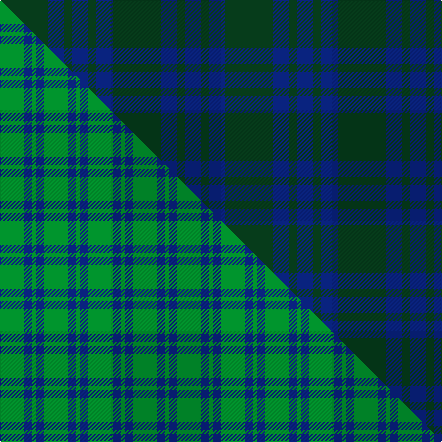

This is one **variant** — a specific cloth: this exact thread count and colourway, with its own
provenance below. It is one weaving of the [sett](/tartans/m/mo/montgomery-2/) (the scale-free proportion — the
same cloth at any scale or shade), whose colour order is pattern [GBG](/stripes/gbg/).

Part of the [Montgomery](/tartans/m/mo/montgomery-2/) tartan — the named design grouping this sett with its other cloths.

Sourced from tartans-authority.  It is a [3 stripe tartan](/stripes/stripes3/).

Original link <code>http://www.tartansauthority.com/tartan-ferret/display/114/</code> — retired · [Internet Archive copy](https://web.archive.org/web/*/http://www.tartansauthority.com/tartan-ferret/display/114/*)

Dataset <small>— provenance for this record, inherited from the source manifest</small>

<dl class="dataset-prov">
<dt>source</dt><dd><a href="/sources/tartans-authority/">Scottish Tartans Authority</a></dd>
<dt>data captured from</dt><dd><a href="https://github.com/thetartan/tartan-database/blob/master/data/tartans-authority/data.csv">https://github.com/thetartan/tartan-database/blob/master/data/tartans-authority/data.csv</a></dd>
<dt>data date</dt><dd>1842 <small>(this record)</small></dd>
<dt>licence</dt><dd><a href="https://creativecommons.org/licenses/by-nc-nd/4.0/">CC BY-NC-ND 4.0</a></dd>
</dl>

Capture chain <small>— the hands this data passed through, oldest first; each capture carries its own licence</small>

<ol class="capture-chain">
<li><a href="https://www.tartansauthority.com/">Scottish Tartans Authority</a> <small>the heritage body’s archive — its tartan-ferret record browser is retired; dead record links are shown unlinked, with an Internet Archive copy (ITI numbers are not SRT references)</small></li>
<li><a href="https://github.com/thetartan/tartan-database">thetartan/tartan-database</a> <small>2016-2017</small> · <a href="https://creativecommons.org/licenses/by-nc-nd/4.0/">CC BY-NC-ND 4.0</a> <small>Levko Kravets's frozen compilation — the capture we vendored, and where its CC licence text came from</small></li>
<li>this dictionary <small>captured 2026-06-10 · commit 5bf86c7566</small> <small>each re-capture is a git commit to data/sources</small></li>
</ol>

## Register references

External register numbers recorded for this tartan.

- Scottish Tartans Authority (ITI): 114

## Thread count
DG/48 DB16 DG/8

One full sett is **88 threads**.

The source recorded this cloth as DG/48 DB16 DG8 DB/16 — 112 threads; it folds to the canonical 88-thread sett above.

## Palette
<table><thead><tr><th>Colour</th><th>Shade</th><th>OKLCh</th></tr></thead><tbody><tr><td>DB</td><td><code style="background-color:#082077;">#082077</code> <small style="color:#888">#082077</small></td><td><small style="color:#888">oklch(30.0% 0.149 265.1)</small></td></tr><tr><td>DG</td><td><code style="background-color:#053819;">#053819</code> <small style="color:#888">#053819</small></td><td><small style="color:#888">oklch(30.0% 0.075 151.3)</small></td></tr></tbody></table>

# Sample pattern

## Compared to the master

This cloth is one sett of its design; the master sett (the exemplar the design is anchored on) is below for comparison.

Its **ΔTartan distance** from the master is **0.22** — the same measure the nearest-tartans table ranks by (0 is identical; a re-scale of the same cloth is near 0, a recolour or a different proportion further).

<figure class="master-compare" style="margin:0">

this sett
master sett ★

<figcaption style="color:#888;font-size:smaller">One weave of this sett against the <a href="/setts/g6db2g1/">master sett ★</a>, split on the diagonal: a shared proportion runs seamlessly across it with only the shades shifting; a different proportion breaks on it.</figcaption>
</figure>

## Nearest tartan variants

The nearest existing variants by ΔTartan distance, with this cloth at the top so the swatches line up against it.

ΔTartan

Threads

Variant

Sett

—

112

<a href="/variants/s3/dg6db2dg1~x8/">Montgomery - 1842 (VS</a>

<a href="/ttd/edit/#slug=dr1dg3db3dg1~x4&amp;base=dg6db2dg1~x8" title="compare in the TTD">1.13</a>

56

<a href="/variants/s4/dr1dg3db3dg1~x4/">Barwell</a>

<a href="/ttd/edit/#slug=dg31lo1dg18db18dr1~x2&amp;base=dg6db2dg1~x8" title="compare in the TTD">1.32</a>

212

<a href="/variants/s5/dg31lo1dg18db18dr1~x2/">Miramichi</a>

<a href="/ttd/edit/#slug=dr2dg8db27dg11do2~x2&amp;base=dg6db2dg1~x8" title="compare in the TTD">1.56</a>

192

<a href="/variants/s5/dr2dg8db27dg11do2~x2/">Hector, James (Corporate)</a>

<a href="/ttd/edit/#slug=dg8dr1db1n1~x10&amp;base=dg6db2dg1~x8" title="compare in the TTD">1.86</a>

130

<a href="/variants/s4/dg8dr1db1n1~x10/">Jodi Williams (Personal)</a>

<a href="/ttd/edit/#slug=dg3dr1dg9n10db3~x4&amp;base=dg6db2dg1~x8" title="compare in the TTD">1.97</a>

184

<a href="/variants/s5/dg3dr1dg9n10db3~x4/">Bethlehem, City of</a>

<a href="/ttd/edit/#slug=t4g8t18w3~x2&amp;base=dg6db2dg1~x8" title="compare in the TTD">2.43</a>

118

<a href="/variants/s4/t4g8t18w3~x2/">Blue Meadow Check (Fashion)</a>

<a href="/ttd/edit/#slug=dg4dp4dg1dp1~x4&amp;base=dg6db2dg1~x8" title="compare in the TTD">3.19</a>

60

<a href="/variants/s4/dg4dp4dg1dp1~x4/">Wilson's No.211</a>

<a href="/ttd/edit/#slug=dg4dp4dg1dp1~x4~dp1105325&amp;base=dg6db2dg1~x8" title="compare in the TTD">3.22</a>

60

<a href="/variants/s4/dg4dp4dg1dp1~x4~dp1105325/">Wilson's No.116</a>

<a href="/ttd/edit/#slug=db4b1dg14db14dr1~x4~db0906265-b1611266&amp;base=dg6db2dg1~x8" title="compare in the TTD">3.38</a>

252

<a href="/variants/s5/db4b1dg14db14dr1~x4~db0906265-b1611266/">Wcwm 1255-1</a>

<a href="/ttd/edit/#slug=dgi40dg15g4dg4g4~x2~dgi1806142-g2203152&amp;base=dg6db2dg1~x8" title="compare in the TTD">3.53</a>

180

<a href="/variants/s5/dgi40dg15g4dg4g4~x2~dgi1806142-g2203152/">Celtic 2009 (Sports)</a>

## Neighbour map

Every grey dot is one of 13656 variants placed by the first two principal components of the ΔTartan feature space (42% of its variance). Red is this tartan; blue dots are its nearest — click one to open its page. The map is a flat projection of a many-dimensional space — [how to read it](/posts/neighbourhood-maps/).

<svg viewBox="0 0 640 380" role="img" style="max-width:100%;height:auto;border:1px solid #e0e0e0;border-radius:4px;display:block" xmlns="http://www.w3.org/2000/svg"><image href="/nn/cloud.v1.png" width="640" height="380"/><a href="/variants/s4/dr1dg3db3dg1~x4/"><circle cx="430.1" cy="366.0" r="4" fill="#3465a4"><title>Barwell</title></circle></a><a href="/variants/s5/dg31lo1dg18db18dr1~x2/"><circle cx="606.6" cy="242.8" r="4" fill="#3465a4"><title>Miramichi</title></circle></a><a href="/variants/s5/dr2dg8db27dg11do2~x2/"><circle cx="518.5" cy="278.9" r="4" fill="#3465a4"><title>Hector, James (Corporate)</title></circle></a><a href="/variants/s4/dg8dr1db1n1~x10/"><circle cx="622.5" cy="292.4" r="4" fill="#3465a4"><title>Jodi Williams (Personal)</title></circle></a><a href="/variants/s5/dg3dr1dg9n10db3~x4/"><circle cx="403.3" cy="296.5" r="4" fill="#3465a4"><title>Bethlehem, City of</title></circle></a><a href="/variants/s4/t4g8t18w3~x2/"><circle cx="471.5" cy="322.7" r="4" fill="#3465a4"><title>Blue Meadow Check (Fashion)</title></circle></a><a href="/variants/s4/dg4dp4dg1dp1~x4/"><circle cx="499.0" cy="366.0" r="4" fill="#3465a4"><title>Wilson's No.211</title></circle></a><a href="/variants/s4/dg4dp4dg1dp1~x4~dp1105325/"><circle cx="496.8" cy="366.0" r="4" fill="#3465a4"><title>Wilson's No.116</title></circle></a><a href="/variants/s5/db4b1dg14db14dr1~x4~db0906265-b1611266/"><circle cx="476.3" cy="266.2" r="4" fill="#3465a4"><title>Wcwm 1255-1</title></circle></a><a href="/variants/s5/dgi40dg15g4dg4g4~x2~dgi1806142-g2203152/"><circle cx="585.1" cy="312.7" r="4" fill="#3465a4"><title>Celtic 2009 (Sports)</title></circle></a><circle cx="584.0" cy="364.0" r="5" fill="#c00000"/><text x="320" y="376" text-anchor="middle" font-size="11" fill="#999">ground</text><text x="11" y="190" text-anchor="middle" font-size="11" fill="#999" transform="rotate(-90 11 190)">complexity</text></svg>

ID: /variants/s3/dg6db2dg1~x8/
