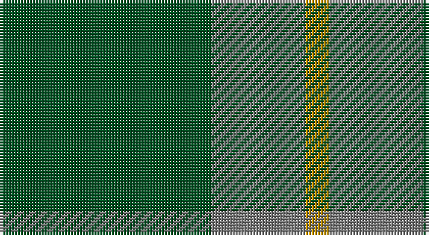

This page is one **sett** — a single exact thread-count. It belongs to the [tartan](/setts/dg9y4lo1/)
(the same proportion at any scale), whose colour order is pattern [GGY](/stripes/ggy/).

Sourced from register-of-tartans.  It is a [3 stripe tartan](/stripes/stripes3/).

Original link https://www.tartanregister.gov.uk/tartanDetails.aspx?ref=2079

## Register references

External register numbers recorded for this tartan.

- Scottish Register of Tartans: [2079](https://www.tartanregister.gov.uk/tartanDetails.aspx?ref=2079)
- Scottish Tartans Authority (ITI): 835
- Scottish Tartans World Register: 835

## Thread count
G/72 N32 DY/8

One full sett is **144 threads**.

## Palette

Palette: <strong>Tartan Register</strong> <small style="color:#888">(2 of 3 colours)</small>
<table><thead><tr><th>Colour</th><th>Threads</th><th>Shade</th><th>Base</th><th>OKLCh</th></tr></thead><tbody><tr><td>G/</td><td style="text-align:right;font-variant-numeric:tabular-nums">72</td><td><code style="background-color:#005020;">#005020</code> <small style="color:#888">#005020</small></td><td>G <code style="background-color:#006100;">#006100</code></td><td><small style="color:#888">oklch(37.7% 0.105 149.6)</small></td></tr><tr><td>N</td><td style="text-align:right;font-variant-numeric:tabular-nums">32</td><td><code style="background-color:#808080;">#808080</code> <small style="color:#888">#808080</small></td><td>G <code style="background-color:#006100;">#006100</code></td><td><small style="color:#888">oklch(60.0% 0.000 89.9)</small></td></tr><tr><td>DY/</td><td style="text-align:right;font-variant-numeric:tabular-nums">8</td><td><code style="background-color:#C89600;">#C89600</code> <small style="color:#888">#C89600</small></td><td>Y <code style="background-color:#F2BF00;">#F2BF00</code></td><td><small style="color:#888">oklch(70.2% 0.144 84.7)</small></td></tr></tbody></table>

# Sample pattern

## Nearest tartans

The nearest existing variants by ΔTartan distance, with this tartan at the top so the swatches line up against it.

ΔTartan

Tartan

Sett

—

<a href="/ttd/edit/#slug=dg9y4lo1~x8">Ledford</a> <a class="nn-out" href="/variants/s3/dg9y4lo1~x8/" title="open its dictionary page">↗</a>

0.78

<a href="/ttd/edit/#slug=g9o4ly1~x4&amp;base=dg9y4lo1~x8">Ledford Family Tartan</a> <a class="nn-out" href="/variants/s3/g9o4ly1~x4/" title="open its dictionary page">↗</a>

1.07

<a href="/ttd/edit/#slug=g9o20g40w5~x2&amp;base=dg9y4lo1~x8">O'Neill (Australia) (Name)</a> <a class="nn-out" href="/variants/s4/g9o20g40w5~x2/" title="open its dictionary page">↗</a>

1.19

<a href="/ttd/edit/#slug=g9o20g46lg5~x2&amp;base=dg9y4lo1~x8">O'Neill, Red (Corporate?)</a> <a class="nn-out" href="/variants/s4/g9o20g46lg5~x2/" title="open its dictionary page">↗</a>

1.53

<a href="/ttd/edit/#slug=g9r2t2~x4&amp;base=dg9y4lo1~x8">Wilson's, No 212</a> <a class="nn-out" href="/variants/s3/g9r2t2~x4/" title="open its dictionary page">↗</a>

1.61

<a href="/variants/s4/g6db2g1~x4/">Montgomery</a>

1.61

<a href="/variants/s4/g6db2g1~x8/">Montgomery - 1842 (VS</a>

1.64

<a href="/ttd/edit/#slug=dg12db3ly1~x4&amp;base=dg9y4lo1~x8">Unidentified pattern #2</a> <a class="nn-out" href="/variants/s3/dg12db3ly1~x4/" title="open its dictionary page">↗</a>

1.67

<a href="/ttd/edit/#slug=g30k20g3~x2&amp;base=dg9y4lo1~x8">Scotch Tape (Corporate)</a> <a class="nn-out" href="/variants/s3/g30k20g3~x2/" title="open its dictionary page">↗</a>

1.68

<a href="/ttd/edit/#slug=dp7g23r3g7~x2&amp;base=dg9y4lo1~x8">Highland Spring (1997) (Corporate)</a> <a class="nn-out" href="/variants/s4/dp7g23r3g7~x2/" title="open its dictionary page">↗</a>

1.69

<a href="/ttd/edit/#slug=g9n1g2k4g2~x4&amp;base=dg9y4lo1~x8">Peterhead (Personal)</a> <a class="nn-out" href="/variants/s5/g9n1g2k4g2~x4/" title="open its dictionary page">↗</a>

## Neighbour map

Every grey dot is one of 14360 variants placed by the first two principal components of the ΔTartan feature space (44% of its variance). Red is this tartan; blue dots are its nearest — click one to open its page.

<svg viewBox="0 0 640 380" role="img" style="max-width:100%;height:auto;border:1px solid #e0e0e0;border-radius:4px;display:block" xmlns="http://www.w3.org/2000/svg"><image href="/nn/cloud.v1.png" width="640" height="380"/><a href="/variants/s3/g9o4ly1~x4/"><circle cx="415.3" cy="304.2" r="4" fill="#3465a4"><title>Ledford Family Tartan</title></circle></a><a href="/variants/s4/g9o20g40w5~x2/"><circle cx="412.5" cy="287.6" r="4" fill="#3465a4"><title>O'Neill (Australia) (Name)</title></circle></a><a href="/variants/s4/g9o20g46lg5~x2/"><circle cx="463.0" cy="289.0" r="4" fill="#3465a4"><title>O'Neill, Red (Corporate?)</title></circle></a><a href="/variants/s3/g9r2t2~x4/"><circle cx="414.2" cy="319.4" r="4" fill="#3465a4"><title>Wilson's, No 212</title></circle></a><a href="/variants/s4/g6db2g1~x4/"><circle cx="426.2" cy="331.6" r="4" fill="#3465a4"><title>Montgomery</title></circle></a><a href="/variants/s4/g6db2g1~x8/"><circle cx="426.2" cy="331.6" r="4" fill="#3465a4"><title>Montgomery - 1842 (VS</title></circle></a><a href="/variants/s3/dg12db3ly1~x4/"><circle cx="515.7" cy="287.1" r="4" fill="#3465a4"><title>Unidentified pattern #2</title></circle></a><a href="/variants/s3/g30k20g3~x2/"><circle cx="419.8" cy="324.6" r="4" fill="#3465a4"><title>Scotch Tape (Corporate)</title></circle></a><a href="/variants/s4/dp7g23r3g7~x2/"><circle cx="471.0" cy="290.0" r="4" fill="#3465a4"><title>Highland Spring (1997) (Corporate)</title></circle></a><a href="/variants/s5/g9n1g2k4g2~x4/"><circle cx="461.0" cy="275.1" r="4" fill="#3465a4"><title>Peterhead (Personal)</title></circle></a><circle cx="421.0" cy="307.3" r="5" fill="#c00000"/></svg>

ID: /variants/s3/dg9y4lo1~x8/
