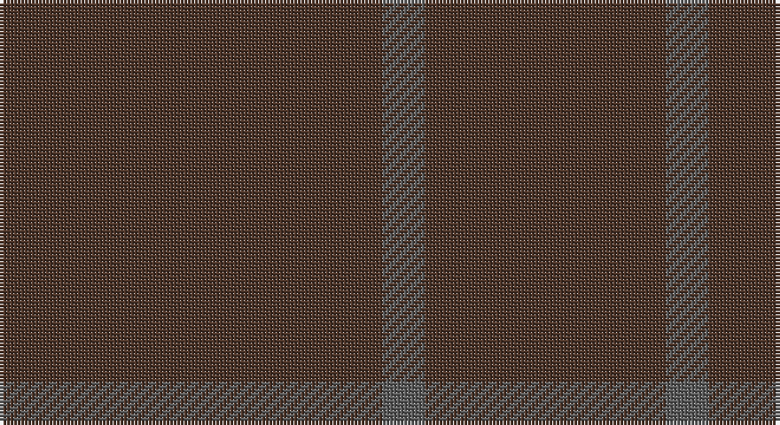

This page is one **sett** — a single exact thread-count. It belongs to the [tartan](/setts/do27n3do17/)
(the same proportion at any scale), whose colour order is pattern [BBB](/stripes/bbb/).

Part of the [Outlander](/tartans/outlander/) tartan — the named design grouping this sett with its other cloths.

Sourced from register-of-tartans.  It is a [3 stripe tartan](/stripes/stripes3/).

Original link https://www.tartanregister.gov.uk/tartanDetails.aspx?ref=11116

## Also known as

This cloth is also recorded under:

- Outlander #1
- Outlander #2
- Outlander #3
- Outlander #4
- Outlander #5

## Register references

External register numbers recorded for this tartan.

- Scottish Register of Tartans: [11116](https://www.tartanregister.gov.uk/tartanDetails.aspx?ref=11116)

## Thread count
T/108 N12 T/68

One full sett is **200 threads**.

## Palette

Palette: <strong>Tartan Register</strong> <small style="color:#888">(1 of 2 colours)</small>
<table><thead><tr><th>Colour</th><th>Threads</th><th>Shade</th><th>Base</th><th>OKLCh</th></tr></thead><tbody><tr><td>T/</td><td style="text-align:right;font-variant-numeric:tabular-nums">108</td><td><code style="background-color:#4C3428;">#4C3428</code> <small style="color:#888">#4C3428</small></td><td>B <code style="background-color:#2A418A;">#2A418A</code></td><td><small style="color:#888">oklch(34.9% 0.040 47.5)</small></td></tr><tr><td>N</td><td style="text-align:right;font-variant-numeric:tabular-nums">12</td><td><code style="background-color:#5C5C5C;">#5C5C5C</code> <small style="color:#888">#5C5C5C</small></td><td>B <code style="background-color:#2A418A;">#2A418A</code></td><td><small style="color:#888">oklch(47.5% 0.000 89.9)</small></td></tr><tr><td>T/</td><td style="text-align:right;font-variant-numeric:tabular-nums">68</td><td><code style="background-color:#4C3428;">#4C3428</code> <small style="color:#888">#4C3428</small></td><td>B <code style="background-color:#2A418A;">#2A418A</code></td><td><small style="color:#888">oklch(34.9% 0.040 47.5)</small></td></tr></tbody></table>

# Sample pattern

## Compared to the master

This cloth is one sett of its design; the master sett (the exemplar the design is anchored on) is below for comparison.

<figure style="margin:0"><figcaption style="color:#888;font-size:smaller">this sett</figcaption></figure>
<figure style="margin:0"><figcaption style="color:#888;font-size:smaller"><a href="/setts/n13do15n2/">master sett →</a></figcaption></figure>

## Nearest tartans

The nearest existing variants by ΔTartan distance, with this tartan at the top so the swatches line up against it.

ΔTartan

Tartan

Sett

—

<a href="/ttd/edit/#slug=do27n3do17~x4">Outlander #4</a> <a class="nn-out" href="/variants/s3/do27n3do17~x4/" title="open its dictionary page">↗</a>

2.02

<a href="/ttd/edit/#slug=dy9n1~x12&amp;base=do27n3do17~x4">Outlander #4</a> <a class="nn-out" href="/variants/s2/dy9n1~x12/" title="open its dictionary page">↗</a>

2.99

<a href="/ttd/edit/#slug=dy16y3dy2~x10&amp;base=do27n3do17~x4">Hallstatt (Artefact)</a> <a class="nn-out" href="/variants/s3/dy16y3dy2~x10/" title="open its dictionary page">↗</a>

3.19

<a href="/ttd/edit/#slug=dt4k2dt16k2dt16k1~x4&amp;base=do27n3do17~x4">Ben Dubh (The Black Mount)</a> <a class="nn-out" href="/variants/s6/dt4k2dt16k2dt16k1~x4/" title="open its dictionary page">↗</a>

3.49

<a href="/ttd/edit/#slug=db12k1~x10&amp;base=do27n3do17~x4">Staines</a> <a class="nn-out" href="/variants/s2/db12k1~x10/" title="open its dictionary page">↗</a>

3.55

<a href="/ttd/edit/#slug=do5k2do28k10do26k4do4~x2&amp;base=do27n3do17~x4">Dunbar, John Telfer (Personal)</a> <a class="nn-out" href="/variants/s7/do5k2do28k10do26k4do4~x2/" title="open its dictionary page">↗</a>

4.05

<a href="/ttd/edit/#slug=n2y3n3y3n10y2n18y1~x4&amp;base=do27n3do17~x4">Hebridean Cairn Fashion Tartan</a> <a class="nn-out" href="/variants/s8/n2y3n3y3n10y2n18y1~x4/" title="open its dictionary page">↗</a>

4.63

<a href="/ttd/edit/#slug=n2o3n3o3n10o2n18o1~x4&amp;base=do27n3do17~x4">Hebridean Cairn (Fashion)</a> <a class="nn-out" href="/variants/s8/n2o3n3o3n10o2n18o1~x4/" title="open its dictionary page">↗</a>

4.72

<a href="/ttd/edit/#slug=loi81g6lo8g8~x2&amp;base=do27n3do17~x4">Young in Australia (Name)</a> <a class="nn-out" href="/variants/s4/loi81g6lo8g8~x2/" title="open its dictionary page">↗</a>

## Neighbour map

Every grey dot is one of 14360 variants placed by the first two principal components of the ΔTartan feature space (44% of its variance). Red is this tartan; blue dots are its nearest — click one to open its page.

<svg viewBox="0 0 640 380" role="img" style="max-width:100%;height:auto;border:1px solid #e0e0e0;border-radius:4px;display:block" xmlns="http://www.w3.org/2000/svg"><image href="/nn/cloud.v1.png" width="640" height="380"/><a href="/variants/s2/dy9n1~x12/"><circle cx="626.0" cy="366.0" r="4" fill="#3465a4"><title>Outlander #4</title></circle></a><a href="/variants/s3/dy16y3dy2~x10/"><circle cx="626.0" cy="366.0" r="4" fill="#3465a4"><title>Hallstatt (Artefact)</title></circle></a><a href="/variants/s6/dt4k2dt16k2dt16k1~x4/"><circle cx="626.0" cy="366.0" r="4" fill="#3465a4"><title>Ben Dubh (The Black Mount)</title></circle></a><a href="/variants/s2/db12k1~x10/"><circle cx="626.0" cy="366.0" r="4" fill="#3465a4"><title>Staines</title></circle></a><a href="/variants/s7/do5k2do28k10do26k4do4~x2/"><circle cx="626.0" cy="356.0" r="4" fill="#3465a4"><title>Dunbar, John Telfer (Personal)</title></circle></a><a href="/variants/s8/n2y3n3y3n10y2n18y1~x4/"><circle cx="626.0" cy="322.2" r="4" fill="#3465a4"><title>Hebridean Cairn Fashion Tartan</title></circle></a><a href="/variants/s8/n2o3n3o3n10o2n18o1~x4/"><circle cx="626.0" cy="297.6" r="4" fill="#3465a4"><title>Hebridean Cairn (Fashion)</title></circle></a><a href="/variants/s4/loi81g6lo8g8~x2/"><circle cx="626.0" cy="313.4" r="4" fill="#3465a4"><title>Young in Australia (Name)</title></circle></a><circle cx="626.0" cy="366.0" r="5" fill="#c00000"/></svg>

ID: /variants/s3/do27n3do17~x4/
