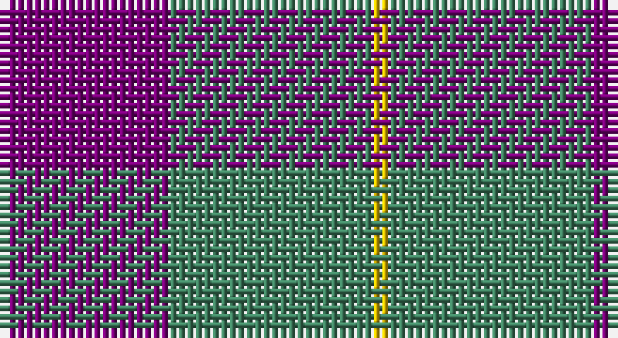

This page is one **sett** — a single exact thread-count. It belongs to the [tartan](/setts/dp10g12ly1/)
(the same proportion at any scale), whose colour order is pattern [BGY](/stripes/bgy/).

Sourced from register-of-tartans.  It is a [3 stripe tartan](/stripes/stripes3/).

Original link https://www.tartanregister.gov.uk/tartanDetails.aspx?ref=4668

## Register references

External register numbers recorded for this tartan.

- Scottish Register of Tartans: [4668](https://www.tartanregister.gov.uk/tartanDetails.aspx?ref=4668)
- Scottish Tartans Authority (ITI): 1936
- Scottish Tartans World Register: 1936

## Thread count
P/20 Ga24 Ya/2

One full sett is **70 threads**.

## Palette

Palette: <strong>Tartan Register</strong>
<table><thead><tr><th>Colour</th><th>Threads</th><th>Shade</th><th>Base</th><th>OKLCh</th></tr></thead><tbody><tr><td>P/</td><td style="text-align:right;font-variant-numeric:tabular-nums">20</td><td><code style="background-color:#780078;">#780078</code> <small style="color:#888">#780078</small></td><td>B <code style="background-color:#2A418A;">#2A418A</code></td><td><small style="color:#888">oklch(40.2% 0.185 328.4)</small></td></tr><tr><td>Ga</td><td style="text-align:right;font-variant-numeric:tabular-nums">24</td><td><code style="background-color:#408060;">#408060</code> <small style="color:#888">#408060</small></td><td>G <code style="background-color:#006100;">#006100</code></td><td><small style="color:#888">oklch(54.8% 0.084 160.1)</small></td></tr><tr><td>Ya/</td><td style="text-align:right;font-variant-numeric:tabular-nums">2</td><td><code style="background-color:#E8C000;">#E8C000</code> <small style="color:#888">#E8C000</small></td><td>Y <code style="background-color:#F2BF00;">#F2BF00</code></td><td><small style="color:#888">oklch(81.9% 0.168 93.7)</small></td></tr></tbody></table>

# Sample pattern

## Nearest tartans

The nearest existing variants by ΔTartan distance, with this tartan at the top so the swatches line up against it.

ΔTartan

Tartan

Sett

—

<a href="/ttd/edit/#slug=dp10g12ly1~x2">Wilson's No.081</a> <a class="nn-out" href="/variants/s3/dp10g12ly1~x2/" title="open its dictionary page">↗</a>

1.26

<a href="/ttd/edit/#slug=db3lo30db40r3~x2&amp;base=dp10g12ly1~x2">Sanix Large Muted</a> <a class="nn-out" href="/variants/s4/db3lo30db40r3~x2/" title="open its dictionary page">↗</a>

1.50

<a href="/ttd/edit/#slug=g6p5t1~x4&amp;base=dp10g12ly1~x2">Wilson's, No 55</a> <a class="nn-out" href="/variants/s3/g6p5t1~x4/" title="open its dictionary page">↗</a>

1.65

<a href="/ttd/edit/#slug=db6r1db6r9w1~x2&amp;base=dp10g12ly1~x2">Hamilton, (Red)</a> <a class="nn-out" href="/variants/s5/db6r1db6r9w1~x2/" title="open its dictionary page">↗</a>

1.74

<a href="/ttd/edit/#slug=k19lo1n19~x8&amp;base=dp10g12ly1~x2">Wcwm 9275-1394</a> <a class="nn-out" href="/variants/s3/k19lo1n19~x8/" title="open its dictionary page">↗</a>

1.78

<a href="/ttd/edit/#slug=dp23dg8dp23dg35w5~x2&amp;base=dp10g12ly1~x2">Baru</a> <a class="nn-out" href="/variants/s5/dp23dg8dp23dg35w5~x2/" title="open its dictionary page">↗</a>

1.79

<a href="/ttd/edit/#slug=o24r11k6db4~x4&amp;base=dp10g12ly1~x2">Nebar (Corporate)</a> <a class="nn-out" href="/variants/s4/o24r11k6db4~x4/" title="open its dictionary page">↗</a>

1.83

<a href="/ttd/edit/#slug=t3dg1t10dg4r10t2~x4&amp;base=dp10g12ly1~x2">Rob Roy (Film)</a> <a class="nn-out" href="/variants/s6/t3dg1t10dg4r10t2~x4/" title="open its dictionary page">↗</a>

1.83

<a href="/ttd/edit/#slug=g17r2db15~x2&amp;base=dp10g12ly1~x2">Ferguson - 1930 (Old)</a> <a class="nn-out" href="/variants/s3/g17r2db15~x2/" title="open its dictionary page">↗</a>

1.85

<a href="/ttd/edit/#slug=g6dp5t1~x4&amp;base=dp10g12ly1~x2">Wilson's No.055</a> <a class="nn-out" href="/variants/s3/g6dp5t1~x4/" title="open its dictionary page">↗</a>

1.86

<a href="/ttd/edit/#slug=dg15r3dp11lb2&amp;base=dp10g12ly1~x2">MacNab WI2</a> <a class="nn-out" href="/variants/s4/dg15r3dp11lb2/" title="open its dictionary page">↗</a>

## Neighbour map

Every grey dot is one of 14360 variants placed by the first two principal components of the ΔTartan feature space (44% of its variance). Red is this tartan; blue dots are its nearest — click one to open its page.

<svg viewBox="0 0 640 380" role="img" style="max-width:100%;height:auto;border:1px solid #e0e0e0;border-radius:4px;display:block" xmlns="http://www.w3.org/2000/svg"><image href="/nn/cloud.v1.png" width="640" height="380"/><a href="/variants/s4/db3lo30db40r3~x2/"><circle cx="370.8" cy="230.5" r="4" fill="#3465a4"><title>Sanix Large Muted</title></circle></a><a href="/variants/s3/g6p5t1~x4/"><circle cx="273.3" cy="305.8" r="4" fill="#3465a4"><title>Wilson's, No 55</title></circle></a><a href="/variants/s5/db6r1db6r9w1~x2/"><circle cx="331.8" cy="251.8" r="4" fill="#3465a4"><title>Hamilton, (Red)</title></circle></a><a href="/variants/s3/k19lo1n19~x8/"><circle cx="365.5" cy="272.5" r="4" fill="#3465a4"><title>Wcwm 9275-1394</title></circle></a><a href="/variants/s5/dp23dg8dp23dg35w5~x2/"><circle cx="292.8" cy="279.1" r="4" fill="#3465a4"><title>Baru</title></circle></a><a href="/variants/s4/o24r11k6db4~x4/"><circle cx="267.9" cy="259.5" r="4" fill="#3465a4"><title>Nebar (Corporate)</title></circle></a><a href="/variants/s6/t3dg1t10dg4r10t2~x4/"><circle cx="313.9" cy="247.8" r="4" fill="#3465a4"><title>Rob Roy (Film)</title></circle></a><a href="/variants/s3/g17r2db15~x2/"><circle cx="326.6" cy="314.4" r="4" fill="#3465a4"><title>Ferguson - 1930 (Old)</title></circle></a><a href="/variants/s3/g6dp5t1~x4/"><circle cx="289.6" cy="320.4" r="4" fill="#3465a4"><title>Wilson's No.055</title></circle></a><a href="/variants/s4/dg15r3dp11lb2/"><circle cx="252.9" cy="255.8" r="4" fill="#3465a4"><title>MacNab WI2</title></circle></a><circle cx="343.1" cy="276.0" r="5" fill="#c00000"/></svg>

ID: /variants/s3/dp10g12ly1~x2/
