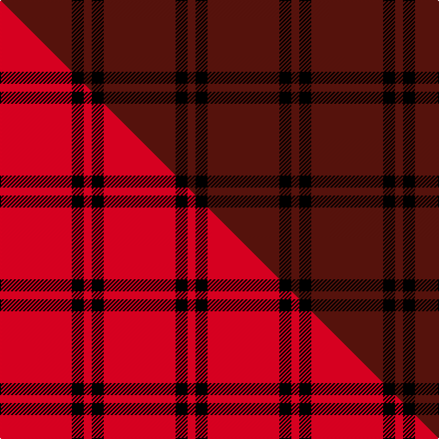

This page is one **sett** — a single exact thread-count. It belongs to the [tartan](/setts/dr18k3dr2/)
(the same proportion at any scale), whose colour order is pattern [BKB](/stripes/bkb/).

Part of the [Buie](/tartans/buie/) tartan — the named design grouping this sett with its other cloths.

Sourced from weddslist.  It is a [3 stripe tartan](/stripes/stripes3/).

Original link http://www.weddslist.com/cgi-bin/tartans/pg.pl?source=sts

## Thread count
DR/72 K12 DR/8

One full sett is **104 threads**.

## Palette
<table><thead><tr><th>Colour</th><th>Shade</th><th>OKLCh</th></tr></thead><tbody><tr><td>DR</td><td><code style="background-color:#55120C;">#55120C</code> <small style="color:#888">#55120C</small></td><td><small style="color:#888">oklch(30.0% 0.099 29.3)</small></td></tr><tr><td>K</td><td><code style="background-color:#000000;">#000000</code> <small style="color:#888">#000000</small></td><td><small style="color:#888">oklch(0.0% 0.000 0.0)</small></td></tr></tbody></table>

# Sample pattern

## Compared to the master

This cloth is one sett of its design; the master sett (the exemplar the design is anchored on) is below for comparison.

Its **ΔTartan distance** from the master is **0.23** — the same measure the nearest-tartans table ranks by (0 is identical; a re-scale of the same cloth is near 0, a recolour or a different proportion further).

<figure class="master-compare" style="margin:0">

this sett
master sett ★

<figcaption style="color:#888;font-size:smaller">One weave of this sett against the <a href="/setts/r18k3r2/">master sett ★</a>, split on the diagonal: a shared proportion runs seamlessly across it with only the shades shifting; a different proportion breaks on it.</figcaption>
</figure>

## Nearest tartan variants

The nearest existing variants by ΔTartan distance, with this cloth at the top so the swatches line up against it.

ΔTartan

Threads

Variant

Sett

—

104

<a href="/variants/s3/dr18k3dr2~x4/">Buie</a>

<a href="/ttd/edit/#slug=r18k3r2~x4&amp;base=dr18k3dr2~x4" title="compare in the TTD">0.23</a>

104

<a href="/variants/s3/r18k3r2~x4/">Buie</a>

<a href="/ttd/edit/#slug=r2k50n2r1~x2&amp;base=dr18k3dr2~x4" title="compare in the TTD">0.91</a>

214

<a href="/variants/s4/r2k50n2r1~x2/">Galloway Family</a>

<a href="/ttd/edit/#slug=r27w3r6w2dg3~x4~r1506028&amp;base=dr18k3dr2~x4" title="compare in the TTD">1.01</a>

208

<a href="/variants/s5/r27w3r6w2dg3~x4~r1506028/">Martin Family, Robert N Personal Tartan</a>

<a href="/ttd/edit/#slug=r12w1r2o1n3~x4~o2500000-n1900000&amp;base=dr18k3dr2~x4" title="compare in the TTD">1.28</a>

92

<a href="/variants/s5/r12w1r2o1n3~x4~o2500000-n1900000/">Glen Shee Plaid (Fashion)</a>

<a href="/ttd/edit/#slug=dr9lr1~x20&amp;base=dr18k3dr2~x4" title="compare in the TTD">1.30</a>

200

<a href="/variants/s2/dr9lr1~x20/">Roddy &quot;Rowdy&quot; Piper (Personal)</a>

<a href="/ttd/edit/#slug=dy1r9db2r9db1~x4&amp;base=dr18k3dr2~x4" title="compare in the TTD">1.31</a>

168

<a href="/variants/s5/dy1r9db2r9db1~x4/">Brooks Brothers Tattersall Red</a>

<a href="/ttd/edit/#slug=db1dr9db2dr9ly1~x4&amp;base=dr18k3dr2~x4" title="compare in the TTD">1.31</a>

168

<a href="/variants/s5/db1dr9db2dr9ly1~x4/">Brooks Bros Tattersall Red (Fashion)</a>

<a href="/ttd/edit/#slug=dr8w1k1~x20&amp;base=dr18k3dr2~x4" title="compare in the TTD">1.58</a>

220

<a href="/variants/s3/dr8w1k1~x20/">International Karate Fed. (Corporat)</a>

<a href="/ttd/edit/#slug=r1n19w1~x2&amp;base=dr18k3dr2~x4" title="compare in the TTD">1.60</a>

80

<a href="/variants/s3/r1n19w1~x2/">Dunbar of Pitgaveny (Clan)</a>

<a href="/ttd/edit/#slug=k12dr7k1dr9~x4&amp;base=dr18k3dr2~x4" title="compare in the TTD">1.69</a>

148

<a href="/variants/s4/k12dr7k1dr9~x4/">Lendrum (Black &amp; Red) or MacFarlane</a>

## Neighbour map

Every grey dot is one of 13620 variants placed by the first two principal components of the ΔTartan feature space (42% of its variance). Red is this tartan; blue dots are its nearest — click one to open its page.

<svg viewBox="0 0 640 380" role="img" style="max-width:100%;height:auto;border:1px solid #e0e0e0;border-radius:4px;display:block" xmlns="http://www.w3.org/2000/svg"><image href="/nn/cloud.v1.png" width="640" height="380"/><a href="/variants/s3/r18k3r2~x4/"><circle cx="565.2" cy="218.8" r="4" fill="#3465a4"><title>Buie</title></circle></a><a href="/variants/s4/r2k50n2r1~x2/"><circle cx="626.0" cy="116.8" r="4" fill="#3465a4"><title>Galloway Family</title></circle></a><a href="/variants/s5/r27w3r6w2dg3~x4~r1506028/"><circle cx="521.0" cy="181.2" r="4" fill="#3465a4"><title>Martin Family, Robert N Personal Tartan</title></circle></a><a href="/variants/s5/r12w1r2o1n3~x4~o2500000-n1900000/"><circle cx="516.2" cy="195.9" r="4" fill="#3465a4"><title>Glen Shee Plaid (Fashion)</title></circle></a><a href="/variants/s2/dr9lr1~x20/"><circle cx="626.0" cy="311.8" r="4" fill="#3465a4"><title>Roddy &quot;Rowdy&quot; Piper (Personal)</title></circle></a><a href="/variants/s5/dy1r9db2r9db1~x4/"><circle cx="554.1" cy="226.3" r="4" fill="#3465a4"><title>Brooks Brothers Tattersall Red</title></circle></a><a href="/variants/s5/db1dr9db2dr9ly1~x4/"><circle cx="621.4" cy="273.6" r="4" fill="#3465a4"><title>Brooks Bros Tattersall Red (Fashion)</title></circle></a><a href="/variants/s3/dr8w1k1~x20/"><circle cx="472.2" cy="218.9" r="4" fill="#3465a4"><title>International Karate Fed. (Corporat)</title></circle></a><a href="/variants/s3/r1n19w1~x2/"><circle cx="626.0" cy="223.5" r="4" fill="#3465a4"><title>Dunbar of Pitgaveny (Clan)</title></circle></a><a href="/variants/s4/k12dr7k1dr9~x4/"><circle cx="394.9" cy="272.9" r="4" fill="#3465a4"><title>Lendrum (Black &amp; Red) or MacFarlane</title></circle></a><circle cx="626.0" cy="264.6" r="5" fill="#c00000"/><text x="320" y="376" text-anchor="middle" font-size="11" fill="#999">ground</text><text x="11" y="190" text-anchor="middle" font-size="11" fill="#999" transform="rotate(-90 11 190)">complexity</text></svg>

ID: /variants/s3/dr18k3dr2~x4/
