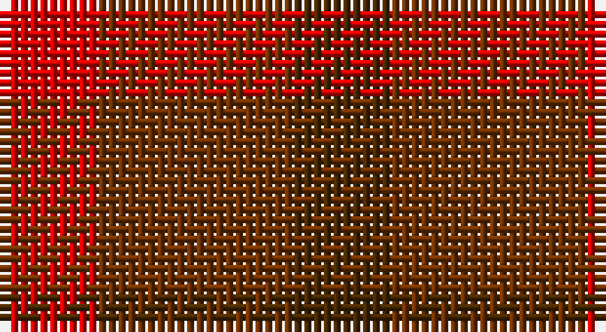

This page is one **sett** — a single exact thread-count. It belongs to the [tartan](/setts/dy1dyi2r1/)
(the same proportion at any scale), whose colour order is pattern [GGR](/stripes/ggr/).

Sourced from register-of-tartans.  It is a [3 stripe tartan](/stripes/stripes3/).

Original link https://www.tartanregister.gov.uk/tartanDetails.aspx?ref=1426

## Register references

External register numbers recorded for this tartan.

- Scottish Register of Tartans: [1426](https://www.tartanregister.gov.uk/tartanDetails.aspx?ref=1426)
- Scottish Tartans World Register: 1663

## Thread count
R/10 Ta20 T/10

One full sett is **60 threads**.

## Palette

Palette: <strong>Logan (The Scottish Gael, 1831)</strong> <small style="color:#888">(1 of 3 colours)</small>
<table><thead><tr><th>Colour</th><th>Threads</th><th>Shade</th><th>Base</th><th>OKLCh</th></tr></thead><tbody><tr><td>R/</td><td style="text-align:right;font-variant-numeric:tabular-nums">10</td><td><code style="background-color:#DC0000;">#DC0000</code> <small style="color:#888">#DC0000</small></td><td>R <code style="background-color:#CC0000;">#CC0000</code></td><td><small style="color:#888">oklch(56.2% 0.230 29.2)</small></td></tr><tr><td>Ta</td><td style="text-align:right;font-variant-numeric:tabular-nums">20</td><td><code style="background-color:#703200;">#703200</code> <small style="color:#888">#703200</small></td><td>G <code style="background-color:#006100;">#006100</code></td><td><small style="color:#888">oklch(39.5% 0.103 50.8)</small></td></tr><tr><td>T/</td><td style="text-align:right;font-variant-numeric:tabular-nums">10</td><td><code style="background-color:#482800;">#482800</code> <small style="color:#888">#482800</small></td><td>G <code style="background-color:#006100;">#006100</code></td><td><small style="color:#888">oklch(31.1% 0.070 65.5)</small></td></tr></tbody></table>

# Sample pattern

## Nearest tartans

The nearest existing variants by ΔTartan distance, with this tartan at the top so the swatches line up against it.

ΔTartan

Tartan

Sett

—

<a href="/ttd/edit/#slug=dy1dyi2r1~x10">Glenmorangie Check</a> <a class="nn-out" href="/variants/s3/dy1dyi2r1~x10/" title="open its dictionary page">↗</a>

0.76

<a href="/ttd/edit/#slug=dr1dri2r1~x10&amp;base=dy1dyi2r1~x10">Glenmorangie Check Corporate Tartan</a> <a class="nn-out" href="/variants/s3/dr1dri2r1~x10/" title="open its dictionary page">↗</a>

1.92

<a href="/ttd/edit/#slug=dy1lo2r1~x10&amp;base=dy1dyi2r1~x10">Glenmorangie Check (Corporate)</a> <a class="nn-out" href="/variants/s3/dy1lo2r1~x10/" title="open its dictionary page">↗</a>

2.83

<a href="/ttd/edit/#slug=r10t5o5n4~x8&amp;base=dy1dyi2r1~x10">Haggis Hostels</a> <a class="nn-out" href="/variants/s4/r10t5o5n4~x8/" title="open its dictionary page">↗</a>

2.89

<a href="/ttd/edit/#slug=dr1ri3r1g1dp1~x8&amp;base=dy1dyi2r1~x10">Blairgowrie Berries and Cherries</a> <a class="nn-out" href="/variants/s5/dr1ri3r1g1dp1~x8/" title="open its dictionary page">↗</a>

2.93

<a href="/ttd/edit/#slug=dy2t1lo1~x2&amp;base=dy1dyi2r1~x10">Gearach Woodcock Tweed (Corporate)</a> <a class="nn-out" href="/variants/s3/dy2t1lo1~x2/" title="open its dictionary page">↗</a>

3.04

<a href="/ttd/edit/#slug=r4dg1yi6y3r2~x8&amp;base=dy1dyi2r1~x10">Belladrum Estate</a> <a class="nn-out" href="/variants/s5/r4dg1yi6y3r2~x8/" title="open its dictionary page">↗</a>

3.09

<a href="/ttd/edit/#slug=dr1ri3r1y1dp1~x4&amp;base=dy1dyi2r1~x10">Blairgowrie Berries and Cherries</a> <a class="nn-out" href="/variants/s5/dr1ri3r1y1dp1~x4/" title="open its dictionary page">↗</a>

3.14

<a href="/ttd/edit/#slug=r3dg3r1db3r3~x12&amp;base=dy1dyi2r1~x10">Gow (Portrait)</a> <a class="nn-out" href="/variants/s5/r3dg3r1db3r3~x12/" title="open its dictionary page">↗</a>

3.19

<a href="/ttd/edit/#slug=n16r2n10r14t5~x2&amp;base=dy1dyi2r1~x10">Mowbray (Personal)</a> <a class="nn-out" href="/variants/s5/n16r2n10r14t5~x2/" title="open its dictionary page">↗</a>

3.31

<a href="/ttd/edit/#slug=dy1db3dy1dg3dy4r1~x2&amp;base=dy1dyi2r1~x10">Fraser Hunting #2</a> <a class="nn-out" href="/variants/s6/dy1db3dy1dg3dy4r1~x2/" title="open its dictionary page">↗</a>

## Neighbour map

Every grey dot is one of 14360 variants placed by the first two principal components of the ΔTartan feature space (44% of its variance). Red is this tartan; blue dots are its nearest — click one to open its page.

<svg viewBox="0 0 640 380" role="img" style="max-width:100%;height:auto;border:1px solid #e0e0e0;border-radius:4px;display:block" xmlns="http://www.w3.org/2000/svg"><image href="/nn/cloud.v1.png" width="640" height="380"/><a href="/variants/s3/dr1dri2r1~x10/"><circle cx="299.1" cy="366.0" r="4" fill="#3465a4"><title>Glenmorangie Check Corporate Tartan</title></circle></a><a href="/variants/s3/dy1lo2r1~x10/"><circle cx="252.7" cy="366.0" r="4" fill="#3465a4"><title>Glenmorangie Check (Corporate)</title></circle></a><a href="/variants/s4/r10t5o5n4~x8/"><circle cx="178.2" cy="345.6" r="4" fill="#3465a4"><title>Haggis Hostels</title></circle></a><a href="/variants/s5/dr1ri3r1g1dp1~x8/"><circle cx="227.9" cy="310.2" r="4" fill="#3465a4"><title>Blairgowrie Berries and Cherries</title></circle></a><a href="/variants/s3/dy2t1lo1~x2/"><circle cx="224.3" cy="366.0" r="4" fill="#3465a4"><title>Gearach Woodcock Tweed (Corporate)</title></circle></a><a href="/variants/s5/r4dg1yi6y3r2~x8/"><circle cx="273.9" cy="315.9" r="4" fill="#3465a4"><title>Belladrum Estate</title></circle></a><a href="/variants/s5/dr1ri3r1y1dp1~x4/"><circle cx="210.0" cy="296.8" r="4" fill="#3465a4"><title>Blairgowrie Berries and Cherries</title></circle></a><a href="/variants/s5/r3dg3r1db3r3~x12/"><circle cx="240.4" cy="344.0" r="4" fill="#3465a4"><title>Gow (Portrait)</title></circle></a><a href="/variants/s5/n16r2n10r14t5~x2/"><circle cx="397.5" cy="318.7" r="4" fill="#3465a4"><title>Mowbray (Personal)</title></circle></a><a href="/variants/s6/dy1db3dy1dg3dy4r1~x2/"><circle cx="271.2" cy="324.6" r="4" fill="#3465a4"><title>Fraser Hunting #2</title></circle></a><circle cx="295.7" cy="366.0" r="5" fill="#c00000"/></svg>

ID: /variants/s3/dy1dyi2r1~x10/
