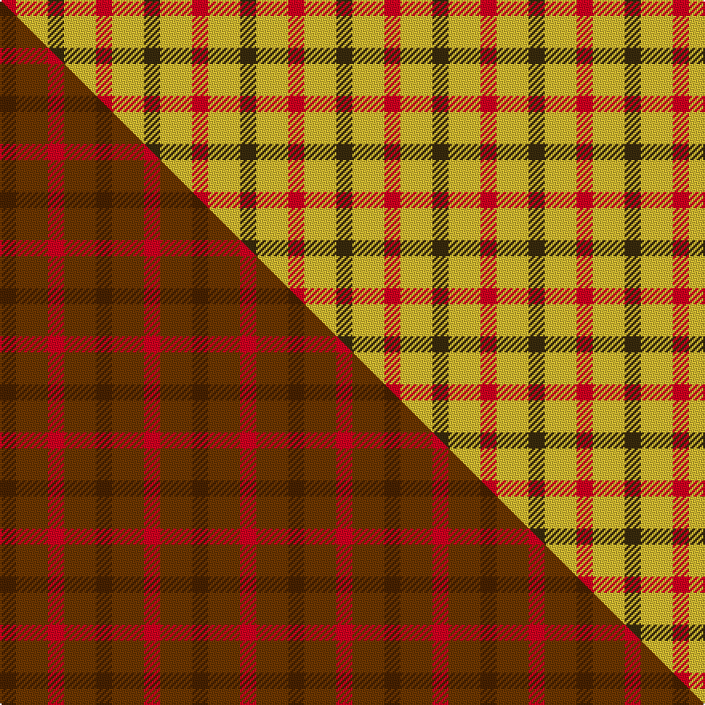

This is one **variant** — a specific cloth: this exact thread count and colourway, with its own
provenance below. It is one weaving of the [sett](/tartans/g/gl/glenmorangie-check/) (the scale-free proportion — the
same cloth at any scale or shade), whose colour order is pattern [GYR](/stripes/gyr/).

Part of the [Glenmorangie Check](/tartans/g/gl/glenmorangie-check/) tartan — the named design grouping this sett with its other cloths.

Sourced from tartans-authority.  It is a [3 stripe tartan](/stripes/stripes3/).

Original link <code>http://www.tartansauthority.com/tartan-ferret/display/5040/</code> — retired · [Internet Archive copy](https://web.archive.org/web/*/http://www.tartansauthority.com/tartan-ferret/display/5040/*)

## Provenance

Earliest known date: 1988 Accredited by the Scottish Tartans Society in 1988. Glenmorangie is a well known malt whisky.

2 attestations — the source records this cloth was collapsed from (oldest owns this page)

<ul>
<li>1988 — Glenmorangie Check (Corporate) (tartans-authority, <a href="https://web.archive.org/web/*/http://www.tartansauthority.com/tartan-ferret/display/5040/*">record</a>)  <em>Designed by Harry Lindley of Kinloch Anderson in 1988. Sample in STA's Johnston Collection. Count and colours taken from letter from Peter MacArthur dated 1988.</em></li>
<li>1988 — Glenmorangie Check Corporate Tartan (house-of-tartan, <a href="http://www.house-of-tartan.scotland.net/house/TartanViewjs.asp?colr=Def&tnam=1663">record</a>) </li>
</ul>

Dataset <small>— provenance for this record, inherited from the source manifest</small>

<dl class="dataset-prov">
<dt>source</dt><dd><a href="/sources/tartans-authority/">Scottish Tartans Authority</a></dd>
<dt>data captured from</dt><dd><a href="https://github.com/thetartan/tartan-database/blob/master/data/tartans-authority/data.csv">https://github.com/thetartan/tartan-database/blob/master/data/tartans-authority/data.csv</a></dd>
<dt>data date</dt><dd>1988 <small>(this record)</small></dd>
<dt>licence</dt><dd><a href="https://creativecommons.org/licenses/by-nc-nd/4.0/">CC BY-NC-ND 4.0</a></dd>
</dl>

Capture chain <small>— the hands this data passed through, oldest first; each capture carries its own licence</small>

<ol class="capture-chain">
<li><a href="https://www.tartansauthority.com/">Scottish Tartans Authority</a> <small>the heritage body’s archive — its tartan-ferret record browser is retired; dead record links are shown unlinked, with an Internet Archive copy (ITI numbers are not SRT references)</small></li>
<li><a href="https://github.com/thetartan/tartan-database">thetartan/tartan-database</a> <small>2016-2017</small> · <a href="https://creativecommons.org/licenses/by-nc-nd/4.0/">CC BY-NC-ND 4.0</a> <small>Levko Kravets's frozen compilation — the capture we vendored, and where its CC licence text came from</small></li>
<li>this dictionary <small>captured 2026-06-10 · commit 5bf86c7566</small> <small>each re-capture is a git commit to data/sources</small></li>
</ol>

## Register references

External register numbers recorded for this tartan.

- Scottish Tartans Authority (ITI): 5040

## Thread count
R/10 LY20 DY/10

One full sett is **60 threads**.

## Palette
<table><thead><tr><th>Colour</th><th>Shade</th><th>OKLCh</th></tr></thead><tbody><tr><td>LY</td><td><code style="background-color:#DCBC32;">#DCBC32</code> <small style="color:#888">#DCBC32</small></td><td><small style="color:#888">oklch(80.0% 0.150 95.2)</small></td></tr><tr><td>R</td><td><code style="background-color:#D60020;">#D60020</code> <small style="color:#888">#D60020</small></td><td><small style="color:#888">oklch(55.2% 0.224 25.5)</small></td></tr><tr><td>DY</td><td><code style="background-color:#3A2B0D;">#3A2B0D</code> <small style="color:#888">#3A2B0D</small></td><td><small style="color:#888">oklch(30.0% 0.049 82.0)</small></td></tr></tbody></table>

# Sample pattern

[Sample sheet (PDF)](swatch.pdf) — the woven sample, thread count and palette on one printable A4, rendered on demand (the same sheet the TTD print page downloads).

## Compared to the master

This cloth is one sett of its design; the master sett (the exemplar the design is anchored on) is below for comparison.

Its **ΔTartan distance** from the master is **3.39** — the same measure the nearest-tartans table ranks by (0 is identical; a re-scale of the same cloth is near 0, a recolour or a different proportion further).

<figure class="master-compare" style="margin:0">

this sett
master sett ★

<figcaption style="color:#888;font-size:smaller">One weave of this sett against the <a href="/setts/dy1dyi2r1/">master sett ★</a>, split on the diagonal: a shared proportion runs seamlessly across it with only the shades shifting; a different proportion breaks on it.</figcaption>
</figure>

## Nearest tartan variants

The nearest existing variants by ΔTartan distance, with this cloth at the top so the swatches line up against it.

ΔTartan

Threads

Variant

Sett

—

60

<a href="/variants/s3/dy1ly2r1~x10/">Glenmorangie Check (Corporate)</a>

<a href="/ttd/edit/#slug=y1dy5r5w1~x4&amp;base=dy1ly2r1~x10" title="compare in the TTD">1.08</a>

88

<a href="/variants/s4/y1dy5r5w1~x4/">Manx Mannin Plaid</a>

<a href="/ttd/edit/#slug=y49r16k11~x2&amp;base=dy1ly2r1~x10" title="compare in the TTD">1.96</a>

184

<a href="/variants/s3/y49r16k11~x2/">Quenouille (2011)</a>

<a href="/ttd/edit/#slug=g30ly3db8r25~x2&amp;base=dy1ly2r1~x10" title="compare in the TTD">2.53</a>

154

<a href="/variants/s4/g30ly3db8r25~x2/">Dohmen (Personal)</a>

<a href="/ttd/edit/#slug=r4g7lb4~x2&amp;base=dy1ly2r1~x10" title="compare in the TTD">2.57</a>

44

<a href="/variants/s3/r4g7lb4~x2/">Wilson's, No 61</a>

<a href="/ttd/edit/#slug=r4dg7lb4~x2&amp;base=dy1ly2r1~x10" title="compare in the TTD">2.59</a>

44

<a href="/variants/s3/r4dg7lb4~x2/">Wilson's No.061</a>

<a href="/ttd/edit/#slug=t10r10dr3~x2&amp;base=dy1ly2r1~x10" title="compare in the TTD">2.71</a>

66

<a href="/variants/s3/t10r10dr3~x2/">Masai Shuka 19 (Artefact)</a>

<a href="/ttd/edit/#slug=g7k4r4~x2&amp;base=dy1ly2r1~x10" title="compare in the TTD">2.74</a>

38

<a href="/variants/s3/g7k4r4~x2/">Wilson's No.202</a>

<a href="/ttd/edit/#slug=r2db2g3y2~x5&amp;base=dy1ly2r1~x10" title="compare in the TTD">2.85</a>

70

<a href="/variants/s4/r2db2g3y2~x5/">Sturch (Corporate)</a>

<a href="/ttd/edit/#slug=r4k7g4~x2&amp;base=dy1ly2r1~x10" title="compare in the TTD">2.86</a>

44

<a href="/variants/s3/r4k7g4~x2/">Wilson's No.200</a>

<a href="/ttd/edit/#slug=r4k7lb4~x2~r5221030&amp;base=dy1ly2r1~x10" title="compare in the TTD">2.88</a>

44

<a href="/variants/s3/r4k7lb4~x2~r5221030/">Wilson's No.198</a>

## Neighbour map

Every grey dot is one of 13662 variants placed by the first two principal components of the ΔTartan feature space (42% of its variance). Red is this tartan; blue dots are its nearest — click one to open its page. The map is a flat projection of a many-dimensional space — [how to read it](/posts/neighbourhood-maps/).

<svg viewBox="0 0 640 380" role="img" style="max-width:100%;height:auto;border:1px solid #e0e0e0;border-radius:4px;display:block" xmlns="http://www.w3.org/2000/svg"><image href="/nn/cloud.v1.png" width="640" height="380"/><a href="/variants/s4/y1dy5r5w1~x4/"><circle cx="228.8" cy="264.3" r="4" fill="#3465a4"><title>Manx Mannin Plaid</title></circle></a><a href="/variants/s3/y49r16k11~x2/"><circle cx="328.5" cy="274.9" r="4" fill="#3465a4"><title>Quenouille (2011)</title></circle></a><a href="/variants/s4/g30ly3db8r25~x2/"><circle cx="265.8" cy="246.7" r="4" fill="#3465a4"><title>Dohmen (Personal)</title></circle></a><a href="/variants/s3/r4g7lb4~x2/"><circle cx="203.5" cy="366.0" r="4" fill="#3465a4"><title>Wilson's, No 61</title></circle></a><a href="/variants/s3/r4dg7lb4~x2/"><circle cx="172.0" cy="366.0" r="4" fill="#3465a4"><title>Wilson's No.061</title></circle></a><a href="/variants/s3/t10r10dr3~x2/"><circle cx="266.0" cy="347.3" r="4" fill="#3465a4"><title>Masai Shuka 19 (Artefact)</title></circle></a><a href="/variants/s3/g7k4r4~x2/"><circle cx="126.5" cy="359.0" r="4" fill="#3465a4"><title>Wilson's No.202</title></circle></a><a href="/variants/s4/r2db2g3y2~x5/"><circle cx="91.0" cy="366.0" r="4" fill="#3465a4"><title>Sturch (Corporate)</title></circle></a><a href="/variants/s3/r4k7g4~x2/"><circle cx="123.7" cy="353.6" r="4" fill="#3465a4"><title>Wilson's No.200</title></circle></a><a href="/variants/s3/r4k7lb4~x2~r5221030/"><circle cx="119.7" cy="349.6" r="4" fill="#3465a4"><title>Wilson's No.198</title></circle></a><circle cx="207.1" cy="361.6" r="5" fill="#c00000"/><text x="320" y="376" text-anchor="middle" font-size="11" fill="#999">ground</text><text x="11" y="190" text-anchor="middle" font-size="11" fill="#999" transform="rotate(-90 11 190)">complexity</text></svg>

ID: /variants/s3/dy1ly2r1~x10/
