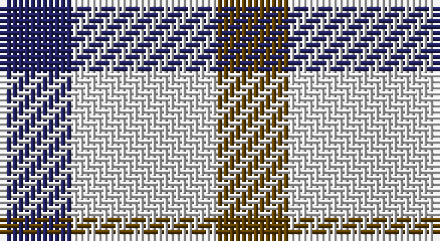

This page is one **sett** — a single exact thread-count. It belongs to the [tartan](/setts/dy1w2db1/)
(the same proportion at any scale), whose colour order is pattern [BWG](/stripes/bwg/).

Part of the [Aquascutum](/tartans/aquascutum/) tartan — the named design grouping this sett with its other cloths.

Sourced from register-of-tartans.  It is a [3 stripe tartan](/stripes/stripes3/).

Original link https://www.tartanregister.gov.uk/tartanDetails.aspx?ref=103

## Register references

External register numbers recorded for this tartan.

- Scottish Register of Tartans: [103](https://www.tartanregister.gov.uk/tartanDetails.aspx?ref=103)
- Scottish Tartans Authority (ITI): 657
- Scottish Tartans World Register: 657

## Thread count
DB/12 LN24 T/12

One full sett is **72 threads**.

## Palette

Palette: <strong>Tartan Register</strong>
<table><thead><tr><th>Colour</th><th>Threads</th><th>Shade</th><th>Base</th><th>OKLCh</th></tr></thead><tbody><tr><td>DB/</td><td style="text-align:right;font-variant-numeric:tabular-nums">12</td><td><code style="background-color:#202060;">#202060</code> <small style="color:#888">#202060</small></td><td>B <code style="background-color:#2A418A;">#2A418A</code></td><td><small style="color:#888">oklch(28.9% 0.111 276.9)</small></td></tr><tr><td>LN</td><td style="text-align:right;font-variant-numeric:tabular-nums">24</td><td><code style="background-color:#E0E0E0;">#E0E0E0</code> <small style="color:#888">#E0E0E0</small></td><td>W <code style="background-color:#F7F7F7;">#F7F7F7</code></td><td><small style="color:#888">oklch(90.7% 0.000 89.9)</small></td></tr><tr><td>T/</td><td style="text-align:right;font-variant-numeric:tabular-nums">12</td><td><code style="background-color:#604000;">#604000</code> <small style="color:#888">#604000</small></td><td>G <code style="background-color:#006100;">#006100</code></td><td><small style="color:#888">oklch(39.8% 0.083 76.8)</small></td></tr></tbody></table>

# Sample pattern

## Nearest tartans

The nearest existing variants by ΔTartan distance, with this tartan at the top so the swatches line up against it.

ΔTartan

Tartan

Sett

—

<a href="/ttd/edit/#slug=dy1w2db1~x12">Aquascutum</a> <a class="nn-out" href="/variants/s3/dy1w2db1~x12/" title="open its dictionary page">↗</a>

1.40

<a href="/ttd/edit/#slug=k3w6k4w6lo3~x2&amp;base=dy1w2db1~x12">Daks (House Check)</a> <a class="nn-out" href="/variants/s5/k3w6k4w6lo3~x2/" title="open its dictionary page">↗</a>

1.44

<a href="/ttd/edit/#slug=k3w7k4w6o3~x2&amp;base=dy1w2db1~x12">Daks - House Check, C.6700.03</a> <a class="nn-out" href="/variants/s5/k3w7k4w6o3~x2/" title="open its dictionary page">↗</a>

2.03

<a href="/ttd/edit/#slug=p5g4t2~x2&amp;base=dy1w2db1~x12">Wilson's, No 209</a> <a class="nn-out" href="/variants/s3/p5g4t2~x2/" title="open its dictionary page">↗</a>

2.03

<a href="/ttd/edit/#slug=r21k21w10k10w21~x2&amp;base=dy1w2db1~x12">Havel</a> <a class="nn-out" href="/variants/s5/r21k21w10k10w21~x2/" title="open its dictionary page">↗</a>

2.13

<a href="/ttd/edit/#slug=db10w3db12ly14r4~x2&amp;base=dy1w2db1~x12">MacLeod, of Argentina</a> <a class="nn-out" href="/variants/s5/db10w3db12ly14r4~x2/" title="open its dictionary page">↗</a>

2.16

<a href="/ttd/edit/#slug=db18t18lo28dt13~x2&amp;base=dy1w2db1~x12">Gold Country (California)</a> <a class="nn-out" href="/variants/s4/db18t18lo28dt13~x2/" title="open its dictionary page">↗</a>

2.20

<a href="/ttd/edit/#slug=t3o6k4t2~x2&amp;base=dy1w2db1~x12">Bedford Check</a> <a class="nn-out" href="/variants/s4/t3o6k4t2~x2/" title="open its dictionary page">↗</a>

2.20

<a href="/ttd/edit/#slug=w9r23g23w9~x2&amp;base=dy1w2db1~x12">Quaboos Pipers Plaid</a> <a class="nn-out" href="/variants/s4/w9r23g23w9~x2/" title="open its dictionary page">↗</a>

2.23

<a href="/ttd/edit/#slug=r1g3p3w1~x4&amp;base=dy1w2db1~x12">Wilson's, No 113</a> <a class="nn-out" href="/variants/s4/r1g3p3w1~x4/" title="open its dictionary page">↗</a>

2.27

<a href="/ttd/edit/#slug=y5k2r2ly2y5~x10&amp;base=dy1w2db1~x12">Ikelman No 3</a> <a class="nn-out" href="/variants/s5/y5k2r2ly2y5~x10/" title="open its dictionary page">↗</a>

## Neighbour map

Every grey dot is one of 14360 variants placed by the first two principal components of the ΔTartan feature space (44% of its variance). Red is this tartan; blue dots are its nearest — click one to open its page.

<svg viewBox="0 0 640 380" role="img" style="max-width:100%;height:auto;border:1px solid #e0e0e0;border-radius:4px;display:block" xmlns="http://www.w3.org/2000/svg"><image href="/nn/cloud.v1.png" width="640" height="380"/><a href="/variants/s5/k3w6k4w6lo3~x2/"><circle cx="141.8" cy="317.2" r="4" fill="#3465a4"><title>Daks (House Check)</title></circle></a><a href="/variants/s5/k3w7k4w6o3~x2/"><circle cx="167.4" cy="310.3" r="4" fill="#3465a4"><title>Daks - House Check, C.6700.03</title></circle></a><a href="/variants/s3/p5g4t2~x2/"><circle cx="185.4" cy="363.1" r="4" fill="#3465a4"><title>Wilson's, No 209</title></circle></a><a href="/variants/s5/r21k21w10k10w21~x2/"><circle cx="74.9" cy="307.9" r="4" fill="#3465a4"><title>Havel</title></circle></a><a href="/variants/s5/db10w3db12ly14r4~x2/"><circle cx="186.2" cy="256.5" r="4" fill="#3465a4"><title>MacLeod, of Argentina</title></circle></a><a href="/variants/s4/db18t18lo28dt13~x2/"><circle cx="54.5" cy="331.7" r="4" fill="#3465a4"><title>Gold Country (California)</title></circle></a><a href="/variants/s4/t3o6k4t2~x2/"><circle cx="149.3" cy="335.6" r="4" fill="#3465a4"><title>Bedford Check</title></circle></a><a href="/variants/s4/w9r23g23w9~x2/"><circle cx="120.5" cy="308.5" r="4" fill="#3465a4"><title>Quaboos Pipers Plaid</title></circle></a><a href="/variants/s4/r1g3p3w1~x4/"><circle cx="119.1" cy="286.4" r="4" fill="#3465a4"><title>Wilson's, No 113</title></circle></a><a href="/variants/s5/y5k2r2ly2y5~x10/"><circle cx="223.8" cy="290.6" r="4" fill="#3465a4"><title>Ikelman No 3</title></circle></a><circle cx="142.4" cy="338.1" r="5" fill="#c00000"/></svg>

ID: /variants/s3/dy1w2db1~x12/
