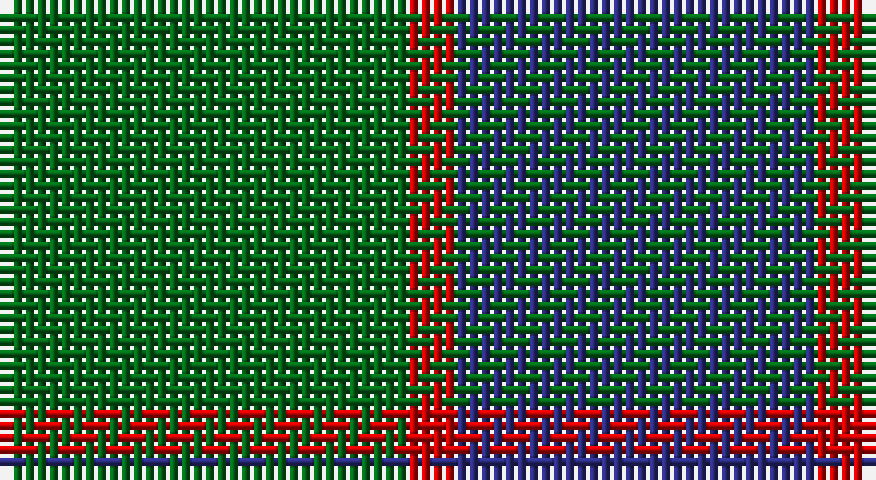

This page is one **sett** — a single exact thread-count. It belongs to the [tartan](/setts/g17r2db15/)
(the same proportion at any scale), whose colour order is pattern [BRG](/stripes/brg/).

Part of the [Ferguson](/tartans/ferguson/) tartan — the named design grouping this sett with its other cloths.

Sourced from tartans-authority.  It is a [3 stripe tartan](/stripes/stripes3/).

Original link http://www.tartansauthority.com/tartan-ferret/display/503/

## Provenance

Earliest known date: 1830 Count revised by G. Newnham 1986

## Also known as

This cloth is also recorded under:

- Ferguson of Balquhidder
- Ferguson of Balquhidder #2
- Ferguson,

3 attestations — the source records this cloth was collapsed from (oldest owns this page)

<ul>
<li>pre 1950 — Ferguson - 1930 (Old) (tartans-authority, <a href="http://www.tartansauthority.com/tartan-ferret/display/503/">record</a>)</li>
<li>undated — Ferguson, (Old) (weddslist, <a href="http://www.weddslist.com/cgi-bin/tartans/pg.pl?source=sts">record</a>)</li>
<li>undated — Ferguson (Old) Clan Tartan (house-of-tartan, <a href="http://www.house-of-tartan.scotland.net/house/TartanViewjs.asp?colr=Def&tnam=503">record</a>)</li>
</ul>

## Register references

External register numbers recorded for this tartan.

- Scottish Tartans Authority (ITI): 503

## Thread count
G/34 R4 DB/30

One full sett is **72 threads**.

## Palette

Palette: <strong>Tartan Register</strong>
<table><thead><tr><th>Colour</th><th>Threads</th><th>Shade</th><th>Base</th><th>OKLCh</th></tr></thead><tbody><tr><td>G/</td><td style="text-align:right;font-variant-numeric:tabular-nums">34</td><td><code style="background-color:#006818;">#006818</code> <small style="color:#888">#006818</small></td><td>G <code style="background-color:#006100;">#006100</code></td><td><small style="color:#888">oklch(45.0% 0.142 145.0)</small></td></tr><tr><td>R</td><td style="text-align:right;font-variant-numeric:tabular-nums">4</td><td><code style="background-color:#C80000;">#C80000</code> <small style="color:#888">#C80000</small></td><td>R <code style="background-color:#CC0000;">#CC0000</code></td><td><small style="color:#888">oklch(52.3% 0.215 29.2)</small></td></tr><tr><td>DB/</td><td style="text-align:right;font-variant-numeric:tabular-nums">30</td><td><code style="background-color:#2C2C80;">#2C2C80</code> <small style="color:#888">#2C2C80</small></td><td>B <code style="background-color:#2A418A;">#2A418A</code></td><td><small style="color:#888">oklch(35.0% 0.138 276.6)</small></td></tr></tbody></table>

# Sample pattern

## Nearest tartans

The nearest existing variants by ΔTartan distance, with this tartan at the top so the swatches line up against it.

ΔTartan

Tartan

Sett

—

<a href="/ttd/edit/#slug=g17r2db15~x2">Ferguson - 1930 (Old)</a> <a class="nn-out" href="/variants/s3/g17r2db15~x2/" title="open its dictionary page">↗</a>

0.78

<a href="/ttd/edit/#slug=db6g5r1~x4&amp;base=g17r2db15~x2">Ferguson</a> <a class="nn-out" href="/variants/s3/db6g5r1~x4/" title="open its dictionary page">↗</a>

0.86

<a href="/ttd/edit/#slug=db13r2g13~x2&amp;base=g17r2db15~x2">Wilson's No 62, (Ferguson)</a> <a class="nn-out" href="/variants/s3/db13r2g13~x2/" title="open its dictionary page">↗</a>

1.00

<a href="/ttd/edit/#slug=db2dg7db7w1~x2&amp;base=g17r2db15~x2">Unidentified No 78</a> <a class="nn-out" href="/variants/s4/db2dg7db7w1~x2/" title="open its dictionary page">↗</a>

1.06

<a href="/ttd/edit/#slug=db5g6r1~x4&amp;base=g17r2db15~x2">Wilson's No 84, Ferguson</a> <a class="nn-out" href="/variants/s3/db5g6r1~x4/" title="open its dictionary page">↗</a>

1.08

<a href="/ttd/edit/#slug=g6dp5t1~x4&amp;base=g17r2db15~x2">Wilson's No.055</a> <a class="nn-out" href="/variants/s3/g6dp5t1~x4/" title="open its dictionary page">↗</a>

1.28

<a href="/ttd/edit/#slug=db2g7db7w1~x2&amp;base=g17r2db15~x2">Unnamed No 78</a> <a class="nn-out" href="/variants/s4/db2g7db7w1~x2/" title="open its dictionary page">↗</a>

1.29

<a href="/ttd/edit/#slug=db6dg5r1~x4&amp;base=g17r2db15~x2">Ferguson</a> <a class="nn-out" href="/variants/s3/db6dg5r1~x4/" title="open its dictionary page">↗</a>

1.41

<a href="/variants/s4/db13r2g13~x2/">Wilson's No.062</a>

1.43

<a href="/ttd/edit/#slug=dg17r2db15~x2&amp;base=g17r2db15~x2">Ferguson (Old)</a> <a class="nn-out" href="/variants/s3/dg17r2db15~x2/" title="open its dictionary page">↗</a>

1.46

<a href="/ttd/edit/#slug=db11g2db15g18w2~x2&amp;base=g17r2db15~x2">Hamilton, hunting</a> <a class="nn-out" href="/variants/s5/db11g2db15g18w2~x2/" title="open its dictionary page">↗</a>

## Neighbour map

Every grey dot is one of 14360 variants placed by the first two principal components of the ΔTartan feature space (44% of its variance). Red is this tartan; blue dots are its nearest — click one to open its page.

<svg viewBox="0 0 640 380" role="img" style="max-width:100%;height:auto;border:1px solid #e0e0e0;border-radius:4px;display:block" xmlns="http://www.w3.org/2000/svg"><image href="/nn/cloud.v1.png" width="640" height="380"/><a href="/variants/s3/db6g5r1~x4/"><circle cx="293.2" cy="325.0" r="4" fill="#3465a4"><title>Ferguson</title></circle></a><a href="/variants/s3/db13r2g13~x2/"><circle cx="288.4" cy="321.5" r="4" fill="#3465a4"><title>Wilson's No 62, (Ferguson)</title></circle></a><a href="/variants/s4/db2dg7db7w1~x2/"><circle cx="332.9" cy="305.1" r="4" fill="#3465a4"><title>Unidentified No 78</title></circle></a><a href="/variants/s3/db5g6r1~x4/"><circle cx="291.3" cy="324.9" r="4" fill="#3465a4"><title>Wilson's No 84, Ferguson</title></circle></a><a href="/variants/s3/g6dp5t1~x4/"><circle cx="289.6" cy="320.4" r="4" fill="#3465a4"><title>Wilson's No.055</title></circle></a><a href="/variants/s4/db2g7db7w1~x2/"><circle cx="303.9" cy="288.5" r="4" fill="#3465a4"><title>Unnamed No 78</title></circle></a><a href="/variants/s3/db6dg5r1~x4/"><circle cx="331.1" cy="345.4" r="4" fill="#3465a4"><title>Ferguson</title></circle></a><a href="/variants/s4/db13r2g13~x2/"><circle cx="272.9" cy="285.6" r="4" fill="#3465a4"><title>Wilson's No.062</title></circle></a><a href="/variants/s3/dg17r2db15~x2/"><circle cx="365.7" cy="335.8" r="4" fill="#3465a4"><title>Ferguson (Old)</title></circle></a><a href="/variants/s5/db11g2db15g18w2~x2/"><circle cx="328.2" cy="271.2" r="4" fill="#3465a4"><title>Hamilton, hunting</title></circle></a><circle cx="326.6" cy="314.4" r="5" fill="#c00000"/></svg>

ID: /variants/s3/g17r2db15~x2/
