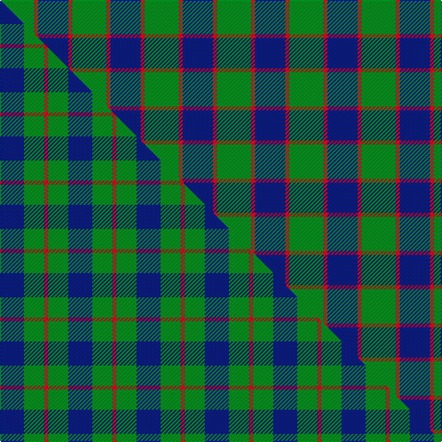

This is one **variant** — a specific cloth: this exact thread count and colourway, with its own
provenance below. It is one weaving of the [sett](/setts/g17r2db15/) (the scale-free proportion — the
same cloth at any scale or shade), whose colour order is pattern [BRG](/stripes/brg/).

Part of the [Ferguson](/tartans/ferguson-2/) tartan — the named design grouping this sett with its other cloths.

Sourced from house-of-tartan.  It is a [3 stripe tartan](/stripes/stripes3/).

Original link [http://www.house-of-tartan.scotland.net/house/TartanViewjs.asp?colr=Def&tnam=503](http://www.house-of-tartan.scotland.net/house/TartanViewjs.asp?colr=Def&tnam=503)

## Provenance

Earliest known date: 1830 Count revised by G. Newnham 1986

4 attestations — the source records this cloth was collapsed from (oldest owns this page)

<ul>
<li>1830 — Ferguson (Old) Clan Tartan (house-of-tartan, <a href="http://www.house-of-tartan.scotland.net/house/TartanViewjs.asp?colr=Def&tnam=503">record</a>) </li>
<li>pre 1950 — Ferguson - 1930 (Old) (tartans-authority, <a href="https://www.tartanregister.gov.uk/tartanDetails.aspx?ref=503">record</a>)  <em>From the MacGregor Hastie collection. No further info on this. Possibly his/Trade error of the time for Wilsons' asymmetric Ferguson - see #6473. PEM</em></li>
<li>undated — Ferguson (Old) (register-of-tartans, <a href="https://www.tartanregister.gov.uk/tartanDetails.aspx?ref=1160">record</a>)  <em>MacGregor-Hastie collection is found in the Scottish Tartans Society archive.</em></li>
<li>undated — Ferguson, (Old) (weddslist, <a href="http://www.weddslist.com/cgi-bin/tartans/pg.pl?source=sts">record</a>) </li>
</ul>

Dataset <small>— provenance for this record, inherited from the source manifest</small>

<dl class="dataset-prov">
<dt>source</dt><dd><a href="/sources/house-of-tartan/">House of Tartan</a></dd>
<dt>data captured from</dt><dd><a href="https://github.com/thetartan/tartan-database/blob/master/data/house-of-tartan/data.csv">https://github.com/thetartan/tartan-database/blob/master/data/house-of-tartan/data.csv</a></dd>
<dt>data date</dt><dd>1830 <small>(this record)</small></dd>
<dt>licence</dt><dd><a href="https://creativecommons.org/licenses/by-nc-nd/4.0/">CC BY-NC-ND 4.0</a></dd>
</dl>

Capture chain <small>— the hands this data passed through, oldest first; each capture carries its own licence</small>

<ol class="capture-chain">
<li><a href="http://www.house-of-tartan.scotland.net/">House of Tartan</a> <small>the weaver/retailer's database — the site is now offline; the URL is kept as the ultimate source's identity</small></li>
<li><a href="https://github.com/thetartan/tartan-database">thetartan/tartan-database</a> <small>2016-2017</small> · <a href="https://creativecommons.org/licenses/by-nc-nd/4.0/">CC BY-NC-ND 4.0</a> <small>Levko Kravets's frozen compilation — the capture we vendored, and where its CC licence text came from</small></li>
<li>this dictionary <small>captured 2026-06-10 · commit 5bf86c7566</small> <small>each re-capture is a git commit to data/sources</small></li>
</ol>

## Register references

External register numbers recorded for this tartan.

- Scottish Register of Tartans: [1160](https://www.tartanregister.gov.uk/tartanDetails.aspx?ref=1160)
- Scottish Tartans Authority (ITI): 503
- Scottish Tartans World Register: 503

## Thread count
G/34 R4 DB/30

One full sett is **72 threads**.

## Palette
<table><thead><tr><th>Colour</th><th>Shade</th><th>OKLCh</th></tr></thead><tbody><tr><td>DB</td><td><code style="background-color:#082077;">#082077</code> <small style="color:#888">#082077</small></td><td><small style="color:#888">oklch(30.0% 0.149 265.1)</small></td></tr><tr><td>G</td><td><code style="background-color:#008B2A;">#008B2A</code> <small style="color:#888">#008B2A</small></td><td><small style="color:#888">oklch(55.4% 0.170 145.9)</small></td></tr><tr><td>R</td><td><code style="background-color:#D60020;">#D60020</code> <small style="color:#888">#D60020</small></td><td><small style="color:#888">oklch(55.2% 0.224 25.5)</small></td></tr></tbody></table>

# Sample pattern

## Compared to the master

This cloth is one sett of its design; the master sett (the exemplar the design is anchored on) is below for comparison.

Its **ΔTartan distance** from the master is **0.50** — the same measure the nearest-tartans table ranks by (0 is identical; a re-scale of the same cloth is near 0, a recolour or a different proportion further).

<figure class="master-compare" style="margin:0">

this sett
master sett ★

<figcaption style="color:#888;font-size:smaller">One weave of this sett against the <a href="/setts/db6g5r1/">master sett ★</a>, split on the diagonal: a shared proportion runs seamlessly across it with only the shades shifting; a different proportion breaks on it.</figcaption>
</figure>

## Nearest tartan variants

The nearest existing variants by ΔTartan distance, with this cloth at the top so the swatches line up against it.

ΔTartan

Threads

Variant

Sett

—

72

<a href="/variants/s3/g17r2db15~x2/">Ferguson (Old) Clan Tartan</a>

<a href="/ttd/edit/#slug=db13r2g13~x2&amp;base=g17r2db15~x2" title="compare in the TTD">0.29</a>

60

<a href="/variants/s3/db13r2g13~x2/">Wilson's No.062</a>

<a href="/ttd/edit/#slug=db5g6r1~x4&amp;base=g17r2db15~x2" title="compare in the TTD">0.38</a>

72

<a href="/variants/s3/db5g6r1~x4/">Wilson's No 84, Ferguson</a>

<a href="/ttd/edit/#slug=g13r2lb13~x2&amp;base=g17r2db15~x2" title="compare in the TTD">0.45</a>

60

<a href="/variants/s3/g13r2lb13~x2/">Wilson's No.161</a>

<a href="/ttd/edit/#slug=db6g5r1~x4&amp;base=g17r2db15~x2" title="compare in the TTD">0.50</a>

68

<a href="/variants/s3/db6g5r1~x4/">Ferguson</a>

<a href="/ttd/edit/#slug=g15r3db11lb2~x2&amp;base=g17r2db15~x2" title="compare in the TTD">0.65</a>

90

<a href="/variants/s4/g15r3db11lb2~x2/">MacNab</a>

<a href="/ttd/edit/#slug=g15r3db11w2&amp;base=g17r2db15~x2" title="compare in the TTD">0.65</a>

45

<a href="/variants/s4/g15r3db11w2/">MacNab WI2</a>

<a href="/ttd/edit/#slug=r1g6db6w1~x4&amp;base=g17r2db15~x2" title="compare in the TTD">0.66</a>

104

<a href="/variants/s4/r1g6db6w1~x4/">Salt Spring Island</a>

<a href="/ttd/edit/#slug=db53g42r14~x2&amp;base=g17r2db15~x2" title="compare in the TTD">0.69</a>

302

<a href="/variants/s3/db53g42r14~x2/">Agnew</a>

<a href="/ttd/edit/#slug=db53g42r14&amp;base=g17r2db15~x2" title="compare in the TTD">0.69</a>

151

<a href="/variants/s3/db53g42r14/">Agnew Family Tartan</a>

<a href="/ttd/edit/#slug=db10g10r5w1~x2&amp;base=g17r2db15~x2" title="compare in the TTD">0.74</a>

82

<a href="/variants/s4/db10g10r5w1~x2/">Thorntons Law Corporate Tartan</a>

## Neighbour map

Every grey dot is one of 13621 variants placed by the first two principal components of the ΔTartan feature space (42% of its variance). Red is this tartan; blue dots are its nearest — click one to open its page.

<svg viewBox="0 0 640 380" role="img" style="max-width:100%;height:auto;border:1px solid #e0e0e0;border-radius:4px;display:block" xmlns="http://www.w3.org/2000/svg"><image href="/nn/cloud.v1.png" width="640" height="380"/><a href="/variants/s3/db13r2g13~x2/"><circle cx="266.3" cy="274.3" r="4" fill="#3465a4"><title>Wilson's No.062</title></circle></a><a href="/variants/s3/db5g6r1~x4/"><circle cx="289.9" cy="311.5" r="4" fill="#3465a4"><title>Wilson's No 84, Ferguson</title></circle></a><a href="/variants/s3/g13r2lb13~x2/"><circle cx="288.1" cy="282.9" r="4" fill="#3465a4"><title>Wilson's No.161</title></circle></a><a href="/variants/s3/db6g5r1~x4/"><circle cx="290.4" cy="310.2" r="4" fill="#3465a4"><title>Ferguson</title></circle></a><a href="/variants/s4/g15r3db11lb2~x2/"><circle cx="257.5" cy="259.2" r="4" fill="#3465a4"><title>MacNab</title></circle></a><a href="/variants/s4/g15r3db11w2/"><circle cx="245.6" cy="255.5" r="4" fill="#3465a4"><title>MacNab WI2</title></circle></a><a href="/variants/s4/r1g6db6w1~x4/"><circle cx="221.5" cy="262.4" r="4" fill="#3465a4"><title>Salt Spring Island</title></circle></a><a href="/variants/s3/db53g42r14~x2/"><circle cx="250.9" cy="336.7" r="4" fill="#3465a4"><title>Agnew</title></circle></a><a href="/variants/s3/db53g42r14/"><circle cx="250.9" cy="336.7" r="4" fill="#3465a4"><title>Agnew Family Tartan</title></circle></a><a href="/variants/s4/db10g10r5w1~x2/"><circle cx="204.5" cy="257.4" r="4" fill="#3465a4"><title>Thorntons Law Corporate Tartan</title></circle></a><circle cx="312.4" cy="294.2" r="5" fill="#c00000"/><text x="320" y="376" text-anchor="middle" font-size="11" fill="#999">ground</text><text x="11" y="190" text-anchor="middle" font-size="11" fill="#999" transform="rotate(-90 11 190)">complexity</text></svg>

ID: /variants/s3/g17r2db15~x2/
