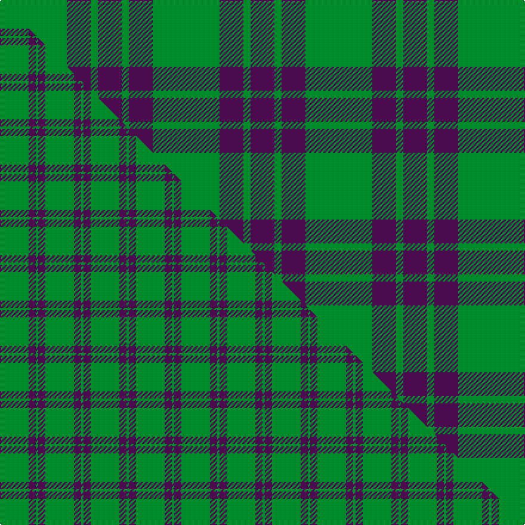

This is one **variant** — a specific cloth: this exact thread count and colourway, with its own
provenance below. It is one weaving of the [sett](/setts/g28dp10g3/) (the scale-free proportion — the
same cloth at any scale or shade), whose colour order is pattern [BGBG](/stripes/bgbg/).

Part of the [Elphinstone](/tartans/e/el/elphinstone/) tartan — the named design grouping this sett with its other cloths.

Sourced from house-of-tartan.  It is a [4 stripe tartan](/stripes/stripes4/).

Original link [http://www.house-of-tartan.scotland.net/house/TartanViewjs.asp?colr=Def&tnam=115](http://www.house-of-tartan.scotland.net/house/TartanViewjs.asp?colr=Def&tnam=115)

## Provenance

Earliest known date: 1842 The village of Elphinstone is next to Tranent near Edinburgh in East Lothian. Sir Henry Elphinstone of Pittendriech in Midlothian was created Baron Elphinstone in 1509 and fell at Flodden Field. The Elphinstone tartan first appeared in the text of the Vestiarium Scoticum (1842). It is similar to some extent with the Montgomerie tartan and to the Montgomerie Hunting sett, suggesting a link to an early provenance. D.W. Stewart (1893) maintained that he could date the Montgomerie of Eglinton to 1707.

Dataset <small>— provenance for this record, inherited from the source manifest</small>

<dl class="dataset-prov">
<dt>source</dt><dd><a href="/sources/house-of-tartan/">House of Tartan</a></dd>
<dt>data captured from</dt><dd><a href="https://github.com/thetartan/tartan-database/blob/master/data/house-of-tartan/data.csv">https://github.com/thetartan/tartan-database/blob/master/data/house-of-tartan/data.csv</a></dd>
<dt>data date</dt><dd>1842 <small>(this record)</small></dd>
<dt>licence</dt><dd><a href="https://creativecommons.org/licenses/by-nc-nd/4.0/">CC BY-NC-ND 4.0</a></dd>
</dl>

Capture chain <small>— the hands this data passed through, oldest first; each capture carries its own licence</small>

<ol class="capture-chain">
<li><a href="http://www.house-of-tartan.scotland.net/">House of Tartan</a> <small>the weaver/retailer's database — the site is now offline; the URL is kept as the ultimate source's identity</small></li>
<li><a href="https://github.com/thetartan/tartan-database">thetartan/tartan-database</a> <small>2016-2017</small> · <a href="https://creativecommons.org/licenses/by-nc-nd/4.0/">CC BY-NC-ND 4.0</a> <small>Levko Kravets's frozen compilation — the capture we vendored, and where its CC licence text came from</small></li>
<li>this dictionary <small>captured 2026-06-10 · commit 5bf86c7566</small> <small>each re-capture is a git commit to data/sources</small></li>
</ol>

## Thread count
G/56 DP20 G6 DP/20

One full sett is **128 threads**.

## Palette
<table><thead><tr><th>Colour</th><th>Shade</th><th>OKLCh</th></tr></thead><tbody><tr><td>G</td><td><code style="background-color:#008B2A;">#008B2A</code> <small style="color:#888">#008B2A</small></td><td><small style="color:#888">oklch(55.4% 0.170 145.9)</small></td></tr><tr><td>DP</td><td><code style="background-color:#4B0B4F;">#4B0B4F</code> <small style="color:#888">#4B0B4F</small></td><td><small style="color:#888">oklch(30.1% 0.125 325.4)</small></td></tr></tbody></table>

# Sample pattern

## Compared to the master

This cloth is one sett of its design; the master sett (the exemplar the design is anchored on) is below for comparison.

Its **ΔTartan distance** from the master is **0.41** — the same measure the nearest-tartans table ranks by (0 is identical; a re-scale of the same cloth is near 0, a recolour or a different proportion further).

<figure class="master-compare" style="margin:0">

this sett
master sett ★

<figcaption style="color:#888;font-size:smaller">One weave of this sett against the <a href="/setts/g12dp3g1/">master sett ★</a>, split on the diagonal: a shared proportion runs seamlessly across it with only the shades shifting; a different proportion breaks on it.</figcaption>
</figure>

## Nearest tartan variants

The nearest existing variants by ΔTartan distance, with this cloth at the top so the swatches line up against it.

ΔTartan

Threads

Variant

Sett

—

128

<a href="/variants/s3/g28dp10g3~x2/">Elphinstone Clan Tartan</a>

<a href="/ttd/edit/#slug=g12dp3g1~x2&amp;base=g28dp10g3~x2" title="compare in the TTD">0.41</a>

38

<a href="/variants/s3/g12dp3g1~x2/">Elphinstone</a>

<a href="/ttd/edit/#slug=g6dp2g1~x4&amp;base=g28dp10g3~x2" title="compare in the TTD">0.45</a>

44

<a href="/variants/s3/g6dp2g1~x4/">Elphinstone</a>

<a href="/ttd/edit/#slug=g6dp2g1~x20&amp;base=g28dp10g3~x2" title="compare in the TTD">0.45</a>

220

<a href="/variants/s3/g6dp2g1~x20/">Elphinstone Check (Clan)</a>

<a href="/ttd/edit/#slug=dp7g23r3g7~x2&amp;base=g28dp10g3~x2" title="compare in the TTD">1.04</a>

132

<a href="/variants/s4/dp7g23r3g7~x2/">Highland Spring (1997) (Corporate)</a>

<a href="/ttd/edit/#slug=w1g10dp4lt1~x2&amp;base=g28dp10g3~x2" title="compare in the TTD">1.54</a>

60

<a href="/variants/s4/w1g10dp4lt1~x2/">Wilson's No.205</a>

<a href="/ttd/edit/#slug=g8dp4g1dp2~x4&amp;base=g28dp10g3~x2" title="compare in the TTD">1.55</a>

80

<a href="/variants/s4/g8dp4g1dp2~x4/">Wilson's, No 211</a>

<a href="/ttd/edit/#slug=g12db3g1~x2&amp;base=g28dp10g3~x2" title="compare in the TTD">1.66</a>

38

<a href="/variants/s3/g12db3g1~x2/">Montgomerie</a>

<a href="/ttd/edit/#slug=dp2g4y1~x4&amp;base=g28dp10g3~x2" title="compare in the TTD">1.75</a>

44

<a href="/variants/s3/dp2g4y1~x4/">Wilson's No.201</a>

<a href="/ttd/edit/#slug=g6db2g1~x4&amp;base=g28dp10g3~x2" title="compare in the TTD">1.77</a>

44

<a href="/variants/s3/g6db2g1~x4/">Montgomery</a>

<a href="/ttd/edit/#slug=g6dp5lb1~x4&amp;base=g28dp10g3~x2" title="compare in the TTD">1.79</a>

68

<a href="/variants/s3/g6dp5lb1~x4/">Wilson's, No 55</a>

## Neighbour map

Every grey dot is one of 13621 variants placed by the first two principal components of the ΔTartan feature space (42% of its variance). Red is this tartan; blue dots are its nearest — click one to open its page.

<svg viewBox="0 0 640 380" role="img" style="max-width:100%;height:auto;border:1px solid #e0e0e0;border-radius:4px;display:block" xmlns="http://www.w3.org/2000/svg"><image href="/nn/cloud.v1.png" width="640" height="380"/><a href="/variants/s3/g12dp3g1~x2/"><circle cx="484.3" cy="267.1" r="4" fill="#3465a4"><title>Elphinstone</title></circle></a><a href="/variants/s3/g6dp2g1~x4/"><circle cx="421.0" cy="309.4" r="4" fill="#3465a4"><title>Elphinstone</title></circle></a><a href="/variants/s3/g6dp2g1~x20/"><circle cx="421.0" cy="309.4" r="4" fill="#3465a4"><title>Elphinstone Check (Clan)</title></circle></a><a href="/variants/s4/dp7g23r3g7~x2/"><circle cx="463.4" cy="269.2" r="4" fill="#3465a4"><title>Highland Spring (1997) (Corporate)</title></circle></a><a href="/variants/s4/w1g10dp4lt1~x2/"><circle cx="371.3" cy="241.9" r="4" fill="#3465a4"><title>Wilson's No.205</title></circle></a><a href="/variants/s4/g8dp4g1dp2~x4/"><circle cx="413.2" cy="296.6" r="4" fill="#3465a4"><title>Wilson's, No 211</title></circle></a><a href="/variants/s3/g12db3g1~x2/"><circle cx="487.3" cy="272.6" r="4" fill="#3465a4"><title>Montgomerie</title></circle></a><a href="/variants/s3/dp2g4y1~x4/"><circle cx="344.4" cy="347.2" r="4" fill="#3465a4"><title>Wilson's No.201</title></circle></a><a href="/variants/s3/g6db2g1~x4/"><circle cx="423.4" cy="315.4" r="4" fill="#3465a4"><title>Montgomery</title></circle></a><a href="/variants/s3/g6dp5lb1~x4/"><circle cx="309.5" cy="322.5" r="4" fill="#3465a4"><title>Wilson's, No 55</title></circle></a><circle cx="422.4" cy="289.9" r="5" fill="#c00000"/><text x="320" y="376" text-anchor="middle" font-size="11" fill="#999">ground</text><text x="11" y="190" text-anchor="middle" font-size="11" fill="#999" transform="rotate(-90 11 190)">complexity</text></svg>

ID: /variants/s3/g28dp10g3~x2/
