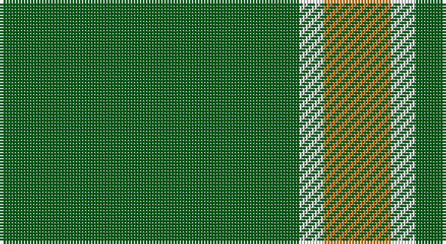

This page is one **sett** — a single exact thread-count. It belongs to the [tartan](/setts/g49w4lo11/)
(the same proportion at any scale), whose colour order is pattern [GWY](/stripes/gwy/).

Sourced from tartans-authority.  It is a [3 stripe tartan](/stripes/stripes3/).

Original link http://www.tartansauthority.com/tartan-ferret/display/11043/

## Register references

External register numbers recorded for this tartan.

- Scottish Register of Tartans: [11043](https://www.tartanregister.gov.uk/tartanDetails?ref=11043)
- Scottish Tartans Authority (ITI): 11043

## Thread count
G/98 W8 O/22

One full sett is **136 threads**.

## Palette

Palette: <strong>Tartan Register</strong>
<table><thead><tr><th>Colour</th><th>Threads</th><th>Shade</th><th>Base</th><th>OKLCh</th></tr></thead><tbody><tr><td>G/</td><td style="text-align:right;font-variant-numeric:tabular-nums">98</td><td><code style="background-color:#006818;">#006818</code> <small style="color:#888">#006818</small></td><td>G <code style="background-color:#006100;">#006100</code></td><td><small style="color:#888">oklch(45.0% 0.142 145.0)</small></td></tr><tr><td>W</td><td style="text-align:right;font-variant-numeric:tabular-nums">8</td><td><code style="background-color:#FCFCFC;">#FCFCFC</code> <small style="color:#888">#FCFCFC</small></td><td>W <code style="background-color:#F7F7F7;">#F7F7F7</code></td><td><small style="color:#888">oklch(99.1% 0.000 89.9)</small></td></tr><tr><td>O/</td><td style="text-align:right;font-variant-numeric:tabular-nums">22</td><td><code style="background-color:#D87C00;">#D87C00</code> <small style="color:#888">#D87C00</small></td><td>Y <code style="background-color:#F2BF00;">#F2BF00</code></td><td><small style="color:#888">oklch(67.3% 0.155 61.8)</small></td></tr></tbody></table>

# Sample pattern

## Nearest tartans

The nearest existing variants by ΔTartan distance, with this tartan at the top so the swatches line up against it.

ΔTartan

Tartan

Sett

—

<a href="/ttd/edit/#slug=g49w4lo11~x2">Hibernian S3</a> <a class="nn-out" href="/variants/s3/g49w4lo11~x2/" title="open its dictionary page">↗</a>

0.90

<a href="/ttd/edit/#slug=g81r10ly20~x2&amp;base=g49w4lo11~x2">McMoosie</a> <a class="nn-out" href="/variants/s3/g81r10ly20~x2/" title="open its dictionary page">↗</a>

1.07

<a href="/ttd/edit/#slug=g12db3ly1~x4&amp;base=g49w4lo11~x2">Unidentified, pattern</a> <a class="nn-out" href="/variants/s3/g12db3ly1~x4/" title="open its dictionary page">↗</a>

1.39

<a href="/ttd/edit/#slug=r2g1r1g11w1~x8&amp;base=g49w4lo11~x2">Welsh, National</a> <a class="nn-out" href="/variants/s5/r2g1r1g11w1~x8/" title="open its dictionary page">↗</a>

1.49

<a href="/ttd/edit/#slug=g7r3g23m7~x2&amp;base=g49w4lo11~x2">Highland Spring (Green)</a> <a class="nn-out" href="/variants/s4/g7r3g23m7~x2/" title="open its dictionary page">↗</a>

1.73

<a href="/ttd/edit/#slug=dp7g23r3g7~x2&amp;base=g49w4lo11~x2">Highland Spring (1997) (Corporate)</a> <a class="nn-out" href="/variants/s4/dp7g23r3g7~x2/" title="open its dictionary page">↗</a>

1.73

<a href="/ttd/edit/#slug=g50k6db11g25ly4~x2&amp;base=g49w4lo11~x2">Glen of Daviot (Dalgleish)</a> <a class="nn-out" href="/variants/s5/g50k6db11g25ly4~x2/" title="open its dictionary page">↗</a>

1.77

<a href="/variants/s4/g12p3g1~x2/">Elphinstone</a>

1.86

<a href="/ttd/edit/#slug=g9ly20g40w5~x2&amp;base=g49w4lo11~x2">O'Neill Irish Family Tartan</a> <a class="nn-out" href="/variants/s4/g9ly20g40w5~x2/" title="open its dictionary page">↗</a>

1.89

<a href="/ttd/edit/#slug=r8g3r4g44w4~x2&amp;base=g49w4lo11~x2">Welsh National (District)</a> <a class="nn-out" href="/variants/s5/r8g3r4g44w4~x2/" title="open its dictionary page">↗</a>

1.95

<a href="/ttd/edit/#slug=r19g6r7g101k7g7&amp;base=g49w4lo11~x2">Loch Laggan</a> <a class="nn-out" href="/variants/s6/r19g6r7g101k7g7/" title="open its dictionary page">↗</a>

## Neighbour map

Every grey dot is one of 14360 variants placed by the first two principal components of the ΔTartan feature space (44% of its variance). Red is this tartan; blue dots are its nearest — click one to open its page.

<svg viewBox="0 0 640 380" role="img" style="max-width:100%;height:auto;border:1px solid #e0e0e0;border-radius:4px;display:block" xmlns="http://www.w3.org/2000/svg"><image href="/nn/cloud.v1.png" width="640" height="380"/><a href="/variants/s3/g81r10ly20~x2/"><circle cx="440.5" cy="274.4" r="4" fill="#3465a4"><title>McMoosie</title></circle></a><a href="/variants/s3/g12db3ly1~x4/"><circle cx="495.0" cy="275.6" r="4" fill="#3465a4"><title>Unidentified, pattern</title></circle></a><a href="/variants/s5/r2g1r1g11w1~x8/"><circle cx="490.3" cy="219.9" r="4" fill="#3465a4"><title>Welsh, National</title></circle></a><a href="/variants/s4/g7r3g23m7~x2/"><circle cx="473.4" cy="289.1" r="4" fill="#3465a4"><title>Highland Spring (Green)</title></circle></a><a href="/variants/s4/dp7g23r3g7~x2/"><circle cx="471.0" cy="290.0" r="4" fill="#3465a4"><title>Highland Spring (1997) (Corporate)</title></circle></a><a href="/variants/s5/g50k6db11g25ly4~x2/"><circle cx="461.8" cy="229.7" r="4" fill="#3465a4"><title>Glen of Daviot (Dalgleish)</title></circle></a><a href="/variants/s4/g12p3g1~x2/"><circle cx="451.4" cy="258.3" r="4" fill="#3465a4"><title>Elphinstone</title></circle></a><a href="/variants/s4/g9ly20g40w5~x2/"><circle cx="361.9" cy="261.1" r="4" fill="#3465a4"><title>O'Neill Irish Family Tartan</title></circle></a><a href="/variants/s5/r8g3r4g44w4~x2/"><circle cx="503.5" cy="208.4" r="4" fill="#3465a4"><title>Welsh National (District)</title></circle></a><a href="/variants/s6/r19g6r7g101k7g7/"><circle cx="527.5" cy="189.4" r="4" fill="#3465a4"><title>Loch Laggan</title></circle></a><circle cx="491.3" cy="257.5" r="5" fill="#c00000"/></svg>

ID: /variants/s3/g49w4lo11~x2/
