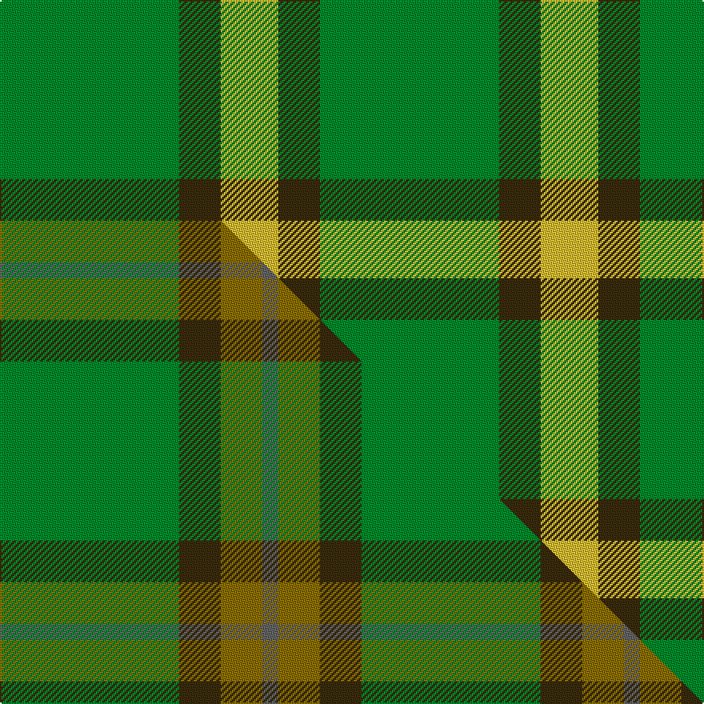

This page is one **sett** — a single exact thread-count. It belongs to the [tartan](/setts/g56dy13ly18/)
(the same proportion at any scale), whose colour order is pattern [GGY](/stripes/ggy/).

Part of the [Colonial Marine](/tartans/colonial-marine/) tartan — the named design grouping this sett with its other cloths.

Sourced from tartans-authority.  It is a [3 stripe tartan](/stripes/stripes3/).

Original link http://www.tartansauthority.com/tartan-ferret/display/10487/

## Register references

External register numbers recorded for this tartan.

- Scottish Register of Tartans: [10487](https://www.tartanregister.gov.uk/tartanDetails?ref=10487)
- Scottish Tartans Authority (ITI): 10487

## Thread count
G/112 DY26 LY/36

One full sett is **200 threads**.

## Palette
<table><thead><tr><th>Colour</th><th>Shade</th><th>OKLCh</th></tr></thead><tbody><tr><td>LY</td><td><code style="background-color:#DCBC32;">#DCBC32</code> <small style="color:#888">#DCBC32</small></td><td><small style="color:#888">oklch(80.0% 0.150 95.2)</small></td></tr><tr><td>G</td><td><code style="background-color:#008B2A;">#008B2A</code> <small style="color:#888">#008B2A</small></td><td><small style="color:#888">oklch(55.4% 0.170 145.9)</small></td></tr><tr><td>DY</td><td><code style="background-color:#3A2B0D;">#3A2B0D</code> <small style="color:#888">#3A2B0D</small></td><td><small style="color:#888">oklch(30.0% 0.049 82.0)</small></td></tr></tbody></table>

# Sample pattern

## Compared to the master

This cloth is one sett of its design; the master sett (the exemplar the design is anchored on) is below for comparison.

Its **ΔTartan distance** from the master is **3.37** — the same measure the nearest-tartans table ranks by (0 is identical; a re-scale of the same cloth is near 0, a recolour or a different proportion further).

<figure class="master-compare" style="margin:0">

this sett
master sett ★

<figcaption style="color:#888;font-size:smaller">One weave of this sett against the <a href="/setts/g56dy13y13n5/">master sett ★</a>, split on the diagonal: a shared proportion runs seamlessly across it with only the shades shifting; a different proportion breaks on it.</figcaption>
</figure>

## Nearest variants

The nearest existing variants by ΔTartan distance, with this cloth at the top so the swatches line up against it.

ΔTartan

Threads

Variant

Sett

—

200

<a href="/variants/s3/g56dy13ly18~x2/">Colonial Marine (Corporate)</a>

<a href="/ttd/edit/#slug=lb9g52dy15ly4~x2&amp;base=g56dy13ly18~x2" title="compare in the TTD">1.25</a>

294

<a href="/variants/s4/lb9g52dy15ly4~x2/">McGuigan, Julia (Personal)</a>

<a href="/ttd/edit/#slug=dp2g4y1~x4&amp;base=g56dy13ly18~x2" title="compare in the TTD">1.48</a>

44

<a href="/variants/s3/dp2g4y1~x4/">Wilson's No.201</a>

<a href="/ttd/edit/#slug=dp5g6y1~x4&amp;base=g56dy13ly18~x2" title="compare in the TTD">1.69</a>

72

<a href="/variants/s3/dp5g6y1~x4/">Wilson's, No 81</a>

<a href="/ttd/edit/#slug=g12db3y1~x4&amp;base=g56dy13ly18~x2" title="compare in the TTD">1.92</a>

76

<a href="/variants/s3/g12db3y1~x4/">Unidentified pattern #2</a>

<a href="/ttd/edit/#slug=y1g10db4lb1~x2&amp;base=g56dy13ly18~x2" title="compare in the TTD">2.19</a>

60

<a href="/variants/s4/y1g10db4lb1~x2/">Wilson's No.174</a>

<a href="/ttd/edit/#slug=dp4g10r1y1~x2&amp;base=g56dy13ly18~x2" title="compare in the TTD">2.19</a>

54

<a href="/variants/s4/dp4g10r1y1~x2/">Wilson's, No 192</a>

<a href="/ttd/edit/#slug=dp4g10r1y1~x2~dp1105325-r2109032&amp;base=g56dy13ly18~x2" title="compare in the TTD">2.19</a>

54

<a href="/variants/s4/dp4g10r1y1~x2~dp1105325-r2109032/">Wilson's No.192</a>

<a href="/ttd/edit/#slug=dg21y43dg86lb10&amp;base=g56dy13ly18~x2" title="compare in the TTD">2.23</a>

289

<a href="/variants/s4/dg21y43dg86lb10/">Special Saffron Tartan</a>

<a href="/ttd/edit/#slug=g9dy20g40w5~x2&amp;base=g56dy13ly18~x2" title="compare in the TTD">2.25</a>

268

<a href="/variants/s4/g9dy20g40w5~x2/">O'Neill Irish Family Tartan</a>

<a href="/ttd/edit/#slug=g49w4lo11~x2&amp;base=g56dy13ly18~x2" title="compare in the TTD">2.26</a>

136

<a href="/variants/s3/g49w4lo11~x2/">Hibernian S3</a>

## Neighbour map

Every grey dot is one of 13620 variants placed by the first two principal components of the ΔTartan feature space (42% of its variance). Red is this tartan; blue dots are its nearest — click one to open its page.

<svg viewBox="0 0 640 380" role="img" style="max-width:100%;height:auto;border:1px solid #e0e0e0;border-radius:4px;display:block" xmlns="http://www.w3.org/2000/svg"><image href="/nn/cloud.v1.png" width="640" height="380"/><a href="/variants/s4/lb9g52dy15ly4~x2/"><circle cx="424.4" cy="241.2" r="4" fill="#3465a4"><title>McGuigan, Julia (Personal)</title></circle></a><a href="/variants/s3/dp2g4y1~x4/"><circle cx="344.0" cy="346.4" r="4" fill="#3465a4"><title>Wilson's No.201</title></circle></a><a href="/variants/s3/dp5g6y1~x4/"><circle cx="322.6" cy="324.6" r="4" fill="#3465a4"><title>Wilson's, No 81</title></circle></a><a href="/variants/s3/g12db3y1~x4/"><circle cx="533.9" cy="276.8" r="4" fill="#3465a4"><title>Unidentified pattern #2</title></circle></a><a href="/variants/s4/y1g10db4lb1~x2/"><circle cx="392.3" cy="249.5" r="4" fill="#3465a4"><title>Wilson's No.174</title></circle></a><a href="/variants/s4/dp4g10r1y1~x2/"><circle cx="377.3" cy="232.5" r="4" fill="#3465a4"><title>Wilson's, No 192</title></circle></a><a href="/variants/s4/dp4g10r1y1~x2~dp1105325-r2109032/"><circle cx="371.5" cy="230.5" r="4" fill="#3465a4"><title>Wilson's No.192</title></circle></a><a href="/variants/s4/dg21y43dg86lb10/"><circle cx="450.9" cy="285.4" r="4" fill="#3465a4"><title>Special Saffron Tartan</title></circle></a><a href="/variants/s4/g9dy20g40w5~x2/"><circle cx="415.3" cy="284.6" r="4" fill="#3465a4"><title>O'Neill Irish Family Tartan</title></circle></a><a href="/variants/s3/g49w4lo11~x2/"><circle cx="546.0" cy="274.5" r="4" fill="#3465a4"><title>Hibernian S3</title></circle></a><circle cx="399.2" cy="333.6" r="5" fill="#c00000"/><text x="320" y="376" text-anchor="middle" font-size="11" fill="#999">ground</text><text x="11" y="190" text-anchor="middle" font-size="11" fill="#999" transform="rotate(-90 11 190)">complexity</text></svg>

ID: /variants/s3/g56dy13ly18~x2/
