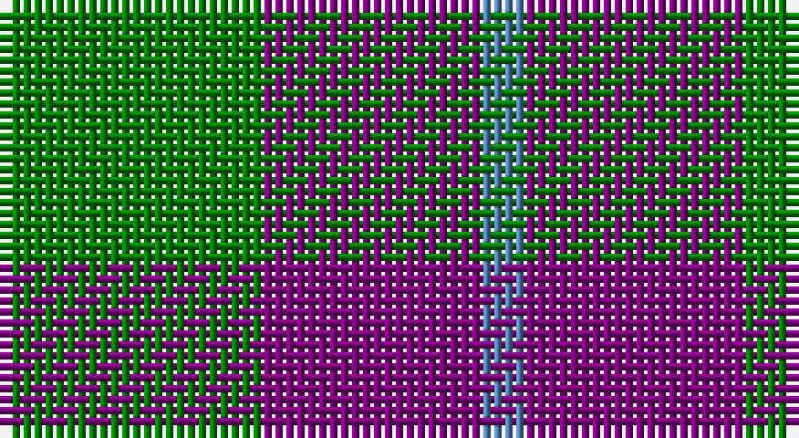

This page is one **sett** — a single exact thread-count. It belongs to the [tartan](/setts/g6p5t1/)
(the same proportion at any scale), whose colour order is pattern [BBG](/stripes/bbg/).

Sourced from weddslist.  It is a [3 stripe tartan](/stripes/stripes3/).

Original link http://www.weddslist.com/cgi-bin/tartans/pg.pl?source=sts

## Thread count
G/24 P20 B/4

One full sett is **68 threads**.

## Palette

Palette: <strong>custom</strong>
<table><thead><tr><th>Colour</th><th>Threads</th><th>Shade</th><th>Base</th><th>OKLCh</th></tr></thead><tbody><tr><td>G/</td><td style="text-align:right;font-variant-numeric:tabular-nums">24</td><td><code style="background-color:#008000;">#008000</code> <small style="color:#888">#008000</small></td><td>G <code style="background-color:#006100;">#006100</code></td><td><small style="color:#888">oklch(52.0% 0.177 142.5)</small></td></tr><tr><td>P</td><td style="text-align:right;font-variant-numeric:tabular-nums">20</td><td><code style="background-color:#800080;">#800080</code> <small style="color:#888">#800080</small></td><td>B <code style="background-color:#2A418A;">#2A418A</code></td><td><small style="color:#888">oklch(42.1% 0.193 328.4)</small></td></tr><tr><td>B/</td><td style="text-align:right;font-variant-numeric:tabular-nums">4</td><td><code style="background-color:#5480B0;">#5480B0</code> <small style="color:#888">#5480B0</small></td><td>B <code style="background-color:#2A418A;">#2A418A</code></td><td><small style="color:#888">oklch(58.8% 0.089 251.5)</small></td></tr></tbody></table>

# Sample pattern

## Nearest tartans

The nearest existing variants by ΔTartan distance, with this tartan at the top so the swatches line up against it.

ΔTartan

Tartan

Sett

—

<a href="/ttd/edit/#slug=g6p5t1~x4">Wilson's, No 55</a> <a class="nn-out" href="/variants/s3/g6p5t1~x4/" title="open its dictionary page">↗</a>

0.67

<a href="/ttd/edit/#slug=p5g6ly1~x4&amp;base=g6p5t1~x4">Wilson's, No 81</a> <a class="nn-out" href="/variants/s3/p5g6ly1~x4/" title="open its dictionary page">↗</a>

0.98

<a href="/ttd/edit/#slug=g6dp5t1~x4&amp;base=g6p5t1~x4">Wilson's No.055</a> <a class="nn-out" href="/variants/s3/g6dp5t1~x4/" title="open its dictionary page">↗</a>

1.22

<a href="/ttd/edit/#slug=db6g5r1~x4&amp;base=g6p5t1~x4">Ferguson</a> <a class="nn-out" href="/variants/s3/db6g5r1~x4/" title="open its dictionary page">↗</a>

1.29

<a href="/ttd/edit/#slug=db53g42r14&amp;base=g6p5t1~x4">Agnew</a> <a class="nn-out" href="/variants/s3/db53g42r14/" title="open its dictionary page">↗</a>

1.40

<a href="/ttd/edit/#slug=db13r2g13~x2&amp;base=g6p5t1~x4">Wilson's No 62, (Ferguson)</a> <a class="nn-out" href="/variants/s3/db13r2g13~x2/" title="open its dictionary page">↗</a>

1.40

<a href="/ttd/edit/#slug=db5g6r1~x4&amp;base=g6p5t1~x4">Wilson's No 84, Ferguson</a> <a class="nn-out" href="/variants/s3/db5g6r1~x4/" title="open its dictionary page">↗</a>

1.42

<a href="/ttd/edit/#slug=db53g42r14~x2&amp;base=g6p5t1~x4">Agnew</a> <a class="nn-out" href="/variants/s3/db53g42r14~x2/" title="open its dictionary page">↗</a>

1.46

<a href="/ttd/edit/#slug=g15r3p11t2~x2&amp;base=g6p5t1~x4">MacNab 7</a> <a class="nn-out" href="/variants/s4/g15r3p11t2~x2/" title="open its dictionary page">↗</a>

1.49

<a href="/ttd/edit/#slug=dg15r3dp11lb2&amp;base=g6p5t1~x4">MacNab WI2</a> <a class="nn-out" href="/variants/s4/dg15r3dp11lb2/" title="open its dictionary page">↗</a>

1.50

<a href="/ttd/edit/#slug=dp10g12ly1~x2&amp;base=g6p5t1~x4">Wilson's No.081</a> <a class="nn-out" href="/variants/s3/dp10g12ly1~x2/" title="open its dictionary page">↗</a>

## Neighbour map

Every grey dot is one of 14360 variants placed by the first two principal components of the ΔTartan feature space (44% of its variance). Red is this tartan; blue dots are its nearest — click one to open its page.

<svg viewBox="0 0 640 380" role="img" style="max-width:100%;height:auto;border:1px solid #e0e0e0;border-radius:4px;display:block" xmlns="http://www.w3.org/2000/svg"><image href="/nn/cloud.v1.png" width="640" height="380"/><a href="/variants/s3/p5g6ly1~x4/"><circle cx="259.1" cy="296.3" r="4" fill="#3465a4"><title>Wilson's, No 81</title></circle></a><a href="/variants/s3/g6dp5t1~x4/"><circle cx="289.6" cy="320.4" r="4" fill="#3465a4"><title>Wilson's No.055</title></circle></a><a href="/variants/s3/db6g5r1~x4/"><circle cx="293.2" cy="325.0" r="4" fill="#3465a4"><title>Ferguson</title></circle></a><a href="/variants/s3/db53g42r14/"><circle cx="247.8" cy="347.7" r="4" fill="#3465a4"><title>Agnew</title></circle></a><a href="/variants/s3/db13r2g13~x2/"><circle cx="288.4" cy="321.5" r="4" fill="#3465a4"><title>Wilson's No 62, (Ferguson)</title></circle></a><a href="/variants/s3/db5g6r1~x4/"><circle cx="291.3" cy="324.9" r="4" fill="#3465a4"><title>Wilson's No 84, Ferguson</title></circle></a><a href="/variants/s3/db53g42r14~x2/"><circle cx="252.0" cy="349.7" r="4" fill="#3465a4"><title>Agnew</title></circle></a><a href="/variants/s4/g15r3p11t2~x2/"><circle cx="251.6" cy="249.7" r="4" fill="#3465a4"><title>MacNab 7</title></circle></a><a href="/variants/s4/dg15r3dp11lb2/"><circle cx="252.9" cy="255.8" r="4" fill="#3465a4"><title>MacNab WI2</title></circle></a><a href="/variants/s3/dp10g12ly1~x2/"><circle cx="343.1" cy="276.0" r="4" fill="#3465a4"><title>Wilson's No.081</title></circle></a><circle cx="273.3" cy="305.8" r="5" fill="#c00000"/></svg>

ID: /variants/s3/g6p5t1~x4/
