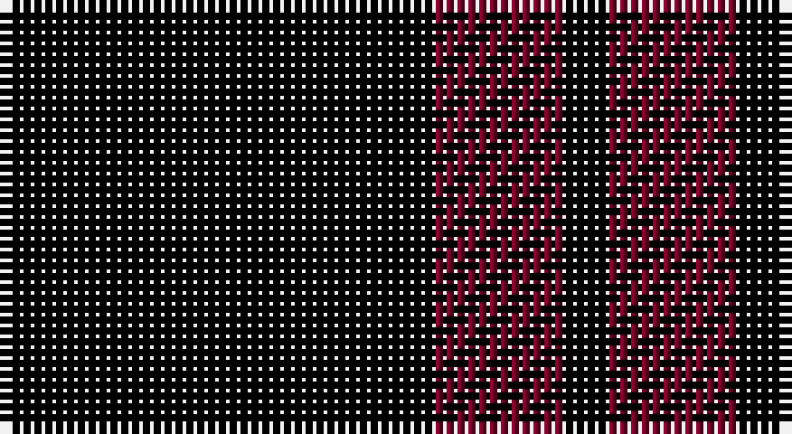

This page is one **sett** — a single exact thread-count. It belongs to the [tartan](/setts/k10r3k1/)
(the same proportion at any scale), whose colour order is pattern [KRK](/stripes/krk/).

Part of the [Red Watch](/tartans/red-watch/) tartan — the named design grouping this sett with its other cloths.

Sourced from register-of-tartans.  It is a [3 stripe tartan](/stripes/stripes3/).

Original link https://www.tartanregister.gov.uk/tartanDetails.aspx?ref=3480

## Also known as

This cloth is also recorded under:

- Red Watch #1
- Red Watch #3

## Register references

External register numbers recorded for this tartan.

- Scottish Register of Tartans: [3480](https://www.tartanregister.gov.uk/tartanDetails.aspx?ref=3480)
- Scottish Tartans Authority (ITI): 5427

## Thread count
K/40 DR12 K/4

One full sett is **68 threads**.

## Palette

Palette: <strong>Ingles Buchan</strong> <small style="color:#888">(1 of 2 colours)</small>
<table><thead><tr><th>Colour</th><th>Threads</th><th>Shade</th><th>Base</th><th>OKLCh</th></tr></thead><tbody><tr><td>K/</td><td style="text-align:right;font-variant-numeric:tabular-nums">40</td><td><code style="background-color:#000000;">#000000</code> <small style="color:#888">#000000</small></td><td>K <code style="background-color:#000000;">#000000</code></td><td><small style="color:#888">oklch(0.0% 0.000 0.0)</small></td></tr><tr><td>DR</td><td style="text-align:right;font-variant-numeric:tabular-nums">12</td><td><code style="background-color:#780028;">#780028</code> <small style="color:#888">#780028</small></td><td>R <code style="background-color:#CC0000;">#CC0000</code></td><td><small style="color:#888">oklch(36.5% 0.146 12.8)</small></td></tr><tr><td>K/</td><td style="text-align:right;font-variant-numeric:tabular-nums">4</td><td><code style="background-color:#000000;">#000000</code> <small style="color:#888">#000000</small></td><td>K <code style="background-color:#000000;">#000000</code></td><td><small style="color:#888">oklch(0.0% 0.000 0.0)</small></td></tr></tbody></table>

# Sample pattern

## Nearest tartans

The nearest existing variants by ΔTartan distance, with this tartan at the top so the swatches line up against it.

ΔTartan

Tartan

Sett

—

<a href="/ttd/edit/#slug=k10r3k1~x4">Red Watch</a> <a class="nn-out" href="/variants/s3/k10r3k1~x4/" title="open its dictionary page">↗</a>

2.15

<a href="/ttd/edit/#slug=k69r14ly5~x2&amp;base=k10r3k1~x4">Batson (Personal)</a> <a class="nn-out" href="/variants/s3/k69r14ly5~x2/" title="open its dictionary page">↗</a>

2.19

<a href="/ttd/edit/#slug=k4r1~x6&amp;base=k10r3k1~x4">St Kilda</a> <a class="nn-out" href="/variants/s2/k4r1~x6/" title="open its dictionary page">↗</a>

2.34

<a href="/ttd/edit/#slug=k4r1~x36&amp;base=k10r3k1~x4">St Kilda</a> <a class="nn-out" href="/variants/s2/k4r1~x36/" title="open its dictionary page">↗</a>

2.36

<a href="/ttd/edit/#slug=k20db1k4db3~x4&amp;base=k10r3k1~x4">Loevenstein Castle 2 (Artefact)</a> <a class="nn-out" href="/variants/s4/k20db1k4db3~x4/" title="open its dictionary page">↗</a>

2.44

<a href="/ttd/edit/#slug=k24g3r3k24r2k2r2&amp;base=k10r3k1~x4">Unidentified 11</a> <a class="nn-out" href="/variants/s7/k24g3r3k24r2k2r2/" title="open its dictionary page">↗</a>

2.48

<a href="/ttd/edit/#slug=db1k12db1~x10&amp;base=k10r3k1~x4">Staines (2013)</a> <a class="nn-out" href="/variants/s3/db1k12db1~x10/" title="open its dictionary page">↗</a>

2.48

<a href="/ttd/edit/#slug=k2ri4k7r1k1~x2&amp;base=k10r3k1~x4">Romsdal, Tresfjord</a> <a class="nn-out" href="/variants/s5/k2ri4k7r1k1~x2/" title="open its dictionary page">↗</a>

2.48

<a href="/ttd/edit/#slug=k55r18k4r18k38&amp;base=k10r3k1~x4">Unidentified Kirtle</a> <a class="nn-out" href="/variants/s5/k55r18k4r18k38/" title="open its dictionary page">↗</a>

2.51

<a href="/ttd/edit/#slug=k15n7k6n11k50n4~x2&amp;base=k10r3k1~x4">Freedom of Scotland</a> <a class="nn-out" href="/variants/s6/k15n7k6n11k50n4~x2/" title="open its dictionary page">↗</a>

2.58

<a href="/ttd/edit/#slug=k4k12k3o7k26o3~x2&amp;base=k10r3k1~x4">Crombie House Check</a> <a class="nn-out" href="/variants/s6/k4k12k3o7k26o3~x2/" title="open its dictionary page">↗</a>

## Neighbour map

Every grey dot is one of 14360 variants placed by the first two principal components of the ΔTartan feature space (44% of its variance). Red is this tartan; blue dots are its nearest — click one to open its page.

<svg viewBox="0 0 640 380" role="img" style="max-width:100%;height:auto;border:1px solid #e0e0e0;border-radius:4px;display:block" xmlns="http://www.w3.org/2000/svg"><image href="/nn/cloud.v1.png" width="640" height="380"/><a href="/variants/s3/k69r14ly5~x2/"><circle cx="513.4" cy="245.9" r="4" fill="#3465a4"><title>Batson (Personal)</title></circle></a><a href="/variants/s2/k4r1~x6/"><circle cx="481.4" cy="362.6" r="4" fill="#3465a4"><title>St Kilda</title></circle></a><a href="/variants/s2/k4r1~x36/"><circle cx="505.2" cy="366.0" r="4" fill="#3465a4"><title>St Kilda</title></circle></a><a href="/variants/s4/k20db1k4db3~x4/"><circle cx="626.0" cy="279.6" r="4" fill="#3465a4"><title>Loevenstein Castle 2 (Artefact)</title></circle></a><a href="/variants/s7/k24g3r3k24r2k2r2/"><circle cx="548.1" cy="219.2" r="4" fill="#3465a4"><title>Unidentified 11</title></circle></a><a href="/variants/s3/db1k12db1~x10/"><circle cx="626.0" cy="300.4" r="4" fill="#3465a4"><title>Staines (2013)</title></circle></a><a href="/variants/s5/k2ri4k7r1k1~x2/"><circle cx="386.9" cy="267.7" r="4" fill="#3465a4"><title>Romsdal, Tresfjord</title></circle></a><a href="/variants/s5/k55r18k4r18k38/"><circle cx="468.6" cy="260.9" r="4" fill="#3465a4"><title>Unidentified Kirtle</title></circle></a><a href="/variants/s6/k15n7k6n11k50n4~x2/"><circle cx="564.5" cy="266.5" r="4" fill="#3465a4"><title>Freedom of Scotland</title></circle></a><a href="/variants/s6/k4k12k3o7k26o3~x2/"><circle cx="552.3" cy="281.2" r="4" fill="#3465a4"><title>Crombie House Check</title></circle></a><circle cx="550.0" cy="308.9" r="5" fill="#c00000"/></svg>

ID: /variants/s3/k10r3k1~x4/
