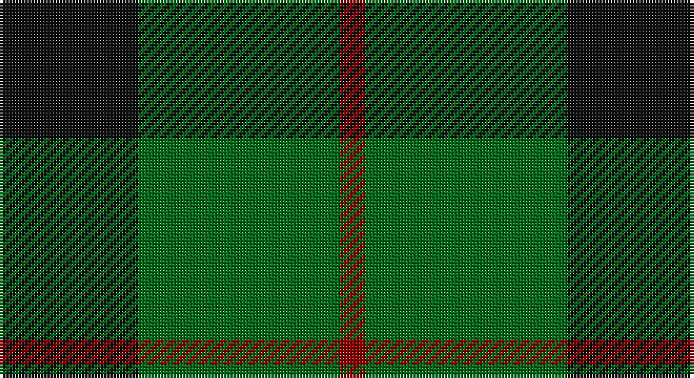

This page is one **sett** — a single exact thread-count. It belongs to the [tartan](/setts/k11g16r2/)
(the same proportion at any scale), whose colour order is pattern [KGR](/stripes/kgr/).

Part of the [Kincaid of Kincaid](/tartans/kincaid-of-kincaid/) tartan — the named design grouping this sett with its other cloths.

Sourced from tartans-authority.  It is a [3 stripe tartan](/stripes/stripes3/).

Original link http://www.tartansauthority.com/tartan-ferret/display/1106/

## Also known as

This cloth is also recorded under:

- Kincaid, of Kincaid

## Register references

External register numbers recorded for this tartan.

- Scottish Tartans Authority (ITI): 1106

## Thread count
K/44 G64 DR/8

One full sett is **180 threads**.

## Palette

Palette: <strong>Tartan Register</strong>
<table><thead><tr><th>Colour</th><th>Threads</th><th>Shade</th><th>Base</th><th>OKLCh</th></tr></thead><tbody><tr><td>K/</td><td style="text-align:right;font-variant-numeric:tabular-nums">44</td><td><code style="background-color:#101010;">#101010</code> <small style="color:#888">#101010</small></td><td>K <code style="background-color:#000000;">#000000</code></td><td><small style="color:#888">oklch(17.3% 0.000 89.9)</small></td></tr><tr><td>G</td><td style="text-align:right;font-variant-numeric:tabular-nums">64</td><td><code style="background-color:#006818;">#006818</code> <small style="color:#888">#006818</small></td><td>G <code style="background-color:#006100;">#006100</code></td><td><small style="color:#888">oklch(45.0% 0.142 145.0)</small></td></tr><tr><td>DR/</td><td style="text-align:right;font-variant-numeric:tabular-nums">8</td><td><code style="background-color:#880000;">#880000</code> <small style="color:#888">#880000</small></td><td>R <code style="background-color:#CC0000;">#CC0000</code></td><td><small style="color:#888">oklch(39.4% 0.162 29.2)</small></td></tr></tbody></table>

# Sample pattern

## Compared to the master

This cloth is one sett of its design; the master sett (the exemplar the design is anchored on) is below for comparison.

<figure style="margin:0"><figcaption style="color:#888;font-size:smaller">this sett</figcaption></figure>
<figure style="margin:0"><figcaption style="color:#888;font-size:smaller"><a href="/setts/g16k11g16r2/">master sett →</a></figcaption></figure>

## Nearest tartans

The nearest existing variants by ΔTartan distance, with this tartan at the top so the swatches line up against it.

ΔTartan

Tartan

Sett

—

<a href="/ttd/edit/#slug=k11g16r2~x4">Kincaid of Kincaid (Clan)</a> <a class="nn-out" href="/variants/s3/k11g16r2~x4/" title="open its dictionary page">↗</a>

0.84

<a href="/ttd/edit/#slug=k5g6t1~x4&amp;base=k11g16r2~x4">Wilson's No.050</a> <a class="nn-out" href="/variants/s3/k5g6t1~x4/" title="open its dictionary page">↗</a>

1.35

<a href="/ttd/edit/#slug=g6k2r3k1~x4&amp;base=k11g16r2~x4">Red Watch (Fashion) #1</a> <a class="nn-out" href="/variants/s4/g6k2r3k1~x4/" title="open its dictionary page">↗</a>

1.36

<a href="/ttd/edit/#slug=g30k20g3~x2&amp;base=k11g16r2~x4">Scotch Tape (Corporate)</a> <a class="nn-out" href="/variants/s3/g30k20g3~x2/" title="open its dictionary page">↗</a>

1.41

<a href="/ttd/edit/#slug=k8g3k4g20r4~x2&amp;base=k11g16r2~x4">MacArthur-Fox (Personal)</a> <a class="nn-out" href="/variants/s5/k8g3k4g20r4~x2/" title="open its dictionary page">↗</a>

1.44

<a href="/ttd/edit/#slug=db5g6r1~x4&amp;base=k11g16r2~x4">Wilson's No 84, Ferguson</a> <a class="nn-out" href="/variants/s3/db5g6r1~x4/" title="open its dictionary page">↗</a>

1.44

<a href="/ttd/edit/#slug=k3g15k20ly3~x2&amp;base=k11g16r2~x4">Scotch Tape 2 (Corporate)</a> <a class="nn-out" href="/variants/s4/k3g15k20ly3~x2/" title="open its dictionary page">↗</a>

1.45

<a href="/ttd/edit/#slug=g6dp5t1~x4&amp;base=k11g16r2~x4">Wilson's No.055</a> <a class="nn-out" href="/variants/s3/g6dp5t1~x4/" title="open its dictionary page">↗</a>

1.51

<a href="/ttd/edit/#slug=g10k2dp5g1~x8&amp;base=k11g16r2~x4">Bumbee #1 (Fashion)</a> <a class="nn-out" href="/variants/s4/g10k2dp5g1~x8/" title="open its dictionary page">↗</a>

1.52

<a href="/ttd/edit/#slug=g4k5g4ly1~x2&amp;base=k11g16r2~x4">Wilson's No.053 #2</a> <a class="nn-out" href="/variants/s4/g4k5g4ly1~x2/" title="open its dictionary page">↗</a>

1.54

<a href="/ttd/edit/#slug=k11dg17r3~x2&amp;base=k11g16r2~x4">Kincaid</a> <a class="nn-out" href="/variants/s3/k11dg17r3~x2/" title="open its dictionary page">↗</a>

## Neighbour map

Every grey dot is one of 14360 variants placed by the first two principal components of the ΔTartan feature space (44% of its variance). Red is this tartan; blue dots are its nearest — click one to open its page.

<svg viewBox="0 0 640 380" role="img" style="max-width:100%;height:auto;border:1px solid #e0e0e0;border-radius:4px;display:block" xmlns="http://www.w3.org/2000/svg"><image href="/nn/cloud.v1.png" width="640" height="380"/><a href="/variants/s3/k5g6t1~x4/"><circle cx="284.5" cy="326.7" r="4" fill="#3465a4"><title>Wilson's No.050</title></circle></a><a href="/variants/s4/g6k2r3k1~x4/"><circle cx="283.4" cy="302.7" r="4" fill="#3465a4"><title>Red Watch (Fashion) #1</title></circle></a><a href="/variants/s3/g30k20g3~x2/"><circle cx="419.8" cy="324.6" r="4" fill="#3465a4"><title>Scotch Tape (Corporate)</title></circle></a><a href="/variants/s5/k8g3k4g20r4~x2/"><circle cx="355.6" cy="278.7" r="4" fill="#3465a4"><title>MacArthur-Fox (Personal)</title></circle></a><a href="/variants/s3/db5g6r1~x4/"><circle cx="291.3" cy="324.9" r="4" fill="#3465a4"><title>Wilson's No 84, Ferguson</title></circle></a><a href="/variants/s4/k3g15k20ly3~x2/"><circle cx="311.5" cy="279.8" r="4" fill="#3465a4"><title>Scotch Tape 2 (Corporate)</title></circle></a><a href="/variants/s3/g6dp5t1~x4/"><circle cx="289.6" cy="320.4" r="4" fill="#3465a4"><title>Wilson's No.055</title></circle></a><a href="/variants/s4/g10k2dp5g1~x8/"><circle cx="355.3" cy="264.8" r="4" fill="#3465a4"><title>Bumbee #1 (Fashion)</title></circle></a><a href="/variants/s4/g4k5g4ly1~x2/"><circle cx="279.2" cy="328.9" r="4" fill="#3465a4"><title>Wilson's No.053 #2</title></circle></a><a href="/variants/s3/k11dg17r3~x2/"><circle cx="294.8" cy="321.8" r="4" fill="#3465a4"><title>Kincaid</title></circle></a><circle cx="338.8" cy="314.8" r="5" fill="#c00000"/></svg>

ID: /variants/s3/k11g16r2~x4/
