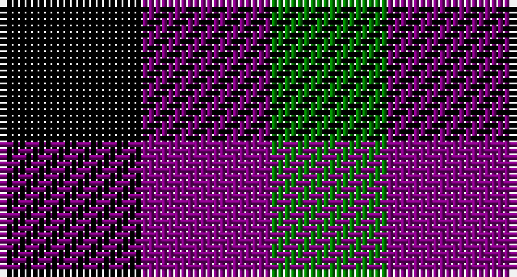

This page is one **sett** — a single exact thread-count. It belongs to the [tartan](/setts/k11p10g9/)
(the same proportion at any scale), whose colour order is pattern [GBK](/stripes/gbk/).

Sourced from weddslist.  It is a [3 stripe tartan](/stripes/stripes3/).

Original link http://www.weddslist.com/cgi-bin/tartans/pg.pl?source=sts

## Thread count
K/22 P20 G/18

One full sett is **80 threads**.

## Palette

Palette: <strong>Ingles Buchan</strong> <small style="color:#888">(1 of 3 colours)</small>
<table><thead><tr><th>Colour</th><th>Threads</th><th>Shade</th><th>Base</th><th>OKLCh</th></tr></thead><tbody><tr><td>K/</td><td style="text-align:right;font-variant-numeric:tabular-nums">22</td><td><code style="background-color:#000000;">#000000</code> <small style="color:#888">#000000</small></td><td>K <code style="background-color:#000000;">#000000</code></td><td><small style="color:#888">oklch(0.0% 0.000 0.0)</small></td></tr><tr><td>P</td><td style="text-align:right;font-variant-numeric:tabular-nums">20</td><td><code style="background-color:#800080;">#800080</code> <small style="color:#888">#800080</small></td><td>B <code style="background-color:#2A418A;">#2A418A</code></td><td><small style="color:#888">oklch(42.1% 0.193 328.4)</small></td></tr><tr><td>G/</td><td style="text-align:right;font-variant-numeric:tabular-nums">18</td><td><code style="background-color:#008000;">#008000</code> <small style="color:#888">#008000</small></td><td>G <code style="background-color:#006100;">#006100</code></td><td><small style="color:#888">oklch(52.0% 0.177 142.5)</small></td></tr></tbody></table>

# Sample pattern

## Nearest tartans

The nearest existing variants by ΔTartan distance, with this tartan at the top so the swatches line up against it.

ΔTartan

Tartan

Sett

—

<a href="/ttd/edit/#slug=k11p10g9~x2">Wilson's, No 185</a> <a class="nn-out" href="/variants/s3/k11p10g9~x2/" title="open its dictionary page">↗</a>

1.26

<a href="/ttd/edit/#slug=k8g7db8~x2&amp;base=k11p10g9~x2">Glen Lyon</a> <a class="nn-out" href="/variants/s3/k8g7db8~x2/" title="open its dictionary page">↗</a>

1.42

<a href="/ttd/edit/#slug=r10k11g9~x2&amp;base=k11p10g9~x2">Wilson's, No 204</a> <a class="nn-out" href="/variants/s3/r10k11g9~x2/" title="open its dictionary page">↗</a>

1.52

<a href="/ttd/edit/#slug=k11g9dp10~x2&amp;base=k11p10g9~x2">Wilson's No.185</a> <a class="nn-out" href="/variants/s3/k11g9dp10~x2/" title="open its dictionary page">↗</a>

1.67

<a href="/ttd/edit/#slug=lo5db5k3~x4&amp;base=k11p10g9~x2">Kazakhstan Relic (Artefact)</a> <a class="nn-out" href="/variants/s3/lo5db5k3~x4/" title="open its dictionary page">↗</a>

1.73

<a href="/ttd/edit/#slug=k11g9r10~x2&amp;base=k11p10g9~x2">Wilson's No.204</a> <a class="nn-out" href="/variants/s3/k11g9r10~x2/" title="open its dictionary page">↗</a>

1.79

<a href="/ttd/edit/#slug=k1g1r1~x8&amp;base=k11p10g9~x2">Wilson's, No 187</a> <a class="nn-out" href="/variants/s3/k1g1r1~x8/" title="open its dictionary page">↗</a>

1.84

<a href="/ttd/edit/#slug=k1lb1o1~x6&amp;base=k11p10g9~x2">Coigach Tweed</a> <a class="nn-out" href="/variants/s3/k1lb1o1~x6/" title="open its dictionary page">↗</a>

1.94

<a href="/ttd/edit/#slug=db1lr1r1~x4&amp;base=k11p10g9~x2">Usa</a> <a class="nn-out" href="/variants/s3/db1lr1r1~x4/" title="open its dictionary page">↗</a>

2.15

<a href="/ttd/edit/#slug=r4k7t4~x2&amp;base=k11p10g9~x2">Wilson's No.198</a> <a class="nn-out" href="/variants/s3/r4k7t4~x2/" title="open its dictionary page">↗</a>

2.16

<a href="/ttd/edit/#slug=k1w1r1~x14&amp;base=k11p10g9~x2">Dacre Estate Check</a> <a class="nn-out" href="/variants/s3/k1w1r1~x14/" title="open its dictionary page">↗</a>

## Neighbour map

Every grey dot is one of 14360 variants placed by the first two principal components of the ΔTartan feature space (44% of its variance). Red is this tartan; blue dots are its nearest — click one to open its page.

<svg viewBox="0 0 640 380" role="img" style="max-width:100%;height:auto;border:1px solid #e0e0e0;border-radius:4px;display:block" xmlns="http://www.w3.org/2000/svg"><image href="/nn/cloud.v1.png" width="640" height="380"/><a href="/variants/s3/k8g7db8~x2/"><circle cx="23.3" cy="366.0" r="4" fill="#3465a4"><title>Glen Lyon</title></circle></a><a href="/variants/s3/r10k11g9~x2/"><circle cx="34.8" cy="366.0" r="4" fill="#3465a4"><title>Wilson's, No 204</title></circle></a><a href="/variants/s3/k11g9dp10~x2/"><circle cx="78.2" cy="366.0" r="4" fill="#3465a4"><title>Wilson's No.185</title></circle></a><a href="/variants/s3/lo5db5k3~x4/"><circle cx="94.1" cy="366.0" r="4" fill="#3465a4"><title>Kazakhstan Relic (Artefact)</title></circle></a><a href="/variants/s3/k11g9r10~x2/"><circle cx="63.9" cy="366.0" r="4" fill="#3465a4"><title>Wilson's No.204</title></circle></a><a href="/variants/s3/k1g1r1~x8/"><circle cx="14.0" cy="366.0" r="4" fill="#3465a4"><title>Wilson's, No 187</title></circle></a><a href="/variants/s3/k1lb1o1~x6/"><circle cx="14.0" cy="366.0" r="4" fill="#3465a4"><title>Coigach Tweed</title></circle></a><a href="/variants/s3/db1lr1r1~x4/"><circle cx="14.0" cy="366.0" r="4" fill="#3465a4"><title>Usa</title></circle></a><a href="/variants/s3/r4k7t4~x2/"><circle cx="141.9" cy="366.0" r="4" fill="#3465a4"><title>Wilson's No.198</title></circle></a><a href="/variants/s3/k1w1r1~x14/"><circle cx="14.0" cy="366.0" r="4" fill="#3465a4"><title>Dacre Estate Check</title></circle></a><circle cx="36.2" cy="366.0" r="5" fill="#c00000"/></svg>

ID: /variants/s3/k11p10g9~x2/
