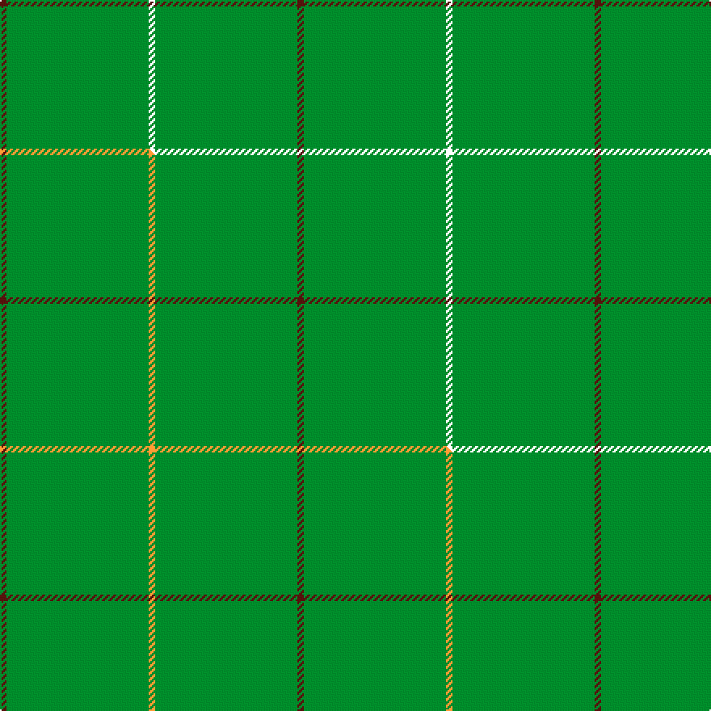

This is one **variant** — a specific cloth: this exact thread count and colourway, with its own
provenance below. It is one weaving of the [sett](/setts/k1g22dr1/) (the scale-free proportion — the
same cloth at any scale or shade), whose colour order is pattern [BGK](/stripes/bgk/).

Part of the [Kenmore Hunting](/tartans/k/ke/kenmore-hunting/) tartan — the named design grouping this sett with its other cloths.

Sourced from tartans-authority.  It is a [3 stripe tartan](/stripes/stripes3/).

Original link [https://www.tartanregister.gov.uk/tartanDetails.aspx?ref=2234](https://www.tartanregister.gov.uk/tartanDetails.aspx?ref=2234)

Dataset <small>— provenance for this record, inherited from the source manifest</small>

<dl class="dataset-prov">
<dt>source</dt><dd><a href="/sources/tartans-authority/">Scottish Tartans Authority</a></dd>
<dt>data captured from</dt><dd><a href="https://github.com/thetartan/tartan-database/blob/master/data/tartans-authority/data.csv">https://github.com/thetartan/tartan-database/blob/master/data/tartans-authority/data.csv</a></dd>
<dt>data date</dt><dd>Oct. 1995 <small>(this record)</small></dd>
<dt>licence</dt><dd><a href="https://creativecommons.org/licenses/by-nc-nd/4.0/">CC BY-NC-ND 4.0</a></dd>
</dl>

Capture chain <small>— the hands this data passed through, oldest first; each capture carries its own licence</small>

<ol class="capture-chain">
<li><a href="https://www.tartansauthority.com/">Scottish Tartans Authority</a> <small>the heritage body's archive — its tartan-ferret record browser is retired (links repaired to the SRT, above)</small></li>
<li><a href="https://github.com/thetartan/tartan-database">thetartan/tartan-database</a> <small>2016-2017</small> · <a href="https://creativecommons.org/licenses/by-nc-nd/4.0/">CC BY-NC-ND 4.0</a> <small>Levko Kravets's frozen compilation — the capture we vendored, and where its CC licence text came from</small></li>
<li>this dictionary <small>captured 2026-06-10 · commit 5bf86c7566</small> <small>each re-capture is a git commit to data/sources</small></li>
</ol>

## Register references

External register numbers recorded for this tartan.

- Scottish Tartans Authority (ITI): 2234

## Thread count
DR/4 G88 K/4

One full sett is **184 threads**.

## Palette
<table><thead><tr><th>Colour</th><th>Shade</th><th>OKLCh</th></tr></thead><tbody><tr><td>DR</td><td><code style="background-color:#55120C;">#55120C</code> <small style="color:#888">#55120C</small></td><td><small style="color:#888">oklch(30.0% 0.099 29.3)</small></td></tr><tr><td>G</td><td><code style="background-color:#008B2A;">#008B2A</code> <small style="color:#888">#008B2A</small></td><td><small style="color:#888">oklch(55.4% 0.170 145.9)</small></td></tr></tbody></table>

# Sample pattern

## Compared to the master

This cloth is one sett of its design; the master sett (the exemplar the design is anchored on) is below for comparison.

Its **ΔTartan distance** from the master is **0.30** — the same measure the nearest-tartans table ranks by (0 is identical; a re-scale of the same cloth is near 0, a recolour or a different proportion further).

<figure class="master-compare" style="margin:0">

this sett
master sett ★

<figcaption style="color:#888;font-size:smaller">One weave of this sett against the <a href="/setts/dr1g22lo1/">master sett ★</a>, split on the diagonal: a shared proportion runs seamlessly across it with only the shades shifting; a different proportion breaks on it.</figcaption>
</figure>

## Nearest tartan variants

The nearest existing variants by ΔTartan distance, with this cloth at the top so the swatches line up against it.

ΔTartan

Threads

Variant

Sett

—

184

<a href="/variants/s3/k1g22dr1~x4/">Kenmore Hunting (Fashion)</a>

<a href="/ttd/edit/#slug=dr1g22lo1~x4&amp;base=k1g22dr1~x4" title="compare in the TTD">0.30</a>

184

<a href="/variants/s3/dr1g22lo1~x4/">Kenmore Hunting</a>

<a href="/ttd/edit/#slug=g30w2dr5~x4&amp;base=k1g22dr1~x4" title="compare in the TTD">0.44</a>

156

<a href="/variants/s3/g30w2dr5~x4/">S3</a>

<a href="/ttd/edit/#slug=dr2k4g45k3y2~x2&amp;base=k1g22dr1~x4" title="compare in the TTD">0.66</a>

216

<a href="/variants/s5/dr2k4g45k3y2~x2/">Mar, Tribe of (Clan)</a>

<a href="/ttd/edit/#slug=r2k3g45k3y2&amp;base=k1g22dr1~x4" title="compare in the TTD">0.67</a>

106

<a href="/variants/s5/r2k3g45k3y2/">Mar Tribe</a>

<a href="/ttd/edit/#slug=r2k4g45k3y2&amp;base=k1g22dr1~x4" title="compare in the TTD">0.67</a>

108

<a href="/variants/s5/r2k4g45k3y2/">Mar (Tribe of..) District Tartan</a>

<a href="/ttd/edit/#slug=dg1k20dg1~x6~dg1804158&amp;base=k1g22dr1~x4" title="compare in the TTD">0.91</a>

252

<a href="/variants/s3/dg1k20dg1~x6~dg1804158/">Stirling of Keir</a>

<a href="/ttd/edit/#slug=r3k4lb2g64k6y3~x2&amp;base=k1g22dr1~x4" title="compare in the TTD">1.29</a>

316

<a href="/variants/s6/r3k4lb2g64k6y3~x2/">Braemar Royal Highland Gathering</a>

<a href="/ttd/edit/#slug=ly24r1w1db1~x11&amp;base=k1g22dr1~x4" title="compare in the TTD">1.30</a>

319

<a href="/variants/s4/ly24r1w1db1~x11/">Dutch Football (Corporate)</a>

<a href="/ttd/edit/#slug=g50r1dr20k2w1~x2&amp;base=k1g22dr1~x4" title="compare in the TTD">1.36</a>

194

<a href="/variants/s5/g50r1dr20k2w1~x2/">Kenspeckle (Corporate)</a>

<a href="/ttd/edit/#slug=dg50r1dr20k2w1~x2~dg1806142&amp;base=k1g22dr1~x4" title="compare in the TTD">1.36</a>

194

<a href="/variants/s5/dg50r1dr20k2w1~x2~dg1806142/">Kenspeckle</a>

## Neighbour map

Every grey dot is one of 13621 variants placed by the first two principal components of the ΔTartan feature space (42% of its variance). Red is this tartan; blue dots are its nearest — click one to open its page.

<svg viewBox="0 0 640 380" role="img" style="max-width:100%;height:auto;border:1px solid #e0e0e0;border-radius:4px;display:block" xmlns="http://www.w3.org/2000/svg"><image href="/nn/cloud.v1.png" width="640" height="380"/><a href="/variants/s3/dr1g22lo1~x4/"><circle cx="626.0" cy="250.6" r="4" fill="#3465a4"><title>Kenmore Hunting</title></circle></a><a href="/variants/s3/g30w2dr5~x4/"><circle cx="578.3" cy="254.1" r="4" fill="#3465a4"><title>S3</title></circle></a><a href="/variants/s5/dr2k4g45k3y2~x2/"><circle cx="498.1" cy="137.1" r="4" fill="#3465a4"><title>Mar, Tribe of (Clan)</title></circle></a><a href="/variants/s5/r2k3g45k3y2/"><circle cx="513.0" cy="134.9" r="4" fill="#3465a4"><title>Mar Tribe</title></circle></a><a href="/variants/s5/r2k4g45k3y2/"><circle cx="494.1" cy="134.6" r="4" fill="#3465a4"><title>Mar (Tribe of..) District Tartan</title></circle></a><a href="/variants/s3/dg1k20dg1~x6~dg1804158/"><circle cx="626.0" cy="203.0" r="4" fill="#3465a4"><title>Stirling of Keir</title></circle></a><a href="/variants/s6/r3k4lb2g64k6y3~x2/"><circle cx="467.3" cy="94.7" r="4" fill="#3465a4"><title>Braemar Royal Highland Gathering</title></circle></a><a href="/variants/s4/ly24r1w1db1~x11/"><circle cx="626.0" cy="172.7" r="4" fill="#3465a4"><title>Dutch Football (Corporate)</title></circle></a><a href="/variants/s5/g50r1dr20k2w1~x2/"><circle cx="435.8" cy="112.8" r="4" fill="#3465a4"><title>Kenspeckle (Corporate)</title></circle></a><a href="/variants/s5/dg50r1dr20k2w1~x2~dg1806142/"><circle cx="477.0" cy="124.1" r="4" fill="#3465a4"><title>Kenspeckle</title></circle></a><circle cx="626.0" cy="201.0" r="5" fill="#c00000"/><text x="320" y="376" text-anchor="middle" font-size="11" fill="#999">ground</text><text x="11" y="190" text-anchor="middle" font-size="11" fill="#999" transform="rotate(-90 11 190)">complexity</text></svg>

ID: /variants/s3/k1g22dr1~x4/
