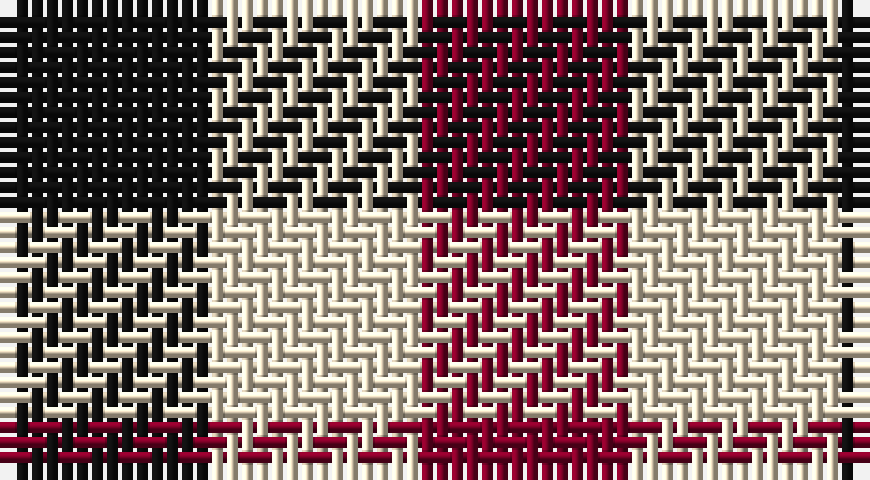

This page is one **sett** — a single exact thread-count. It belongs to the [tartan](/setts/k1w1r1/)
(the same proportion at any scale), whose colour order is pattern [KWR](/stripes/kwr/).

Sourced from register-of-tartans.  It is a [3 stripe tartan](/stripes/stripes3/).

Original link https://www.tartanregister.gov.uk/tartanDetails.aspx?ref=862

## Also known as

This cloth is also recorded under:

- Dacre Estate Check

2 attestations — the source records this cloth was collapsed from (oldest owns this page)

<ul>
<li>01/01/1868 — Dacre Estate Check (register-of-tartans, <a href="https://www.tartanregister.gov.uk/tartanDetails.aspx?ref=862">record</a>)</li>
<li>pre 1868 — Dacre (Estate Check) (tartans-authority, <a href="http://www.tartansauthority.com/tartan-ferret/display/7330/">record</a>)</li>
</ul>

## Register references

External register numbers recorded for this tartan.

- Scottish Register of Tartans: [862](https://www.tartanregister.gov.uk/tartanDetails.aspx?ref=862)
- Scottish Tartans Authority (ITI): 7330

## Thread count
K/14 W14 DR/14

One full sett is **56 threads**.

## Palette

Palette: <strong>Tartan Register</strong> <small style="color:#888">(2 of 3 colours)</small>
<table><thead><tr><th>Colour</th><th>Threads</th><th>Shade</th><th>Base</th><th>OKLCh</th></tr></thead><tbody><tr><td>K/</td><td style="text-align:right;font-variant-numeric:tabular-nums">14</td><td><code style="background-color:#101010;">#101010</code> <small style="color:#888">#101010</small></td><td>K <code style="background-color:#000000;">#000000</code></td><td><small style="color:#888">oklch(17.3% 0.000 89.9)</small></td></tr><tr><td>W</td><td style="text-align:right;font-variant-numeric:tabular-nums">14</td><td><code style="background-color:#F0E0C4;">#F0E0C4</code> <small style="color:#888">#F0E0C4</small></td><td>W <code style="background-color:#F7F7F7;">#F7F7F7</code></td><td><small style="color:#888">oklch(91.2% 0.041 81.7)</small></td></tr><tr><td>DR/</td><td style="text-align:right;font-variant-numeric:tabular-nums">14</td><td><code style="background-color:#800028;">#800028</code> <small style="color:#888">#800028</small></td><td>R <code style="background-color:#CC0000;">#CC0000</code></td><td><small style="color:#888">oklch(38.2% 0.152 14.5)</small></td></tr></tbody></table>

# Sample pattern

## Nearest tartans

The nearest existing variants by ΔTartan distance, with this tartan at the top so the swatches line up against it.

ΔTartan

Tartan

Sett

—

<a href="/ttd/edit/#slug=k1w1r1~x14">Dacre Estate Check</a> <a class="nn-out" href="/variants/s3/k1w1r1~x14/" title="open its dictionary page">↗</a>

0.51

<a href="/ttd/edit/#slug=k1lb1o1~x6&amp;base=k1w1r1~x14">Coigach Tweed</a> <a class="nn-out" href="/variants/s3/k1lb1o1~x6/" title="open its dictionary page">↗</a>

1.00

<a href="/ttd/edit/#slug=db1lr1r1~x4&amp;base=k1w1r1~x14">Usa</a> <a class="nn-out" href="/variants/s3/db1lr1r1~x4/" title="open its dictionary page">↗</a>

1.20

<a href="/ttd/edit/#slug=r1db1ly1~x40&amp;base=k1w1r1~x14">Mothers Pride</a> <a class="nn-out" href="/variants/s3/r1db1ly1~x40/" title="open its dictionary page">↗</a>

1.40

<a href="/ttd/edit/#slug=db1w1r1~x22&amp;base=k1w1r1~x14">Aquascutum</a> <a class="nn-out" href="/variants/s3/db1w1r1~x22/" title="open its dictionary page">↗</a>

1.70

<a href="/ttd/edit/#slug=dg1r1w1db1~x20&amp;base=k1w1r1~x14">Algarve</a> <a class="nn-out" href="/variants/s4/dg1r1w1db1~x20/" title="open its dictionary page">↗</a>

1.75

<a href="/ttd/edit/#slug=k1g1r1~x8&amp;base=k1w1r1~x14">Wilson's, No 187</a> <a class="nn-out" href="/variants/s3/k1g1r1~x8/" title="open its dictionary page">↗</a>

1.83

<a href="/variants/s4/k1w1do1~x8/">Hogg</a>

2.01

<a href="/ttd/edit/#slug=r10k11g9~x2&amp;base=k1w1r1~x14">Wilson's, No 204</a> <a class="nn-out" href="/variants/s3/r10k11g9~x2/" title="open its dictionary page">↗</a>

2.04

<a href="/ttd/edit/#slug=k11g9r10~x2&amp;base=k1w1r1~x14">Wilson's No.204</a> <a class="nn-out" href="/variants/s3/k11g9r10~x2/" title="open its dictionary page">↗</a>

2.16

<a href="/ttd/edit/#slug=k11p10g9~x2&amp;base=k1w1r1~x14">Wilson's, No 185</a> <a class="nn-out" href="/variants/s3/k11p10g9~x2/" title="open its dictionary page">↗</a>

## Neighbour map

Every grey dot is one of 14360 variants placed by the first two principal components of the ΔTartan feature space (44% of its variance). Red is this tartan; blue dots are its nearest — click one to open its page.

<svg viewBox="0 0 640 380" role="img" style="max-width:100%;height:auto;border:1px solid #e0e0e0;border-radius:4px;display:block" xmlns="http://www.w3.org/2000/svg"><image href="/nn/cloud.v1.png" width="640" height="380"/><a href="/variants/s3/k1lb1o1~x6/"><circle cx="14.0" cy="366.0" r="4" fill="#3465a4"><title>Coigach Tweed</title></circle></a><a href="/variants/s3/db1lr1r1~x4/"><circle cx="14.0" cy="366.0" r="4" fill="#3465a4"><title>Usa</title></circle></a><a href="/variants/s3/r1db1ly1~x40/"><circle cx="14.0" cy="366.0" r="4" fill="#3465a4"><title>Mothers Pride</title></circle></a><a href="/variants/s3/db1w1r1~x22/"><circle cx="14.0" cy="366.0" r="4" fill="#3465a4"><title>Aquascutum</title></circle></a><a href="/variants/s4/dg1r1w1db1~x20/"><circle cx="14.0" cy="366.0" r="4" fill="#3465a4"><title>Algarve</title></circle></a><a href="/variants/s3/k1g1r1~x8/"><circle cx="14.0" cy="366.0" r="4" fill="#3465a4"><title>Wilson's, No 187</title></circle></a><a href="/variants/s4/k1w1do1~x8/"><circle cx="35.0" cy="366.0" r="4" fill="#3465a4"><title>Hogg</title></circle></a><a href="/variants/s3/r10k11g9~x2/"><circle cx="34.8" cy="366.0" r="4" fill="#3465a4"><title>Wilson's, No 204</title></circle></a><a href="/variants/s3/k11g9r10~x2/"><circle cx="63.9" cy="366.0" r="4" fill="#3465a4"><title>Wilson's No.204</title></circle></a><a href="/variants/s3/k11p10g9~x2/"><circle cx="36.2" cy="366.0" r="4" fill="#3465a4"><title>Wilson's, No 185</title></circle></a><circle cx="14.0" cy="366.0" r="5" fill="#c00000"/></svg>

ID: /variants/s3/k1w1r1~x14/
