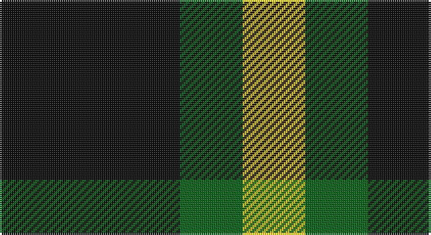

This page is one **sett** — a single exact thread-count. It belongs to the [tartan](/setts/k23g8ly8/)
(the same proportion at any scale), whose colour order is pattern [KGY](/stripes/kgy/).

Part of the [Zwijnenberg, Frans](/tartans/zwijnenberg-frans/) tartan — the named design grouping this sett with its other cloths.

Sourced from tartans-authority.  It is a [3 stripe tartan](/stripes/stripes3/).

Original link http://www.tartansauthority.com/tartan-ferret/display/11096/

## Register references

External register numbers recorded for this tartan.

- Scottish Register of Tartans: [11096](https://www.tartanregister.gov.uk/tartanDetails?ref=11096)
- Scottish Tartans Authority (ITI): 11096

## Thread count
K/92 G32 Y/32

One full sett is **188 threads**.

## Palette

Palette: <strong>Tartan Register</strong>
<table><thead><tr><th>Colour</th><th>Threads</th><th>Shade</th><th>Base</th><th>OKLCh</th></tr></thead><tbody><tr><td>K/</td><td style="text-align:right;font-variant-numeric:tabular-nums">92</td><td><code style="background-color:#101010;">#101010</code> <small style="color:#888">#101010</small></td><td>K <code style="background-color:#000000;">#000000</code></td><td><small style="color:#888">oklch(17.3% 0.000 89.9)</small></td></tr><tr><td>G</td><td style="text-align:right;font-variant-numeric:tabular-nums">32</td><td><code style="background-color:#006818;">#006818</code> <small style="color:#888">#006818</small></td><td>G <code style="background-color:#006100;">#006100</code></td><td><small style="color:#888">oklch(45.0% 0.142 145.0)</small></td></tr><tr><td>Y/</td><td style="text-align:right;font-variant-numeric:tabular-nums">32</td><td><code style="background-color:#FCCC00;">#FCCC00</code> <small style="color:#888">#FCCC00</small></td><td>Y <code style="background-color:#F2BF00;">#F2BF00</code></td><td><small style="color:#888">oklch(86.2% 0.176 91.5)</small></td></tr></tbody></table>

# Sample pattern

## Compared to the master

This cloth is one sett of its design; the master sett (the exemplar the design is anchored on) is below for comparison.

<figure style="margin:0"><figcaption style="color:#888;font-size:smaller">this sett</figcaption></figure>
<figure style="margin:0"><figcaption style="color:#888;font-size:smaller"><a href="/setts/k23g8lo8/">master sett →</a></figcaption></figure>

## Nearest tartans

The nearest existing variants by ΔTartan distance, with this tartan at the top so the swatches line up against it.

ΔTartan

Tartan

Sett

—

<a href="/ttd/edit/#slug=k23g8ly8~x4">Zwijnenberg, Frans (Personal)</a> <a class="nn-out" href="/variants/s3/k23g8ly8~x4/" title="open its dictionary page">↗</a>

1.16

<a href="/ttd/edit/#slug=k23g8lo8~x4&amp;base=k23g8ly8~x4">Zwijnenberg, Frans (Personal)</a> <a class="nn-out" href="/variants/s3/k23g8lo8~x4/" title="open its dictionary page">↗</a>

1.24

<a href="/ttd/edit/#slug=dp2g4ly1~x4&amp;base=k23g8ly8~x4">Wilson's No.201</a> <a class="nn-out" href="/variants/s3/dp2g4ly1~x4/" title="open its dictionary page">↗</a>

1.41

<a href="/ttd/edit/#slug=g4t1k2~x4&amp;base=k23g8ly8~x4">Wilson's, No 45</a> <a class="nn-out" href="/variants/s3/g4t1k2~x4/" title="open its dictionary page">↗</a>

1.47

<a href="/ttd/edit/#slug=k4g6r1~x10&amp;base=k23g8ly8~x4">Kincaid, of Kincaid</a> <a class="nn-out" href="/variants/s3/k4g6r1~x10/" title="open its dictionary page">↗</a>

1.49

<a href="/ttd/edit/#slug=k5g4ly1~x2&amp;base=k23g8ly8~x4">Wilson's, No 2/53 or Mull</a> <a class="nn-out" href="/variants/s3/k5g4ly1~x2/" title="open its dictionary page">↗</a>

1.57

<a href="/ttd/edit/#slug=k6g5r2~x2&amp;base=k23g8ly8~x4">Glen Lyon</a> <a class="nn-out" href="/variants/s3/k6g5r2~x2/" title="open its dictionary page">↗</a>

1.71

<a href="/ttd/edit/#slug=k11dg17r3&amp;base=k23g8ly8~x4">Kincaid</a> <a class="nn-out" href="/variants/s3/k11dg17r3/" title="open its dictionary page">↗</a>

1.71

<a href="/ttd/edit/#slug=p2g4ly1~x4&amp;base=k23g8ly8~x4">Wilson's, No 201</a> <a class="nn-out" href="/variants/s3/p2g4ly1~x4/" title="open its dictionary page">↗</a>

1.75

<a href="/ttd/edit/#slug=lr1ly6k6ly1~x2&amp;base=k23g8ly8~x4">Barclay Dress</a> <a class="nn-out" href="/variants/s4/lr1ly6k6ly1~x2/" title="open its dictionary page">↗</a>

1.75

<a href="/ttd/edit/#slug=lr1ly6k6ly1&amp;base=k23g8ly8~x4">Barclay Dress</a> <a class="nn-out" href="/variants/s4/lr1ly6k6ly1/" title="open its dictionary page">↗</a>

## Neighbour map

Every grey dot is one of 14360 variants placed by the first two principal components of the ΔTartan feature space (44% of its variance). Red is this tartan; blue dots are its nearest — click one to open its page.

<svg viewBox="0 0 640 380" role="img" style="max-width:100%;height:auto;border:1px solid #e0e0e0;border-radius:4px;display:block" xmlns="http://www.w3.org/2000/svg"><image href="/nn/cloud.v1.png" width="640" height="380"/><a href="/variants/s3/k23g8lo8~x4/"><circle cx="241.3" cy="325.1" r="4" fill="#3465a4"><title>Zwijnenberg, Frans (Personal)</title></circle></a><a href="/variants/s3/dp2g4ly1~x4/"><circle cx="264.4" cy="318.4" r="4" fill="#3465a4"><title>Wilson's No.201</title></circle></a><a href="/variants/s3/g4t1k2~x4/"><circle cx="242.2" cy="319.5" r="4" fill="#3465a4"><title>Wilson's, No 45</title></circle></a><a href="/variants/s3/k4g6r1~x10/"><circle cx="257.7" cy="300.5" r="4" fill="#3465a4"><title>Kincaid, of Kincaid</title></circle></a><a href="/variants/s3/k5g4ly1~x2/"><circle cx="217.7" cy="311.0" r="4" fill="#3465a4"><title>Wilson's, No 2/53 or Mull</title></circle></a><a href="/variants/s3/k6g5r2~x2/"><circle cx="168.4" cy="343.5" r="4" fill="#3465a4"><title>Glen Lyon</title></circle></a><a href="/variants/s3/k11dg17r3/"><circle cx="283.2" cy="316.4" r="4" fill="#3465a4"><title>Kincaid</title></circle></a><a href="/variants/s3/p2g4ly1~x4/"><circle cx="260.9" cy="311.8" r="4" fill="#3465a4"><title>Wilson's, No 201</title></circle></a><a href="/variants/s4/lr1ly6k6ly1~x2/"><circle cx="240.9" cy="256.5" r="4" fill="#3465a4"><title>Barclay Dress</title></circle></a><a href="/variants/s4/lr1ly6k6ly1/"><circle cx="240.9" cy="256.5" r="4" fill="#3465a4"><title>Barclay Dress</title></circle></a><circle cx="240.8" cy="320.6" r="5" fill="#c00000"/></svg>

ID: /variants/s3/k23g8ly8~x4/
