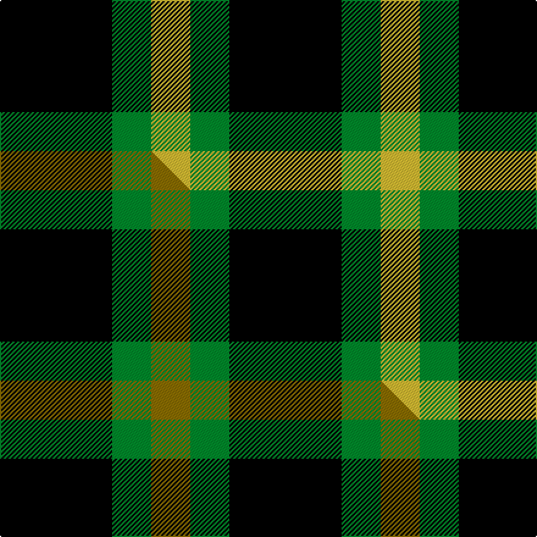

This page is one **sett** — a single exact thread-count. It belongs to the [tartan](/setts/k23g8ly8/)
(the same proportion at any scale), whose colour order is pattern [KGY](/stripes/kgy/).

Part of the [Zwijnenberg, Frans](/tartans/zwijnenberg-frans/) tartan — the named design grouping this sett with its other cloths.

Sourced from tartans-authority.  It is a [3 stripe tartan](/stripes/stripes3/).

Original link http://www.tartansauthority.com/tartan-ferret/display/11096/

## Register references

External register numbers recorded for this tartan.

- Scottish Register of Tartans: [11096](https://www.tartanregister.gov.uk/tartanDetails?ref=11096)
- Scottish Tartans Authority (ITI): 11096

## Thread count
K/92 G32 LY/32

One full sett is **188 threads**.

## Palette
<table><thead><tr><th>Colour</th><th>Shade</th><th>OKLCh</th></tr></thead><tbody><tr><td>G</td><td><code style="background-color:#008B2A;">#008B2A</code> <small style="color:#888">#008B2A</small></td><td><small style="color:#888">oklch(55.4% 0.170 145.9)</small></td></tr><tr><td>K</td><td><code style="background-color:#000000;">#000000</code> <small style="color:#888">#000000</small></td><td><small style="color:#888">oklch(0.0% 0.000 0.0)</small></td></tr><tr><td>LY</td><td><code style="background-color:#DCBC32;">#DCBC32</code> <small style="color:#888">#DCBC32</small></td><td><small style="color:#888">oklch(80.0% 0.150 95.2)</small></td></tr></tbody></table>

# Sample pattern

## Compared to the master

This cloth is one sett of its design; the master sett (the exemplar the design is anchored on) is below for comparison.

Its **ΔTartan distance** from the master is **0.10** — the same measure the nearest-tartans table ranks by (0 is identical; a re-scale of the same cloth is near 0, a recolour or a different proportion further).

<figure class="master-compare" style="margin:0">

this sett
master sett ★

<figcaption style="color:#888;font-size:smaller">One weave of this sett against the <a href="/setts/k23g8y8/">master sett ★</a>, split on the diagonal: a shared proportion runs seamlessly across it with only the shades shifting; a different proportion breaks on it.</figcaption>
</figure>

## Nearest tartan variants

The nearest existing variants by ΔTartan distance, with this cloth at the top so the swatches line up against it.

ΔTartan

Threads

Variant

Sett

—

188

<a href="/variants/s3/k23g8ly8~x4/">Zwijnenberg, Frans (Personal)</a>

<a href="/ttd/edit/#slug=k23g8y8~x4&amp;base=k23g8ly8~x4" title="compare in the TTD">0.10</a>

188

<a href="/variants/s3/k23g8y8~x4/">Zwijnenberg, Frans (Personal)</a>

<a href="/ttd/edit/#slug=k5g4y1~x2&amp;base=k23g8ly8~x4" title="compare in the TTD">0.91</a>

28

<a href="/variants/s3/k5g4y1~x2/">Wilson's, No 2/53 or Mull</a>

<a href="/ttd/edit/#slug=k6y1g6~x4&amp;base=k23g8ly8~x4" title="compare in the TTD">0.95</a>

56

<a href="/variants/s3/k6y1g6~x4/">Wilson's No.197</a>

<a href="/ttd/edit/#slug=y40db8k20g11~x2&amp;base=k23g8ly8~x4" title="compare in the TTD">1.10</a>

214

<a href="/variants/s4/y40db8k20g11~x2/">Brun, Pierre Emmanuel (Personal)</a>

<a href="/ttd/edit/#slug=k7y1g7lb1~x2&amp;base=k23g8ly8~x4" title="compare in the TTD">1.26</a>

48

<a href="/variants/s4/k7y1g7lb1~x2/">Wilson's, No 140</a>

<a href="/ttd/edit/#slug=k5g3lb2~x2&amp;base=k23g8ly8~x4" title="compare in the TTD">1.53</a>

26

<a href="/variants/s3/k5g3lb2~x2/">Glen Lyon, or Mull (No.53)</a>

<a href="/ttd/edit/#slug=r4k7g4~x2&amp;base=k23g8ly8~x4" title="compare in the TTD">1.67</a>

44

<a href="/variants/s3/r4k7g4~x2/">Wilson's No.200</a>

<a href="/ttd/edit/#slug=k5g4r2~x2&amp;base=k23g8ly8~x4" title="compare in the TTD">1.74</a>

30

<a href="/variants/s3/k5g4r2~x2/">Wilson's, No 94</a>

<a href="/ttd/edit/#slug=k5g4lb2~x2&amp;base=k23g8ly8~x4" title="compare in the TTD">1.74</a>

30

<a href="/variants/s3/k5g4lb2~x2/">Mull</a>

<a href="/ttd/edit/#slug=k6g5r2~x2&amp;base=k23g8ly8~x4" title="compare in the TTD">1.75</a>

36

<a href="/variants/s3/k6g5r2~x2/">Glen Lyon #1</a>

## Neighbour map

Every grey dot is one of 13620 variants placed by the first two principal components of the ΔTartan feature space (42% of its variance). Red is this tartan; blue dots are its nearest — click one to open its page.

<svg viewBox="0 0 640 380" role="img" style="max-width:100%;height:auto;border:1px solid #e0e0e0;border-radius:4px;display:block" xmlns="http://www.w3.org/2000/svg"><image href="/nn/cloud.v1.png" width="640" height="380"/><a href="/variants/s3/k23g8y8~x4/"><circle cx="236.6" cy="303.0" r="4" fill="#3465a4"><title>Zwijnenberg, Frans (Personal)</title></circle></a><a href="/variants/s3/k5g4y1~x2/"><circle cx="215.1" cy="291.7" r="4" fill="#3465a4"><title>Wilson's, No 2/53 or Mull</title></circle></a><a href="/variants/s3/k6y1g6~x4/"><circle cx="200.8" cy="254.0" r="4" fill="#3465a4"><title>Wilson's No.197</title></circle></a><a href="/variants/s4/y40db8k20g11~x2/"><circle cx="197.5" cy="254.9" r="4" fill="#3465a4"><title>Brun, Pierre Emmanuel (Personal)</title></circle></a><a href="/variants/s4/k7y1g7lb1~x2/"><circle cx="190.3" cy="230.0" r="4" fill="#3465a4"><title>Wilson's, No 140</title></circle></a><a href="/variants/s3/k5g3lb2~x2/"><circle cx="156.1" cy="332.6" r="4" fill="#3465a4"><title>Glen Lyon, or Mull (No.53)</title></circle></a><a href="/variants/s3/r4k7g4~x2/"><circle cx="123.9" cy="354.6" r="4" fill="#3465a4"><title>Wilson's No.200</title></circle></a><a href="/variants/s3/k5g4r2~x2/"><circle cx="140.9" cy="335.3" r="4" fill="#3465a4"><title>Wilson's, No 94</title></circle></a><a href="/variants/s3/k5g4lb2~x2/"><circle cx="136.0" cy="340.5" r="4" fill="#3465a4"><title>Mull</title></circle></a><a href="/variants/s3/k6g5r2~x2/"><circle cx="192.4" cy="323.7" r="4" fill="#3465a4"><title>Glen Lyon #1</title></circle></a><circle cx="222.8" cy="300.0" r="5" fill="#c00000"/><text x="320" y="376" text-anchor="middle" font-size="11" fill="#999">ground</text><text x="11" y="190" text-anchor="middle" font-size="11" fill="#999" transform="rotate(-90 11 190)">complexity</text></svg>

ID: /variants/s3/k23g8ly8~x4/
