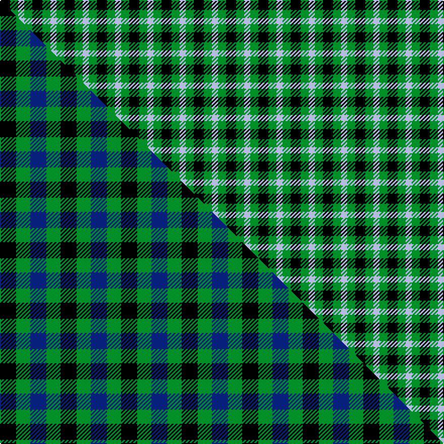

This is one **variant** — a specific cloth: this exact thread count and colourway, with its own
provenance below. It is one weaving of the [sett](/setts/k5g4lb3/) (the scale-free proportion — the
same cloth at any scale or shade), whose colour order is pattern [KGW](/stripes/kgw/).

Part of the [Glen Lyon](/tartans/g/gl/glen-lyon-4/) tartan — the named design grouping this sett with its other cloths.

Sourced from tartans-authority.  It is a [3 stripe tartan](/stripes/stripes3/).

Original link [https://www.tartanregister.gov.uk/tartanDetails.aspx?ref=24](https://www.tartanregister.gov.uk/tartanDetails.aspx?ref=24)

2 attestations — the source records this cloth was collapsed from (oldest owns this page)

<ul>
<li>1819 — Glen Lyon (District) (tartans-authority, <a href="https://www.tartanregister.gov.uk/tartanDetails.aspx?ref=24">record</a>)  <em>This is recorded by Gordon Teall in' District Tartans' but no background is given to its choice as the Mull district tartan. Writing in 1996, Peter MacDonald said that in recent years this pattern has been promoted as the Glenlyon District Tartan although it is clear it started life as a Fancy Pattern. This tartan is specifically mentioned by Telford Dunbar in his 1962 'History of Highland Dress' (Page149) when he included it in a list of William Wilson's tartans that were most popular in 1822.</em></li>
<li>pre 2002 — Mull (District) (tartans-authority, <a href="https://www.tartanregister.gov.uk/tartanDetails.aspx?ref=162">record</a>)  <em>The proportions given in District Tartans differ from those recorded in the ITI as Wilsons No 53. Here the black is much wider. How this came to be named 'Mull' is not recorded.</em></li>
</ul>

Dataset <small>— provenance for this record, inherited from the source manifest</small>

<dl class="dataset-prov">
<dt>source</dt><dd><a href="/sources/tartans-authority/">Scottish Tartans Authority</a></dd>
<dt>data captured from</dt><dd><a href="https://github.com/thetartan/tartan-database/blob/master/data/tartans-authority/data.csv">https://github.com/thetartan/tartan-database/blob/master/data/tartans-authority/data.csv</a></dd>
<dt>data date</dt><dd>1819 <small>(this record)</small></dd>
<dt>licence</dt><dd><a href="https://creativecommons.org/licenses/by-nc-nd/4.0/">CC BY-NC-ND 4.0</a></dd>
</dl>

Capture chain <small>— the hands this data passed through, oldest first; each capture carries its own licence</small>

<ol class="capture-chain">
<li><a href="https://www.tartansauthority.com/">Scottish Tartans Authority</a> <small>the heritage body's archive — its tartan-ferret record browser is retired (links repaired to the SRT, above)</small></li>
<li><a href="https://github.com/thetartan/tartan-database">thetartan/tartan-database</a> <small>2016-2017</small> · <a href="https://creativecommons.org/licenses/by-nc-nd/4.0/">CC BY-NC-ND 4.0</a> <small>Levko Kravets's frozen compilation — the capture we vendored, and where its CC licence text came from</small></li>
<li>this dictionary <small>captured 2026-06-10 · commit 5bf86c7566</small> <small>each re-capture is a git commit to data/sources</small></li>
</ol>

## Register references

External register numbers recorded for this tartan.

- Scottish Tartans Authority (ITI): 162

## Thread count
K/10 G8 LB/6

One full sett is **32 threads**.

## Palette
<table><thead><tr><th>Colour</th><th>Shade</th><th>OKLCh</th></tr></thead><tbody><tr><td>LB</td><td><code style="background-color:#B5BBDE;">#B5BBDE</code> <small style="color:#888">#B5BBDE</small></td><td><small style="color:#888">oklch(79.9% 0.050 277.6)</small></td></tr><tr><td>G</td><td><code style="background-color:#008B2A;">#008B2A</code> <small style="color:#888">#008B2A</small></td><td><small style="color:#888">oklch(55.4% 0.170 145.9)</small></td></tr><tr><td>K</td><td><code style="background-color:#000000;">#000000</code> <small style="color:#888">#000000</small></td><td><small style="color:#888">oklch(0.0% 0.000 0.0)</small></td></tr></tbody></table>

# Sample pattern

## Compared to the master

This cloth is one sett of its design; the master sett (the exemplar the design is anchored on) is below for comparison.

Its **ΔTartan distance** from the master is **0.55** — the same measure the nearest-tartans table ranks by (0 is identical; a re-scale of the same cloth is near 0, a recolour or a different proportion further).

<figure class="master-compare" style="margin:0">

this sett
master sett ★

<figcaption style="color:#888;font-size:smaller">One weave of this sett against the <a href="/setts/k8g7db8/">master sett ★</a>, split on the diagonal: a shared proportion runs seamlessly across it with only the shades shifting; a different proportion breaks on it.</figcaption>
</figure>

## Nearest tartan variants

The nearest existing variants by ΔTartan distance, with this cloth at the top so the swatches line up against it.

ΔTartan

Threads

Variant

Sett

—

32

<a href="/variants/s3/k5g4lb3~x2/">Glen Lyon (District)</a>

<a href="/ttd/edit/#slug=k5g4lb2~x2&amp;base=k5g4lb3~x2" title="compare in the TTD">0.33</a>

30

<a href="/variants/s3/k5g4lb2~x2/">Mull or Glenlyon District Tartan</a>

<a href="/ttd/edit/#slug=k5g3lb2~x2&amp;base=k5g4lb3~x2" title="compare in the TTD">0.40</a>

26

<a href="/variants/s3/k5g3lb2~x2/">Glen Lyon or Mull (No.53) District Tartan</a>

<a href="/ttd/edit/#slug=k8g7db8~x2&amp;base=k5g4lb3~x2" title="compare in the TTD">0.55</a>

60

<a href="/variants/s3/k8g7db8~x2/">Glenlyon</a>

<a href="/ttd/edit/#slug=g3k2db2~x4&amp;base=k5g4lb3~x2" title="compare in the TTD">0.65</a>

36

<a href="/variants/s3/g3k2db2~x4/">Glenlyon #2</a>

<a href="/ttd/edit/#slug=g7k4lb4~x2&amp;base=k5g4lb3~x2" title="compare in the TTD">0.70</a>

38

<a href="/variants/s3/g7k4lb4~x2/">Wilson's No.052</a>

<a href="/ttd/edit/#slug=g4lb1k2~x4&amp;base=k5g4lb3~x2" title="compare in the TTD">0.85</a>

32

<a href="/variants/s3/g4lb1k2~x4/">Wilson's, No 45</a>

<a href="/ttd/edit/#slug=db4k5g4r1~x4&amp;base=k5g4lb3~x2" title="compare in the TTD">0.95</a>

92

<a href="/variants/s4/db4k5g4r1~x4/">Unidentified pattern #3</a>

<a href="/ttd/edit/#slug=b9g9k10lb2~x2&amp;base=k5g4lb3~x2" title="compare in the TTD">1.01</a>

98

<a href="/variants/s4/b9g9k10lb2~x2/">Wilson's, No 196</a>

<a href="/ttd/edit/#slug=k5g4r2~x2&amp;base=k5g4lb3~x2" title="compare in the TTD">1.38</a>

30

<a href="/variants/s3/k5g4r2~x2/">Wilson's, No 94</a>

<a href="/ttd/edit/#slug=db1k2r1~x42&amp;base=k5g4lb3~x2" title="compare in the TTD">1.40</a>

252

<a href="/variants/s3/db1k2r1~x42/">Allen, Nicholas (Personal)</a>

## Neighbour map

Every grey dot is one of 13656 variants placed by the first two principal components of the ΔTartan feature space (42% of its variance). Red is this tartan; blue dots are its nearest — click one to open its page. The map is a flat projection of a many-dimensional space — [how to read it](/posts/neighbourhood-maps/).

<svg viewBox="0 0 640 380" role="img" style="max-width:100%;height:auto;border:1px solid #e0e0e0;border-radius:4px;display:block" xmlns="http://www.w3.org/2000/svg"><image href="/nn/cloud.v1.png" width="640" height="380"/><a href="/variants/s3/k5g4lb2~x2/"><circle cx="135.7" cy="339.7" r="4" fill="#3465a4"><title>Mull or Glenlyon District Tartan</title></circle></a><a href="/variants/s3/k5g3lb2~x2/"><circle cx="155.8" cy="331.8" r="4" fill="#3465a4"><title>Glen Lyon or Mull (No.53) District Tartan</title></circle></a><a href="/variants/s3/k8g7db8~x2/"><circle cx="46.2" cy="366.0" r="4" fill="#3465a4"><title>Glenlyon</title></circle></a><a href="/variants/s3/g3k2db2~x4/"><circle cx="102.9" cy="366.0" r="4" fill="#3465a4"><title>Glenlyon #2</title></circle></a><a href="/variants/s3/g7k4lb4~x2/"><circle cx="119.4" cy="366.0" r="4" fill="#3465a4"><title>Wilson's No.052</title></circle></a><a href="/variants/s3/g4lb1k2~x4/"><circle cx="230.9" cy="298.1" r="4" fill="#3465a4"><title>Wilson's, No 45</title></circle></a><a href="/variants/s4/db4k5g4r1~x4/"><circle cx="108.0" cy="281.4" r="4" fill="#3465a4"><title>Unidentified pattern #3</title></circle></a><a href="/variants/s4/b9g9k10lb2~x2/"><circle cx="90.4" cy="282.6" r="4" fill="#3465a4"><title>Wilson's, No 196</title></circle></a><a href="/variants/s3/k5g4r2~x2/"><circle cx="140.6" cy="334.4" r="4" fill="#3465a4"><title>Wilson's, No 94</title></circle></a><a href="/variants/s3/db1k2r1~x42/"><circle cx="169.7" cy="337.8" r="4" fill="#3465a4"><title>Allen, Nicholas (Personal)</title></circle></a><circle cx="83.1" cy="366.0" r="5" fill="#c00000"/><text x="320" y="376" text-anchor="middle" font-size="11" fill="#999">ground</text><text x="11" y="190" text-anchor="middle" font-size="11" fill="#999" transform="rotate(-90 11 190)">complexity</text></svg>

ID: /variants/s3/k5g4lb3~x2/
