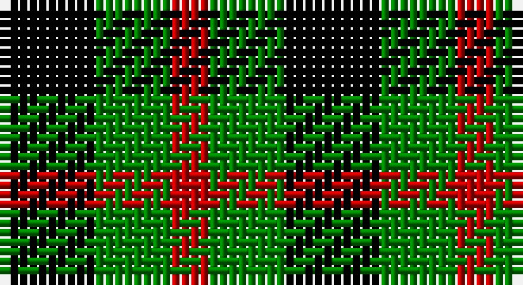

This page is one **sett** — a single exact thread-count. It belongs to the [tartan](/setts/k5g4r2/)
(the same proportion at any scale), whose colour order is pattern [KGR](/stripes/kgr/).

Sourced from weddslist.  It is a [3 stripe tartan](/stripes/stripes3/).

Original link http://www.weddslist.com/cgi-bin/tartans/pg.pl?source=sts

## Thread count
K/10 G8 R/4

One full sett is **30 threads**.

## Palette

Palette: <strong>Ingles Buchan</strong> <small style="color:#888">(1 of 3 colours)</small>
<table><thead><tr><th>Colour</th><th>Threads</th><th>Shade</th><th>Base</th><th>OKLCh</th></tr></thead><tbody><tr><td>K/</td><td style="text-align:right;font-variant-numeric:tabular-nums">10</td><td><code style="background-color:#000000;">#000000</code> <small style="color:#888">#000000</small></td><td>K <code style="background-color:#000000;">#000000</code></td><td><small style="color:#888">oklch(0.0% 0.000 0.0)</small></td></tr><tr><td>G</td><td style="text-align:right;font-variant-numeric:tabular-nums">8</td><td><code style="background-color:#008000;">#008000</code> <small style="color:#888">#008000</small></td><td>G <code style="background-color:#006100;">#006100</code></td><td><small style="color:#888">oklch(52.0% 0.177 142.5)</small></td></tr><tr><td>R/</td><td style="text-align:right;font-variant-numeric:tabular-nums">4</td><td><code style="background-color:#C00000;">#C00000</code> <small style="color:#888">#C00000</small></td><td>R <code style="background-color:#CC0000;">#CC0000</code></td><td><small style="color:#888">oklch(50.7% 0.208 29.2)</small></td></tr></tbody></table>

# Sample pattern

## Nearest tartans

The nearest existing variants by ΔTartan distance, with this tartan at the top so the swatches line up against it.

ΔTartan

Tartan

Sett

—

<a href="/ttd/edit/#slug=k5g4r2~x2">Wilson's, No 94</a> <a class="nn-out" href="/variants/s3/k5g4r2~x2/" title="open its dictionary page">↗</a>

0.48

<a href="/ttd/edit/#slug=k6g5r2~x2&amp;base=k5g4r2~x2">Glen Lyon</a> <a class="nn-out" href="/variants/s3/k6g5r2~x2/" title="open its dictionary page">↗</a>

1.16

<a href="/ttd/edit/#slug=k5g3t2~x2&amp;base=k5g4r2~x2">Glen Lyon, or Mull (No.53)</a> <a class="nn-out" href="/variants/s3/k5g3t2~x2/" title="open its dictionary page">↗</a>

1.60

<a href="/ttd/edit/#slug=r4k7g4~x2&amp;base=k5g4r2~x2">Wilson's No.200</a> <a class="nn-out" href="/variants/s3/r4k7g4~x2/" title="open its dictionary page">↗</a>

1.75

<a href="/ttd/edit/#slug=k23g8lo8~x4&amp;base=k5g4r2~x2">Zwijnenberg, Frans (Personal)</a> <a class="nn-out" href="/variants/s3/k23g8lo8~x4/" title="open its dictionary page">↗</a>

1.75

<a href="/ttd/edit/#slug=k5g4ly1~x2&amp;base=k5g4r2~x2">Wilson's, No 2/53 or Mull</a> <a class="nn-out" href="/variants/s3/k5g4ly1~x2/" title="open its dictionary page">↗</a>

1.76

<a href="/ttd/edit/#slug=o3k7oi4k6ly3~x2&amp;base=k5g4r2~x2">Daks - Black House Check, C.6700.06</a> <a class="nn-out" href="/variants/s5/o3k7oi4k6ly3~x2/" title="open its dictionary page">↗</a>

1.79

<a href="/ttd/edit/#slug=g7k4r4~x2&amp;base=k5g4r2~x2">Wilson's No.202</a> <a class="nn-out" href="/variants/s3/g7k4r4~x2/" title="open its dictionary page">↗</a>

1.79

<a href="/ttd/edit/#slug=k5g4t2~x2&amp;base=k5g4r2~x2">Mull</a> <a class="nn-out" href="/variants/s3/k5g4t2~x2/" title="open its dictionary page">↗</a>

1.83

<a href="/ttd/edit/#slug=k23g8ly8~x4&amp;base=k5g4r2~x2">Zwijnenberg, Frans (Personal)</a> <a class="nn-out" href="/variants/s3/k23g8ly8~x4/" title="open its dictionary page">↗</a>

1.93

<a href="/ttd/edit/#slug=r3k6dy4k6ly3~x2&amp;base=k5g4r2~x2">Daks, Black (Fashion)</a> <a class="nn-out" href="/variants/s5/r3k6dy4k6ly3~x2/" title="open its dictionary page">↗</a>

## Neighbour map

Every grey dot is one of 14360 variants placed by the first two principal components of the ΔTartan feature space (44% of its variance). Red is this tartan; blue dots are its nearest — click one to open its page.

<svg viewBox="0 0 640 380" role="img" style="max-width:100%;height:auto;border:1px solid #e0e0e0;border-radius:4px;display:block" xmlns="http://www.w3.org/2000/svg"><image href="/nn/cloud.v1.png" width="640" height="380"/><a href="/variants/s3/k6g5r2~x2/"><circle cx="168.4" cy="343.5" r="4" fill="#3465a4"><title>Glen Lyon</title></circle></a><a href="/variants/s3/k5g3t2~x2/"><circle cx="164.9" cy="356.5" r="4" fill="#3465a4"><title>Glen Lyon, or Mull (No.53)</title></circle></a><a href="/variants/s3/r4k7g4~x2/"><circle cx="158.9" cy="366.0" r="4" fill="#3465a4"><title>Wilson's No.200</title></circle></a><a href="/variants/s3/k23g8lo8~x4/"><circle cx="241.3" cy="325.1" r="4" fill="#3465a4"><title>Zwijnenberg, Frans (Personal)</title></circle></a><a href="/variants/s3/k5g4ly1~x2/"><circle cx="217.7" cy="311.0" r="4" fill="#3465a4"><title>Wilson's, No 2/53 or Mull</title></circle></a><a href="/variants/s5/o3k7oi4k6ly3~x2/"><circle cx="152.6" cy="312.6" r="4" fill="#3465a4"><title>Daks - Black House Check, C.6700.06</title></circle></a><a href="/variants/s3/g7k4r4~x2/"><circle cx="159.8" cy="366.0" r="4" fill="#3465a4"><title>Wilson's No.202</title></circle></a><a href="/variants/s3/k5g4t2~x2/"><circle cx="178.2" cy="366.0" r="4" fill="#3465a4"><title>Mull</title></circle></a><a href="/variants/s3/k23g8ly8~x4/"><circle cx="240.8" cy="320.6" r="4" fill="#3465a4"><title>Zwijnenberg, Frans (Personal)</title></circle></a><a href="/variants/s5/r3k6dy4k6ly3~x2/"><circle cx="146.6" cy="328.9" r="4" fill="#3465a4"><title>Daks, Black (Fashion)</title></circle></a><circle cx="147.8" cy="356.1" r="5" fill="#c00000"/></svg>

ID: /variants/s3/k5g4r2~x2/
