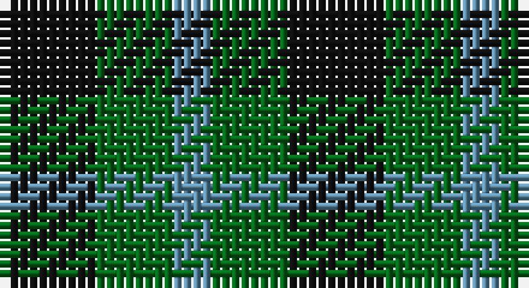

This page is one **sett** — a single exact thread-count. It belongs to the [tartan](/setts/k5g4t2/)
(the same proportion at any scale), whose colour order is pattern [BGK](/stripes/bgk/).

Sourced from register-of-tartans.  It is a [3 stripe tartan](/stripes/stripes3/).

Original link https://www.tartanregister.gov.uk/tartanDetails.aspx?ref=3043

## Provenance

Earliest known date: 1819 This sett appears in the pattern books of the 18th century weaving firm, William Wilson and Sons, where it is recorded as pattern No. 53 or Glen Lyon.

## Also known as

This cloth is also recorded under:

- Mull or Glenlyon
- Mull, or Glenlyon

3 attestations — the source records this cloth was collapsed from (oldest owns this page)

<ul>
<li>01/01/2002 — Mull (register-of-tartans, <a href="https://www.tartanregister.gov.uk/tartanDetails.aspx?ref=3043">record</a>)</li>
<li>undated — Mull, or Glenlyon (weddslist, <a href="http://www.weddslist.com/cgi-bin/tartans/pg.pl?source=sts">record</a>)</li>
<li>undated — Mull or Glenlyon District Tartan (house-of-tartan, <a href="http://www.house-of-tartan.scotland.net/house/TartanViewjs.asp?colr=Def&tnam=162">record</a>)</li>
</ul>

## Register references

External register numbers recorded for this tartan.

- Scottish Register of Tartans: [3043](https://www.tartanregister.gov.uk/tartanDetails.aspx?ref=3043)
- Scottish Tartans Authority (ITI): 162
- Scottish Tartans World Register: 162

## Thread count
K/10 G8 B/4

One full sett is **30 threads**.

## Palette

Palette: <strong>Tartan Register</strong>
<table><thead><tr><th>Colour</th><th>Threads</th><th>Shade</th><th>Base</th><th>OKLCh</th></tr></thead><tbody><tr><td>K/</td><td style="text-align:right;font-variant-numeric:tabular-nums">10</td><td><code style="background-color:#101010;">#101010</code> <small style="color:#888">#101010</small></td><td>K <code style="background-color:#000000;">#000000</code></td><td><small style="color:#888">oklch(17.3% 0.000 89.9)</small></td></tr><tr><td>G</td><td style="text-align:right;font-variant-numeric:tabular-nums">8</td><td><code style="background-color:#006818;">#006818</code> <small style="color:#888">#006818</small></td><td>G <code style="background-color:#006100;">#006100</code></td><td><small style="color:#888">oklch(45.0% 0.142 145.0)</small></td></tr><tr><td>B/</td><td style="text-align:right;font-variant-numeric:tabular-nums">4</td><td><code style="background-color:#5C8CA8;">#5C8CA8</code> <small style="color:#888">#5C8CA8</small></td><td>B <code style="background-color:#2A418A;">#2A418A</code></td><td><small style="color:#888">oklch(61.7% 0.067 235.0)</small></td></tr></tbody></table>

# Sample pattern

## Nearest tartans

The nearest existing variants by ΔTartan distance, with this tartan at the top so the swatches line up against it.

ΔTartan

Tartan

Sett

—

<a href="/ttd/edit/#slug=k5g4t2~x2">Mull</a> <a class="nn-out" href="/variants/s3/k5g4t2~x2/" title="open its dictionary page">↗</a>

1.00

<a href="/ttd/edit/#slug=g7k4t4~x2&amp;base=k5g4t2~x2">Wilson's No.052</a> <a class="nn-out" href="/variants/s3/g7k4t4~x2/" title="open its dictionary page">↗</a>

1.25

<a href="/ttd/edit/#slug=g4dp5g4t2~x2&amp;base=k5g4t2~x2">Wilson's No.209</a> <a class="nn-out" href="/variants/s4/g4dp5g4t2~x2/" title="open its dictionary page">↗</a>

1.29

<a href="/ttd/edit/#slug=k5g4t3~x2&amp;base=k5g4t2~x2">Glen Lyon (District)</a> <a class="nn-out" href="/variants/s3/k5g4t3~x2/" title="open its dictionary page">↗</a>

1.37

<a href="/ttd/edit/#slug=g4k5g4r2~x2&amp;base=k5g4t2~x2">Wilson's No.094</a> <a class="nn-out" href="/variants/s4/g4k5g4r2~x2/" title="open its dictionary page">↗</a>

1.44

<a href="/variants/s4/k6g5r2~x2/">Glen Lyon #1</a>

1.56

<a href="/ttd/edit/#slug=g7k4r4~x2&amp;base=k5g4t2~x2">Wilson's No.202</a> <a class="nn-out" href="/variants/s3/g7k4r4~x2/" title="open its dictionary page">↗</a>

1.57

<a href="/ttd/edit/#slug=k5g3t2~x2&amp;base=k5g4t2~x2">Glen Lyon, or Mull (No.53)</a> <a class="nn-out" href="/variants/s3/k5g3t2~x2/" title="open its dictionary page">↗</a>

1.57

<a href="/ttd/edit/#slug=db53g42r14&amp;base=k5g4t2~x2">Agnew</a> <a class="nn-out" href="/variants/s3/db53g42r14/" title="open its dictionary page">↗</a>

1.63

<a href="/ttd/edit/#slug=r4dg7t4~x2&amp;base=k5g4t2~x2">Wilson's No.061</a> <a class="nn-out" href="/variants/s3/r4dg7t4~x2/" title="open its dictionary page">↗</a>

1.73

<a href="/ttd/edit/#slug=n3k3n3dg6k2~x2&amp;base=k5g4t2~x2">Austin WI</a> <a class="nn-out" href="/variants/s5/n3k3n3dg6k2~x2/" title="open its dictionary page">↗</a>

## Neighbour map

Every grey dot is one of 14360 variants placed by the first two principal components of the ΔTartan feature space (44% of its variance). Red is this tartan; blue dots are its nearest — click one to open its page.

<svg viewBox="0 0 640 380" role="img" style="max-width:100%;height:auto;border:1px solid #e0e0e0;border-radius:4px;display:block" xmlns="http://www.w3.org/2000/svg"><image href="/nn/cloud.v1.png" width="640" height="380"/><a href="/variants/s3/g7k4t4~x2/"><circle cx="153.7" cy="366.0" r="4" fill="#3465a4"><title>Wilson's No.052</title></circle></a><a href="/variants/s4/g4dp5g4t2~x2/"><circle cx="217.3" cy="366.0" r="4" fill="#3465a4"><title>Wilson's No.209</title></circle></a><a href="/variants/s3/k5g4t3~x2/"><circle cx="112.0" cy="366.0" r="4" fill="#3465a4"><title>Glen Lyon (District)</title></circle></a><a href="/variants/s4/g4k5g4r2~x2/"><circle cx="199.9" cy="361.0" r="4" fill="#3465a4"><title>Wilson's No.094</title></circle></a><a href="/variants/s4/k6g5r2~x2/"><circle cx="243.1" cy="362.0" r="4" fill="#3465a4"><title>Glen Lyon #1</title></circle></a><a href="/variants/s3/g7k4r4~x2/"><circle cx="159.8" cy="366.0" r="4" fill="#3465a4"><title>Wilson's No.202</title></circle></a><a href="/variants/s3/k5g3t2~x2/"><circle cx="164.9" cy="356.5" r="4" fill="#3465a4"><title>Glen Lyon, or Mull (No.53)</title></circle></a><a href="/variants/s3/db53g42r14/"><circle cx="247.8" cy="347.7" r="4" fill="#3465a4"><title>Agnew</title></circle></a><a href="/variants/s3/r4dg7t4~x2/"><circle cx="161.6" cy="366.0" r="4" fill="#3465a4"><title>Wilson's No.061</title></circle></a><a href="/variants/s5/n3k3n3dg6k2~x2/"><circle cx="140.7" cy="336.3" r="4" fill="#3465a4"><title>Austin WI</title></circle></a><circle cx="178.2" cy="366.0" r="5" fill="#c00000"/></svg>

ID: /variants/s3/k5g4t2~x2/
