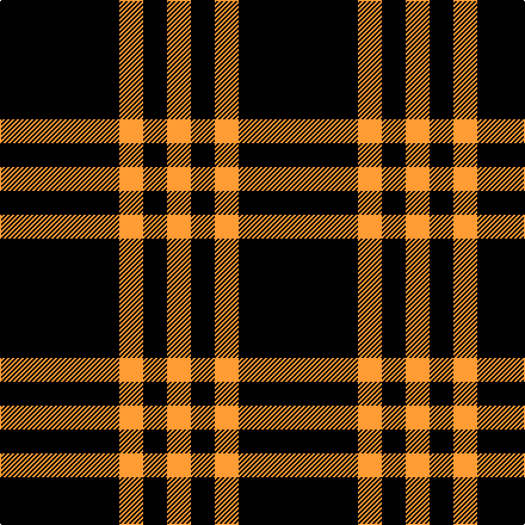

This is one **variant** — a specific cloth: this exact thread count and colourway, with its own
provenance below. It is one weaving of the [sett](/tartans/j/ju/justus-3/) (the scale-free proportion — the
same cloth at any scale or shade), whose colour order is pattern [KYK](/stripes/kyk/).

Part of the [Justus](/tartans/j/ju/justus-3/) tartan — the named design grouping this sett with its other cloths.

Sourced from tartans-authority.  It is a [3 stripe tartan](/stripes/stripes3/).

Original link <code>http://www.tartansauthority.com/tartan-ferret/display/1276/</code> — retired · [Internet Archive copy](https://web.archive.org/web/*/http://www.tartansauthority.com/tartan-ferret/display/1276/*)

Dataset <small>— provenance for this record, inherited from the source manifest</small>

<dl class="dataset-prov">
<dt>source</dt><dd><a href="/sources/tartans-authority/">Scottish Tartans Authority</a></dd>
<dt>data captured from</dt><dd><a href="https://github.com/thetartan/tartan-database/blob/master/data/tartans-authority/data.csv">https://github.com/thetartan/tartan-database/blob/master/data/tartans-authority/data.csv</a></dd>
<dt>data date</dt><dd>1986 <small>(this record)</small></dd>
<dt>licence</dt><dd><a href="https://creativecommons.org/licenses/by-nc-nd/4.0/">CC BY-NC-ND 4.0</a></dd>
</dl>

Capture chain <small>— the hands this data passed through, oldest first; each capture carries its own licence</small>

<ol class="capture-chain">
<li><a href="https://www.tartansauthority.com/">Scottish Tartans Authority</a> <small>the heritage body’s archive — its tartan-ferret record browser is retired; dead record links are shown unlinked, with an Internet Archive copy (ITI numbers are not SRT references)</small></li>
<li><a href="https://github.com/thetartan/tartan-database">thetartan/tartan-database</a> <small>2016-2017</small> · <a href="https://creativecommons.org/licenses/by-nc-nd/4.0/">CC BY-NC-ND 4.0</a> <small>Levko Kravets's frozen compilation — the capture we vendored, and where its CC licence text came from</small></li>
<li>this dictionary <small>captured 2026-06-10 · commit 5bf86c7566</small> <small>each re-capture is a git commit to data/sources</small></li>
</ol>

## Register references

External register numbers recorded for this tartan.

- Scottish Tartans Authority (ITI): 1276

## Thread count
K/100 LO20 K/20

One full sett is **160 threads**.

The source recorded this cloth as K/100 LO20 K20 LO/20 — 200 threads; it folds to the canonical 160-thread sett above.

## Palette
<table><thead><tr><th>Colour</th><th>Shade</th><th>OKLCh</th></tr></thead><tbody><tr><td>LO</td><td><code style="background-color:#FF9C34;">#FF9C34</code> <small style="color:#888">#FF9C34</small></td><td><small style="color:#888">oklch(77.9% 0.161 61.8)</small></td></tr><tr><td>K</td><td><code style="background-color:#000000;">#000000</code> <small style="color:#888">#000000</small></td><td><small style="color:#888">oklch(0.0% 0.000 0.0)</small></td></tr></tbody></table>

# Sample pattern

## Compared to the master

This cloth is one sett of its design; the master sett (the exemplar the design is anchored on) is below for comparison.

Its **ΔTartan distance** from the master is **0.00** — the same measure the nearest-tartans table ranks by (0 is identical; a re-scale of the same cloth is near 0, a recolour or a different proportion further).

<figure class="master-compare" style="margin:0">

this sett
master sett ★

<figcaption style="color:#888;font-size:smaller">One weave of this sett against the <a href="/setts/k5lo1k1lo1/">master sett ★</a>, split on the diagonal: a shared proportion runs seamlessly across it with only the shades shifting; a different proportion breaks on it.</figcaption>
</figure>

## Nearest tartan variants

The nearest existing variants by ΔTartan distance, with this cloth at the top so the swatches line up against it.

ΔTartan

Threads

Variant

Sett

—

200

<a href="/variants/s3/k5lo1k1~x20/">Justus #2 (Personal)</a>

<a href="/ttd/edit/#slug=k5y1k1~x12&amp;base=k5lo1k1~x20" title="compare in the TTD">0.30</a>

96

<a href="/variants/s3/k5y1k1~x12/">Justus</a>

1.17

200

<a href="/variants/s4/k5lo1k1lo1~x20/">Justus #2 (Personal)</a>

<a href="/ttd/edit/#slug=dr8w1k1~x20&amp;base=k5lo1k1~x20" title="compare in the TTD">1.30</a>

220

<a href="/variants/s3/dr8w1k1~x20/">International Karate Fed. (Corporat)</a>

<a href="/ttd/edit/#slug=k46o7k8w20~x2&amp;base=k5lo1k1~x20" title="compare in the TTD">1.45</a>

192

<a href="/variants/s4/k46o7k8w20~x2/">Lords, of Skye</a>

<a href="/ttd/edit/#slug=k19o7k26o3~x2&amp;base=k5lo1k1~x20" title="compare in the TTD">1.59</a>

176

<a href="/variants/s4/k19o7k26o3~x2/">Crombie House Check</a>

<a href="/ttd/edit/#slug=k10r3k1~x4&amp;base=k5lo1k1~x20" title="compare in the TTD">1.67</a>

68

<a href="/variants/s3/k10r3k1~x4/">Red Watch</a>

<a href="/ttd/edit/#slug=k4r1~x36&amp;base=k5lo1k1~x20" title="compare in the TTD">1.76</a>

180

<a href="/variants/s2/k4r1~x36/">St Kilda</a>

<a href="/ttd/edit/#slug=k4r1~x6&amp;base=k5lo1k1~x20" title="compare in the TTD">1.76</a>

30

<a href="/variants/s2/k4r1~x6/">St Kilda District Tartan</a>

<a href="/ttd/edit/#slug=k46dy7k8w20~x2&amp;base=k5lo1k1~x20" title="compare in the TTD">1.78</a>

192

<a href="/variants/s4/k46dy7k8w20~x2/">Lords of Skye Trade Tartan</a>

<a href="/ttd/edit/#slug=k35lo3w3g3~x4&amp;base=k5lo1k1~x20" title="compare in the TTD">1.81</a>

200

<a href="/variants/s4/k35lo3w3g3~x4/">Dhillon (Personal)</a>

## Neighbour map

Every grey dot is one of 13662 variants placed by the first two principal components of the ΔTartan feature space (42% of its variance). Red is this tartan; blue dots are its nearest — click one to open its page. The map is a flat projection of a many-dimensional space — [how to read it](/posts/neighbourhood-maps/).

<svg viewBox="0 0 640 380" role="img" style="max-width:100%;height:auto;border:1px solid #e0e0e0;border-radius:4px;display:block" xmlns="http://www.w3.org/2000/svg"><image href="/nn/cloud.v1.png" width="640" height="380"/><a href="/variants/s3/k5y1k1~x12/"><circle cx="416.5" cy="247.4" r="4" fill="#3465a4"><title>Justus</title></circle></a><a href="/variants/s4/k5lo1k1lo1~x20/"><circle cx="360.3" cy="226.0" r="4" fill="#3465a4"><title>Justus #2 (Personal)</title></circle></a><a href="/variants/s3/dr8w1k1~x20/"><circle cx="472.3" cy="217.9" r="4" fill="#3465a4"><title>International Karate Fed. (Corporat)</title></circle></a><a href="/variants/s4/k46o7k8w20~x2/"><circle cx="303.7" cy="223.3" r="4" fill="#3465a4"><title>Lords, of Skye</title></circle></a><a href="/variants/s4/k19o7k26o3~x2/"><circle cx="474.8" cy="243.6" r="4" fill="#3465a4"><title>Crombie House Check</title></circle></a><a href="/variants/s3/k10r3k1~x4/"><circle cx="463.0" cy="227.1" r="4" fill="#3465a4"><title>Red Watch</title></circle></a><a href="/variants/s2/k4r1~x36/"><circle cx="441.6" cy="301.1" r="4" fill="#3465a4"><title>St Kilda</title></circle></a><a href="/variants/s2/k4r1~x6/"><circle cx="441.6" cy="301.1" r="4" fill="#3465a4"><title>St Kilda District Tartan</title></circle></a><a href="/variants/s4/k46dy7k8w20~x2/"><circle cx="307.3" cy="226.1" r="4" fill="#3465a4"><title>Lords of Skye Trade Tartan</title></circle></a><a href="/variants/s4/k35lo3w3g3~x4/"><circle cx="433.5" cy="158.1" r="4" fill="#3465a4"><title>Dhillon (Personal)</title></circle></a><circle cx="400.9" cy="243.6" r="5" fill="#c00000"/><text x="320" y="376" text-anchor="middle" font-size="11" fill="#999">ground</text><text x="11" y="190" text-anchor="middle" font-size="11" fill="#999" transform="rotate(-90 11 190)">complexity</text></svg>

ID: /variants/s3/k5lo1k1~x20/
