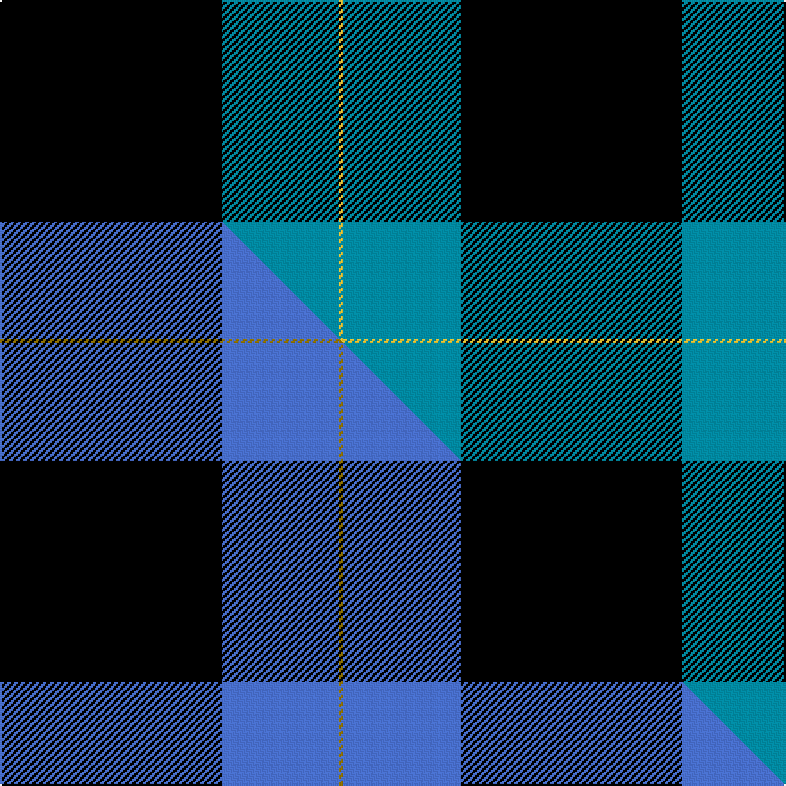

This page is one **sett** — a single exact thread-count. It belongs to the [tartan](/setts/k62t33ly1/)
(the same proportion at any scale), whose colour order is pattern [KBY](/stripes/kby/).

Part of the [Westwater](/tartans/westwater/) tartan — the named design grouping this sett with its other cloths.

Sourced from tartans-authority.  It is a [3 stripe tartan](/stripes/stripes3/).

Original link http://www.tartansauthority.com/tartan-ferret/display/10547/

## Register references

External register numbers recorded for this tartan.

- Scottish Register of Tartans: [10547](https://www.tartanregister.gov.uk/tartanDetails?ref=10547)
- Scottish Tartans Authority (ITI): 10547

## Thread count
K/124 T66 LY/2

One full sett is **258 threads**.

## Palette
<table><thead><tr><th>Colour</th><th>Shade</th><th>OKLCh</th></tr></thead><tbody><tr><td>T</td><td><code style="background-color:#00879F;">#00879F</code> <small style="color:#888">#00879F</small></td><td><small style="color:#888">oklch(57.4% 0.102 216.1)</small></td></tr><tr><td>K</td><td><code style="background-color:#000000;">#000000</code> <small style="color:#888">#000000</small></td><td><small style="color:#888">oklch(0.0% 0.000 0.0)</small></td></tr><tr><td>LY</td><td><code style="background-color:#DCBC32;">#DCBC32</code> <small style="color:#888">#DCBC32</small></td><td><small style="color:#888">oklch(80.0% 0.150 95.2)</small></td></tr></tbody></table>

# Sample pattern

## Compared to the master

This cloth is one sett of its design; the master sett (the exemplar the design is anchored on) is below for comparison.

Its **ΔTartan distance** from the master is **0.84** — the same measure the nearest-tartans table ranks by (0 is identical; a re-scale of the same cloth is near 0, a recolour or a different proportion further).

<figure class="master-compare" style="margin:0">

this sett
master sett ★

<figcaption style="color:#888;font-size:smaller">One weave of this sett against the <a href="/setts/k62b33y1/">master sett ★</a>, split on the diagonal: a shared proportion runs seamlessly across it with only the shades shifting; a different proportion breaks on it.</figcaption>
</figure>

## Nearest tartan variants

The nearest existing variants by ΔTartan distance, with this cloth at the top so the swatches line up against it.

ΔTartan

Threads

Variant

Sett

—

258

<a href="/variants/s3/k62t33ly1~x2/">Westwater (Personal)</a>

<a href="/ttd/edit/#slug=k62b33y1~x2&amp;base=k62t33ly1~x2" title="compare in the TTD">0.00</a>

258

<a href="/variants/s3/k62b33y1~x2/">Westwater (Edinburgh, 2012)</a>

<a href="/ttd/edit/#slug=db40k32w1~x2&amp;base=k62t33ly1~x2" title="compare in the TTD">1.13</a>

210

<a href="/variants/s3/db40k32w1~x2/">Shirra (2013)</a>

<a href="/ttd/edit/#slug=k62db15w6y4~x2&amp;base=k62t33ly1~x2" title="compare in the TTD">1.28</a>

216

<a href="/variants/s4/k62db15w6y4~x2/">C-Tec N.I. Ltd</a>

<a href="/ttd/edit/#slug=r3lb12k50ly3~x2&amp;base=k62t33ly1~x2" title="compare in the TTD">1.29</a>

260

<a href="/variants/s4/r3lb12k50ly3~x2/">Rogues, The (Corporate)</a>

<a href="/ttd/edit/#slug=dr1k20lb5dr1~x4&amp;base=k62t33ly1~x2" title="compare in the TTD">1.56</a>

208

<a href="/variants/s4/dr1k20lb5dr1~x4/">Dobelman (Personal)</a>

<a href="/ttd/edit/#slug=r4db32k15w2~x2&amp;base=k62t33ly1~x2" title="compare in the TTD">1.59</a>

200

<a href="/variants/s4/r4db32k15w2~x2/">Scottish Nuclear</a>

<a href="/ttd/edit/#slug=k41lg16dg14w2~x2~lg2704216-w3600000&amp;base=k62t33ly1~x2" title="compare in the TTD">2.03</a>

206

<a href="/variants/s4/k41lg16dg14w2~x2~lg2704216-w3600000/">Hamworthy Association</a>

<a href="/ttd/edit/#slug=dg43k14b14r2~x2&amp;base=k62t33ly1~x2" title="compare in the TTD">2.21</a>

202

<a href="/variants/s4/dg43k14b14r2~x2/">St. Andrews International Golf Club</a>

<a href="/ttd/edit/#slug=k62n24y5w3~x2&amp;base=k62t33ly1~x2" title="compare in the TTD">2.26</a>

246

<a href="/variants/s4/k62n24y5w3~x2/">Perry (Calgary), Alex (Personal)</a>

<a href="/ttd/edit/#slug=k19lo1n19~x8&amp;base=k62t33ly1~x2" title="compare in the TTD">2.27</a>

320

<a href="/variants/s3/k19lo1n19~x8/">Wcwm 9275-1394</a>

## Neighbour map

Every grey dot is one of 13620 variants placed by the first two principal components of the ΔTartan feature space (42% of its variance). Red is this tartan; blue dots are its nearest — click one to open its page.

<svg viewBox="0 0 640 380" role="img" style="max-width:100%;height:auto;border:1px solid #e0e0e0;border-radius:4px;display:block" xmlns="http://www.w3.org/2000/svg"><image href="/nn/cloud.v1.png" width="640" height="380"/><a href="/variants/s3/k62b33y1~x2/"><circle cx="401.7" cy="171.6" r="4" fill="#3465a4"><title>Westwater (Edinburgh, 2012)</title></circle></a><a href="/variants/s3/db40k32w1~x2/"><circle cx="394.7" cy="208.8" r="4" fill="#3465a4"><title>Shirra (2013)</title></circle></a><a href="/variants/s4/k62db15w6y4~x2/"><circle cx="384.9" cy="164.1" r="4" fill="#3465a4"><title>C-Tec N.I. Ltd</title></circle></a><a href="/variants/s4/r3lb12k50ly3~x2/"><circle cx="399.5" cy="155.6" r="4" fill="#3465a4"><title>Rogues, The (Corporate)</title></circle></a><a href="/variants/s4/dr1k20lb5dr1~x4/"><circle cx="431.5" cy="161.1" r="4" fill="#3465a4"><title>Dobelman (Personal)</title></circle></a><a href="/variants/s4/r4db32k15w2~x2/"><circle cx="330.3" cy="186.3" r="4" fill="#3465a4"><title>Scottish Nuclear</title></circle></a><a href="/variants/s4/k41lg16dg14w2~x2~lg2704216-w3600000/"><circle cx="278.1" cy="186.7" r="4" fill="#3465a4"><title>Hamworthy Association</title></circle></a><a href="/variants/s4/dg43k14b14r2~x2/"><circle cx="337.6" cy="191.6" r="4" fill="#3465a4"><title>St. Andrews International Golf Club</title></circle></a><a href="/variants/s4/k62n24y5w3~x2/"><circle cx="362.6" cy="161.6" r="4" fill="#3465a4"><title>Perry (Calgary), Alex (Personal)</title></circle></a><a href="/variants/s3/k19lo1n19~x8/"><circle cx="303.0" cy="227.1" r="4" fill="#3465a4"><title>Wcwm 9275-1394</title></circle></a><circle cx="400.3" cy="175.4" r="5" fill="#c00000"/><text x="320" y="376" text-anchor="middle" font-size="11" fill="#999">ground</text><text x="11" y="190" text-anchor="middle" font-size="11" fill="#999" transform="rotate(-90 11 190)">complexity</text></svg>

ID: /variants/s3/k62t33ly1~x2/
