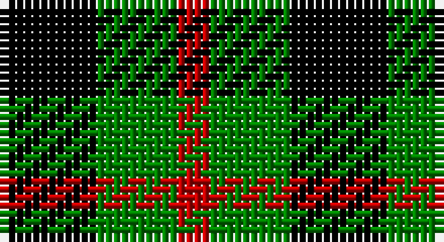

This page is one **sett** — a single exact thread-count. It belongs to the [tartan](/setts/k6g5r2/)
(the same proportion at any scale), whose colour order is pattern [KGR](/stripes/kgr/).

Part of the [Glen Lyon](/tartans/glen-lyon-2/) tartan — the named design grouping this sett with its other cloths.

Sourced from weddslist.  It is a [3 stripe tartan](/stripes/stripes3/).

Original link http://www.weddslist.com/cgi-bin/tartans/pg.pl?source=sts

## Provenance

Earliest known date: 1820 Appears to be No 185 in Wilson's '1819'

## Also known as

This cloth is also recorded under:

- Glen Lyon #1
- Glen Lyon #2
- Wilson's No.053

2 attestations — the source records this cloth was collapsed from (oldest owns this page)

<ul>
<li>undated — Glen Lyon (weddslist, <a href="http://www.weddslist.com/cgi-bin/tartans/pg.pl?source=sts">record</a>)</li>
<li>undated — Glen Lyon District Tartan (house-of-tartan, <a href="http://www.house-of-tartan.scotland.net/house/TartanViewjs.asp?colr=Def&tnam=23">record</a>)</li>
</ul>

## Thread count
K/12 G10 R/4

One full sett is **36 threads**.

## Palette

Palette: <strong>Ingles Buchan</strong> <small style="color:#888">(1 of 3 colours)</small>
<table><thead><tr><th>Colour</th><th>Threads</th><th>Shade</th><th>Base</th><th>OKLCh</th></tr></thead><tbody><tr><td>K/</td><td style="text-align:right;font-variant-numeric:tabular-nums">12</td><td><code style="background-color:#000000;">#000000</code> <small style="color:#888">#000000</small></td><td>K <code style="background-color:#000000;">#000000</code></td><td><small style="color:#888">oklch(0.0% 0.000 0.0)</small></td></tr><tr><td>G</td><td style="text-align:right;font-variant-numeric:tabular-nums">10</td><td><code style="background-color:#008000;">#008000</code> <small style="color:#888">#008000</small></td><td>G <code style="background-color:#006100;">#006100</code></td><td><small style="color:#888">oklch(52.0% 0.177 142.5)</small></td></tr><tr><td>R/</td><td style="text-align:right;font-variant-numeric:tabular-nums">4</td><td><code style="background-color:#C00000;">#C00000</code> <small style="color:#888">#C00000</small></td><td>R <code style="background-color:#CC0000;">#CC0000</code></td><td><small style="color:#888">oklch(50.7% 0.208 29.2)</small></td></tr></tbody></table>

# Sample pattern

## Nearest tartans

The nearest existing variants by ΔTartan distance, with this tartan at the top so the swatches line up against it.

ΔTartan

Tartan

Sett

—

<a href="/ttd/edit/#slug=k6g5r2~x2">Glen Lyon</a> <a class="nn-out" href="/variants/s3/k6g5r2~x2/" title="open its dictionary page">↗</a>

0.48

<a href="/ttd/edit/#slug=k5g4r2~x2&amp;base=k6g5r2~x2">Wilson's, No 94</a> <a class="nn-out" href="/variants/s3/k5g4r2~x2/" title="open its dictionary page">↗</a>

1.06

<a href="/ttd/edit/#slug=k5g3t2~x2&amp;base=k6g5r2~x2">Glen Lyon, or Mull (No.53)</a> <a class="nn-out" href="/variants/s3/k5g3t2~x2/" title="open its dictionary page">↗</a>

1.30

<a href="/ttd/edit/#slug=k5g4ly1~x2&amp;base=k6g5r2~x2">Wilson's, No 2/53 or Mull</a> <a class="nn-out" href="/variants/s3/k5g4ly1~x2/" title="open its dictionary page">↗</a>

1.48

<a href="/ttd/edit/#slug=k23g8lo8~x4&amp;base=k6g5r2~x2">Zwijnenberg, Frans (Personal)</a> <a class="nn-out" href="/variants/s3/k23g8lo8~x4/" title="open its dictionary page">↗</a>

1.57

<a href="/ttd/edit/#slug=k23g8ly8~x4&amp;base=k6g5r2~x2">Zwijnenberg, Frans (Personal)</a> <a class="nn-out" href="/variants/s3/k23g8ly8~x4/" title="open its dictionary page">↗</a>

1.65

<a href="/ttd/edit/#slug=g5k6t1~x4&amp;base=k6g5r2~x2">Wilson's, No 50</a> <a class="nn-out" href="/variants/s3/g5k6t1~x4/" title="open its dictionary page">↗</a>

1.65

<a href="/ttd/edit/#slug=k6ly1g6~x4&amp;base=k6g5r2~x2">Wilson's, No 197</a> <a class="nn-out" href="/variants/s3/k6ly1g6~x4/" title="open its dictionary page">↗</a>

1.77

<a href="/ttd/edit/#slug=k11dg17r3&amp;base=k6g5r2~x2">Kincaid</a> <a class="nn-out" href="/variants/s3/k11dg17r3/" title="open its dictionary page">↗</a>

1.79

<a href="/ttd/edit/#slug=k5g4t2~x2&amp;base=k6g5r2~x2">Mull</a> <a class="nn-out" href="/variants/s3/k5g4t2~x2/" title="open its dictionary page">↗</a>

1.83

<a href="/ttd/edit/#slug=k4g6r1~x10&amp;base=k6g5r2~x2">Kincaid, of Kincaid</a> <a class="nn-out" href="/variants/s3/k4g6r1~x10/" title="open its dictionary page">↗</a>

## Neighbour map

Every grey dot is one of 14360 variants placed by the first two principal components of the ΔTartan feature space (44% of its variance). Red is this tartan; blue dots are its nearest — click one to open its page.

<svg viewBox="0 0 640 380" role="img" style="max-width:100%;height:auto;border:1px solid #e0e0e0;border-radius:4px;display:block" xmlns="http://www.w3.org/2000/svg"><image href="/nn/cloud.v1.png" width="640" height="380"/><a href="/variants/s3/k5g4r2~x2/"><circle cx="147.8" cy="356.1" r="4" fill="#3465a4"><title>Wilson's, No 94</title></circle></a><a href="/variants/s3/k5g3t2~x2/"><circle cx="164.9" cy="356.5" r="4" fill="#3465a4"><title>Glen Lyon, or Mull (No.53)</title></circle></a><a href="/variants/s3/k5g4ly1~x2/"><circle cx="217.7" cy="311.0" r="4" fill="#3465a4"><title>Wilson's, No 2/53 or Mull</title></circle></a><a href="/variants/s3/k23g8lo8~x4/"><circle cx="241.3" cy="325.1" r="4" fill="#3465a4"><title>Zwijnenberg, Frans (Personal)</title></circle></a><a href="/variants/s3/k23g8ly8~x4/"><circle cx="240.8" cy="320.6" r="4" fill="#3465a4"><title>Zwijnenberg, Frans (Personal)</title></circle></a><a href="/variants/s3/g5k6t1~x4/"><circle cx="238.4" cy="307.3" r="4" fill="#3465a4"><title>Wilson's, No 50</title></circle></a><a href="/variants/s3/k6ly1g6~x4/"><circle cx="221.0" cy="301.9" r="4" fill="#3465a4"><title>Wilson's, No 197</title></circle></a><a href="/variants/s3/k11dg17r3/"><circle cx="283.2" cy="316.4" r="4" fill="#3465a4"><title>Kincaid</title></circle></a><a href="/variants/s3/k5g4t2~x2/"><circle cx="178.2" cy="366.0" r="4" fill="#3465a4"><title>Mull</title></circle></a><a href="/variants/s3/k4g6r1~x10/"><circle cx="257.7" cy="300.5" r="4" fill="#3465a4"><title>Kincaid, of Kincaid</title></circle></a><circle cx="168.4" cy="343.5" r="5" fill="#c00000"/></svg>

ID: /variants/s3/k6g5r2~x2/
