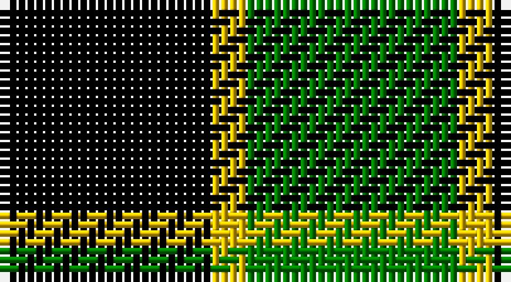

This page is one **sett** — a single exact thread-count. It belongs to the [tartan](/setts/k6ly1g6/)
(the same proportion at any scale), whose colour order is pattern [GYK](/stripes/gyk/).

Sourced from weddslist.  It is a [3 stripe tartan](/stripes/stripes3/).

Original link http://www.weddslist.com/cgi-bin/tartans/pg.pl?source=sts

## Also known as

This cloth is also recorded under:

- Wilson's, No 197

## Thread count
K/24 Y4 G/24

One full sett is **56 threads**.

## Palette

Palette: <strong>Ingles Buchan</strong> <small style="color:#888">(1 of 3 colours)</small>
<table><thead><tr><th>Colour</th><th>Threads</th><th>Shade</th><th>Base</th><th>OKLCh</th></tr></thead><tbody><tr><td>K/</td><td style="text-align:right;font-variant-numeric:tabular-nums">24</td><td><code style="background-color:#000000;">#000000</code> <small style="color:#888">#000000</small></td><td>K <code style="background-color:#000000;">#000000</code></td><td><small style="color:#888">oklch(0.0% 0.000 0.0)</small></td></tr><tr><td>Y</td><td style="text-align:right;font-variant-numeric:tabular-nums">4</td><td><code style="background-color:#F0C000;">#F0C000</code> <small style="color:#888">#F0C000</small></td><td>Y <code style="background-color:#F2BF00;">#F2BF00</code></td><td><small style="color:#888">oklch(82.7% 0.169 90.5)</small></td></tr><tr><td>G/</td><td style="text-align:right;font-variant-numeric:tabular-nums">24</td><td><code style="background-color:#008000;">#008000</code> <small style="color:#888">#008000</small></td><td>G <code style="background-color:#006100;">#006100</code></td><td><small style="color:#888">oklch(52.0% 0.177 142.5)</small></td></tr></tbody></table>

# Sample pattern

## Nearest tartans

The nearest existing variants by ΔTartan distance, with this tartan at the top so the swatches line up against it.

ΔTartan

Tartan

Sett

—

<a href="/ttd/edit/#slug=k6ly1g6~x4">Wilson's, No 197</a> <a class="nn-out" href="/variants/s3/k6ly1g6~x4/" title="open its dictionary page">↗</a>

0.51

<a href="/ttd/edit/#slug=k5g4ly1~x2&amp;base=k6ly1g6~x4">Wilson's, No 2/53 or Mull</a> <a class="nn-out" href="/variants/s3/k5g4ly1~x2/" title="open its dictionary page">↗</a>

0.70

<a href="/ttd/edit/#slug=g5k6t1~x4&amp;base=k6ly1g6~x4">Wilson's, No 50</a> <a class="nn-out" href="/variants/s3/g5k6t1~x4/" title="open its dictionary page">↗</a>

0.75

<a href="/ttd/edit/#slug=k4g6r1~x10&amp;base=k6ly1g6~x4">Kincaid, of Kincaid</a> <a class="nn-out" href="/variants/s3/k4g6r1~x10/" title="open its dictionary page">↗</a>

1.12

<a href="/ttd/edit/#slug=k30db7g36k5~x2&amp;base=k6ly1g6~x4">Innes, hunting</a> <a class="nn-out" href="/variants/s4/k30db7g36k5~x2/" title="open its dictionary page">↗</a>

1.33

<a href="/ttd/edit/#slug=k4g33k33ly4~x2&amp;base=k6ly1g6~x4">Wallace, hunting</a> <a class="nn-out" href="/variants/s4/k4g33k33ly4~x2/" title="open its dictionary page">↗</a>

1.38

<a href="/ttd/edit/#slug=g4t1k2~x4&amp;base=k6ly1g6~x4">Wilson's, No 45</a> <a class="nn-out" href="/variants/s3/g4t1k2~x4/" title="open its dictionary page">↗</a>

1.44

<a href="/ttd/edit/#slug=k11dg17r3&amp;base=k6ly1g6~x4">Kincaid</a> <a class="nn-out" href="/variants/s3/k11dg17r3/" title="open its dictionary page">↗</a>

1.45

<a href="/ttd/edit/#slug=k7ly1g7t1~x2&amp;base=k6ly1g6~x4">Wilson's, No 140</a> <a class="nn-out" href="/variants/s4/k7ly1g7t1~x2/" title="open its dictionary page">↗</a>

1.46

<a href="/ttd/edit/#slug=k1g8k8ly1~x4&amp;base=k6ly1g6~x4">Wallace Htg (Clan)</a> <a class="nn-out" href="/variants/s4/k1g8k8ly1~x4/" title="open its dictionary page">↗</a>

1.47

<a href="/variants/s4/k6ly1g6~x4/">Wilson's No.197</a>

## Neighbour map

Every grey dot is one of 14360 variants placed by the first two principal components of the ΔTartan feature space (44% of its variance). Red is this tartan; blue dots are its nearest — click one to open its page.

<svg viewBox="0 0 640 380" role="img" style="max-width:100%;height:auto;border:1px solid #e0e0e0;border-radius:4px;display:block" xmlns="http://www.w3.org/2000/svg"><image href="/nn/cloud.v1.png" width="640" height="380"/><a href="/variants/s3/k5g4ly1~x2/"><circle cx="217.7" cy="311.0" r="4" fill="#3465a4"><title>Wilson's, No 2/53 or Mull</title></circle></a><a href="/variants/s3/g5k6t1~x4/"><circle cx="238.4" cy="307.3" r="4" fill="#3465a4"><title>Wilson's, No 50</title></circle></a><a href="/variants/s3/k4g6r1~x10/"><circle cx="257.7" cy="300.5" r="4" fill="#3465a4"><title>Kincaid, of Kincaid</title></circle></a><a href="/variants/s4/k30db7g36k5~x2/"><circle cx="243.2" cy="272.4" r="4" fill="#3465a4"><title>Innes, hunting</title></circle></a><a href="/variants/s4/k4g33k33ly4~x2/"><circle cx="273.0" cy="256.9" r="4" fill="#3465a4"><title>Wallace, hunting</title></circle></a><a href="/variants/s3/g4t1k2~x4/"><circle cx="242.2" cy="319.5" r="4" fill="#3465a4"><title>Wilson's, No 45</title></circle></a><a href="/variants/s3/k11dg17r3/"><circle cx="283.2" cy="316.4" r="4" fill="#3465a4"><title>Kincaid</title></circle></a><a href="/variants/s4/k7ly1g7t1~x2/"><circle cx="201.7" cy="245.8" r="4" fill="#3465a4"><title>Wilson's, No 140</title></circle></a><a href="/variants/s4/k1g8k8ly1~x4/"><circle cx="280.4" cy="263.1" r="4" fill="#3465a4"><title>Wallace Htg (Clan)</title></circle></a><a href="/variants/s4/k6ly1g6~x4/"><circle cx="224.2" cy="273.2" r="4" fill="#3465a4"><title>Wilson's No.197</title></circle></a><circle cx="221.0" cy="301.9" r="5" fill="#c00000"/></svg>

ID: /variants/s3/k6ly1g6~x4/
