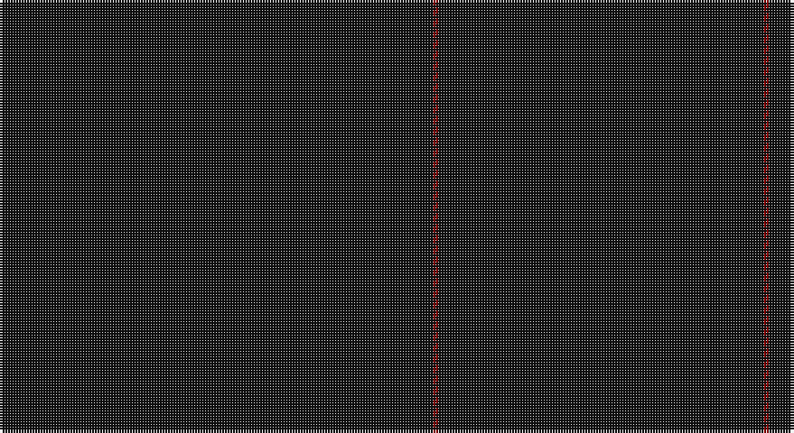

This page is one **sett** — a single exact thread-count. It belongs to the [tartan](/setts/k80r1k60/)
(the same proportion at any scale), whose colour order is pattern [KRK](/stripes/krk/).

Sourced from register-of-tartans.  It is a [3 stripe tartan](/stripes/stripes3/).

Original link https://www.tartanregister.gov.uk/tartanDetails.aspx?ref=10194

## Provenance

Earliest known date: 20th March 2010 The red stripe which delineates the 3 and 4 inch squares, is intended to be almost invisible in certain lights. This design supercedes the original bodog.com tartan (STR ref: 306, STA ref:6889) to reflect the new brand licensing model that now controls all the intellectual property of bodogbrand.com.

3 attestations — the source records this cloth was collapsed from (oldest owns this page)

<ul>
<li>20/03/2010 — Bodog (register-of-tartans, <a href="https://www.tartanregister.gov.uk/tartanDetails.aspx?ref=10194">record</a>)</li>
<li>20th March 2010 — Bodog (Corporate) (tartans-authority, <a href="http://www.tartansauthority.com/tartan-ferret/display/10194/">record</a>)</li>
<li>undated — Bodog Corporate Tartan (house-of-tartan, <a href="http://www.house-of-tartan.scotland.net/house/TartanViewjs.asp?colr=Def&tnam=10194">record</a>)</li>
</ul>

## Register references

External register numbers recorded for this tartan.

- Scottish Register of Tartans: [10194](https://www.tartanregister.gov.uk/tartanDetails?ref=10194)
- Scottish Tartans Authority (ITI): 10194

## Thread count
K/160 DR2 K/120

One full sett is **284 threads**.

## Palette

Palette: <strong>Tartan Register</strong>
<table><thead><tr><th>Colour</th><th>Threads</th><th>Shade</th><th>Base</th><th>OKLCh</th></tr></thead><tbody><tr><td>K/</td><td style="text-align:right;font-variant-numeric:tabular-nums">160</td><td><code style="background-color:#101010;">#101010</code> <small style="color:#888">#101010</small></td><td>K <code style="background-color:#000000;">#000000</code></td><td><small style="color:#888">oklch(17.3% 0.000 89.9)</small></td></tr><tr><td>DR</td><td style="text-align:right;font-variant-numeric:tabular-nums">2</td><td><code style="background-color:#880000;">#880000</code> <small style="color:#888">#880000</small></td><td>R <code style="background-color:#CC0000;">#CC0000</code></td><td><small style="color:#888">oklch(39.4% 0.162 29.2)</small></td></tr><tr><td>K/</td><td style="text-align:right;font-variant-numeric:tabular-nums">120</td><td><code style="background-color:#101010;">#101010</code> <small style="color:#888">#101010</small></td><td>K <code style="background-color:#000000;">#000000</code></td><td><small style="color:#888">oklch(17.3% 0.000 89.9)</small></td></tr></tbody></table>

# Sample pattern

## Nearest tartans

The nearest existing variants by ΔTartan distance, with this tartan at the top so the swatches line up against it.

ΔTartan

Tartan

Sett

—

<a href="/ttd/edit/#slug=k80r1k60~x2">Bodog</a> <a class="nn-out" href="/variants/s3/k80r1k60~x2/" title="open its dictionary page">↗</a>

3.19

<a href="/ttd/edit/#slug=k20n1~x6&amp;base=k80r1k60~x2">Black Shadow (Fashion)</a> <a class="nn-out" href="/variants/s2/k20n1~x6/" title="open its dictionary page">↗</a>

4.63

<a href="/ttd/edit/#slug=dg20r1dg4~x3&amp;base=k80r1k60~x2">Castle Fraser Check</a> <a class="nn-out" href="/variants/s3/dg20r1dg4~x3/" title="open its dictionary page">↗</a>

## Neighbour map

Every grey dot is one of 14360 variants placed by the first two principal components of the ΔTartan feature space (44% of its variance). Red is this tartan; blue dots are its nearest — click one to open its page.

<svg viewBox="0 0 640 380" role="img" style="max-width:100%;height:auto;border:1px solid #e0e0e0;border-radius:4px;display:block" xmlns="http://www.w3.org/2000/svg"><image href="/nn/cloud.v1.png" width="640" height="380"/><a href="/variants/s2/k20n1~x6/"><circle cx="626.0" cy="366.0" r="4" fill="#3465a4"><title>Black Shadow (Fashion)</title></circle></a><a href="/variants/s3/dg20r1dg4~x3/"><circle cx="626.0" cy="326.4" r="4" fill="#3465a4"><title>Castle Fraser Check</title></circle></a><circle cx="626.0" cy="363.3" r="5" fill="#c00000"/></svg>

ID: /variants/s3/k80r1k60~x2/
